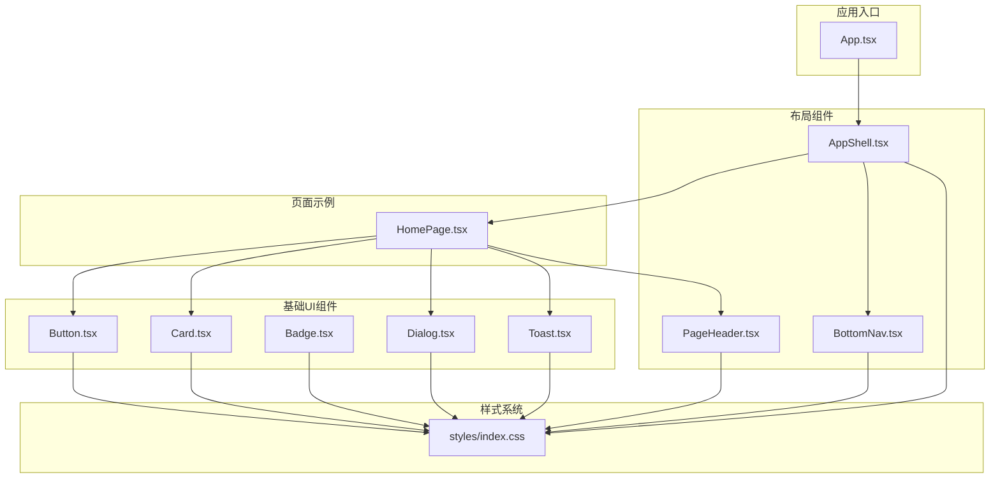
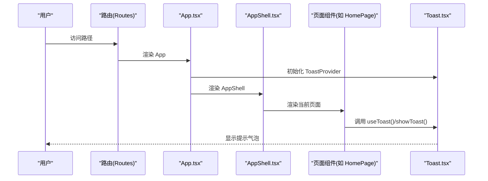
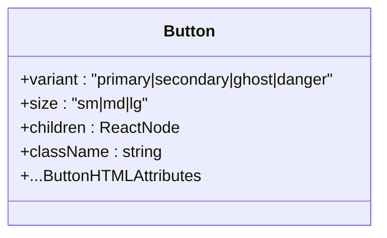
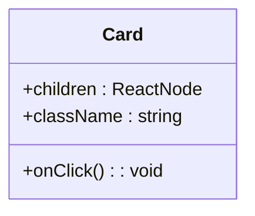
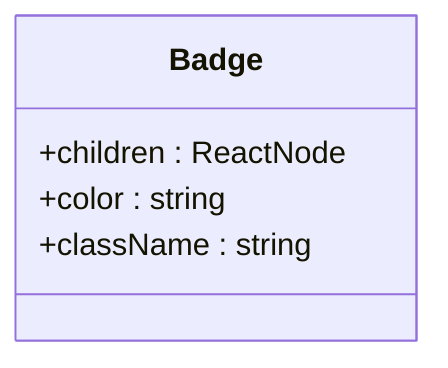
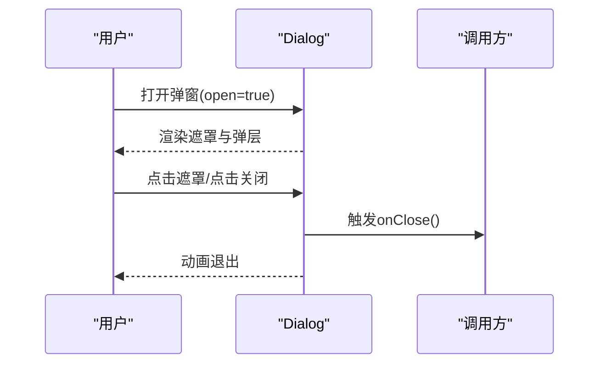
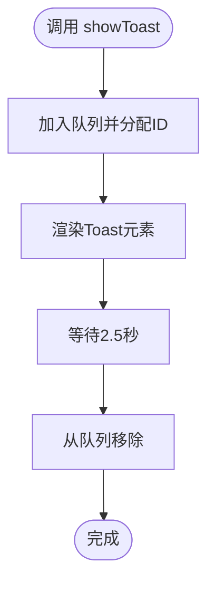
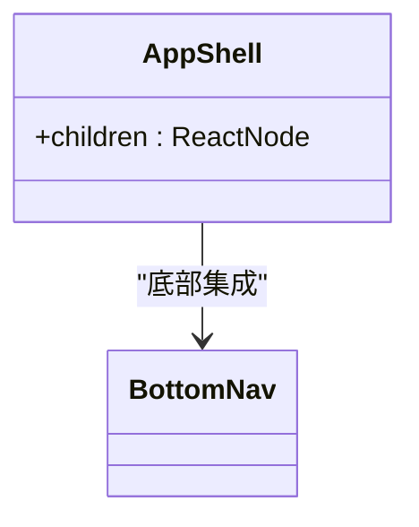
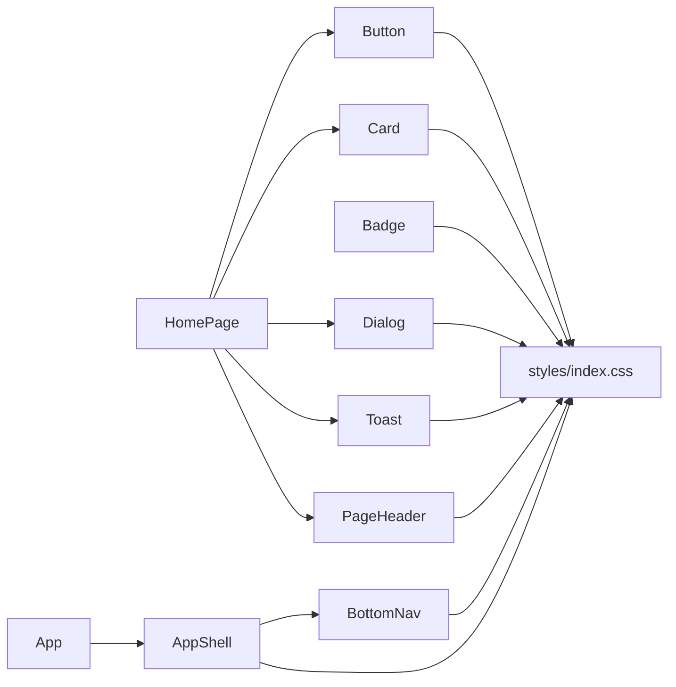

# UI组件系统

<cite>
**本文引用的文件**
- [src/components/ui/Button.tsx](file://src/components/ui/Button.tsx)
- [src/components/ui/Card.tsx](file://src/components/ui/Card.tsx)
- [src/components/ui/Badge.tsx](file://src/components/ui/Badge.tsx)
- [src/components/ui/Dialog.tsx](file://src/components/ui/Dialog.tsx)
- [src/components/ui/Toast.tsx](file://src/components/ui/Toast.tsx)
- [src/components/layout/AppShell.tsx](file://src/components/layout/AppShell.tsx)
- [src/components/layout/PageHeader.tsx](file://src/components/layout/PageHeader.tsx)
- [src/components/layout/BottomNav.tsx](file://src/components/layout/BottomNav.tsx)
- [src/styles/index.css](file://src/styles/index.css)
- [src/App.tsx](file://src/App.tsx)
- [src/pages/HomePage.tsx](file://src/pages/HomePage.tsx)
- [src/utils/constants.ts](file://src/utils/constants.ts)
- [package.json](file://package.json)
</cite>

## 目录
1. [简介](#简介)
2. [项目结构](#项目结构)
3. [核心组件](#核心组件)
4. [架构总览](#架构总览)
5. [组件详解](#组件详解)
6. [依赖关系分析](#依赖关系分析)
7. [性能与体验](#性能与体验)
8. [故障排查指南](#故障排查指南)
9. [结论](#结论)
10. [附录：使用示例与最佳实践](#附录使用示例与最佳实践)

## 简介
本文件系统化梳理 MoneyNote 的 UI 组件体系，覆盖基础组件（Button、Card、Badge、Dialog、Toast）、布局组件（AppShell、PageHeader、BottomNav）以及主题与样式系统。文档从设计原则、实现方式、属性与事件、样式定制、响应式与无障碍、跨浏览器兼容性、性能优化到扩展机制给出完整说明，并结合实际页面使用场景提供示例与最佳实践。

## 项目结构
UI 组件主要位于 src/components/ui 与 src/components/layout 两个目录，样式统一在 src/styles/index.css 中集中管理；应用通过 App.tsx 组装路由动画、全局 Toast 提供器与 AppShell 容器。

**图表来源**
- [src/App.tsx:42-50](file://src/App.tsx#L42-L50)
- [src/components/layout/AppShell.tsx:8-17](file://src/components/layout/AppShell.tsx#L8-L17)
- [src/components/layout/PageHeader.tsx:6-19](file://src/components/layout/PageHeader.tsx#L6-L19)
- [src/components/layout/BottomNav.tsx:11-33](file://src/components/layout/BottomNav.tsx#L11-L33)
- [src/components/ui/Button.tsx:22-37](file://src/components/ui/Button.tsx#L22-L37)
- [src/components/ui/Card.tsx:9-18](file://src/components/ui/Card.tsx#L9-L18)
- [src/components/ui/Badge.tsx:7-16](file://src/components/ui/Badge.tsx#L7-L16)
- [src/components/ui/Dialog.tsx:11-42](file://src/components/ui/Dialog.tsx#L11-L42)
- [src/components/ui/Toast.tsx:23-60](file://src/components/ui/Toast.tsx#L23-L60)
- [src/styles/index.css:1-134](file://src/styles/index.css#L1-L134)

**章节来源**
- [src/App.tsx:1-51](file://src/App.tsx#L1-L51)
- [src/styles/index.css:1-134](file://src/styles/index.css#L1-L134)

## 核心组件
- 基础组件：Button、Card、Badge、Dialog、Toast
- 布局组件：AppShell、PageHeader、BottomNav
- 主题与样式：基于 Tailwind V4 自定义变量与原子类组合
- 动画与过渡：使用 Framer Motion 实现页面与组件级动效

**章节来源**
- [src/components/ui/Button.tsx:1-38](file://src/components/ui/Button.tsx#L1-L38)
- [src/components/ui/Card.tsx:1-19](file://src/components/ui/Card.tsx#L1-L19)
- [src/components/ui/Badge.tsx:1-17](file://src/components/ui/Badge.tsx#L1-L17)
- [src/components/ui/Dialog.tsx:1-43](file://src/components/ui/Dialog.tsx#L1-L43)
- [src/components/ui/Toast.tsx:1-61](file://src/components/ui/Toast.tsx#L1-L61)
- [src/components/layout/AppShell.tsx:1-18](file://src/components/layout/AppShell.tsx#L1-L18)
- [src/components/layout/PageHeader.tsx:1-20](file://src/components/layout/PageHeader.tsx#L1-L20)
- [src/components/layout/BottomNav.tsx:1-34](file://src/components/layout/BottomNav.tsx#L1-L34)
- [src/styles/index.css:1-134](file://src/styles/index.css#L1-L134)

## 架构总览
应用通过 AppShell 包裹页面内容并在底部集成 BottomNav；页面通过路由切换并配合 Framer Motion 实现页面级滑入/滑出过渡；Toast 作为全局通知容器，通过上下文在任意子组件中调用。

**图表来源**
- [src/App.tsx:17-40](file://src/App.tsx#L17-L40)
- [src/components/layout/AppShell.tsx:8-17](file://src/components/layout/AppShell.tsx#L8-L17)
- [src/pages/HomePage.tsx:13-100](file://src/pages/HomePage.tsx#L13-L100)
- [src/components/ui/Toast.tsx:23-60](file://src/components/ui/Toast.tsx#L23-L60)

## 组件详解

### Button（按钮）
- 设计原则
  - 语义化变体：primary、secondary、ghost、danger
  - 尺寸一致性：sm、md、lg 三档，统一字重与字母间距
  - 可访问性：继承原生 button 属性，支持禁用、点击回调
- 关键属性
  - variant: 'primary' | 'secondary' | 'ghost' | 'danger'
  - size: 'sm' | 'md' | 'lg'
  - children: ReactNode
  - className: 扩展样式
  - 其他 HTMLButtonAttributes（如 onClick、disabled、aria-*）
- 样式与主题
  - 使用主题变量与原子类组合，hover/active 状态渐变过渡
  - 支持通过 className 覆盖默认样式
- 使用示例
  - 在页面中直接渲染，传入文本或图标元素作为 children
  - 结合表单提交、操作确认等交互场景

**图表来源**
- [src/components/ui/Button.tsx:3-7](file://src/components/ui/Button.tsx#L3-L7)
- [src/components/ui/Button.tsx:22-37](file://src/components/ui/Button.tsx#L22-L37)

**章节来源**
- [src/components/ui/Button.tsx:1-38](file://src/components/ui/Button.tsx#L1-L38)
- [src/styles/index.css:3-48](file://src/styles/index.css#L3-L48)

### Card（卡片）
- 设计原则
  - 轻量容器，支持可选点击行为，提供悬停反馈
  - 默认浅色背景与琥珀边框，突出内容层级
- 关键属性
  - children: ReactNode
  - className: 扩展样式
  - onClick?: () => void
- 样式与主题
  - 使用主题变量与原子类，支持 cursor-pointer 与 hover 效果
- 使用示例
  - 用于展示统计摘要、交易项卡片等

**图表来源**
- [src/components/ui/Card.tsx:3-7](file://src/components/ui/Card.tsx#L3-L7)
- [src/components/ui/Card.tsx:9-18](file://src/components/ui/Card.tsx#L9-L18)

**章节来源**
- [src/components/ui/Card.tsx:1-19](file://src/components/ui/Card.tsx#L1-L19)
- [src/styles/index.css:96-104](file://src/styles/index.css#L96-L104)

### Badge（徽标）
- 设计原则
  - 轻量标签，支持自定义颜色与圆角
  - 透明底色与纯色文字，保证对比度
- 关键属性
  - children: ReactNode
  - color?: string（默认使用中性色）
  - className?: string
- 样式与主题
  - 通过内联 style 设置背景色与文字色，背景色带 15% 透明度
- 使用示例
  - 用于分类标签、状态提示等

**图表来源**
- [src/components/ui/Badge.tsx:1-5](file://src/components/ui/Badge.tsx#L1-L5)
- [src/components/ui/Badge.tsx:7-16](file://src/components/ui/Badge.tsx#L7-L16)

**章节来源**
- [src/components/ui/Badge.tsx:1-17](file://src/components/ui/Badge.tsx#L1-L17)

### Dialog（对话框）
- 设计原则
  - 底部上滑弹出，适配移动端安全区域
  - 背景遮罩点击可关闭，标题与关闭按钮清晰
- 关键属性
  - open: boolean（受控）
  - onClose: () => void
  - title?: string
  - children: ReactNode
- 动画与交互
  - 使用 Framer Motion 实现进入/退出动画
  - 点击遮罩关闭，支持键盘 ESC（由外部路由/状态控制）
- 样式与主题
  - 使用主题变量与安全区域类，确保在刘海屏/胶囊屏下不被遮挡
- 使用示例
  - 用于编辑交易、确认删除等轻量操作面板

**图表来源**
- [src/components/ui/Dialog.tsx:11-42](file://src/components/ui/Dialog.tsx#L11-L42)

**章节来源**
- [src/components/ui/Dialog.tsx:1-43](file://src/components/ui/Dialog.tsx#L1-L43)
- [src/styles/index.css:106-113](file://src/styles/index.css#L106-L113)

### Toast（全局提示）
- 设计原则
  - 全局通知，自动消失，支持多类型（成功/错误/信息）
  - 上浮动画，居中显示，避免遮挡主要内容
- 关键接口
  - useToast(): { showToast(message, type?) }
  - ToastProvider(children): 包裹应用根节点
- 核心行为
  - 添加消息后定时自动移除
  - 多个消息按顺序动画进入/退出
- 样式与主题
  - 类名组合使用主题色，字号与字重统一
- 使用示例
  - 页面中调用 useToast() 获取方法，在提交、删除、更新后展示反馈

**图表来源**
- [src/components/ui/Toast.tsx:23-60](file://src/components/ui/Toast.tsx#L23-L60)

**章节来源**
- [src/components/ui/Toast.tsx:1-61](file://src/components/ui/Toast.tsx#L1-L61)
- [src/App.tsx:42-50](file://src/App.tsx#L42-L50)
- [src/pages/HomePage.tsx:16-50](file://src/pages/HomePage.tsx#L16-L50)

### AppShell（应用外壳）
- 设计原则
  - 固定最大宽度，居中布局，主内容区预留底部导航高度
  - 底部导航固定定位，避免重复渲染
- 关键属性
  - children: ReactNode
- 使用方式
  - 在 App.tsx 中包裹页面路由容器
- 响应式与安全区域
  - 内容区与导航区均考虑安全区域类

**图表来源**
- [src/components/layout/AppShell.tsx:4-6](file://src/components/layout/AppShell.tsx#L4-L6)
- [src/components/layout/AppShell.tsx:8-17](file://src/components/layout/AppShell.tsx#L8-L17)

**章节来源**
- [src/components/layout/AppShell.tsx:1-18](file://src/components/layout/AppShell.tsx#L1-L18)

### PageHeader（页面头部）
- 设计原则
  - 标题层级明确，副标题辅助说明
  - 品牌标识与分隔线强化页面边界
- 关键属性
  - title: string
  - subtitle?: string
- 样式与主题
  - 使用主题字体与颜色，标题采用专用字体类

**章节来源**
- [src/components/layout/PageHeader.tsx:1-20](file://src/components/layout/PageHeader.tsx#L1-L20)

### BottomNav（底部导航）
- 设计原则
  - 固定在底部，高亮当前页，支持路由跳转
  - 使用 NavLink 的激活态样式
- 关键属性
  - 无显式属性，内部维护路由配置数组
- 样式与主题
  - 半透明白底+模糊，强调与内容分离

**章节来源**
- [src/components/layout/BottomNav.tsx:1-34](file://src/components/layout/BottomNav.tsx#L1-L34)

## 依赖关系分析
- 组件间依赖
  - AppShell 依赖 BottomNav
  - 页面通过 AppShell 使用 PageHeader、Button、Card、Dialog、Toast
- 外部依赖
  - Framer Motion：页面与组件动画
  - react-router-dom：路由与导航
  - Tailwind V4：原子类与主题变量
- 样式依赖
  - 所有组件样式依赖 styles/index.css 中的主题变量与工具类

**图表来源**
- [src/components/ui/Button.tsx:22-37](file://src/components/ui/Button.tsx#L22-L37)
- [src/components/ui/Card.tsx:9-18](file://src/components/ui/Card.tsx#L9-L18)
- [src/components/ui/Badge.tsx:7-16](file://src/components/ui/Badge.tsx#L7-L16)
- [src/components/ui/Dialog.tsx:11-42](file://src/components/ui/Dialog.tsx#L11-L42)
- [src/components/ui/Toast.tsx:23-60](file://src/components/ui/Toast.tsx#L23-L60)
- [src/components/layout/PageHeader.tsx:6-19](file://src/components/layout/PageHeader.tsx#L6-L19)
- [src/components/layout/BottomNav.tsx:11-33](file://src/components/layout/BottomNav.tsx#L11-L33)
- [src/components/layout/AppShell.tsx:8-17](file://src/components/layout/AppShell.tsx#L8-L17)
- [src/App.tsx:42-50](file://src/App.tsx#L42-L50)
- [src/pages/HomePage.tsx:13-100](file://src/pages/HomePage.tsx#L13-L100)
- [src/styles/index.css:1-134](file://src/styles/index.css#L1-L134)

**章节来源**
- [package.json:12-38](file://package.json#L12-L38)
- [src/styles/index.css:1-134](file://src/styles/index.css#L1-L134)

## 性能与体验
- 动画与渲染
  - 使用 Framer Motion 的受控动画，避免不必要的重排
  - 页面切换使用模式为“wait”的动画容器，减少闪烁
- 交互反馈
  - Button 提供 hover/active 过渡，提升点击感知
  - Card 支持 onClick，增强可点触达性
- 可访问性与无障碍
  - Button 继承原生 button 属性，便于屏幕阅读器识别
  - Dialog 提供关闭按钮与遮罩点击关闭，建议在业务层补充键盘 ESC 支持
- 响应式与安全区域
  - 统一使用 safe-area-* 类处理刘海屏/胶囊屏
  - AppShell 固定最大宽度并居中，保证小屏体验
- 跨浏览器兼容性
  - 依赖 Tailwind V4 与现代浏览器特性，建议在目标设备上验证动画与安全区域支持

**章节来源**
- [src/App.tsx:11-40](file://src/App.tsx#L11-L40)
- [src/components/ui/Button.tsx:9-20](file://src/components/ui/Button.tsx#L9-L20)
- [src/components/ui/Card.tsx:9-18](file://src/components/ui/Card.tsx#L9-L18)
- [src/styles/index.css:106-113](file://src/styles/index.css#L106-L113)
- [src/components/layout/AppShell.tsx:10-16](file://src/components/layout/AppShell.tsx#L10-L16)

## 故障排查指南
- Toast 不显示
  - 确认已在应用根节点包裹 ToastProvider
  - 检查 useToast 返回的方法是否正确调用
- Dialog 无法关闭
  - 确保传入 open 并在 onClose 中更新状态
  - 点击遮罩会触发 onClose，检查事件冒泡
- 样式未生效
  - 检查主题变量与工具类是否正确引入
  - 确认 className 合并顺序，避免被默认样式覆盖
- 导航高亮异常
  - 确认 NavLink 的 to 与路由一致
  - 检查激活态样式条件

**章节来源**
- [src/components/ui/Toast.tsx:23-60](file://src/components/ui/Toast.tsx#L23-L60)
- [src/components/ui/Dialog.tsx:11-42](file://src/components/ui/Dialog.tsx#L11-L42)
- [src/styles/index.css:1-134](file://src/styles/index.css#L1-L134)
- [src/components/layout/BottomNav.tsx:11-33](file://src/components/layout/BottomNav.tsx#L11-L33)

## 结论
MoneyNote 的 UI 组件系统以简洁、一致、可扩展为核心目标：通过主题变量与原子类统一视觉语言，借助 Framer Motion 提升交互质感，配合 AppShell 与 BottomNav 形成稳定的移动端布局骨架。组件具备良好的可定制性与可访问性基础，适合在现有体系上持续扩展与演进。

## 附录：使用示例与最佳实践
- 使用示例
  - 在页面中引入并渲染 Button、Card、Badge、Dialog、Toast
  - 使用 PageHeader 统一页面标题与副标题
  - 在 App.tsx 中以 AppShell 包裹页面路由
- 最佳实践
  - 优先使用组件提供的变体与尺寸，避免过度自定义
  - 通过 className 与主题变量进行局部样式覆盖
  - 对需要全局反馈的场景统一使用 Toast
  - 对于轻量操作面板优先使用 Dialog
- 性能优化建议
  - 控制 Toast 数量与时长，避免频繁创建/销毁
  - 将复杂动画封装在组件内部，减少父组件渲染压力
  - 使用安全区域类确保在不同设备上的可用性

**章节来源**
- [src/pages/HomePage.tsx:13-100](file://src/pages/HomePage.tsx#L13-L100)
- [src/App.tsx:42-50](file://src/App.tsx#L42-L50)
- [src/components/layout/PageHeader.tsx:6-19](file://src/components/layout/PageHeader.tsx#L6-L19)
- [src/components/ui/Toast.tsx:23-60](file://src/components/ui/Toast.tsx#L23-L60)
- [src/components/ui/Dialog.tsx:11-42](file://src/components/ui/Dialog.tsx#L11-L42)