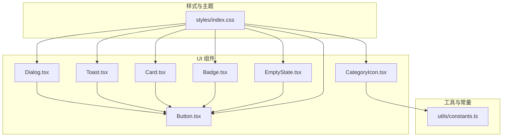
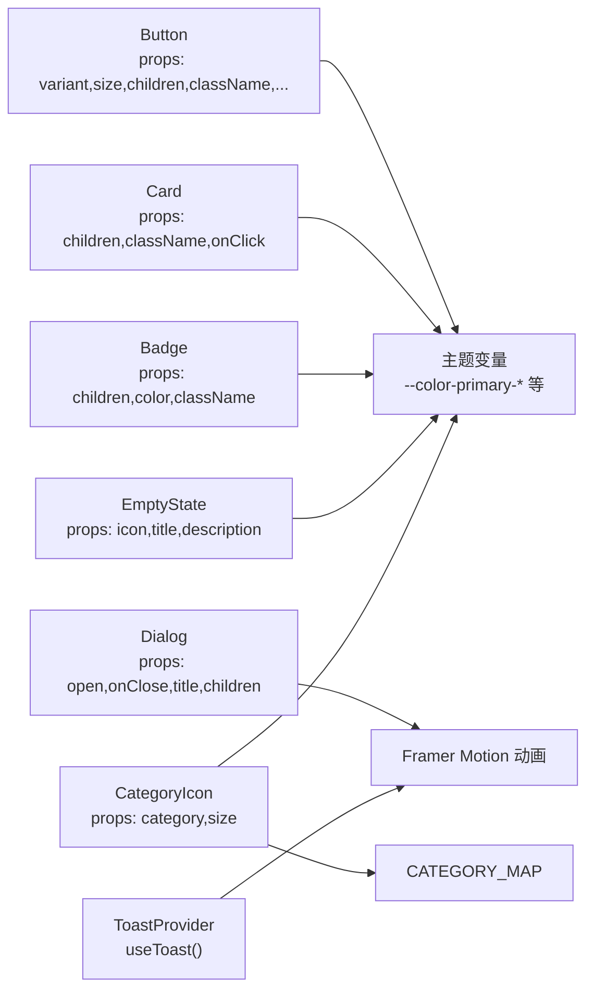
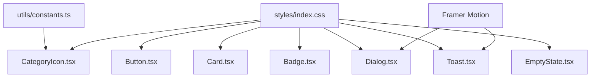

# 基础UI组件

<cite>
**本文引用的文件**
- [src/components/ui/Button.tsx](file://src/components/ui/Button.tsx)
- [src/components/ui/Card.tsx](file://src/components/ui/Card.tsx)
- [src/components/ui/Badge.tsx](file://src/components/ui/Badge.tsx)
- [src/components/ui/Dialog.tsx](file://src/components/ui/Dialog.tsx)
- [src/components/ui/Toast.tsx](file://src/components/ui/Toast.tsx)
- [src/components/ui/EmptyState.tsx](file://src/components/ui/EmptyState.tsx)
- [src/components/ui/CategoryIcon.tsx](file://src/components/ui/CategoryIcon.tsx)
- [src/styles/index.css](file://src/styles/index.css)
- [src/utils/constants.ts](file://src/utils/constants.ts)
</cite>

## 目录
1. [简介](#简介)
2. [项目结构](#项目结构)
3. [核心组件](#核心组件)
4. [架构总览](#架构总览)
5. [详细组件分析](#详细组件分析)
6. [依赖关系分析](#依赖关系分析)
7. [性能考量](#性能考量)
8. [故障排查指南](#故障排查指南)
9. [结论](#结论)
10. [附录](#附录)

## 简介
本文件系统化梳理 MoneyNote 的基础 UI 组件库，覆盖 Button、Card、Badge、Dialog、Toast、EmptyState、CategoryIcon 等可复用组件。内容包括：设计原则与实现要点、props 属性与事件回调、样式定制与主题扩展、状态管理与动画交互、响应式与无障碍支持、跨浏览器兼容性、最佳实践与性能优化建议，并通过“代码片段路径”指引到仓库中的具体实现位置。

## 项目结构
基础 UI 组件集中位于 src/components/ui 目录下，配合 src/styles/index.css 提供主题变量与通用样式；部分组件（如 CategoryIcon）依赖 src/utils/constants.ts 中的分类映射常量。

图示来源
- [src/components/ui/Button.tsx](file://src/components/ui/Button.tsx)
- [src/components/ui/Card.tsx](file://src/components/ui/Card.tsx)
- [src/components/ui/Badge.tsx](file://src/components/ui/Badge.tsx)
- [src/components/ui/Dialog.tsx](file://src/components/ui/Dialog.tsx)
- [src/components/ui/Toast.tsx](file://src/components/ui/Toast.tsx)
- [src/components/ui/EmptyState.tsx](file://src/components/ui/EmptyState.tsx)
- [src/components/ui/CategoryIcon.tsx](file://src/components/ui/CategoryIcon.tsx)
- [src/styles/index.css](file://src/styles/index.css)
- [src/utils/constants.ts](file://src/utils/constants.ts)

章节来源
- [src/components/ui/Button.tsx](file://src/components/ui/Button.tsx)
- [src/components/ui/Card.tsx](file://src/components/ui/Card.tsx)
- [src/components/ui/Badge.tsx](file://src/components/ui/Badge.tsx)
- [src/components/ui/Dialog.tsx](file://src/components/ui/Dialog.tsx)
- [src/components/ui/Toast.tsx](file://src/components/ui/Toast.tsx)
- [src/components/ui/EmptyState.tsx](file://src/components/ui/EmptyState.tsx)
- [src/components/ui/CategoryIcon.tsx](file://src/components/ui/CategoryIcon.tsx)
- [src/styles/index.css](file://src/styles/index.css)
- [src/utils/constants.ts](file://src/utils/constants.ts)

## 核心组件
本节概览各组件的职责、关键属性与交互特征，便于快速定位与使用。

- Button：提供主次/幽灵/危险四种外观变体与三种尺寸，支持透传原生按钮属性，具备过渡动效。
- Card：容器型组件，支持点击回调与可选指针样式，内置琥珀边框与浅色背景。
- Badge：徽标组件，支持自定义颜色与类名，基于透明度混合色实现轻量标签。
- Dialog：底部弹出式对话框，支持遮罩层与滑入动画，提供标题区与关闭按钮。
- Toast：全局提示系统，提供成功/错误/信息三类样式，自动定时消失，支持上下文注入。
- EmptyState：空状态占位，支持图标、标题与描述文本。
- CategoryIcon：按分类映射渲染带边框与颜色的图标容器，支持尺寸控制。

章节来源
- [src/components/ui/Button.tsx](file://src/components/ui/Button.tsx)
- [src/components/ui/Card.tsx](file://src/components/ui/Card.tsx)
- [src/components/ui/Badge.tsx](file://src/components/ui/Badge.tsx)
- [src/components/ui/Dialog.tsx](file://src/components/ui/Dialog.tsx)
- [src/components/ui/Toast.tsx](file://src/components/ui/Toast.tsx)
- [src/components/ui/EmptyState.tsx](file://src/components/ui/EmptyState.tsx)
- [src/components/ui/CategoryIcon.tsx](file://src/components/ui/CategoryIcon.tsx)

## 架构总览
基础 UI 组件遵循“最小接口 + 可组合样式”的设计：通过 props 控制外观与行为，通过 className 扩展样式；动画统一由 Framer Motion 提供；主题变量集中在 CSS 自定义属性中，便于整体切换。

图示来源
- [src/components/ui/Button.tsx](file://src/components/ui/Button.tsx)
- [src/components/ui/Card.tsx](file://src/components/ui/Card.tsx)
- [src/components/ui/Badge.tsx](file://src/components/ui/Badge.tsx)
- [src/components/ui/Dialog.tsx](file://src/components/ui/Dialog.tsx)
- [src/components/ui/Toast.tsx](file://src/components/ui/Toast.tsx)
- [src/components/ui/EmptyState.tsx](file://src/components/ui/EmptyState.tsx)
- [src/components/ui/CategoryIcon.tsx](file://src/components/ui/CategoryIcon.tsx)
- [src/styles/index.css](file://src/styles/index.css)
- [src/utils/constants.ts](file://src/utils/constants.ts)

## 详细组件分析

### Button 组件
- 设计原则
  - 以“变体 + 尺寸”为核心配置，保证在不同场景下的一致性与可预测性。
  - 通过 className 与透传属性实现灵活扩展。
- 关键属性
  - variant: 'primary' | 'secondary' | 'ghost' | 'danger'
  - size: 'sm' | 'md' | 'lg'
  - children: ReactNode
  - className?: string
  - 其他原生 button 属性（如 onClick、disabled、type 等）
- 事件与回调
  - 支持原生按钮事件（如 onClick、onFocus、onBlur），无内置回调。
- 样式与主题
  - 使用主题变量 --color-primary-* 与自定义阴影、圆角等。
  - 通过 variants/sizes 映射生成类名，支持 hover/active 状态。
- 交互与动画
  - 内置 transition-colors，确保颜色过渡自然。
- 使用场景
  - 主要操作（Primary）、次要操作（Secondary）、危险操作（Danger）、装饰性按钮（Ghost）。
- 代码片段路径
  - [Button 实现:1-38](file://src/components/ui/Button.tsx#L1-L38)
  - [主题变量与动画:3-48](file://src/styles/index.css#L3-L48)

章节来源
- [src/components/ui/Button.tsx:1-38](file://src/components/ui/Button.tsx#L1-L38)
- [src/styles/index.css:3-48](file://src/styles/index.css#L3-L48)

### Card 组件
- 设计原则
  - 轻量容器，强调内容密度与可点击反馈。
- 关键属性
  - children: ReactNode
  - className?: string
  - onClick?: () => void
- 事件与回调
  - onClick 回调用于外层交互。
- 样式与主题
  - amber-border、背景色与悬停态浅色叠加。
- 交互与动画
  - 无内置动画，仅在存在 onClick 时提供指针与悬停态。
- 使用场景
  - 列表项卡片、详情卡片、可点击区块。
- 代码片段路径
  - [Card 实现:1-19](file://src/components/ui/Card.tsx#L1-L19)
  - [主题样式:96-99](file://src/styles/index.css#L96-L99)

章节来源
- [src/components/ui/Card.tsx:1-19](file://src/components/ui/Card.tsx#L1-L19)
- [src/styles/index.css:96-99](file://src/styles/index.css#L96-L99)

### Badge 组件
- 设计原则
  - 轻量信息标记，颜色与背景通过透明度混合实现柔和视觉。
- 关键属性
  - children: ReactNode
  - color?: string（默认中性灰）
  - className?: string
- 样式与主题
  - 背景色基于 color + 15 透明度，文字色与边框色一致。
- 使用场景
  - 标签、状态指示、分类标识。
- 代码片段路径
  - [Badge 实现:1-17](file://src/components/ui/Badge.tsx#L1-L17)
  - [主题样式:96-99](file://src/styles/index.css#L96-L99)

章节来源
- [src/components/ui/Badge.tsx:1-17](file://src/components/ui/Badge.tsx#L1-L17)
- [src/styles/index.css:96-99](file://src/styles/index.css#L96-L99)

### Dialog 组件
- 设计原则
  - 底部弹出式对话框，适配移动端安全区域，提供遮罩与滑入动画。
- 关键属性
  - open: boolean（受控开关）
  - onClose: () => void（点击遮罩或关闭按钮触发）
  - title?: string（可选标题）
  - children: ReactNode
- 事件与回调
  - onClose 在遮罩点击与关闭按钮点击时触发。
- 样式与主题
  - 背景、边框、圆角与安全区域适配。
- 动画与交互
  - 使用 Framer Motion 提供进入/退出动画，底部滑入。
- 使用场景
  - 移动端确认对话框、设置面板、筛选器面板。
- 代码片段路径
  - [Dialog 实现:1-43](file://src/components/ui/Dialog.tsx#L1-L43)
  - [安全区域样式:106-109](file://src/styles/index.css#L106-L109)

章节来源
- [src/components/ui/Dialog.tsx:1-43](file://src/components/ui/Dialog.tsx#L1-L43)
- [src/styles/index.css:106-109](file://src/styles/index.css#L106-L109)

### Toast 组件
- 设计原则
  - 全局提示系统，自动定时消失，支持多条队列展示。
- 关键属性
  - 作为 Provider 使用，不直接接收 props。
  - useToast(): { showToast(message, type?) }
- 上下文与状态
  - 内部维护 toasts 数组，按 id 过滤移除。
  - 默认类型为 success，支持 success/error/info。
- 样式与主题
  - 不同类型对应不同背景与文字色。
- 动画与交互
  - 使用 Framer Motion 提供进入/退出动画。
- 使用场景
  - 操作反馈、错误提示、信息提醒。
- 代码片段路径
  - [ToastProvider 与 useToast:1-61](file://src/components/ui/Toast.tsx#L1-L61)
  - [主题样式:3-48](file://src/styles/index.css#L3-L48)

章节来源
- [src/components/ui/Toast.tsx:1-61](file://src/components/ui/Toast.tsx#L1-L61)
- [src/styles/index.css:3-48](file://src/styles/index.css#L3-L48)

### EmptyState 组件
- 设计原则
  - 空状态占位，简洁明了，提升可用性。
- 关键属性
  - icon?: string（默认短横线）
  - title: string
  - description?: string
- 样式与主题
  - 图标、标题、描述文本采用统一字号与颜色体系。
- 使用场景
  - 列表为空、功能未启用、引导提示。
- 代码片段路径
  - [EmptyState 实现:1-16](file://src/components/ui/EmptyState.tsx#L1-L16)
  - [主题样式:73-79](file://src/styles/index.css#L73-L79)

章节来源
- [src/components/ui/EmptyState.tsx:1-16](file://src/components/ui/EmptyState.tsx#L1-L16)
- [src/styles/index.css:73-79](file://src/styles/index.css#L73-L79)

### CategoryIcon 组件
- 设计原则
  - 基于分类映射渲染图标容器，统一尺寸与颜色规范。
- 关键属性
  - category: string（需匹配 CATEGORY_MAP）
  - size?: 'sm' | 'md' | 'lg'
- 依赖与数据
  - 依赖 utils/constants.ts 中的 CATEGORY_MAP 常量。
- 样式与主题
  - 边框色与图标色来自分类信息，尺寸通过类名映射。
- 使用场景
  - 交易列表、统计图表、分类筛选。
- 代码片段路径
  - [CategoryIcon 实现:1-25](file://src/components/ui/CategoryIcon.tsx#L1-L25)
  - [分类映射常量](file://src/utils/constants.ts)

章节来源
- [src/components/ui/CategoryIcon.tsx:1-25](file://src/components/ui/CategoryIcon.tsx#L1-L25)
- [src/utils/constants.ts](file://src/utils/constants.ts)

## 依赖关系分析
- 组件间耦合
  - Dialog/Toast/Card/Badge 均为纯展示组件，彼此低耦合，可独立使用。
  - CategoryIcon 依赖 utils/constants.ts 的分类映射。
- 外部依赖
  - Framer Motion：用于动画与过渡。
  - TailwindCSS：用于原子化样式与主题变量。
- 潜在循环依赖
  - 当前结构无循环依赖风险。
- 接口契约
  - 所有组件均通过 props 控制行为，无隐式副作用。

图示来源
- [src/components/ui/CategoryIcon.tsx](file://src/components/ui/CategoryIcon.tsx)
- [src/components/ui/Dialog.tsx](file://src/components/ui/Dialog.tsx)
- [src/components/ui/Toast.tsx](file://src/components/ui/Toast.tsx)
- [src/styles/index.css](file://src/styles/index.css)
- [src/utils/constants.ts](file://src/utils/constants.ts)

章节来源
- [src/components/ui/CategoryIcon.tsx](file://src/components/ui/CategoryIcon.tsx)
- [src/components/ui/Dialog.tsx](file://src/components/ui/Dialog.tsx)
- [src/components/ui/Toast.tsx](file://src/components/ui/Toast.tsx)
- [src/styles/index.css](file://src/styles/index.css)
- [src/utils/constants.ts](file://src/utils/constants.ts)

## 性能考量
- 渲染开销
  - 所有组件均为函数组件，无复杂计算，开销极低。
- 动画性能
  - 使用 Framer Motion 的硬件加速动画，建议避免在动画期间进行重排与大对象更新。
- 状态管理
  - Toast 使用本地状态，单页内多实例不会造成额外负担；若需要全局共享，可考虑引入状态库。
- 样式体积
  - Tailwind 原子类按需使用，建议在生产环境开启 Tree Shaking 与 Purge。
- 交互反馈
  - Button 的 transition-colors 与 Card 的 hover 效果均为 CSS 过渡，性能友好。

## 故障排查指南
- 动画不生效
  - 确认已安装并正确引入 Framer Motion。
  - 检查父级是否包裹了 AnimatePresence 或正确的初始状态。
- 颜色显示异常
  - 确认主题变量已正确编译，Tailwind 已加载自定义主题。
- 分类图标不显示
  - 检查传入的 category 是否存在于 CATEGORY_MAP。
- Toast 不出现
  - 确认已在应用根部包裹 ToastProvider，并通过 useToast 获取方法。
- 对话框无法关闭
  - 确认 open 为 true 且 onClose 正确绑定到遮罩与关闭按钮。

章节来源
- [src/components/ui/Dialog.tsx](file://src/components/ui/Dialog.tsx)
- [src/components/ui/Toast.tsx](file://src/components/ui/Toast.tsx)
- [src/components/ui/CategoryIcon.tsx](file://src/components/ui/CategoryIcon.tsx)
- [src/styles/index.css](file://src/styles/index.css)

## 结论
MoneyNote 的基础 UI 组件以简洁、可组合为核心理念，通过 props 与 className 实现高扩展性，借助主题变量与动画库达成一致的视觉与交互体验。建议在业务组件中优先复用这些基础组件，以降低维护成本并提升一致性。

## 附录

### 组件属性与事件速查
- Button
  - 属性：variant, size, children, className, 原生 button 属性
  - 事件：onClick/onFocus/onBlur 等
  - 适用场景：主要/次要/危险/幽灵按钮
- Card
  - 属性：children, className, onClick
  - 事件：onClick
  - 适用场景：卡片容器、可点击区块
- Badge
  - 属性：children, color, className
  - 适用场景：标签、状态指示
- Dialog
  - 属性：open, onClose, title, children
  - 事件：遮罩点击、关闭按钮点击
  - 适用场景：移动端底部弹窗
- Toast
  - 方法：useToast().showToast(message, type?)
  - 类型：success/error/info
  - 适用场景：全局提示
- EmptyState
  - 属性：icon, title, description
  - 适用场景：空状态占位
- CategoryIcon
  - 属性：category, size
  - 依赖：CATEGORY_MAP
  - 适用场景：分类图标

### 主题定制与样式覆盖
- 主题变量
  - 在 styles/index.css 中定义 --color-primary-*、--color-*cat-* 等，统一颜色体系。
- 样式覆盖
  - 通过 className 覆盖默认类名，或新增原子类实现局部定制。
- 动画与过渡
  - 通过 --animate-* 自定义动画名称，或直接在组件上覆写动画参数。

章节来源
- [src/styles/index.css:3-48](file://src/styles/index.css#L3-L48)