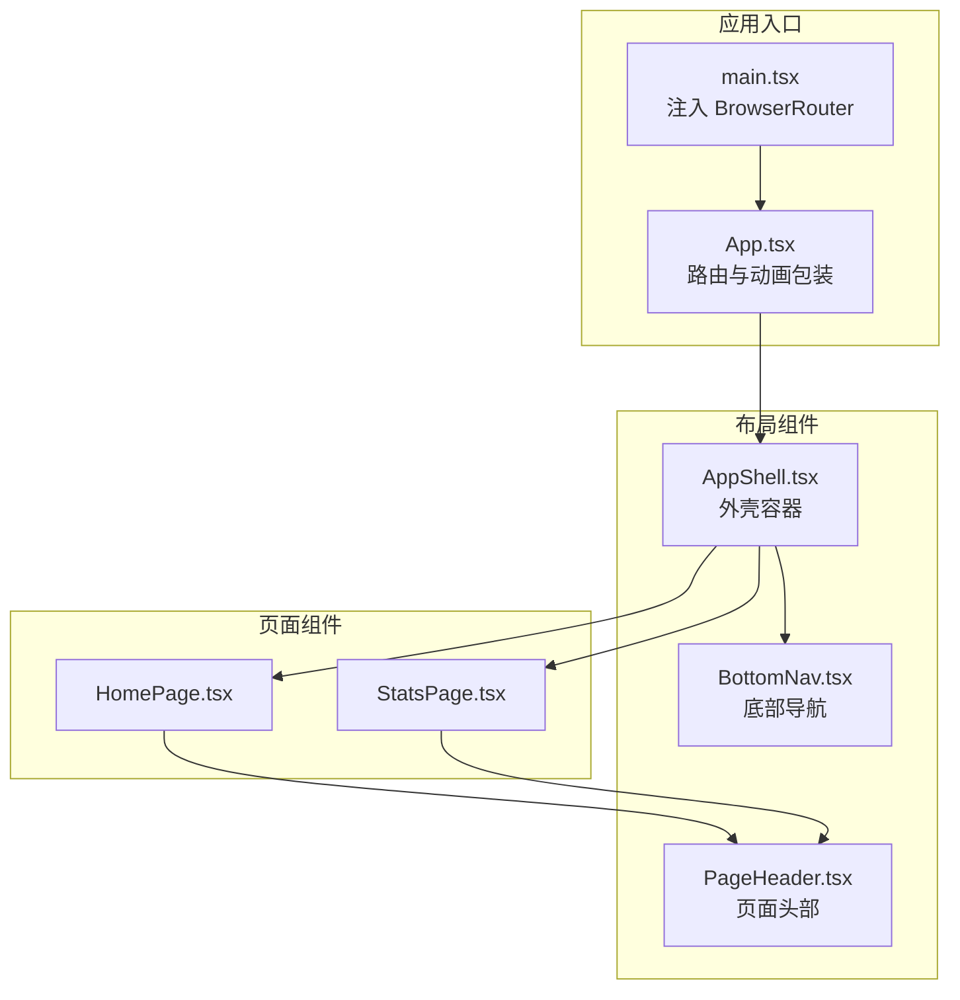
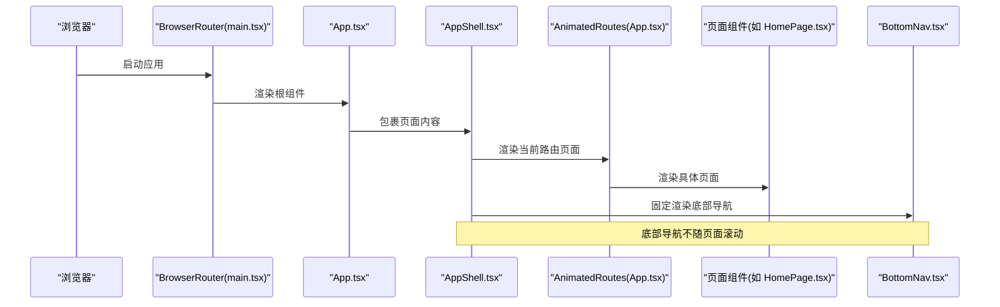
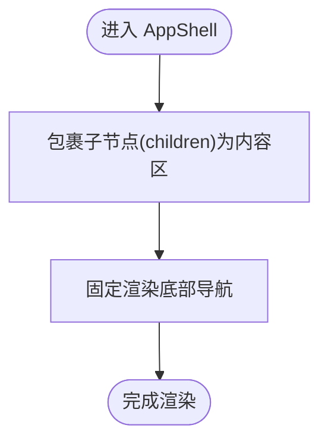
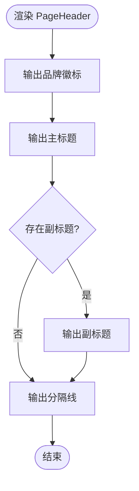
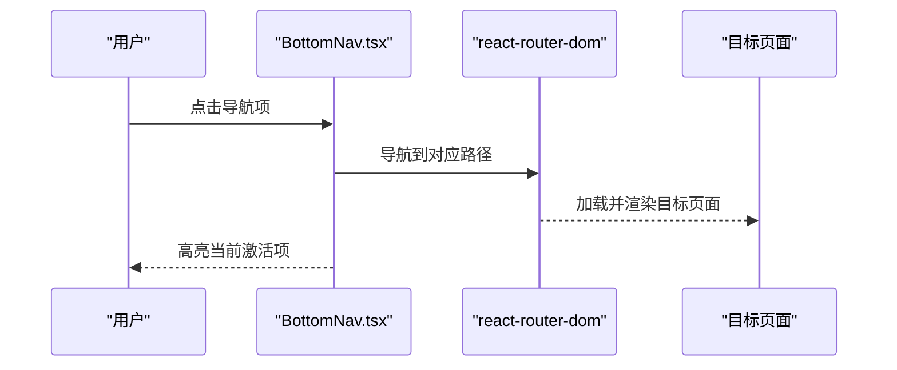
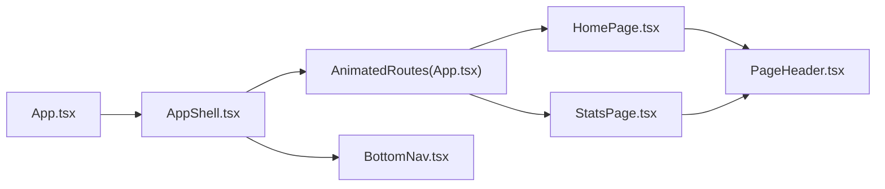
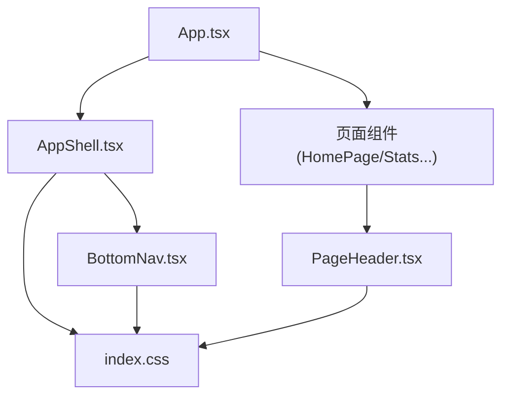

# 布局组件

<cite>
**本文引用的文件**
- [AppShell.tsx](file://src/components/layout/AppShell.tsx)
- [PageHeader.tsx](file://src/components/layout/PageHeader.tsx)
- [BottomNav.tsx](file://src/components/layout/BottomNav.tsx)
- [App.tsx](file://src/App.tsx)
- [main.tsx](file://src/main.tsx)
- [HomePage.tsx](file://src/pages/HomePage.tsx)
- [StatsPage.tsx](file://src/pages/StatsPage.tsx)
- [index.css](file://src/styles/index.css)
</cite>

## 目录
1. [简介](#简介)
2. [项目结构](#项目结构)
3. [核心组件](#核心组件)
4. [架构总览](#架构总览)
5. [组件详解](#组件详解)
6. [依赖关系分析](#依赖关系分析)
7. [性能与体验](#性能与体验)
8. [故障排查指南](#故障排查指南)
9. [结论](#结论)
10. [附录：样式与主题定制](#附录样式与主题定制)

## 简介
本文件系统性梳理 MoneyNote 的布局组件体系，重点覆盖 AppShell、PageHeader、BottomNav 三大组件的设计理念、实现方式与使用范式。文档同时阐述它们与页面组件的集成路径、路由切换机制、移动端安全区域适配、主题与样式定制方法，并给出常见问题排查建议。

## 项目结构
布局组件位于 src/components/layout 目录，采用“按功能域分层”的组织方式：
- AppShell：应用外壳容器，统一承载页面内容与底部导航
- PageHeader：页面级头部，负责标题、副标题与装饰分隔线
- BottomNav：移动端底部导航，基于 react-router-dom 的 NavLink 实现

应用入口通过 App.tsx 将页面路由包裹在 AppShell 内，再由 main.tsx 注入 BrowserRouter 提供路由环境。

**图表来源**
- [main.tsx:1-14](file://src/main.tsx#L1-L14)
- [App.tsx:1-51](file://src/App.tsx#L1-L51)
- [AppShell.tsx:1-18](file://src/components/layout/AppShell.tsx#L1-L18)
- [BottomNav.tsx:1-34](file://src/components/layout/BottomNav.tsx#L1-L34)
- [PageHeader.tsx:1-20](file://src/components/layout/PageHeader.tsx#L1-L20)
- [HomePage.tsx:1-100](file://src/pages/HomePage.tsx#L1-L100)
- [StatsPage.tsx:1-38](file://src/pages/StatsPage.tsx#L1-L38)

**章节来源**
- [main.tsx:1-14](file://src/main.tsx#L1-L14)
- [App.tsx:1-51](file://src/App.tsx#L1-L51)

## 核心组件
- AppShell：提供最大宽度约束与居中布局，内部预留页面内容区与底部导航区域，确保移动端最佳阅读宽度与交互空间。
- PageHeader：提供品牌徽标、标题、副标题与分隔线，统一页面头部视觉与留白。
- BottomNav：固定在底部的导航条，使用 NavLink 根据当前路由高亮对应项，提供移动端一致的导航体验。

**章节来源**
- [AppShell.tsx:1-18](file://src/components/layout/AppShell.tsx#L1-L18)
- [PageHeader.tsx:1-20](file://src/components/layout/PageHeader.tsx#L1-L20)
- [BottomNav.tsx:1-34](file://src/components/layout/BottomNav.tsx#L1-L34)

## 架构总览
下图展示从浏览器到页面渲染的关键调用链，以及布局组件在其中的位置与职责：

**图表来源**
- [main.tsx:1-14](file://src/main.tsx#L1-L14)
- [App.tsx:1-51](file://src/App.tsx#L1-L51)
- [AppShell.tsx:1-18](file://src/components/layout/AppShell.tsx#L1-L18)
- [BottomNav.tsx:1-34](file://src/components/layout/BottomNav.tsx#L1-L34)
- [HomePage.tsx:1-100](file://src/pages/HomePage.tsx#L1-L100)

## 组件详解

### AppShell：应用外壳容器
- 设计目标
  - 限制内容最大宽度（max-w-lg），在大屏设备上保持居中，提升可读性
  - 为页面内容预留底部空间（pb-20），避免与固定底部导航重叠
  - 统一挂载 BottomNav，保证导航始终可见且不随页面滚动
- 关键点
  - 使用最小高度与最大宽度组合，确保在小屏设备上铺满，在大屏设备上不溢出
  - 主体内容区与导航区分离，便于后续扩展顶部工具栏或侧边栏
- 适用场景
  - 所有页面均应被 AppShell 包裹，以获得一致的布局基线

**图表来源**
- [AppShell.tsx:8-17](file://src/components/layout/AppShell.tsx#L8-L17)

**章节来源**
- [AppShell.tsx:1-18](file://src/components/layout/AppShell.tsx#L1-L18)

### PageHeader：页面头部
- 设计目标
  - 展示品牌标识、主标题与可选副标题，形成清晰的页面层级
  - 提供视觉分隔线，增强内容区块边界感
  - 支持安全区域适配（safe-area-top），在刘海屏/圆角屏上避免遮挡
- 关键点
  - 标题采用强调字体与字号，突出页面主题
  - 品牌徽标与副标题采用较小字号与浅色，避免喧宾夺主
  - 分隔线使用主题色系，强化品牌一致性
- 使用建议
  - 在每个页面的最上方使用，配合 AppShell 的内边距与安全区域类，确保视觉统一

**图表来源**
- [PageHeader.tsx:6-19](file://src/components/layout/PageHeader.tsx#L6-L19)

**章节来源**
- [PageHeader.tsx:1-20](file://src/components/layout/PageHeader.tsx#L1-L20)

### BottomNav：移动端底部导航
- 设计目标
  - 固定在屏幕底部，提供跨页面快速切换
  - 基于 NavLink 的激活态样式，直观反馈当前路由
  - 使用模糊与半透明白底，兼顾可读性与层次感
- 导航项
  - 记账、统计、明细、预算、设置，分别对应不同路由路径
- 交互特性
  - 激活项使用主题色边框与文字高亮
  - 非激活项悬停时过渡到主题色，提供即时反馈
- 适配要点
  - 使用 safe-area-bottom 适配刘海屏底部安全区域
  - 固定定位与 z-index 确保导航始终覆盖在内容之上

**图表来源**
- [BottomNav.tsx:11-33](file://src/components/layout/BottomNav.tsx#L11-L33)

**章节来源**
- [BottomNav.tsx:1-34](file://src/components/layout/BottomNav.tsx#L1-L34)

### 页面与布局的集成
- App.tsx 中通过 AppShell 包裹 AnimatedRoutes，后者根据当前路由渲染对应页面
- 页面组件（如 HomePage、StatsPage）在自身顶部使用 PageHeader，形成“页面头部 + 内容区”的标准结构
- 底部导航由 AppShell 固定渲染，不随页面内容滚动

**图表来源**
- [App.tsx:17-40](file://src/App.tsx#L17-L40)
- [AppShell.tsx:8-17](file://src/components/layout/AppShell.tsx#L8-L17)
- [HomePage.tsx:54](file://src/pages/HomePage.tsx#L54)
- [StatsPage.tsx:13](file://src/pages/StatsPage.tsx#L13)

**章节来源**
- [App.tsx:1-51](file://src/App.tsx#L1-L51)
- [HomePage.tsx:1-100](file://src/pages/HomePage.tsx#L1-L100)
- [StatsPage.tsx:1-38](file://src/pages/StatsPage.tsx#L1-L38)

## 依赖关系分析
- AppShell 依赖 BottomNav，用于渲染底部导航
- App.tsx 依赖 AppShell，并在其内部渲染页面路由
- 页面组件依赖 PageHeader 进行头部展示
- 全局样式通过 index.css 提供主题变量、安全区域与通用样式

**图表来源**
- [App.tsx:1-51](file://src/App.tsx#L1-L51)
- [AppShell.tsx:1-18](file://src/components/layout/AppShell.tsx#L1-L18)
- [BottomNav.tsx:1-34](file://src/components/layout/BottomNav.tsx#L1-L34)
- [PageHeader.tsx:1-20](file://src/components/layout/PageHeader.tsx#L1-L20)
- [index.css:1-134](file://src/styles/index.css#L1-L134)

**章节来源**
- [index.css:1-134](file://src/styles/index.css#L1-L134)

## 性能与体验
- 路由切换动画
  - AnimatedRoutes 使用 Framer Motion 对页面进行淡入淡出与位移过渡，时长短、反馈快，提升切换感知
- 移动端体验
  - BottomNav 固定定位 + safe-area-bottom，避免手势误触与遮挡
  - AppShell 的 pb-20 与 BottomNav 高度相匹配，确保内容不被底部导航遮挡
- 视觉一致性
  - 主题变量集中定义，颜色、圆角、阴影、字体族统一管理，减少样式碎片化

**章节来源**
- [App.tsx:11-40](file://src/App.tsx#L11-L40)
- [BottomNav.tsx:13](file://src/components/layout/BottomNav.tsx#L13)
- [AppShell.tsx:10-11](file://src/components/layout/AppShell.tsx#L10-L11)
- [index.css:3-48](file://src/styles/index.css#L3-L48)

## 故障排查指南
- 底部导航遮挡页面内容
  - 检查 AppShell 是否正确设置内容区底部留白（pb-20）
  - 检查 BottomNav 是否为固定定位且 z-index 足够高
  - 参考：[AppShell.tsx:10-11](file://src/components/layout/AppShell.tsx#L10-L11)，[BottomNav.tsx:13](file://src/components/layout/BottomNav.tsx#L13)
- 导航高亮不生效
  - 确认 NavLink 的 to 与路由路径一致
  - 确认路由已正确注册于 Routes 中
  - 参考：[BottomNav.tsx:3-9](file://src/components/layout/BottomNav.tsx#L3-L9)，[App.tsx:30-36](file://src/App.tsx#L30-L36)
- 品牌徽标或标题显示异常
  - 检查 PageHeader 的标题与副标题传参是否正确
  - 检查 safe-area-top 类是否在需要的设备上生效
  - 参考：[PageHeader.tsx:6-19](file://src/components/layout/PageHeader.tsx#L6-L19)
- 路由未生效或页面不渲染
  - 确认 main.tsx 已注入 BrowserRouter
  - 确认 App.tsx 的 Routes 已包含目标路径
  - 参考：[main.tsx:7-13](file://src/main.tsx#L7-L13)，[App.tsx:30-36](file://src/App.tsx#L30-L36)

**章节来源**
- [AppShell.tsx:10-11](file://src/components/layout/AppShell.tsx#L10-L11)
- [BottomNav.tsx:3-9](file://src/components/layout/BottomNav.tsx#L3-L9)
- [PageHeader.tsx:6-19](file://src/components/layout/PageHeader.tsx#L6-L19)
- [App.tsx:30-36](file://src/App.tsx#L30-L36)
- [main.tsx:7-13](file://src/main.tsx#L7-L13)

## 结论
MoneyNote 的布局组件以简洁、一致为核心设计原则：AppShell 提供稳定的容器与导航基座，PageHeader 明确页面层级，BottomNav 提供移动端高效导航。三者协同工作，结合全局主题与安全区域适配，形成良好的移动端体验基线。后续如需扩展顶部工具栏或侧边栏，可在 AppShell 内部进行模块化拆分与复用。

## 附录：样式与主题定制
- 主题变量
  - 颜色：主色系、语义色（支出/收入）、分类色
  - 圆角：卡片、按钮、输入框统一圆角
  - 阴影：卡片无阴影、输入框聚焦光晕
  - 字体：衬线标题、无衬线正文、等宽代码
- 安全区域
  - safe-area-top/safe-area-bottom 适配刘海屏/圆角屏
- 使用建议
  - 新增页面时统一在顶部使用 PageHeader
  - 如需自定义导航项，修改 BottomNav 的 tabs 列表并同步路由注册
  - 如需调整最大宽度或留白，修改 AppShell 的容器类名

**章节来源**
- [index.css:3-48](file://src/styles/index.css#L3-L48)
- [index.css:106-113](file://src/styles/index.css#L106-L113)
- [BottomNav.tsx:3-9](file://src/components/layout/BottomNav.tsx#L3-L9)
- [AppShell.tsx:10](file://src/components/layout/AppShell.tsx#L10)