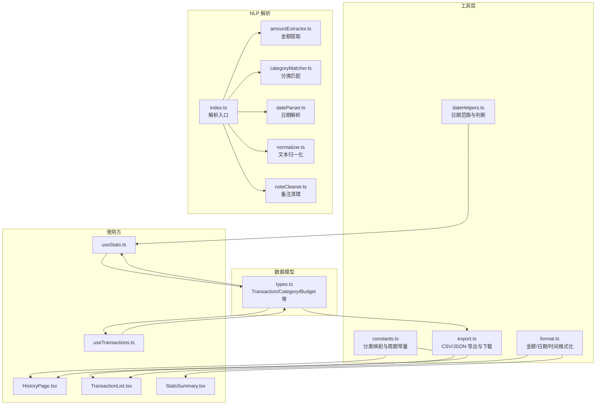
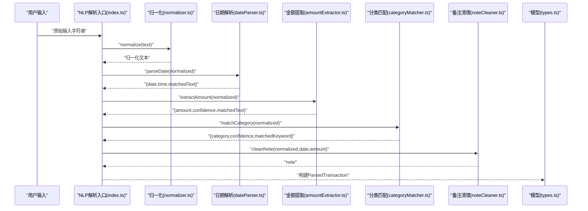
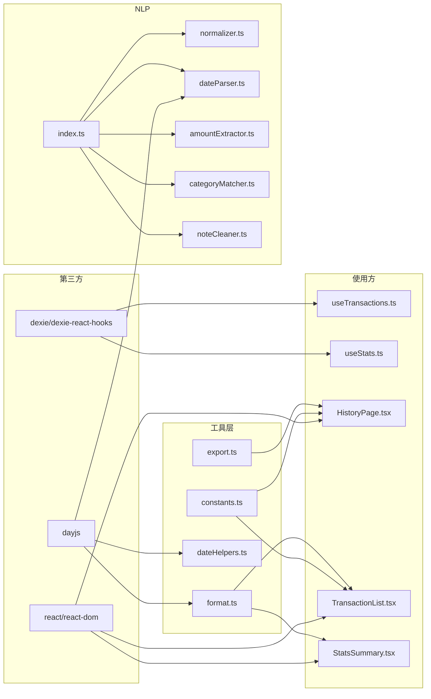

# 工具函数和辅助模块

<cite>
**本文引用的文件**
- [src/utils/constants.ts](file://src/utils/constants.ts)
- [src/utils/dateHelpers.ts](file://src/utils/dateHelpers.ts)
- [src/utils/format.ts](file://src/utils/format.ts)
- [src/utils/export.ts](file://src/utils/export.ts)
- [src/db/types.ts](file://src/db/types.ts)
- [src/nlp/index.ts](file://src/nlp/index.ts)
- [src/nlp/amountExtractor.ts](file://src/nlp/amountExtractor.ts)
- [src/nlp/categoryMatcher.ts](file://src/nlp/categoryMatcher.ts)
- [src/nlp/dateParser.ts](file://src/nlp/dateParser.ts)
- [src/nlp/normalizer.ts](file://src/nlp/normalizer.ts)
- [src/nlp/noteCleaner.ts](file://src/nlp/noteCleaner.ts)
- [src/hooks/useTransactions.ts](file://src/hooks/useTransactions.ts)
- [src/hooks/useStats.ts](file://src/hooks/useStats.ts)
- [src/pages/HistoryPage.tsx](file://src/pages/HistoryPage.tsx)
- [src/components/transaction/TransactionList.tsx](file://src/components/transaction/TransactionList.tsx)
- [src/components/stats/StatsSummary.tsx](file://src/components/stats/StatsSummary.tsx)
- [package.json](file://package.json)
</cite>

## 目录
1. [简介](#简介)
2. [项目结构](#项目结构)
3. [核心组件](#核心组件)
4. [架构总览](#架构总览)
5. [详细组件分析](#详细组件分析)
6. [依赖分析](#依赖分析)
7. [性能考虑](#性能考虑)
8. [故障排查指南](#故障排查指南)
9. [结论](#结论)
10. [附录](#附录)

## 简介
本文件系统性梳理 MoneyNote 的工具函数与辅助模块，覆盖常量定义、日期处理、格式化、导出功能以及 NLP 解析工具链。文档以“可读性优先”的原则，结合实际使用场景，给出参数说明、返回值格式、性能优化建议与扩展方法，帮助开发者快速理解与维护这些工具模块。

## 项目结构
工具模块主要位于 src/utils 与 src/nlp 目录，配合数据库类型定义与页面/组件使用示例，形成“数据模型—工具—UI”的清晰分层。

图表来源
- [src/utils/constants.ts:1-19](file://src/utils/constants.ts#L1-L19)
- [src/utils/dateHelpers.ts:1-35](file://src/utils/dateHelpers.ts#L1-L35)
- [src/utils/format.ts:1-28](file://src/utils/format.ts#L1-L28)
- [src/utils/export.ts:1-28](file://src/utils/export.ts#L1-L28)
- [src/nlp/index.ts:1-62](file://src/nlp/index.ts#L1-L62)
- [src/nlp/amountExtractor.ts:1-44](file://src/nlp/amountExtractor.ts#L1-L44)
- [src/nlp/categoryMatcher.ts:1-90](file://src/nlp/categoryMatcher.ts#L1-L90)
- [src/nlp/dateParser.ts:1-121](file://src/nlp/dateParser.ts#L1-L121)
- [src/nlp/normalizer.ts:1-36](file://src/nlp/normalizer.ts#L1-L36)
- [src/nlp/noteCleaner.ts:1-29](file://src/nlp/noteCleaner.ts#L1-L29)
- [src/db/types.ts:1-60](file://src/db/types.ts#L1-L60)
- [src/hooks/useTransactions.ts:1-67](file://src/hooks/useTransactions.ts#L1-L67)
- [src/hooks/useStats.ts:1-79](file://src/hooks/useStats.ts#L1-L79)
- [src/pages/HistoryPage.tsx:1-105](file://src/pages/HistoryPage.tsx#L1-L105)
- [src/components/transaction/TransactionList.tsx:1-50](file://src/components/transaction/TransactionList.tsx#L1-L50)
- [src/components/stats/StatsSummary.tsx:1-22](file://src/components/stats/StatsSummary.tsx#L1-L22)

章节来源
- [src/utils/constants.ts:1-19](file://src/utils/constants.ts#L1-L19)
- [src/utils/dateHelpers.ts:1-35](file://src/utils/dateHelpers.ts#L1-L35)
- [src/utils/format.ts:1-28](file://src/utils/format.ts#L1-L28)
- [src/utils/export.ts:1-28](file://src/utils/export.ts#L1-L28)
- [src/nlp/index.ts:1-62](file://src/nlp/index.ts#L1-L62)
- [src/db/types.ts:1-60](file://src/db/types.ts#L1-L60)

## 核心组件
- 常量定义：提供分类映射表与周期枚举，统一前端展示与逻辑判断。
- 日期工具：生成今日/本周/本月/本年范围，计算某月天数，判断某日期是否为今日或本月。
- 格式化工具：金额格式化（含万元简写）、日期人性化显示、时间格式化占位。
- 导出工具：将交易数据导出为 CSV/JSON，并触发浏览器下载。
- NLP 解析：文本归一化、日期解析、金额提取、分类匹配、备注清理，最终输出解析结果对象。

章节来源
- [src/utils/constants.ts:1-19](file://src/utils/constants.ts#L1-L19)
- [src/utils/dateHelpers.ts:1-35](file://src/utils/dateHelpers.ts#L1-L35)
- [src/utils/format.ts:1-28](file://src/utils/format.ts#L1-L28)
- [src/utils/export.ts:1-28](file://src/utils/export.ts#L1-L28)
- [src/nlp/index.ts:1-62](file://src/nlp/index.ts#L1-L62)

## 架构总览
下图展示了“解析流程”在工具层与使用方之间的交互关系，体现从原始输入到结构化交易对象的关键步骤。

图表来源
- [src/nlp/index.ts:8-55](file://src/nlp/index.ts#L8-L55)
- [src/nlp/normalizer.ts:17-35](file://src/nlp/normalizer.ts#L17-L35)
- [src/nlp/dateParser.ts:101-120](file://src/nlp/dateParser.ts#L101-L120)
- [src/nlp/amountExtractor.ts:27-43](file://src/nlp/amountExtractor.ts#L27-L43)
- [src/nlp/categoryMatcher.ts:45-89](file://src/nlp/categoryMatcher.ts#L45-L89)
- [src/nlp/noteCleaner.ts:2-28](file://src/nlp/noteCleaner.ts#L2-L28)
- [src/db/types.ts:48-59](file://src/db/types.ts#L48-L59)

## 详细组件分析

### 常量定义与周期类型
- 分类映射 CATEGORY_MAP：键为分类标识符，值包含中文名称、图标与颜色，用于 UI 展示与搜索过滤。
- 周期常量 PERIODS：支持 day/month/year 三种周期，配合 PeriodType 类型约束。
- 使用场景：历史页搜索、分类筛选、统计周期切换。

章节来源
- [src/utils/constants.ts:1-19](file://src/utils/constants.ts#L1-L19)
- [src/pages/HistoryPage.tsx:23-37](file://src/pages/HistoryPage.tsx#L23-L37)
- [src/hooks/useStats.ts:8-20](file://src/hooks/useStats.ts#L8-L20)

### 日期处理工具
- getTodayRange/getMonthRange/getYearRange/getWeekRange：返回闭区间字符串数组 ["YYYY-MM-DD","YYYY-MM-DD"]。
- getDaysInMonth：返回指定月份天数。
- isToday/isThisMonth：判断日期是否为今日或本月。

章节来源
- [src/utils/dateHelpers.ts:3-34](file://src/utils/dateHelpers.ts#L3-L34)
- [src/hooks/useStats.ts:11-20](file://src/hooks/useStats.ts#L11-L20)

### 格式化工具
- formatAmount：金额格式化为“¥XX.XX”。
- formatAmountShort：金额“万元简写”，大于等于10000时以“¥X.Xw”形式显示，否则整数“¥X”。
- formatDate：日期人性化显示，“今天/昨天/当年(M月D日)/跨年(YYYY年M月D日)”。
- formatTime：当前为占位，直接返回传入时间字符串。

章节来源
- [src/utils/format.ts:3-27](file://src/utils/format.ts#L3-L27)
- [src/components/transaction/TransactionList.tsx:33](file://src/components/transaction/TransactionList.tsx#L33)
- [src/components/stats/StatsSummary.tsx:13](file://src/components/stats/StatsSummary.tsx#L13)

### 导出工具
- exportToCSV：生成 CSV 字符串，列包括“日期,时间,类型,分类,金额,备注”，备注中的逗号会被替换为中文逗号。
- exportToJSON：将交易数组序列化为 JSON 字符串。
- downloadFile：创建 Blob 并触发浏览器下载，自动回收对象 URL。

章节来源
- [src/utils/export.ts:4-27](file://src/utils/export.ts#L4-L27)
- [src/db/types.ts:3-14](file://src/db/types.ts#L3-L14)

### NLP 解析工具链
- 归一化 normalize：全角转半角、中文货币单位映射、小写化、空白压缩。
- 日期解析 parseDate：支持“今天/昨天/前天/大前天”、“N天前”、“上周/这周+星期X”、“月日”、“ISO日期”、“时间”等模式。
- 金额提取 extractAmount：按优先级匹配多种金额模式，返回数值、置信度与匹配文本。
- 分类匹配 matchCategory：内置多分类关键词词典，基于关键词命中长度加权评分，返回分类、置信度与匹配词。
- 备注清理 cleanNote：移除已解析的日期/金额片段与常见动词前缀，清理标点与多余空白。
- 解析入口 parseInput：串联上述步骤，产出 ParsedTransaction 结构，包含是否需要人工复核的标志。

章节来源
- [src/nlp/normalizer.ts:17-35](file://src/nlp/normalizer.ts#L17-L35)
- [src/nlp/dateParser.ts:101-120](file://src/nlp/dateParser.ts#L101-L120)
- [src/nlp/amountExtractor.ts:27-43](file://src/nlp/amountExtractor.ts#L27-L43)
- [src/nlp/categoryMatcher.ts:45-89](file://src/nlp/categoryMatcher.ts#L45-L89)
- [src/nlp/noteCleaner.ts:2-28](file://src/nlp/noteCleaner.ts#L2-L28)
- [src/nlp/index.ts:8-55](file://src/nlp/index.ts#L8-L55)

### 数据模型与使用方
- Transaction/Category/Budget/Setting 等类型定义，明确字段与约束。
- useTransactions/useStats：封装查询、增删改、聚合统计与日期导航。
- HistoryPage/TransactionList/StatsSummary：在页面与组件中调用格式化与常量，完成展示与交互。

章节来源
- [src/db/types.ts:3-60](file://src/db/types.ts#L3-L60)
- [src/hooks/useTransactions.ts:6-66](file://src/hooks/useTransactions.ts#L6-L66)
- [src/hooks/useStats.ts:7-78](file://src/hooks/useStats.ts#L7-L78)
- [src/pages/HistoryPage.tsx:12-104](file://src/pages/HistoryPage.tsx#L12-L104)
- [src/components/transaction/TransactionList.tsx:12-49](file://src/components/transaction/TransactionList.tsx#L12-L49)
- [src/components/stats/StatsSummary.tsx:8-21](file://src/components/stats/StatsSummary.tsx#L8-L21)

## 依赖分析
- 第三方库：dayjs 用于日期处理；dexie/dexie-react-hooks 用于本地数据库访问；React Hooks 用于状态与订阅。
- 模块耦合：工具层低耦合，通过明确的输入输出接口与类型约束连接；NLP 解析器内部组合多个子模块；导出模块依赖类型定义与常量映射。

图表来源
- [package.json:12-21](file://package.json#L12-L21)
- [src/utils/format.ts:1](file://src/utils/format.ts#L1)
- [src/utils/export.ts:1](file://src/utils/export.ts#L1)
- [src/utils/dateHelpers.ts:1](file://src/utils/dateHelpers.ts#L1)
- [src/utils/constants.ts:1](file://src/utils/constants.ts#L1)
- [src/nlp/index.ts:1-7](file://src/nlp/index.ts#L1-L7)
- [src/hooks/useTransactions.ts:1-4](file://src/hooks/useTransactions.ts#L1-L4)
- [src/hooks/useStats.ts:1-5](file://src/hooks/useStats.ts#L1-L5)
- [src/pages/HistoryPage.tsx:1-11](file://src/pages/HistoryPage.tsx#L1-L11)
- [src/components/transaction/TransactionList.tsx:1-5](file://src/components/transaction/TransactionList.tsx#L1-L5)
- [src/components/stats/StatsSummary.tsx:1](file://src/components/stats/StatsSummary.tsx#L1)

章节来源
- [package.json:12-21](file://package.json#L12-L21)

## 性能考虑
- 日期计算：优先使用 dayjs 的 startOf/endOf 等原生方法，避免重复格式化；批量计算时尽量复用同一天的 Dayjs 实例。
- 文本处理：NLP 步骤按优先级匹配，注意正则复杂度；可对高频关键词建立更小的候选集或缓存中间结果。
- 导出性能：CSV/JSON 生成在内存中进行，超大数据量时建议分批导出或服务端导出；下载前确保及时释放 Blob URL。
- UI 渲染：格式化函数应保持纯函数特性，避免在渲染路径内做昂贵计算；必要时使用 useMemo 缓存中间结果。
- 数据库查询：使用索引字段（如 date）进行范围查询；合理限制返回数量，避免一次性加载过多数据。

## 故障排查指南
- 日期解析异常
  - 症状：日期解析未命中任何模式，返回默认“今天”。
  - 排查：检查输入文本是否包含中文日期表达式或 ISO 格式；确认 normalize 是否正确执行。
  - 参考
    - [src/nlp/dateParser.ts:101-120](file://src/nlp/dateParser.ts#L101-L120)
    - [src/nlp/normalizer.ts:17-35](file://src/nlp/normalizer.ts#L17-L35)
- 金额提取失败
  - 症状：amount 为 null，confidence 低。
  - 排查：确认输入是否包含“元/块/¥/￥”等货币单位；检查中文数字与全角字符是否被正确归一化。
  - 参考
    - [src/nlp/amountExtractor.ts:27-43](file://src/nlp/amountExtractor.ts#L27-L43)
    - [src/nlp/normalizer.ts:17-35](file://src/nlp/normalizer.ts#L17-L35)
- 分类匹配不准确
  - 症状：分类置信度低或误判。
  - 排查：增加关键词覆盖度；调整评分阈值；确保输入文本大小写已被统一。
  - 参考
    - [src/nlp/categoryMatcher.ts:45-89](file://src/nlp/categoryMatcher.ts#L45-L89)
- 导出文件乱码或列错位
  - 症状：CSV 中文显示异常或列顺序错误。
  - 排查：确认编码设置与逗号替换逻辑；确保 Transaction 类型字段顺序一致。
  - 参考
    - [src/utils/export.ts:4-13](file://src/utils/export.ts#L4-L13)
    - [src/db/types.ts:3-14](file://src/db/types.ts#L3-L14)

## 结论
本项目的工具与辅助模块围绕“数据模型—工具—UI”三层设计，形成高内聚、低耦合的结构。通过统一的常量、格式化与导出工具，以及可扩展的 NLP 解析链，既保证了用户体验的一致性，也为后续功能扩展提供了清晰的边界与接口。

## 附录

### 使用示例与参数说明
- 日期范围生成
  - 输入：可选日期（Dayjs 实例）
  - 输出：["YYYY-MM-DD","YYYY-MM-DD"]
  - 示例路径
    - [src/utils/dateHelpers.ts:8-21](file://src/utils/dateHelpers.ts#L8-L21)
- 金额格式化
  - 输入：数值
  - 输出："¥XX.XX" 或 "¥Xw"（万元简写）
  - 示例路径
    - [src/utils/format.ts:3-12](file://src/utils/format.ts#L3-L12)
- 日期人性化显示
  - 输入：日期字符串或 Date 对象
  - 输出："今天/昨天/某年某月某日/某月某日"
  - 示例路径
    - [src/utils/format.ts:14-23](file://src/utils/format.ts#L14-L23)
- 导出 CSV/JSON
  - 输入：Transaction[] 数组
  - 输出：CSV/JSON 字符串；触发下载
  - 示例路径
    - [src/utils/export.ts:4-27](file://src/utils/export.ts#L4-L27)
    - [src/db/types.ts:3-14](file://src/db/types.ts#L3-L14)

### 扩展与维护建议
- 新增工具函数
  - 保持纯函数与不可变性；明确输入/输出类型；在 utils 下新增独立文件并导出。
  - 在对应使用方组件中引入并测试。
- 维护现有模块
  - 常量：新增分类时同步更新 CATEGORY_MAP 与 UI 选择器。
  - NLP：根据用户反馈迭代关键词与正则；必要时引入缓存或预编译正则。
  - 导出：支持更多格式（如 Excel）时，新增导出函数并在页面中暴露入口。
- 性能优化
  - 对频繁调用的格式化函数使用 useMemo 缓存；
  - 对大数据量导出采用分片或服务端导出；
  - 合理拆分 NLP 步骤，便于并行化与单元测试。