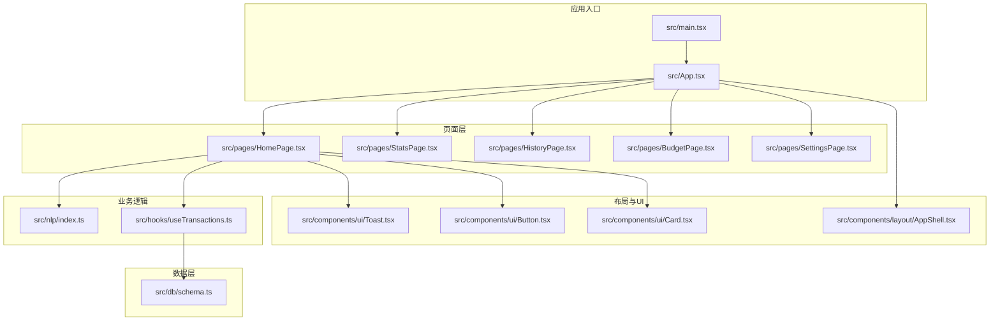
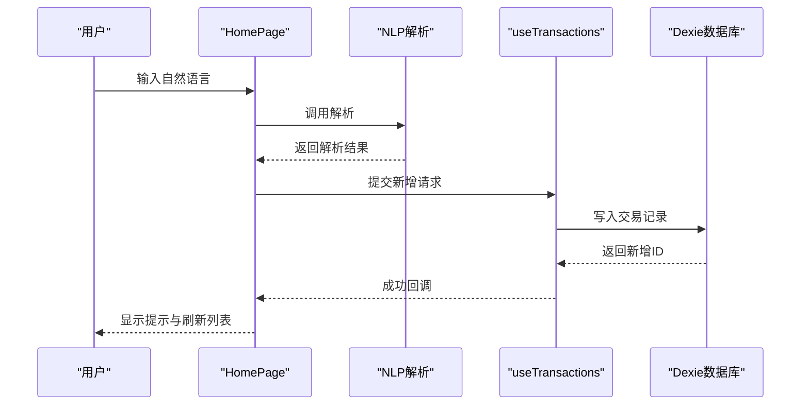
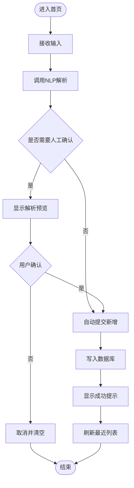
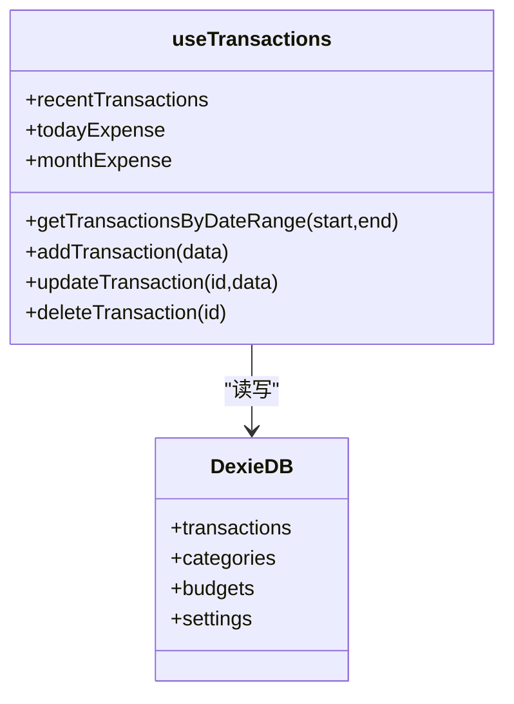
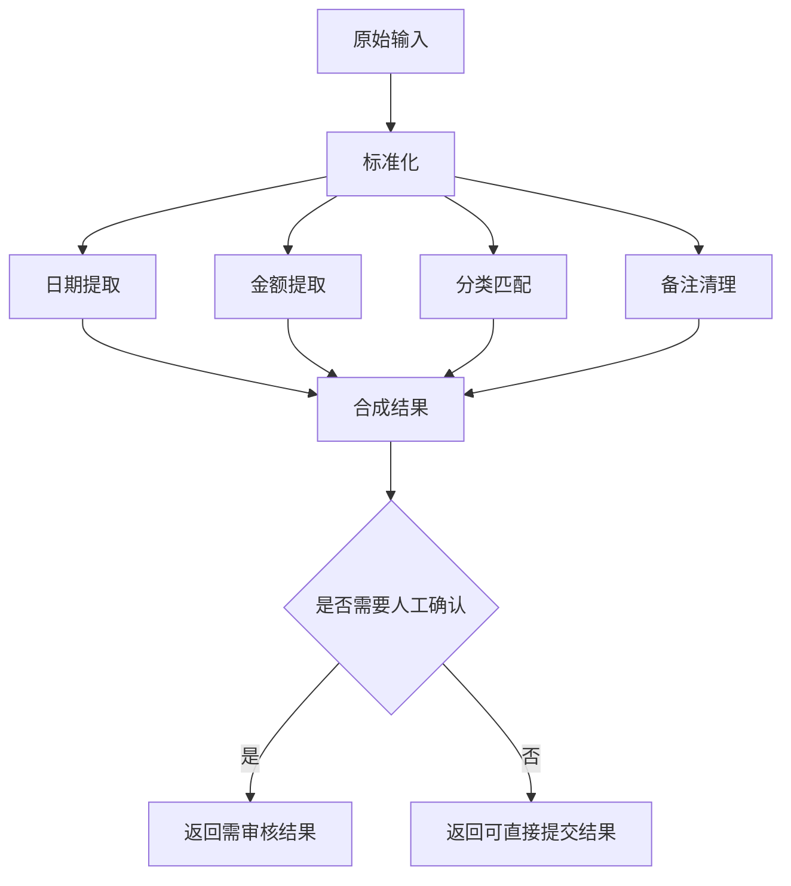
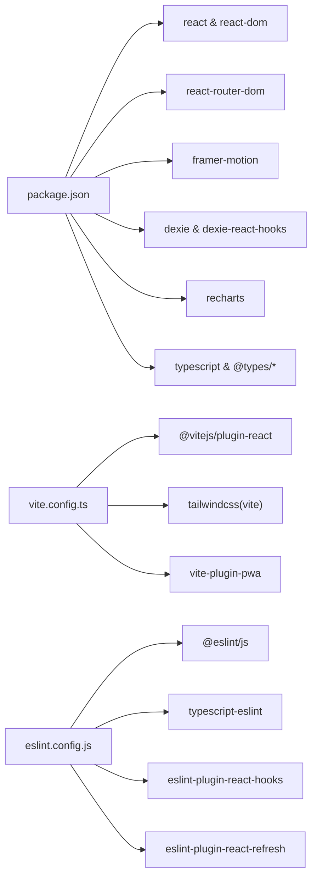

# 开发指南

<cite>
**本文引用的文件**
- [package.json](file://package.json)
- [eslint.config.js](file://eslint.config.js)
- [vite.config.ts](file://vite.config.ts)
- [README.md](file://README.md)
- [tsconfig.json](file://tsconfig.json)
- [tsconfig.app.json](file://tsconfig.app.json)
- [src/main.tsx](file://src/main.tsx)
- [src/App.tsx](file://src/App.tsx)
- [src/components/layout/AppShell.tsx](file://src/components/layout/AppShell.tsx)
- [src/pages/HomePage.tsx](file://src/pages/HomePage.tsx)
- [src/hooks/useTransactions.ts](file://src/hooks/useTransactions.ts)
- [src/nlp/index.ts](file://src/nlp/index.ts)
- [src/db/schema.ts](file://src/db/schema.ts)
- [src/utils/constants.ts](file://src/utils/constants.ts)
</cite>

## 目录
1. [简介](#简介)
2. [项目结构](#项目结构)
3. [核心组件](#核心组件)
4. [架构总览](#架构总览)
5. [详细组件分析](#详细组件分析)
6. [依赖分析](#依赖分析)
7. [性能考虑](#性能考虑)
8. [故障排查指南](#故障排查指南)
9. [结论](#结论)
10. [附录](#附录)

## 简介
本开发指南面向 MoneyNote 项目，覆盖代码规范、开发流程与最佳实践，重点解释以下方面：
- ESLint 配置与规则扩展
- 代码格式化与类型检查策略
- Git 工作流与分支管理建议
- 新功能开发流程、代码审查标准与测试策略
- 调试技巧、性能分析方法与问题排查
- 扩展项目功能、新增组件与集成第三方库的方法
- 贡献指南与团队协作规范

## 项目结构
项目采用基于功能模块的组织方式，前端以 React + TypeScript + Vite 构建，使用 TailwindCSS 进行样式管理，并通过 Dexie 实现本地 IndexedDB 数据持久化。核心目录与职责概览如下：
- src/assets：静态资源
- src/components：可复用 UI 组件与页面级布局
- src/pages：页面级容器（路由对应）
- src/hooks：自定义 Hooks（数据访问与状态逻辑）
- src/nlp：自然语言解析模块
- src/db：数据库模型与类型定义
- src/utils：常量与工具函数
- src/stores/styles：全局样式入口
- 根目录配置：Vite、ESLint、TypeScript、PWA 等

图表来源
- [src/main.tsx:1-14](file://src/main.tsx#L1-L14)
- [src/App.tsx:1-51](file://src/App.tsx#L1-L51)
- [src/pages/HomePage.tsx:1-100](file://src/pages/HomePage.tsx#L1-L100)
- [src/components/layout/AppShell.tsx:1-18](file://src/components/layout/AppShell.tsx#L1-L18)
- [src/hooks/useTransactions.ts:1-67](file://src/hooks/useTransactions.ts#L1-L67)
- [src/nlp/index.ts:1-62](file://src/nlp/index.ts#L1-L62)
- [src/db/schema.ts:1-21](file://src/db/schema.ts#L1-L21)

章节来源
- [package.json:1-40](file://package.json#L1-L40)
- [vite.config.ts:1-36](file://vite.config.ts#L1-L36)
- [tsconfig.app.json:1-27](file://tsconfig.app.json#L1-L27)

## 核心组件
- 应用入口与路由：应用在入口文件中挂载根节点并包裹路由与主题提供器；App 组件负责页面切换动画与全局布局包装。
- 页面容器：首页聚合自然语言输入、解析预览、统计摘要与交易列表，统一处理编辑弹窗与交互反馈。
- 数据访问 Hook：useTransactions 封装了最近交易查询、按日期范围查询、增删改查与当日/当月支出计算。
- NLP 解析：parseInput 将原始输入进行标准化、日期/金额/分类提取与备注清理，并输出是否需要人工确认的结果。
- 数据库模型：Dexie 定义事务、分类、预算、设置表的主键与索引，确保高效查询与排序。

章节来源
- [src/main.tsx:1-14](file://src/main.tsx#L1-L14)
- [src/App.tsx:1-51](file://src/App.tsx#L1-L51)
- [src/pages/HomePage.tsx:1-100](file://src/pages/HomePage.tsx#L1-L100)
- [src/hooks/useTransactions.ts:1-67](file://src/hooks/useTransactions.ts#L1-L67)
- [src/nlp/index.ts:1-62](file://src/nlp/index.ts#L1-L62)
- [src/db/schema.ts:1-21](file://src/db/schema.ts#L1-L21)

## 架构总览
下图展示从用户输入到数据持久化的端到端流程，包括 NLP 解析、状态管理与数据库写入。

图表来源
- [src/pages/HomePage.tsx:19-34](file://src/pages/HomePage.tsx#L19-L34)
- [src/nlp/index.ts:8-55](file://src/nlp/index.ts#L8-L55)
- [src/hooks/useTransactions.ts:21-29](file://src/hooks/useTransactions.ts#L21-L29)
- [src/db/schema.ts:4-20](file://src/db/schema.ts#L4-L20)

## 详细组件分析

### 组件一：HomePage 页面
- 职责：整合快速输入、解析预览、统计摘要与交易列表；处理新增、编辑、删除与提示反馈。
- 关键交互：当解析结果无需人工确认时自动提交；编辑弹窗保存/删除后关闭并刷新状态。
- 性能注意：最近交易限制数量与反向排序，避免一次性加载过多数据。

图表来源
- [src/pages/HomePage.tsx:13-50](file://src/pages/HomePage.tsx#L13-L50)
- [src/nlp/index.ts:8-55](file://src/nlp/index.ts#L8-L55)
- [src/hooks/useTransactions.ts:21-29](file://src/hooks/useTransactions.ts#L21-L29)

章节来源
- [src/pages/HomePage.tsx:1-100](file://src/pages/HomePage.tsx#L1-L100)

### 组件二：useTransactions Hook
- 职责：封装交易 CRUD 与统计查询；利用 live query 实现实时数据订阅。
- 查询优化：按复合索引与日期区间查询，减少全表扫描。
- 时间维度：当日/当月支出通过日期边界计算，避免复杂聚合。

图表来源
- [src/hooks/useTransactions.ts:6-66](file://src/hooks/useTransactions.ts#L6-L66)
- [src/db/schema.ts:4-20](file://src/db/schema.ts#L4-L20)

章节来源
- [src/hooks/useTransactions.ts:1-67](file://src/hooks/useTransactions.ts#L1-L67)
- [src/db/schema.ts:1-21](file://src/db/schema.ts#L1-L21)

### 组件三：NLP 解析模块
- 流程：标准化 → 日期提取 → 金额提取 → 分类匹配 → 备注清理 → 判定是否需要人工确认。
- 结果结构：包含金额、分类、日期/时间、备注、置信度与是否需要审核等字段。
- 可扩展性：各阶段独立函数便于替换或增强算法。

图表来源
- [src/nlp/index.ts:8-55](file://src/nlp/index.ts#L8-L55)

章节来源
- [src/nlp/index.ts:1-62](file://src/nlp/index.ts#L1-L62)

### 组件四：数据库模型
- 表与索引：事务表使用复合索引支持按类型+日期排序与范围查询；分类与预算表具备排序与组合键。
- 版本迁移：通过 Dexie 版本化存储定义表结构与索引，便于后续演进。

章节来源
- [src/db/schema.ts:1-21](file://src/db/schema.ts#L1-L21)

## 依赖分析
- 运行时依赖：React 生态、路由、动画、数据库与可视化库。
- 开发依赖：Vite、React 插件、TailwindCSS、ESLint、TypeScript、PWA 插件。
- 类型系统：双 tsconfig 引用，分别针对应用与 Node 环境，启用严格模式与路径别名。

图表来源
- [package.json:12-38](file://package.json#L12-L38)
- [vite.config.ts:7-35](file://vite.config.ts#L7-L35)
- [eslint.config.js:8-22](file://eslint.config.js#L8-L22)
- [tsconfig.json:1-8](file://tsconfig.json#L1-L8)
- [tsconfig.app.json:20-23](file://tsconfig.app.json#L20-L23)

章节来源
- [package.json:1-40](file://package.json#L1-L40)
- [vite.config.ts:1-36](file://vite.config.ts#L1-L36)
- [eslint.config.js:1-23](file://eslint.config.js#L1-L23)
- [tsconfig.json:1-8](file://tsconfig.json#L1-L8)
- [tsconfig.app.json:1-27](file://tsconfig.app.json#L1-L27)

## 性能考虑
- 渲染性能
  - 使用页面级动画与按需渲染，减少不必要的重绘与回流。
  - 列表项使用轻量组件与最小化状态提升，避免深层嵌套。
- 数据访问性能
  - Dexie 查询使用复合索引与范围查询，避免全表扫描。
  - 限制最近交易数量与反向排序，降低前端渲染压力。
- 构建与打包
  - Vite 快速冷启动与热更新；生产构建开启压缩与分包策略。
  - PWA 自动更新与缓存策略，提升离线与二次打开体验。
- 类型安全
  - 双 tsconfig 引用与严格模式，结合 ESLint 推荐规则，降低运行时错误风险。

## 故障排查指南
- ESLint 报错
  - 若出现类型相关规则报错，参考 README 中关于推荐配置的说明，按需启用类型感知规则集。
  - 确认全局忽略与文件匹配规则未误排除目标文件。
- 构建失败
  - 检查 TypeScript 引用配置与路径别名是否正确。
  - 确认 Vite 插件顺序与 PWA 配置无冲突。
- 数据库异常
  - 确认 Dexie 版本化存储与索引定义一致。
  - 检查事务写入字段与类型是否匹配。
- 页面不更新
  - 确认 useTransactions 的 live query 是否正确订阅。
  - 检查路由动画与 key 值是否导致页面未重新挂载。

章节来源
- [README.md:14-74](file://README.md#L14-L74)
- [eslint.config.js:8-22](file://eslint.config.js#L8-L22)
- [tsconfig.json:1-8](file://tsconfig.json#L1-L8)
- [vite.config.ts:7-35](file://vite.config.ts#L7-L35)
- [src/db/schema.ts:10-19](file://src/db/schema.ts#L10-L19)
- [src/hooks/useTransactions.ts:8-19](file://src/hooks/useTransactions.ts#L8-L19)

## 结论
本指南提供了 MoneyNote 项目的开发规范、流程与最佳实践，涵盖代码质量、性能与可维护性。建议团队在日常开发中坚持：
- 严格遵循 ESLint 与 TypeScript 规则
- 以页面/功能为单位进行模块化开发
- 在数据库与查询层面保持索引与范围查询的清晰设计
- 通过 PWA 与动画提升用户体验
- 在变更前进行充分测试与代码审查

## 附录

### 代码规范与格式化
- ESLint 配置
  - 使用扁平化配置与推荐规则集，启用 React Hooks 与 React Refresh 规则。
  - 如需更强约束，可参考 README 中的类型感知与风格化规则示例。
- TypeScript
  - 双 tsconfig 引用，启用严格模式与路径别名，确保类型安全与导入一致性。
- 样式
  - 使用 TailwindCSS，配合 PWA 插件生成图标与清单，保证移动端体验一致。

章节来源
- [eslint.config.js:8-22](file://eslint.config.js#L8-L22)
- [README.md:14-74](file://README.md#L14-L74)
- [tsconfig.json:1-8](file://tsconfig.json#L1-L8)
- [tsconfig.app.json:20-23](file://tsconfig.app.json#L20-L23)
- [vite.config.ts:11-29](file://vite.config.ts#L11-L29)

### 开发流程与 Git 工作流
- 分支策略
  - 主分支仅合并经审查的特性分支；特性分支命名建议使用 feature/xxx 或 fix/xxx。
- 提交信息
  - 使用清晰语义的描述，如 feat: 新增XX功能、fix: 修复XX问题、chore: 调整构建脚本。
- 代码审查
  - 至少一名合作者审查；关注代码结构、性能影响与可维护性。
- 测试策略
  - 单元测试：对解析模块与工具函数进行断言。
  - 集成测试：验证页面交互与数据库写入链路。
  - 端到端测试：覆盖关键用户路径（输入→解析→提交→列表刷新）。

### 新功能开发流程
- 需求评审：明确功能边界与数据模型变更。
- 设计与原型：确定页面结构、组件拆分与数据流。
- 开发与联调：先实现解析/数据层，再接入页面与 UI。
- 测试与文档：补充单元测试与变更说明。
- 合并与回顾：合并后进行一次回顾，沉淀经验。

### 扩展与集成指南
- 新增页面
  - 在 pages 下创建页面组件，注册路由并在 AppShell 中引入。
- 新增组件
  - 在 components 下按功能域划分，优先考虑可复用性与单一职责。
- 集成第三方库
  - 在 package.json 中添加依赖，按需调整 Vite/Tailwind/ESLint 配置。
  - 对于 PWA 相关需求，完善图标与清单配置。

### 调试与性能分析
- 调试技巧
  - 使用浏览器 DevTools 的 React DevTools 与网络面板定位渲染与请求问题。
  - 在 NLP 与数据库层增加日志，区分解析阶段与写入阶段。
- 性能分析
  - 使用 React Profiler 分析组件渲染热点。
  - 使用浏览器性能面板观察主线程阻塞点。
- 问题排查
  - 从入口文件开始逐层排查：路由→页面→Hook→数据库→UI。
  - 关注 Dexie 查询条件与索引命中情况。