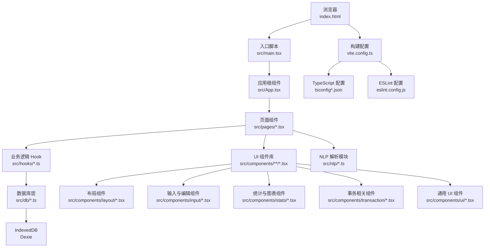
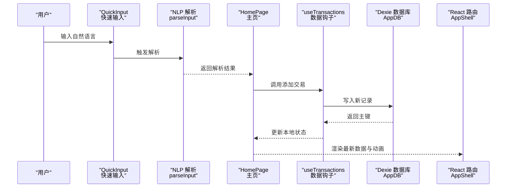
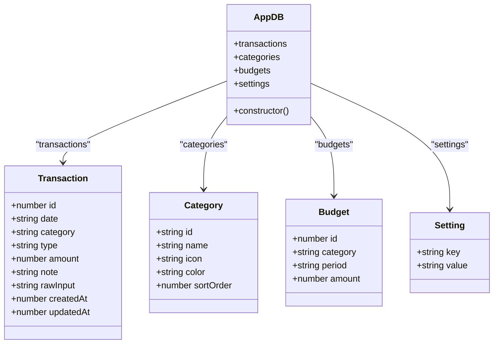
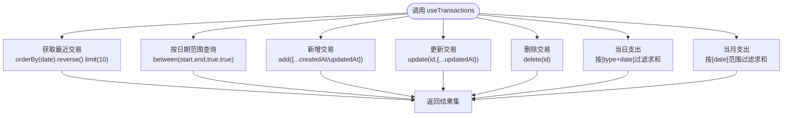
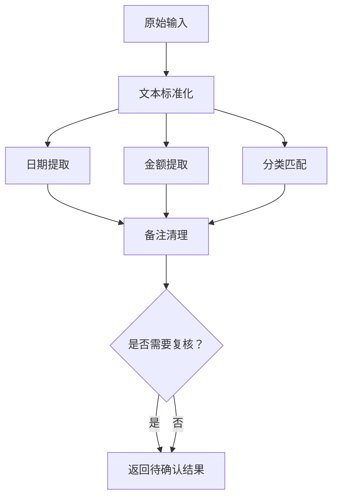
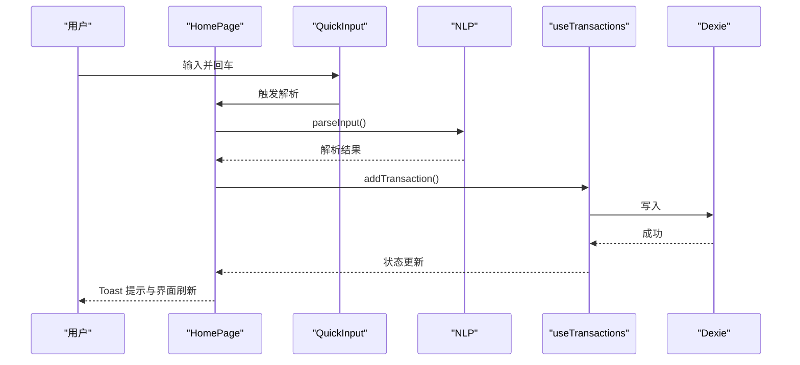

# 快速开始

<cite>
**本文引用的文件**
- [package.json](file://package.json)
- [vite.config.ts](file://vite.config.ts)
- [tsconfig.json](file://tsconfig.json)
- [tsconfig.app.json](file://tsconfig.app.json)
- [tsconfig.node.json](file://tsconfig.node.json)
- [eslint.config.js](file://eslint.config.js)
- [index.html](file://index.html)
- [src/main.tsx](file://src/main.tsx)
- [src/App.tsx](file://src/App.tsx)
- [src/db/schema.ts](file://src/db/schema.ts)
- [src/utils/constants.ts](file://src/utils/constants.ts)
- [src/hooks/useTransactions.ts](file://src/hooks/useTransactions.ts)
- [src/nlp/index.ts](file://src/nlp/index.ts)
- [src/pages/HomePage.tsx](file://src/pages/HomePage.tsx)
- [src/components/input/QuickInput.tsx](file://src/components/input/QuickInput.tsx)
- [src/components/layout/AppShell.tsx](file://src/components/layout/AppShell.tsx)
</cite>

## 目录
1. [简介](#简介)
2. [项目结构](#项目结构)
3. [核心组件](#核心组件)
4. [架构总览](#架构总览)
5. [详细组件分析](#详细组件分析)
6. [依赖分析](#依赖分析)
7. [性能考虑](#性能考虑)
8. [故障排除指南](#故障排除指南)
9. [结论](#结论)
10. [附录](#附录)

## 简介
本指南面向首次接触 MoneyNote 的开发者，帮助你在约 30 分钟内完成环境准备、安装依赖、启动开发服务器，并理解项目的基本功能与结构。MoneyNote 是一款基于 React + TypeScript + Vite 构建的移动端优先的智能记账应用，支持通过自然语言输入快速记录收支，并提供图表统计与预算管理。

## 项目结构
项目采用前端单页应用（SPA）架构，使用 Vite 作为构建工具与开发服务器，TypeScript 提供类型安全，TailwindCSS 负责样式，Dexie 实现 IndexedDB 数据持久化，React Router 进行页面路由，Recharts 展示统计图表，Framer Motion 提供动画效果。

**图示来源**
- [index.html:1-19](file://index.html#L1-L19)
- [src/main.tsx:1-14](file://src/main.tsx#L1-L14)
- [src/App.tsx:1-51](file://src/App.tsx#L1-L51)
- [vite.config.ts:1-36](file://vite.config.ts#L1-L36)
- [tsconfig.json:1-8](file://tsconfig.json#L1-L8)
- [eslint.config.js:1-23](file://eslint.config.js#L1-L23)

**章节来源**
- [index.html:1-19](file://index.html#L1-L19)
- [src/main.tsx:1-14](file://src/main.tsx#L1-L14)
- [src/App.tsx:1-51](file://src/App.tsx#L1-L51)
- [vite.config.ts:1-36](file://vite.config.ts#L1-L36)
- [tsconfig.json:1-8](file://tsconfig.json#L1-L8)
- [eslint.config.js:1-23](file://eslint.config.js#L1-L23)

## 核心组件
- 应用入口与路由
  - 入口脚本负责挂载 React 根节点并包裹路由容器。
  - 应用根组件定义页面路由与页面切换动画。
- 页面组件
  - 主页提供自然语言输入、解析预览、统计摘要与最近交易列表。
  - 统计页、历史页、预算页、设置页分别承载对应功能。
- 数据与状态
  - 使用 Dexie 建模本地数据库，提供实时查询与变更。
  - Hooks 封装常用数据操作，如获取最近交易、按日期范围查询、增删改等。
- NLP 解析
  - 将自然语言输入拆解为金额、日期、分类、备注等结构化信息。
- UI 组件
  - 包含通用 UI 组件（按钮、卡片、对话框、Toast）、输入组件（快速输入）、统计组件（饼图、趋势线）与事务列表组件。

**章节来源**
- [src/main.tsx:1-14](file://src/main.tsx#L1-L14)
- [src/App.tsx:1-51](file://src/App.tsx#L1-L51)
- [src/pages/HomePage.tsx:1-100](file://src/pages/HomePage.tsx#L1-L100)
- [src/hooks/useTransactions.ts:1-67](file://src/hooks/useTransactions.ts#L1-L67)
- [src/db/schema.ts:1-21](file://src/db/schema.ts#L1-L21)
- [src/nlp/index.ts:1-62](file://src/nlp/index.ts#L1-L62)
- [src/components/input/QuickInput.tsx:1-68](file://src/components/input/QuickInput.tsx#L1-L68)
- [src/components/layout/AppShell.tsx:1-18](file://src/components/layout/AppShell.tsx#L1-L18)

## 架构总览
下图展示了从用户输入到数据持久化的端到端流程，以及页面渲染与动画过渡的交互路径。

**图示来源**
- [src/components/input/QuickInput.tsx:1-68](file://src/components/input/QuickInput.tsx#L1-L68)
- [src/nlp/index.ts:1-62](file://src/nlp/index.ts#L1-L62)
- [src/pages/HomePage.tsx:1-100](file://src/pages/HomePage.tsx#L1-L100)
- [src/hooks/useTransactions.ts:1-67](file://src/hooks/useTransactions.ts#L1-L67)
- [src/db/schema.ts:1-21](file://src/db/schema.ts#L1-L21)
- [src/App.tsx:1-51](file://src/App.tsx#L1-L51)

## 详细组件分析

### 数据库与模型
- 数据库类继承自 Dexie，定义了交易、分类、预算、设置四张表及其索引。
- 版本 1 的存储模式覆盖了常见查询场景（如按类型+日期复合索引）。

**图示来源**
- [src/db/schema.ts:1-21](file://src/db/schema.ts#L1-L21)

**章节来源**
- [src/db/schema.ts:1-21](file://src/db/schema.ts#L1-L21)
- [src/utils/constants.ts:1-19](file://src/utils/constants.ts#L1-L19)

### 数据访问与实时查询
- 使用 dexie-react-hooks 的 useLiveQuery 实现实时订阅，自动响应数据库变更。
- 提供最近交易、按日期范围查询、新增、更新、删除、当日与当月支出计算等方法。

**图示来源**
- [src/hooks/useTransactions.ts:1-67](file://src/hooks/useTransactions.ts#L1-L67)

**章节来源**
- [src/hooks/useTransactions.ts:1-67](file://src/hooks/useTransactions.ts#L1-L67)

### NLP 解析流程
- 输入规范化 → 日期提取 → 金额提取 → 分类匹配 → 备注清理 → 判定是否需要人工复核。

**图示来源**
- [src/nlp/index.ts:1-62](file://src/nlp/index.ts#L1-L62)

**章节来源**
- [src/nlp/index.ts:1-62](file://src/nlp/index.ts#L1-L62)

### 页面与交互
- 主页整合输入、解析、预览、统计与列表，支持直接提交或编辑保存/删除。
- 应用外壳提供统一布局与底部导航，路由切换配合页面动画。

**图示来源**
- [src/pages/HomePage.tsx:1-100](file://src/pages/HomePage.tsx#L1-L100)
- [src/components/input/QuickInput.tsx:1-68](file://src/components/input/QuickInput.tsx#L1-L68)
- [src/nlp/index.ts:1-62](file://src/nlp/index.ts#L1-L62)
- [src/hooks/useTransactions.ts:1-67](file://src/hooks/useTransactions.ts#L1-L67)
- [src/db/schema.ts:1-21](file://src/db/schema.ts#L1-L21)

**章节来源**
- [src/pages/HomePage.tsx:1-100](file://src/pages/HomePage.tsx#L1-L100)
- [src/components/input/QuickInput.tsx:1-68](file://src/components/input/QuickInput.tsx#L1-L68)
- [src/components/layout/AppShell.tsx:1-18](file://src/components/layout/AppShell.tsx#L1-L18)
- [src/App.tsx:1-51](file://src/App.tsx#L1-L51)

## 依赖分析
- 运行时依赖
  - React 生态与路由：react、react-dom、react-router-dom
  - 数据库与 React Hooks：dexie、dexie-react-hooks
  - 动画与图表：framer-motion、recharts
  - 日期处理：dayjs
- 开发依赖
  - 构建与插件：@vitejs/plugin-react、vite、vite-plugin-pwa、@tailwindcss/vite
  - 类型与检查：typescript、@types/react、@types/react-dom、@types/node
  - Lint：eslint、typescript-eslint、eslint-plugin-react-hooks、eslint-plugin-react-refresh
- 构建与运行脚本
  - dev：启动 Vite 开发服务器
  - build：先执行 TypeScript 构建，再进行 Vite 打包
  - preview：预览打包产物
  - lint：执行 ESLint 检查

**章节来源**
- [package.json:1-40](file://package.json#L1-L40)
- [vite.config.ts:1-36](file://vite.config.ts#L1-L36)
- [eslint.config.js:1-23](file://eslint.config.js#L1-L23)

## 性能考虑
- 构建与运行
  - 使用 Vite 的快速冷启动与热更新，开发体验更佳。
  - TypeScript 采用 bundler 模式与严格语法，减少运行时开销。
- 数据访问
  - Dexie 查询尽量利用索引（如复合索引），避免全表扫描。
  - 使用 useLiveQuery 订阅局部状态，减少不必要的重渲染。
- 样式与资源
  - TailwindCSS 按需生成样式，避免引入未使用类名。
  - PWA 插件提供缓存策略与离线能力，提升移动端体验。

[本节为通用指导，不直接分析具体文件，故无“章节来源”]

## 故障排除指南
- Node.js 版本不兼容
  - 现有配置使用 ES2023 目标与 bundler 模式，请确保 Node.js 版本满足 Vite/TS 的最低要求。
  - 若出现编译错误，检查 tsconfig 中的 target 与 moduleResolution 设置。
- 无法启动开发服务器
  - 确认已安装依赖后再运行 dev 脚本。
  - 若端口被占用，修改 Vite 配置中的端口或终止占用进程。
- 浏览器中样式异常
  - 确保 TailwindCSS 插件已正确加载，且 PostCSS 配置与版本兼容。
- PWA 功能无效
  - 检查 manifest 字段与图标资源是否存在，确认 HTTPS 或 localhost 环境。
- ESLint 报错
  - 按需启用类型感知规则，确保 tsconfig 引用正确。
- 数据库读写失败
  - 确认 Dexie 数据库版本升级与索引定义一致，避免跨版本破坏性变更。
- 路由跳转无动画或闪烁
  - 检查路由包裹与页面动画配置，确保 key 与 location 正确传递。

**章节来源**
- [tsconfig.app.json:1-27](file://tsconfig.app.json#L1-L27)
- [tsconfig.node.json:1-25](file://tsconfig.node.json#L1-L25)
- [vite.config.ts:1-36](file://vite.config.ts#L1-L36)
- [eslint.config.js:1-23](file://eslint.config.js#L1-L23)
- [src/db/schema.ts:1-21](file://src/db/schema.ts#L1-L21)
- [src/App.tsx:1-51](file://src/App.tsx#L1-L51)

## 结论
通过本指南，你可以在短时间内完成 MoneyNote 的环境搭建与运行。项目以 React + TypeScript + Vite 为基础，结合 Dexie 实现本地数据持久化与 NLP 解析，提供简洁直观的移动端记账体验。建议在熟悉基础功能后，逐步探索页面组件、NLP 模块与数据库设计，以便进行二次开发与定制。

[本节为总结性内容，不直接分析具体文件，故无“章节来源”]

## 附录

### 安装与运行步骤
- 环境要求
  - Node.js：满足 Vite/TypeScript 最低版本要求（建议使用长期支持版本）
  - 包管理器：npm、yarn 或 pnpm（任选其一）
- 安装依赖
  - 在项目根目录执行安装命令（例如 npm install）
- 启动开发服务器
  - 执行开发脚本，打开浏览器访问默认地址
- 构建生产版本
  - 执行构建脚本，输出至 dist 目录
- 预览生产版本
  - 执行预览脚本，本地预览打包产物
- 代码检查
  - 执行 Lint 脚本，修复或调整规则以满足团队规范

**章节来源**
- [package.json:1-40](file://package.json#L1-L40)
- [vite.config.ts:1-36](file://vite.config.ts#L1-L36)

### 关键配置文件简述
- package.json
  - 定义项目名称、版本、脚本与依赖
- vite.config.ts
  - 配置 React 插件、TailwindCSS 插件、PWA 插件与路径别名
- tsconfig.json / tsconfig.app.json / tsconfig.node.json
  - 分离应用与 Node 工具链的 TS 配置，启用 bundler 模式与路径映射
- eslint.config.js
  - 推荐的 ESLint 配置，包含 TypeScript、React Hooks、React Refresh 规则

**章节来源**
- [package.json:1-40](file://package.json#L1-L40)
- [vite.config.ts:1-36](file://vite.config.ts#L1-L36)
- [tsconfig.json:1-8](file://tsconfig.json#L1-L8)
- [tsconfig.app.json:1-27](file://tsconfig.app.json#L1-L27)
- [tsconfig.node.json:1-25](file://tsconfig.node.json#L1-L25)
- [eslint.config.js:1-23](file://eslint.config.js#L1-L23)