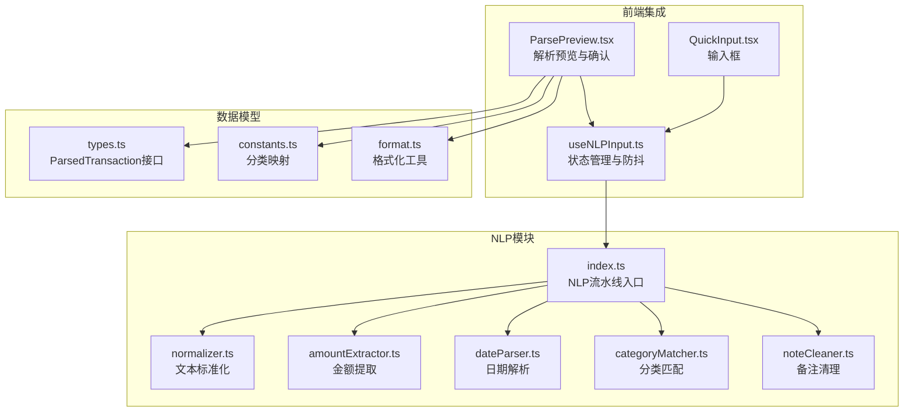
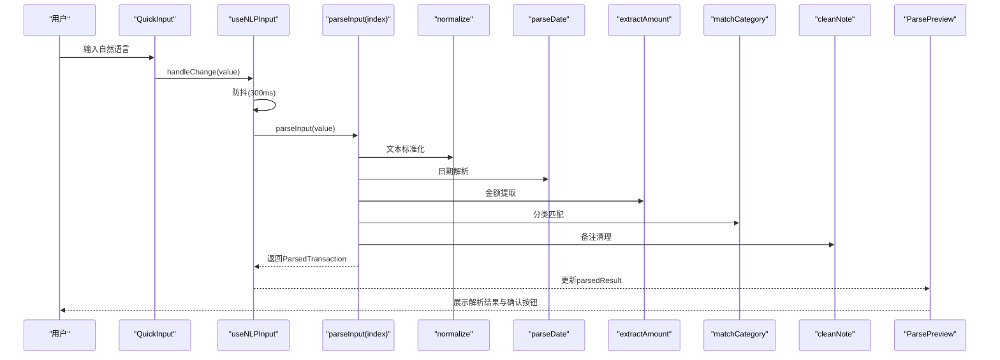
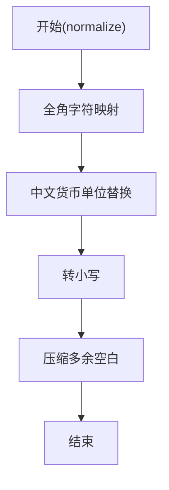
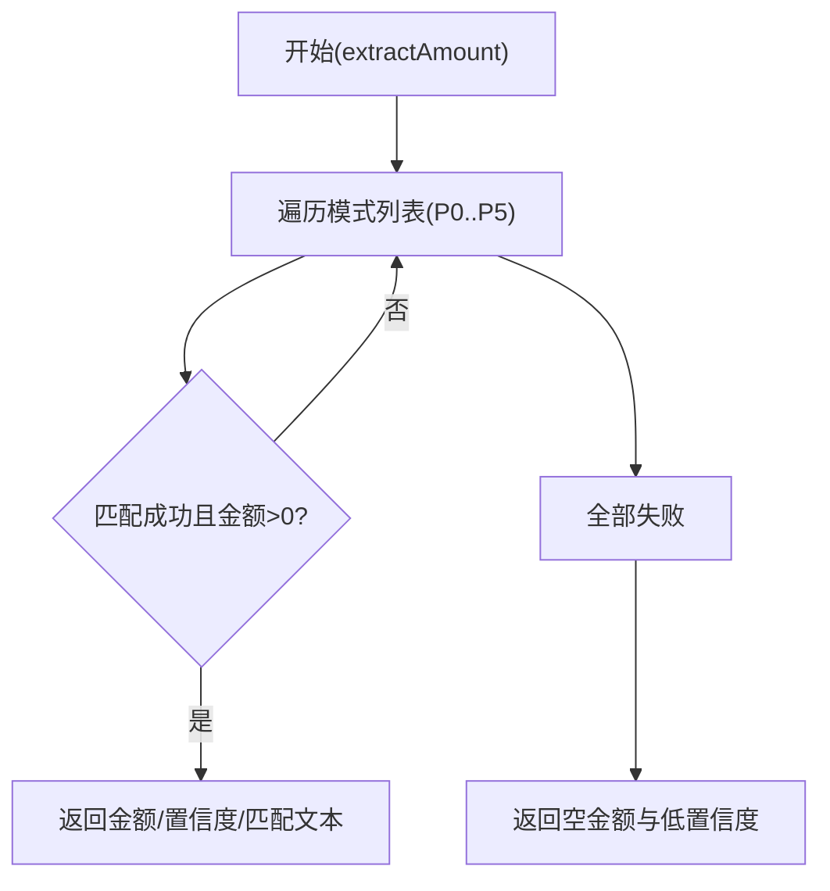
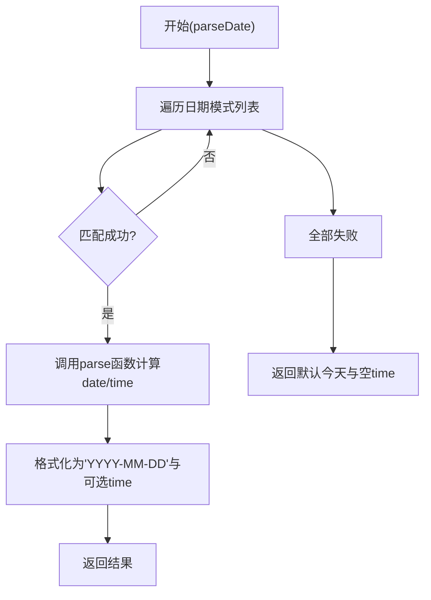
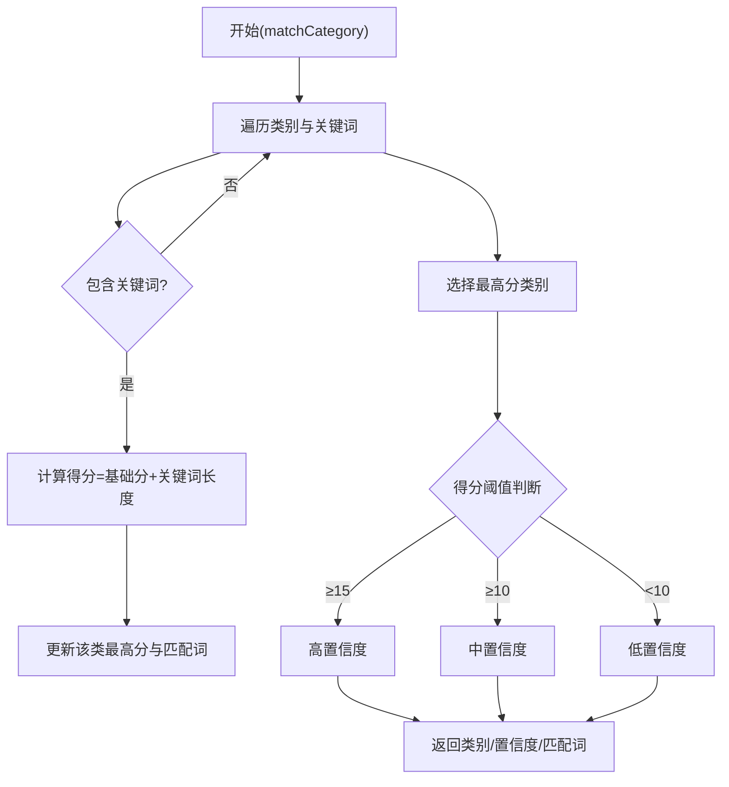
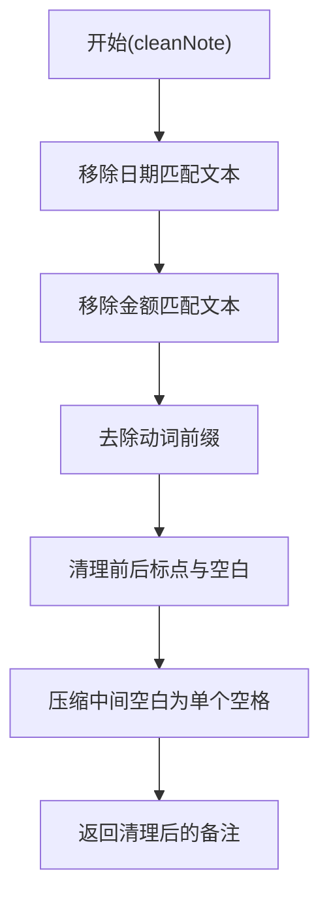
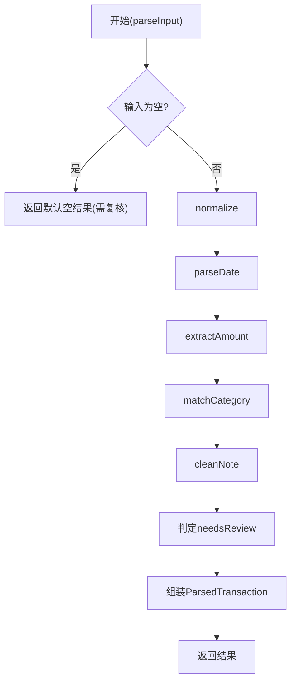
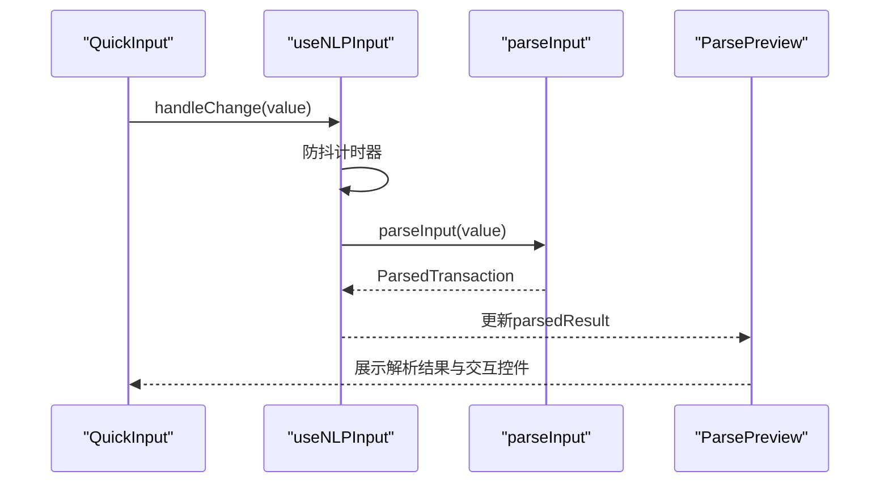
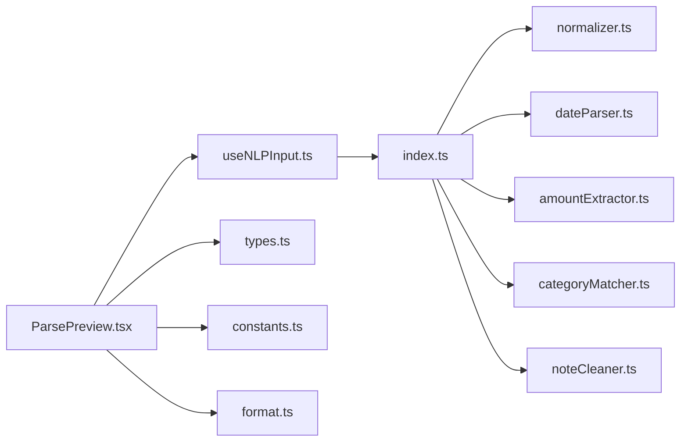

# NLP处理架构

<cite>
**本文档引用的文件**
- [src/nlp/index.ts](file://src/nlp/index.ts)
- [src/nlp/normalizer.ts](file://src/nlp/normalizer.ts)
- [src/nlp/amountExtractor.ts](file://src/nlp/amountExtractor.ts)
- [src/nlp/categoryMatcher.ts](file://src/nlp/categoryMatcher.ts)
- [src/nlp/dateParser.ts](file://src/nlp/dateParser.ts)
- [src/nlp/noteCleaner.ts](file://src/nlp/noteCleaner.ts)
- [src/db/types.ts](file://src/db/types.ts)
- [src/hooks/useNLPInput.ts](file://src/hooks/useNLPInput.ts)
- [src/components/input/ParsePreview.tsx](file://src/components/input/ParsePreview.tsx)
- [src/components/input/QuickInput.tsx](file://src/components/input/QuickInput.tsx)
- [src/utils/constants.ts](file://src/utils/constants.ts)
- [src/utils/format.ts](file://src/utils/format.ts)
</cite>

## 目录
1. [引言](#引言)
2. [项目结构](#项目结构)
3. [核心组件](#核心组件)
4. [架构总览](#架构总览)
5. [详细组件分析](#详细组件分析)
6. [依赖关系分析](#依赖关系分析)
7. [性能考虑](#性能考虑)
8. [故障排除指南](#故障排除指南)
9. [结论](#结论)

## 引言
本文件面向MoneyNote项目的自然语言处理（NLP）系统，系统性阐述其架构设计、模块化处理流程与数据转换机制。重点解释NLP处理器的流水线设计：文本标准化、金额提取、分类匹配、日期解析与备注清理的处理顺序；明确各模块职责、算法实现与错误处理策略；说明NLP结果的数据结构设计、预览生成与用户确认机制；并提供处理流程图与数据流转示意图，帮助开发者快速理解智能记账的核心技术实现。

## 项目结构
NLP相关代码集中在src/nlp目录，前端交互通过React Hook与UI组件完成，数据库类型定义位于src/db/types.ts。整体采用“模块化处理 + 流水线编排”的架构，便于扩展与维护。

**图表来源**
- [src/nlp/index.ts:1-62](file://src/nlp/index.ts#L1-L62)
- [src/nlp/normalizer.ts:1-36](file://src/nlp/normalizer.ts#L1-L36)
- [src/nlp/amountExtractor.ts:1-44](file://src/nlp/amountExtractor.ts#L1-L44)
- [src/nlp/dateParser.ts:1-121](file://src/nlp/dateParser.ts#L1-L121)
- [src/nlp/categoryMatcher.ts:1-90](file://src/nlp/categoryMatcher.ts#L1-L90)
- [src/nlp/noteCleaner.ts:1-29](file://src/nlp/noteCleaner.ts#L1-L29)
- [src/hooks/useNLPInput.ts:1-51](file://src/hooks/useNLPInput.ts#L1-L51)
- [src/components/input/ParsePreview.tsx:1-123](file://src/components/input/ParsePreview.tsx#L1-L123)
- [src/components/input/QuickInput.tsx:1-68](file://src/components/input/QuickInput.tsx#L1-L68)
- [src/db/types.ts:48-60](file://src/db/types.ts#L48-L60)
- [src/utils/constants.ts:1-19](file://src/utils/constants.ts#L1-L19)
- [src/utils/format.ts:1-28](file://src/utils/format.ts#L1-L28)

**章节来源**
- [src/nlp/index.ts:1-62](file://src/nlp/index.ts#L1-L62)
- [src/nlp/normalizer.ts:1-36](file://src/nlp/normalizer.ts#L1-L36)
- [src/nlp/amountExtractor.ts:1-44](file://src/nlp/amountExtractor.ts#L1-L44)
- [src/nlp/dateParser.ts:1-121](file://src/nlp/dateParser.ts#L1-L121)
- [src/nlp/categoryMatcher.ts:1-90](file://src/nlp/categoryMatcher.ts#L1-L90)
- [src/nlp/noteCleaner.ts:1-29](file://src/nlp/noteCleaner.ts#L1-L29)
- [src/hooks/useNLPInput.ts:1-51](file://src/hooks/useNLPInput.ts#L1-L51)
- [src/components/input/ParsePreview.tsx:1-123](file://src/components/input/ParsePreview.tsx#L1-L123)
- [src/components/input/QuickInput.tsx:1-68](file://src/components/input/QuickInput.tsx#L1-L68)
- [src/db/types.ts:48-60](file://src/db/types.ts#L48-L60)
- [src/utils/constants.ts:1-19](file://src/utils/constants.ts#L1-L19)
- [src/utils/format.ts:1-28](file://src/utils/format.ts#L1-L28)

## 核心组件
- NLP流水线入口：负责组织各模块执行顺序、合并结果与判定是否需要人工复核。
- 文本标准化：统一全角字符、货币单位、大小写与空白，提升后续模块鲁棒性。
- 金额提取：多模式正则匹配，按优先级返回金额与置信度。
- 日期解析：支持“今天/昨天/前天”等相对时间、“YYYY-MM-DD/YY/MM/DD”等绝对时间与“HH:mm”时间抽取。
- 分类匹配：基于内置关键词词典，计算匹配得分，输出类别与置信度。
- 备注清理：移除已解析的日期/金额片段与常见动词前缀，生成干净的备注文本。
- 前端集成：Hook负责防抖解析与状态管理；UI组件负责预览展示与用户确认。

**章节来源**
- [src/nlp/index.ts:8-55](file://src/nlp/index.ts#L8-L55)
- [src/nlp/normalizer.ts:17-35](file://src/nlp/normalizer.ts#L17-L35)
- [src/nlp/amountExtractor.ts:27-43](file://src/nlp/amountExtractor.ts#L27-L43)
- [src/nlp/dateParser.ts:101-120](file://src/nlp/dateParser.ts#L101-L120)
- [src/nlp/categoryMatcher.ts:45-89](file://src/nlp/categoryMatcher.ts#L45-L89)
- [src/nlp/noteCleaner.ts:2-28](file://src/nlp/noteCleaner.ts#L2-L28)
- [src/hooks/useNLPInput.ts:5-50](file://src/hooks/useNLPInput.ts#L5-L50)
- [src/components/input/ParsePreview.tsx:17-122](file://src/components/input/ParsePreview.tsx#L17-L122)

## 架构总览
NLP处理采用“单入口、多模块、流水线”的设计。parseInput作为统一入口，依次调用各模块，最终生成ParsedTransaction对象。该对象包含金额、分类、日期、备注、原始输入与是否需要复核等字段，用于驱动前端预览与确认流程。

**图表来源**
- [src/nlp/index.ts:8-55](file://src/nlp/index.ts#L8-L55)
- [src/nlp/normalizer.ts:17-35](file://src/nlp/normalizer.ts#L17-L35)
- [src/nlp/amountExtractor.ts:27-43](file://src/nlp/amountExtractor.ts#L27-L43)
- [src/nlp/dateParser.ts:101-120](file://src/nlp/dateParser.ts#L101-L120)
- [src/nlp/categoryMatcher.ts:45-89](file://src/nlp/categoryMatcher.ts#L45-L89)
- [src/nlp/noteCleaner.ts:2-28](file://src/nlp/noteCleaner.ts#L2-L28)
- [src/hooks/useNLPInput.ts:11-30](file://src/hooks/useNLPInput.ts#L11-L30)
- [src/components/input/ParsePreview.tsx:17-122](file://src/components/input/ParsePreview.tsx#L17-L122)

## 详细组件分析

### 文本标准化模块（normalizer.ts）
- 职责：将输入文本进行全角到半角的字符转换、中文货币单位规范化、英文小写化、多余空白压缩，确保后续模块处理的一致性。
- 关键点：
  - 使用字符映射表处理全角数字与标点。
  - 使用中文货币单位映射表替换“块/毛/大洋/人民币/块钱”等。
  - 统一小写与空白压缩，减少歧义。
- 错误处理：无显式异常，若输入为空或不匹配，直接返回原样处理后的字符串。

**图表来源**
- [src/nlp/normalizer.ts:17-35](file://src/nlp/normalizer.ts#L17-L35)

**章节来源**
- [src/nlp/normalizer.ts:17-35](file://src/nlp/normalizer.ts#L17-L35)

### 金额提取模块（amountExtractor.ts）
- 职责：从标准化文本中提取金额，返回金额数值、匹配文本与置信度。
- 算法实现：
  - 按优先级定义多个正则模式，逐个尝试匹配。
  - 匹配成功后转换为浮点数，过滤非正值，返回第一个有效匹配。
  - 若均未匹配，返回空金额与低置信度。
- 置信度策略：
  - 高置信度：明确的“数字+元/块/￥”、“动词+数字”、“货币符号前缀”等。
  - 中置信度：末尾数字。
  - 低置信度：兜底第一个数字。
- 错误处理：非法数字或非正值被过滤，避免错误金额进入流水线。

**图表来源**
- [src/nlp/amountExtractor.ts:27-43](file://src/nlp/amountExtractor.ts#L27-L43)

**章节来源**
- [src/nlp/amountExtractor.ts:1-44](file://src/nlp/amountExtractor.ts#L1-L44)

### 日期解析模块（dateParser.ts）
- 职责：从文本中解析日期与可选时间，支持中文相对时间、绝对日期与时间格式。
- 算法实现：
  - 定义多种日期模式与解析函数，按优先级匹配。
  - 支持“昨天/前天/大前天”等相对日期、“这周/上周+星期X”等周期表达、“MM月DD日/号”等格式、“YYYY-MM-DD/YY/MM/DD”等ISO格式、“HH:mm”等时间格式。
  - 使用dayjs库进行日期计算与格式化。
- 默认行为：若未匹配任何模式，默认返回当天日期。
- 错误处理：未匹配时返回默认日期，保证流水线继续执行。

**图表来源**
- [src/nlp/dateParser.ts:101-120](file://src/nlp/dateParser.ts#L101-L120)

**章节来源**
- [src/nlp/dateParser.ts:1-121](file://src/nlp/dateParser.ts#L1-L121)

### 分类匹配模块（categoryMatcher.ts）
- 职责：根据内置关键词词典对文本进行分类匹配，返回类别、匹配关键词与置信度。
- 算法实现：
  - 将文本转为小写，遍历每个类别的关键词集合，统计匹配得分。
  - 得分规则：完全匹配时，基础分+10，再加关键词长度权重，取同一类最高分。
  - 根据最高分阈值确定置信度：≥15高，≥10中，否则低。
- 关键词覆盖：餐饮、交通、购物、娱乐、住房、医疗、教育等常用类别。
- 错误处理：若无匹配，返回“其他”类别与低置信度。

**图表来源**
- [src/nlp/categoryMatcher.ts:45-89](file://src/nlp/categoryMatcher.ts#L45-L89)

**章节来源**
- [src/nlp/categoryMatcher.ts:1-90](file://src/nlp/categoryMatcher.ts#L1-L90)

### 备注清理模块（noteCleaner.ts）
- 职责：从标准化文本中移除已解析的日期与金额片段，去除常见动词前缀，清理多余标点与空白，生成干净的备注。
- 实现要点：
  - 顺序移除日期匹配文本、金额匹配文本。
  - 去除“花了/花费/用了/消费/支付/付了”等动词前缀。
  - 清理前后标点与空白，压缩中间空白为单个空格。
- 错误处理：若无匹配文本，则跳过对应移除步骤，保证健壮性。

**图表来源**
- [src/nlp/noteCleaner.ts:2-28](file://src/nlp/noteCleaner.ts#L2-L28)

**章节来源**
- [src/nlp/noteCleaner.ts:1-29](file://src/nlp/noteCleaner.ts#L1-L29)

### NLP流水线入口（index.ts）
- 职责：串联各模块，组织处理顺序，合并结果，决定是否需要人工复核。
- 处理顺序：
  1) 文本标准化
  2) 日期解析
  3) 金额提取
  4) 分类匹配
  5) 备注清理
- 复核判定逻辑：
  - 金额为空或金额置信度为低，或分类置信度为低时，needsReview为true。
- 返回结构：ParsedTransaction，包含金额、分类、日期、时间、备注、原始输入与复核标志。

**图表来源**
- [src/nlp/index.ts:8-55](file://src/nlp/index.ts#L8-L55)

**章节来源**
- [src/nlp/index.ts:1-62](file://src/nlp/index.ts#L1-L62)

### 前端集成与用户确认（useNLPInput.ts、ParsePreview.tsx、QuickInput.tsx）
- useNLPInput：
  - 管理输入值、解析结果、解析状态与防抖。
  - 300ms防抖触发parseInput，异步更新解析结果。
  - 提供clearInput与updateParsedResult方法。
- ParsePreview：
  - 展示金额、分类图标与名称、日期与时间、备注。
  - 提供分类选择器与金额输入框，支持用户手动修正。
  - 当needsReview为true时显示提示，确认按钮在金额存在时可用。
- QuickInput：
  - 输入框样式与占位符，回车提交，清除按钮。
  - 解析进行时显示进度条动画。

**图表来源**
- [src/hooks/useNLPInput.ts:11-30](file://src/hooks/useNLPInput.ts#L11-L30)
- [src/nlp/index.ts:8-55](file://src/nlp/index.ts#L8-L55)
- [src/components/input/ParsePreview.tsx:17-122](file://src/components/input/ParsePreview.tsx#L17-L122)
- [src/components/input/QuickInput.tsx:11-67](file://src/components/input/QuickInput.tsx#L11-L67)

**章节来源**
- [src/hooks/useNLPInput.ts:1-51](file://src/hooks/useNLPInput.ts#L1-L51)
- [src/components/input/ParsePreview.tsx:1-123](file://src/components/input/ParsePreview.tsx#L1-L123)
- [src/components/input/QuickInput.tsx:1-68](file://src/components/input/QuickInput.tsx#L1-L68)

## 依赖关系分析
- 模块内聚与耦合：
  - index.ts作为编排者，仅依赖各功能模块导出函数，保持高内聚、低耦合。
  - 各模块均为纯函数，便于测试与复用。
- 外部依赖：
  - dayjs用于日期解析与格式化。
  - React Hook与Framer Motion用于前端交互。
- 数据流：
  - 输入字符串经标准化后，逐步注入到金额、日期、分类与备注清理模块。
  - 最终汇聚为ParsedTransaction，驱动UI层展示与确认。

**图表来源**
- [src/nlp/index.ts:1-62](file://src/nlp/index.ts#L1-L62)
- [src/nlp/normalizer.ts:1-36](file://src/nlp/normalizer.ts#L1-L36)
- [src/nlp/amountExtractor.ts:1-44](file://src/nlp/amountExtractor.ts#L1-L44)
- [src/nlp/dateParser.ts:1-121](file://src/nlp/dateParser.ts#L1-L121)
- [src/nlp/categoryMatcher.ts:1-90](file://src/nlp/categoryMatcher.ts#L1-L90)
- [src/nlp/noteCleaner.ts:1-29](file://src/nlp/noteCleaner.ts#L1-L29)
- [src/hooks/useNLPInput.ts:1-51](file://src/hooks/useNLPInput.ts#L1-L51)
- [src/components/input/ParsePreview.tsx:1-123](file://src/components/input/ParsePreview.tsx#L1-L123)
- [src/db/types.ts:48-60](file://src/db/types.ts#L48-L60)
- [src/utils/constants.ts:1-19](file://src/utils/constants.ts#L1-L19)
- [src/utils/format.ts:1-28](file://src/utils/format.ts#L1-L28)

**章节来源**
- [src/nlp/index.ts:1-62](file://src/nlp/index.ts#L1-L62)
- [src/hooks/useNLPInput.ts:1-51](file://src/hooks/useNLPInput.ts#L1-L51)
- [src/components/input/ParsePreview.tsx:1-123](file://src/components/input/ParsePreview.tsx#L1-L123)
- [src/db/types.ts:48-60](file://src/db/types.ts#L48-L60)

## 性能考虑
- 防抖优化：前端300ms防抖降低频繁解析带来的开销，适合移动端输入场景。
- 正则优先级：金额提取按优先级匹配，命中即返回，避免全量扫描。
- 字符串处理：标准化与清理操作为线性复杂度，输入规模可控。
- 日期解析：模式有限且顺序匹配，性能稳定。
- 建议：
  - 对超长输入可考虑分段处理或限制最大长度。
  - 可引入缓存机制（如最近一次解析结果）以减少重复计算。
  - 在UI层增加加载状态与取消机制，避免长时间阻塞。

[本节为通用性能建议，无需特定文件引用]

## 故障排除指南
- 金额未识别：
  - 检查输入是否包含明确的金额表达（如“元/块/￥”、动词+数字、货币符号前缀）。
  - 若为低置信度，可在UI中手动输入金额并关闭复核。
- 分类错误：
  - 确认输入中是否包含关键词，或调整分类映射。
  - 使用分类选择器手动修正。
- 日期异常：
  - 检查输入中的相对时间或日期格式是否符合预期。
  - 若未匹配，系统默认返回当天日期。
- 备注为空：
  - 确认输入中是否包含可识别的日期/金额片段，或是否存在动词前缀导致被清理。
- 复核提示：
  - 当金额为空或置信度低、分类置信度低时，界面会提示需要确认。

**章节来源**
- [src/nlp/index.ts:38-54](file://src/nlp/index.ts#L38-L54)
- [src/nlp/amountExtractor.ts:27-43](file://src/nlp/amountExtractor.ts#L27-L43)
- [src/nlp/categoryMatcher.ts:76-88](file://src/nlp/categoryMatcher.ts#L76-L88)
- [src/nlp/dateParser.ts:101-120](file://src/nlp/dateParser.ts#L101-L120)
- [src/nlp/noteCleaner.ts:2-28](file://src/nlp/noteCleaner.ts#L2-L28)
- [src/components/input/ParsePreview.tsx:92-119](file://src/components/input/ParsePreview.tsx#L92-L119)

## 结论
MoneyNote的NLP处理架构以模块化为核心，通过标准化、金额提取、日期解析、分类匹配与备注清理的流水线设计，实现了对自然语言输入的高效解析与稳健容错。前端通过防抖与UI确认机制，提升了用户体验与准确性。该架构具备良好的可扩展性，未来可按需新增模块或优化现有算法，以适配更复杂的输入场景。