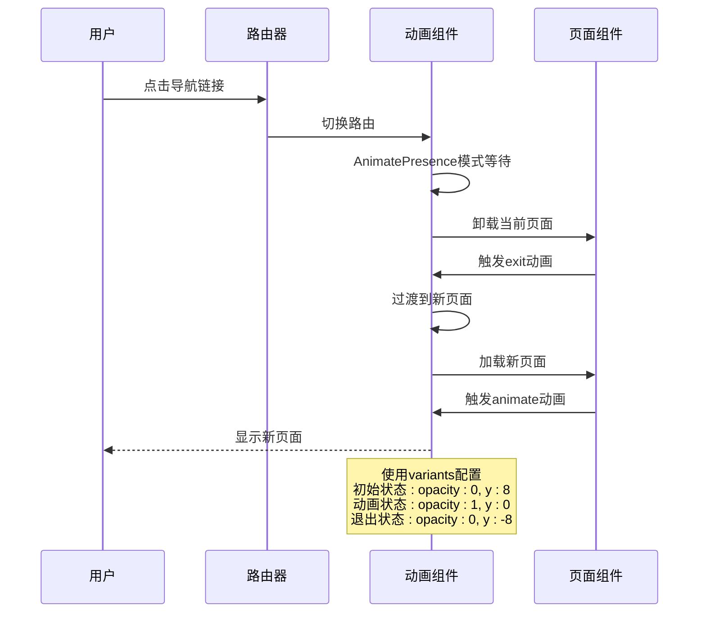
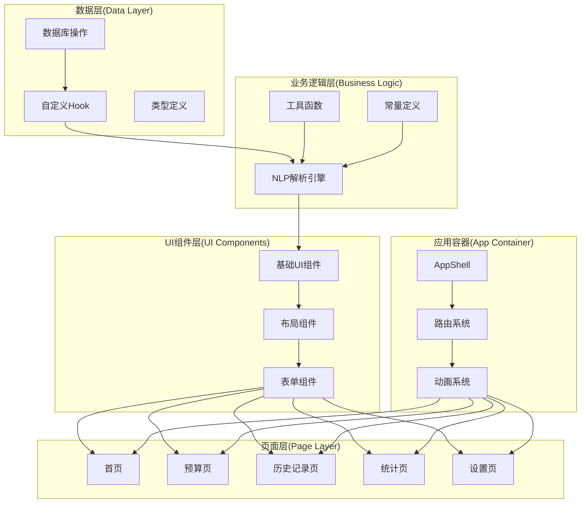
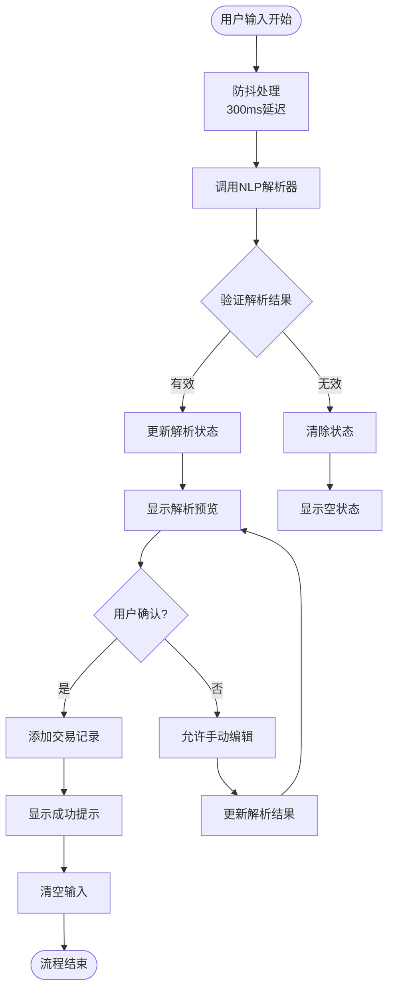
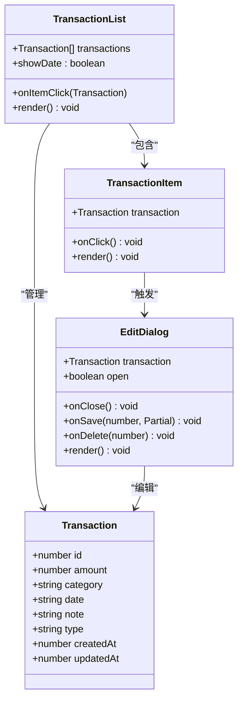
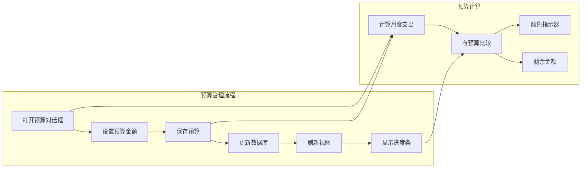
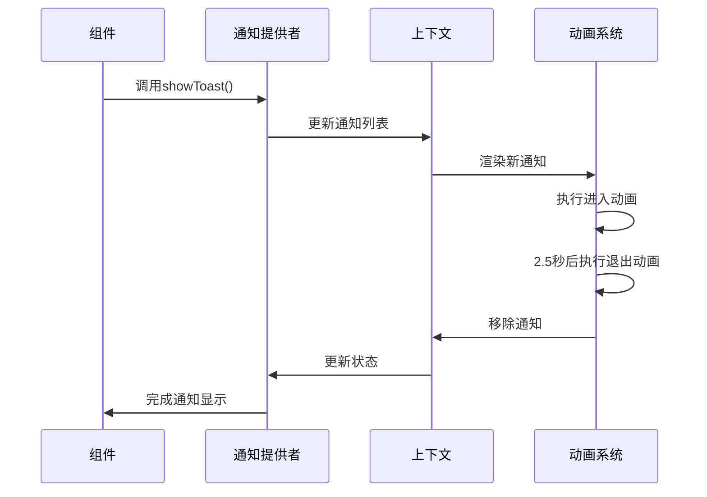
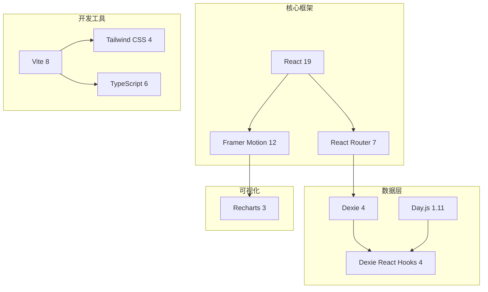
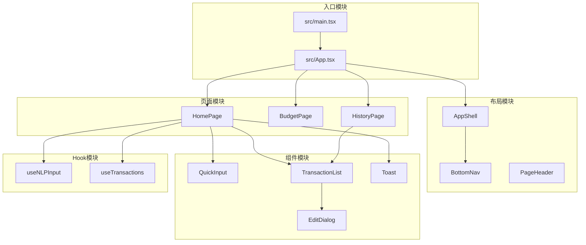

# 前端架构设计

<cite>
**本文档引用的文件**
- [src/App.tsx](file://src/App.tsx)
- [src/main.tsx](file://src/main.tsx)
- [src/components/layout/AppShell.tsx](file://src/components/layout/AppShell.tsx)
- [src/components/layout/BottomNav.tsx](file://src/components/layout/BottomNav.tsx)
- [src/components/layout/PageHeader.tsx](file://src/components/layout/PageHeader.tsx)
- [src/components/input/QuickInput.tsx](file://src/components/input/QuickInput.tsx)
- [src/components/transaction/TransactionList.tsx](file://src/components/transaction/TransactionList.tsx)
- [src/components/transaction/EditDialog.tsx](file://src/components/transaction/EditDialog.tsx)
- [src/components/stats/StatsSummary.tsx](file://src/components/stats/StatsSummary.tsx)
- [src/components/ui/Toast.tsx](file://src/components/ui/Toast.tsx)
- [src/hooks/useNLPInput.ts](file://src/hooks/useNLPInput.ts)
- [src/hooks/useTransactions.ts](file://src/hooks/useTransactions.ts)
- [src/pages/HomePage.tsx](file://src/pages/HomePage.tsx)
- [src/pages/BudgetPage.tsx](file://src/pages/BudgetPage.tsx)
- [src/pages/HistoryPage.tsx](file://src/pages/HistoryPage.tsx)
- [package.json](file://package.json)
</cite>

## 目录
1. [引言](#引言)
2. [项目结构](#项目结构)
3. [核心组件](#核心组件)
4. [架构概览](#架构概览)
5. [详细组件分析](#详细组件分析)
6. [依赖分析](#依赖分析)
7. [性能考虑](#性能考虑)
8. [故障排除指南](#故障排除指南)
9. [结论](#结论)

## 引言

MoneyNote是一个基于React 19构建的移动端记账应用，采用现代化的前端架构设计。该项目展现了优秀的组件化架构模式，通过清晰的分层结构实现了高度模块化的代码组织。项目的核心设计理念是围绕AppShell组件构建统一的应用容器，结合Framer Motion实现流畅的页面切换动画效果，并通过自定义Hook实现数据状态管理。

该架构充分利用了React 19的新特性，包括并发渲染和改进的Suspense支持，为移动端应用提供了优秀的用户体验。整个应用采用单页应用(SPA)架构，通过React Router进行路由管理，配合底部导航实现移动端友好的导航体验。

## 项目结构

MoneyNote项目采用了功能驱动的模块化组织方式，将代码按照功能领域进行分层：

```mermaid
graph TB
subgraph "入口层"
main_tsx[src/main.tsx]
app_tsx[src/App.tsx]
end
subgraph "布局层"
appshell_tsx[components/layout/AppShell.tsx]
bottomnav_tsx[components/layout/BottomNav.tsx]
pageheader_tsx[components/layout/PageHeader.tsx]
end
subgraph "页面层"
homepage_tsx[pages/HomePage.tsx]
budgetpage_tsx[pages/BudgetPage.tsx]
historypage_tsx[pages/HistoryPage.tsx]
statspage_tsx[pages/StatsPage.tsx]
settingspage_tsx[pages/SettingsPage.tsx]
end
subgraph "组件层"
subgraph "输入组件"
quickinput_tsx[components/input/QuickInput.tsx]
parsepreview_tsx[components/input/ParsePreview.tsx]
end
subgraph "交易组件"
transactionlist_tsx[components/transaction/TransactionList.tsx]
transactionitem_tsx[components/transaction/TransactionItem.tsx]
editdialog_tsx[components/transaction/EditDialog.tsx]
end
subgraph "统计组件"
statssummary_tsx[components/stats/StatsSummary.tsx]
categorypiechart_tsx[components/stats/CategoryPieChart.tsx]
trendlinechart_tsx[components/stats/TrendLineChart.tsx]
periodswitcher_tsx[components/stats/PeriodSwitcher.tsx]
end
subgraph "UI基础组件"
button_tsx[components/ui/Button.tsx]
card_tsx[components/ui/Card.tsx]
dialog_tsx[components/ui/Dialog.tsx]
badge_tsx[components/ui/Badge.tsx]
emptystate_tsx[components/ui/EmptyState.tsx]
toast_tsx[components/ui/Toast.tsx]
categoryicon_tsx[components/ui/CategoryIcon.tsx]
end
end
subgraph "数据层"
hooks_tsx[hooks目录]
db_tsx[db目录]
utils_tsx[utils目录]
types_tsx[types目录]
end
main_tsx --> app_tsx
app_tsx --> appshell_tsx
appshell_tsx --> bottomnav_tsx
app_tsx --> homepage_tsx
app_tsx --> budgetpage_tsx
app_tsx --> historypage_tsx
app_tsx --> statspage_tsx
app_tsx --> settingspage_tsx
homepage_tsx --> quickinput_tsx
homepage_tsx --> statssummary_tsx
homepage_tsx --> transactionlist_tsx
historypage_tsx --> transactionlist_tsx
budgetpage_tsx --> dialog_tsx
transactionlist_tsx --> editdialog_tsx
appshell_tsx --> app_tsx
```

**图表来源**
- [src/main.tsx:1-14](file://src/main.tsx#L1-L14)
- [src/App.tsx:1-51](file://src/App.tsx#L1-L51)
- [src/components/layout/AppShell.tsx:1-18](file://src/components/layout/AppShell.tsx#L1-L18)

**章节来源**
- [src/main.tsx:1-14](file://src/main.tsx#L1-L14)
- [src/App.tsx:1-51](file://src/App.tsx#L1-L51)

## 核心组件

### AppShell组件设计

AppShell作为应用的根容器，体现了现代移动端应用的典型架构模式。该组件采用"内容区域 + 底部导航"的双区域布局设计，通过CSS约束确保内容在最大宽度范围内居中显示。

AppShell的核心职责包括：
- **内容容器管理**：提供固定的高度约束和内边距，确保内容区域在不同设备上的一致性
- **导航集成**：将底部导航组件集成到应用布局中，实现全局导航访问
- **响应式适配**：通过max-w-lg类确保在桌面端的优雅降级

### 动画路由系统

项目实现了基于Framer Motion的动画路由系统，为用户提供流畅的页面切换体验：

**图表来源**
- [src/App.tsx:11-40](file://src/App.tsx#L11-L40)

**章节来源**
- [src/components/layout/AppShell.tsx:8-17](file://src/components/layout/AppShell.tsx#L8-L17)
- [src/App.tsx:11-40](file://src/App.tsx#L11-L40)

## 架构概览

MoneyNote采用分层架构设计，从底层到顶层依次为：数据层、业务逻辑层、UI组件层和页面层。这种分层设计确保了各层之间的职责分离和低耦合。

**图表来源**
- [src/App.tsx:1-51](file://src/App.tsx#L1-L51)
- [src/components/layout/AppShell.tsx:1-18](file://src/components/layout/AppShell.tsx#L1-L18)

## 详细组件分析

### NLP输入处理系统

NLP输入处理系统是MoneyNote的核心功能之一，实现了自然语言到结构化交易数据的转换：

**图表来源**
- [src/hooks/useNLPInput.ts:11-30](file://src/hooks/useNLPInput.ts#L11-L30)
- [src/pages/HomePage.tsx:19-34](file://src/pages/HomePage.tsx#L19-L34)

该系统的关键特性包括：
- **防抖机制**：避免频繁的NLP解析调用，提升性能
- **实时预览**：提供即时的解析结果显示
- **错误处理**：优雅处理解析失败的情况
- **用户交互**：支持手动编辑和确认流程

**章节来源**
- [src/hooks/useNLPInput.ts:1-51](file://src/hooks/useNLPInput.ts#L1-L51)
- [src/pages/HomePage.tsx:13-100](file://src/pages/HomePage.tsx#L13-L100)

### 交易管理系统

交易管理系统实现了完整的CRUD操作，结合Dexie数据库提供本地存储能力：

**图表来源**
- [src/components/transaction/TransactionList.tsx:6-10](file://src/components/transaction/TransactionList.tsx#L6-L10)
- [src/components/transaction/EditDialog.tsx:8-14](file://src/components/transaction/EditDialog.tsx#L8-L14)

**章节来源**
- [src/components/transaction/TransactionList.tsx:1-50](file://src/components/transaction/TransactionList.tsx#L1-L50)
- [src/components/transaction/EditDialog.tsx:1-113](file://src/components/transaction/EditDialog.tsx#L1-L113)

### 预算管理组件

预算管理组件提供了完整的预算规划和跟踪功能：

**图表来源**
- [src/pages/BudgetPage.tsx:39-58](file://src/pages/BudgetPage.tsx#L39-L58)
- [src/pages/BudgetPage.tsx:21-31](file://src/pages/BudgetPage.tsx#L21-L31)

**章节来源**
- [src/pages/BudgetPage.tsx:13-169](file://src/pages/BudgetPage.tsx#L13-L169)

### 通知系统

Toast通知系统实现了全局状态管理和动画效果：

**图表来源**
- [src/components/ui/Toast.tsx:23-60](file://src/components/ui/Toast.tsx#L23-L60)

**章节来源**
- [src/components/ui/Toast.tsx:1-61](file://src/components/ui/Toast.tsx#L1-L61)

## 依赖分析

### 外部依赖架构

MoneyNote项目采用轻量级但功能完备的技术栈，所有依赖都经过精心选择以满足移动端应用的需求：

**图表来源**
- [package.json:12-21](file://package.json#L12-L21)

### 内部模块依赖

项目内部模块遵循清晰的依赖层次结构，避免循环依赖并保持模块间的松耦合：

**图表来源**
- [src/main.tsx:1-14](file://src/main.tsx#L1-L14)
- [src/App.tsx:1-51](file://src/App.tsx#L1-L51)

**章节来源**
- [package.json:1-40](file://package.json#L1-L40)

## 性能考虑

### 渲染优化策略

项目采用了多种性能优化技术来确保移动端应用的流畅运行：

1. **懒加载和代码分割**：通过React Router的动态导入实现按需加载
2. **虚拟滚动**：对于大量交易记录使用虚拟化技术
3. **防抖和节流**：在输入处理和搜索功能中使用防抖机制
4. **状态缓存**：利用Dexie React Hooks提供的智能缓存机制

### 内存管理

- **自动清理**：React 19的并发特性有助于更好的内存管理
- **事件监听器清理**：确保组件卸载时清理所有事件监听器
- **定时器管理**：Toast系统中的自动清理机制

### 网络和存储优化

- **本地存储优先**：所有数据都存储在本地，减少网络请求
- **批量操作**：数据库操作采用批量处理提高效率
- **索引优化**：为常用查询字段建立适当的索引

## 故障排除指南

### 常见问题诊断

1. **路由切换动画不生效**
   - 检查Framer Motion版本兼容性
   - 确认AnimatePresence组件正确包裹
   - 验证key属性的唯一性

2. **NLP解析失败**
   - 检查输入文本格式
   - 验证NLP模块的依赖完整性
   - 查看控制台错误信息

3. **数据库操作异常**
   - 确认Dexie数据库初始化完成
   - 检查事务冲突情况
   - 验证数据模型定义

4. **Toast通知不显示**
   - 确认ToastProvider正确嵌套
   - 检查CSS定位样式
   - 验证动画配置参数

### 开发调试建议

- 使用React DevTools检查组件树结构
- 利用浏览器性能面板分析渲染性能
- 通过console.log追踪异步操作状态
- 使用React Router DevTools调试路由问题

**章节来源**
- [src/App.tsx:11-40](file://src/App.tsx#L11-L40)
- [src/components/ui/Toast.tsx:23-60](file://src/components/ui/Toast.tsx#L23-L60)

## 结论

MoneyNote项目展现了现代React应用开发的最佳实践，通过精心设计的架构实现了功能完整性与代码可维护性的平衡。项目的核心优势包括：

1. **清晰的架构层次**：从布局到页面再到组件的分层设计确保了良好的可扩展性
2. **优秀的用户体验**：结合Framer Motion的动画效果和移动端友好的界面设计
3. **高效的性能表现**：通过合理的优化策略确保了流畅的用户体验
4. **完善的错误处理**：全面的错误处理机制提升了应用的稳定性

该架构为类似的移动端应用开发提供了优秀的参考模板，特别是在组件化设计、状态管理和用户体验优化方面具有重要的借鉴价值。随着React生态系统的持续发展，该项目也具备良好的演进潜力，可以轻松适配新的React特性和最佳实践。