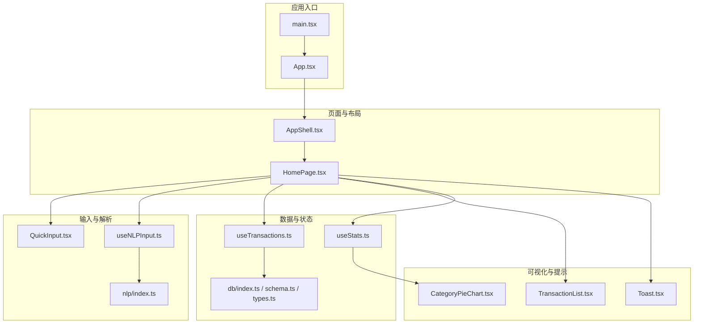
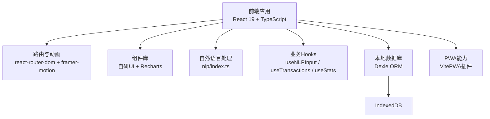
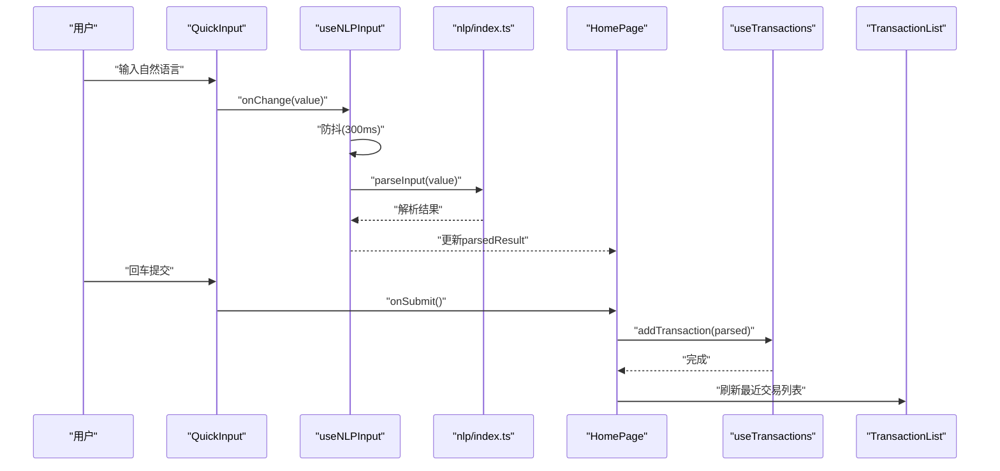
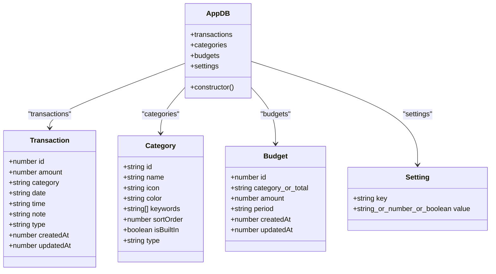
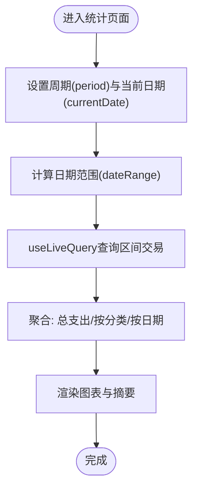
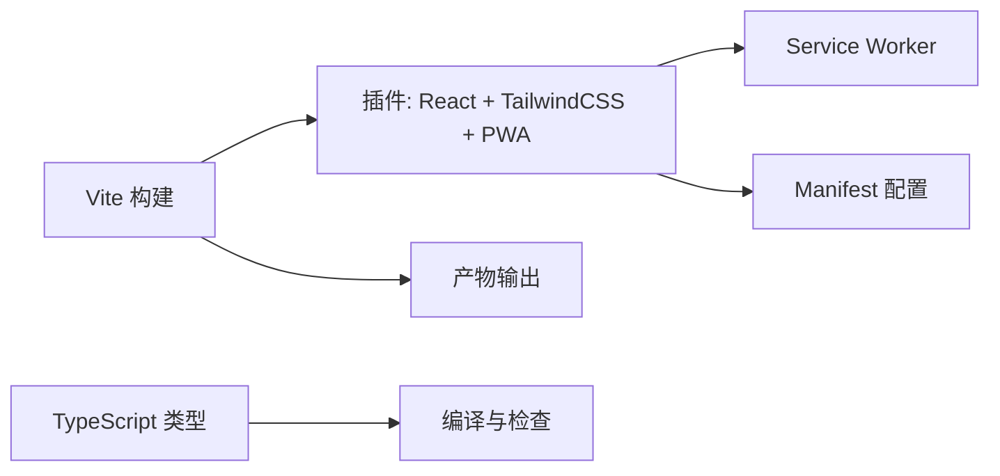
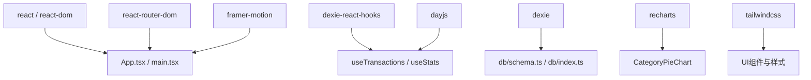

# 技术架构

<cite>
**本文引用的文件**
- [package.json](file://package.json)
- [vite.config.ts](file://vite.config.ts)
- [tsconfig.json](file://tsconfig.json)
- [src/main.tsx](file://src/main.tsx)
- [src/App.tsx](file://src/App.tsx)
- [src/components/layout/AppShell.tsx](file://src/components/layout/AppShell.tsx)
- [src/components/input/QuickInput.tsx](file://src/components/input/QuickInput.tsx)
- [src/components/transaction/TransactionList.tsx](file://src/components/transaction/TransactionList.tsx)
- [src/components/stats/CategoryPieChart.tsx](file://src/components/stats/CategoryPieChart.tsx)
- [src/components/ui/Toast.tsx](file://src/components/ui/Toast.tsx)
- [src/pages/HomePage.tsx](file://src/pages/HomePage.tsx)
- [src/hooks/useNLPInput.ts](file://src/hooks/useNLPInput.ts)
- [src/hooks/useTransactions.ts](file://src/hooks/useTransactions.ts)
- [src/hooks/useStats.ts](file://src/hooks/useStats.ts)
- [src/nlp/index.ts](file://src/nlp/index.ts)
- [src/db/index.ts](file://src/db/index.ts)
- [src/db/schema.ts](file://src/db/schema.ts)
- [src/db/types.ts](file://src/db/types.ts)
- [src/utils/constants.ts](file://src/utils/constants.ts)
</cite>

## 目录
1. [引言](#引言)
2. [项目结构](#项目结构)
3. [核心组件](#核心组件)
4. [架构总览](#架构总览)
5. [详细组件分析](#详细组件分析)
6. [依赖分析](#依赖分析)
7. [性能考虑](#性能考虑)
8. [故障排查指南](#故障排查指南)
9. [结论](#结论)
10. [附录](#附录)

## 引言
本文件面向开发者与产品团队，系统性阐述 MoneyNote 的技术架构与设计决策。项目采用 React 19 组件化架构，结合 Dexie ORM 实现本地数据库与实时查询，通过 Vite 构建系统与 TypeScript 类型体系保障开发效率与运行质量，并以 PWA 能力提升移动端可用性与离线体验。本文从系统边界、组件交互、数据流与性能优化等维度进行深入解析，并辅以多类架构图示，帮助读者快速把握整体设计思路。

## 项目结构
项目采用按功能域划分的目录组织方式，核心模块包括：
- 应用入口与路由：src/main.tsx、src/App.tsx、各页面组件（src/pages）
- 布局与UI：src/components/layout、src/components/ui、src/components/transaction、src/components/budget、src/components/stats
- 数据层：src/db（Dexie ORM）、src/hooks（业务数据钩子）
- 自然语言处理：src/nlp（解析流水线）
- 工具与常量：src/utils、src/types
- 构建与类型：vite.config.ts、tsconfig.json 及其子配置

**图表来源**
- [src/main.tsx:1-14](file://src/main.tsx#L1-L14)
- [src/App.tsx:1-51](file://src/App.tsx#L1-L51)
- [src/components/layout/AppShell.tsx:1-18](file://src/components/layout/AppShell.tsx#L1-L18)
- [src/pages/HomePage.tsx:1-100](file://src/pages/HomePage.tsx#L1-L100)
- [src/components/input/QuickInput.tsx:1-68](file://src/components/input/QuickInput.tsx#L1-L68)
- [src/nlp/index.ts:1-62](file://src/nlp/index.ts#L1-L62)
- [src/hooks/useNLPInput.ts:1-51](file://src/hooks/useNLPInput.ts#L1-L51)
- [src/hooks/useTransactions.ts:1-67](file://src/hooks/useTransactions.ts#L1-L67)
- [src/hooks/useStats.ts:1-79](file://src/hooks/useStats.ts#L1-L79)
- [src/db/index.ts:1-14](file://src/db/index.ts#L1-L14)
- [src/db/schema.ts:1-21](file://src/db/schema.ts#L1-L21)
- [src/db/types.ts:1-60](file://src/db/types.ts#L1-L60)
- [src/components/transaction/TransactionList.tsx:1-50](file://src/components/transaction/TransactionList.tsx#L1-L50)
- [src/components/stats/CategoryPieChart.tsx:1-61](file://src/components/stats/CategoryPieChart.tsx#L1-L61)
- [src/components/ui/Toast.tsx:1-61](file://src/components/ui/Toast.tsx#L1-L61)

**章节来源**
- [package.json:1-40](file://package.json#L1-L40)
- [vite.config.ts:1-36](file://vite.config.ts#L1-L36)
- [tsconfig.json:1-8](file://tsconfig.json#L1-L8)

## 核心组件
- 应用壳与路由：AppShell 提供移动端最大宽度与底部导航容器；App 使用 React Router 管理页面切换，并配合 Framer Motion 实现页面级转场动画。
- 输入与解析：QuickInput 提供自然语言输入与焦点管理；useNLPInput 负责防抖与解析状态；nlp/index.ts 定义解析流水线（标准化、日期、金额、分类、备注）。
- 数据访问：useTransactions 提供交易增删改查与聚合指标（今日/当月支出）；useStats 管理统计周期与数据聚合。
- 可视化：TransactionList 按日期分组展示交易；CategoryPieChart 基于 Recharts 展示分类占比。
- 通知系统：Toast 提供全局轻提示，支持自动消失与多种类型。
- 数据库：Dexie 定义表结构与索引，首次打开时写入默认数据。

**章节来源**
- [src/components/layout/AppShell.tsx:1-18](file://src/components/layout/AppShell.tsx#L1-L18)
- [src/App.tsx:1-51](file://src/App.tsx#L1-L51)
- [src/components/input/QuickInput.tsx:1-68](file://src/components/input/QuickInput.tsx#L1-L68)
- [src/hooks/useNLPInput.ts:1-51](file://src/hooks/useNLPInput.ts#L1-L51)
- [src/nlp/index.ts:1-62](file://src/nlp/index.ts#L1-L62)
- [src/hooks/useTransactions.ts:1-67](file://src/hooks/useTransactions.ts#L1-L67)
- [src/hooks/useStats.ts:1-79](file://src/hooks/useStats.ts#L1-L79)
- [src/components/transaction/TransactionList.tsx:1-50](file://src/components/transaction/TransactionList.tsx#L1-L50)
- [src/components/stats/CategoryPieChart.tsx:1-61](file://src/components/stats/CategoryPieChart.tsx#L1-L61)
- [src/components/ui/Toast.tsx:1-61](file://src/components/ui/Toast.tsx#L1-L61)
- [src/db/schema.ts:1-21](file://src/db/schema.ts#L1-L21)
- [src/db/index.ts:1-14](file://src/db/index.ts#L1-L14)

## 架构总览
系统采用“前端单页应用 + 本地数据库 + PWA”的混合架构：
- 前端框架：React 19，函数式组件 + Hooks，组件化拆分清晰。
- 数据层：Dexie 作为 IndexedDB 封装，提供声明式查询与实时订阅。
- 构建与类型：Vite 提供快速开发与生产构建，TypeScript 提供强类型保障。
- PWA：通过 VitePWA 插件生成 Manifest 与 Service Worker，支持自动更新与离线缓存。
- 移动端优化：固定最大宽度、底部导航、手势与动画体验。

**图表来源**
- [src/main.tsx:1-14](file://src/main.tsx#L1-L14)
- [src/App.tsx:1-51](file://src/App.tsx#L1-L51)
- [src/nlp/index.ts:1-62](file://src/nlp/index.ts#L1-L62)
- [src/hooks/useNLPInput.ts:1-51](file://src/hooks/useNLPInput.ts#L1-L51)
- [src/hooks/useTransactions.ts:1-67](file://src/hooks/useTransactions.ts#L1-L67)
- [src/hooks/useStats.ts:1-79](file://src/hooks/useStats.ts#L1-L79)
- [src/db/schema.ts:1-21](file://src/db/schema.ts#L1-L21)
- [vite.config.ts:1-36](file://vite.config.ts#L1-L36)

## 详细组件分析

### 页面与路由交互（HomePage）
HomePage 是主入口页面，负责串联输入、解析、列表与编辑流程：
- 输入与解析：QuickInput 接收用户输入，useNLPInput 防抖触发解析，nlp/index.ts 产出解析结果。
- 记录与展示：useTransactions 提供最近交易与聚合指标；TransactionList 按日期分组渲染。
- 编辑与删除：EditDialog 通过事务钩子执行更新与删除操作。
- 通知：Toast 提供成功/错误提示。

**图表来源**
- [src/components/input/QuickInput.tsx:1-68](file://src/components/input/QuickInput.tsx#L1-L68)
- [src/hooks/useNLPInput.ts:1-51](file://src/hooks/useNLPInput.ts#L1-L51)
- [src/nlp/index.ts:1-62](file://src/nlp/index.ts#L1-L62)
- [src/pages/HomePage.tsx:1-100](file://src/pages/HomePage.tsx#L1-L100)
- [src/hooks/useTransactions.ts:1-67](file://src/hooks/useTransactions.ts#L1-L67)
- [src/components/transaction/TransactionList.tsx:1-50](file://src/components/transaction/TransactionList.tsx#L1-L50)

**章节来源**
- [src/pages/HomePage.tsx:1-100](file://src/pages/HomePage.tsx#L1-L100)
- [src/components/input/QuickInput.tsx:1-68](file://src/components/input/QuickInput.tsx#L1-L68)
- [src/hooks/useNLPInput.ts:1-51](file://src/hooks/useNLPInput.ts#L1-L51)
- [src/nlp/index.ts:1-62](file://src/nlp/index.ts#L1-L62)
- [src/hooks/useTransactions.ts:1-67](file://src/hooks/useTransactions.ts#L1-L67)
- [src/components/transaction/TransactionList.tsx:1-50](file://src/components/transaction/TransactionList.tsx#L1-L50)

### 数据层与查询逻辑（Dexie ORM）
- 数据模型：Transaction、Category、Budget、Setting，统一在 db/types.ts 中定义。
- 表结构：AppDB 在构造函数中声明版本与索引，确保高效查询（如复合索引[type+date]、[category+period]）。
- 初始化：db/index.ts 在 populate 事件中批量写入默认分类与设置。
- 查询与订阅：useTransactions 与 useStats 使用 useLiveQuery 实现实时响应。

**图表来源**
- [src/db/schema.ts:1-21](file://src/db/schema.ts#L1-L21)
- [src/db/types.ts:1-60](file://src/db/types.ts#L1-L60)
- [src/db/index.ts:1-14](file://src/db/index.ts#L1-L14)

**章节来源**
- [src/db/schema.ts:1-21](file://src/db/schema.ts#L1-L21)
- [src/db/types.ts:1-60](file://src/db/types.ts#L1-L60)
- [src/db/index.ts:1-14](file://src/db/index.ts#L1-L14)
- [src/hooks/useTransactions.ts:1-67](file://src/hooks/useTransactions.ts#L1-L67)
- [src/hooks/useStats.ts:1-79](file://src/hooks/useStats.ts#L1-L79)

### 统计与图表（useStats 与 CategoryPieChart）
- useStats：维护当前周期（日/月/年）与日期范围，基于 useLiveQuery 查询区间内交易并计算总支出、按分类与按日期的汇总。
- CategoryPieChart：将分类汇总映射到图标、颜色与名称，使用 Recharts 渲染饼图与工具提示。

**图表来源**
- [src/hooks/useStats.ts:1-79](file://src/hooks/useStats.ts#L1-L79)
- [src/components/stats/CategoryPieChart.tsx:1-61](file://src/components/stats/CategoryPieChart.tsx#L1-L61)
- [src/utils/constants.ts:1-19](file://src/utils/constants.ts#L1-L19)

**章节来源**
- [src/hooks/useStats.ts:1-79](file://src/hooks/useStats.ts#L1-L79)
- [src/components/stats/CategoryPieChart.tsx:1-61](file://src/components/stats/CategoryPieChart.tsx#L1-L61)
- [src/utils/constants.ts:1-19](file://src/utils/constants.ts#L1-L19)

### PWA 与构建系统
- 构建：Vite 提供开发服务器与生产打包；@vitejs/plugin-react 与 @tailwindcss/vite 支持 React 与 TailwindCSS。
- PWA：VitePWA 插件自动生成 Manifest、Service Worker 与静态资源清单，registerType 设为 autoUpdate 以实现后台自动更新。
- 类型：tsconfig.json 通过引用子配置实现 app 与 node 的分离，保证类型检查与编译隔离。

**图表来源**
- [vite.config.ts:1-36](file://vite.config.ts#L1-L36)
- [package.json:1-40](file://package.json#L1-L40)
- [tsconfig.json:1-8](file://tsconfig.json#L1-L8)

**章节来源**
- [vite.config.ts:1-36](file://vite.config.ts#L1-L36)
- [package.json:1-40](file://package.json#L1-L40)
- [tsconfig.json:1-8](file://tsconfig.json#L1-L8)

## 依赖分析
- 外部依赖：React 19、React Router、Framer Motion、Dexie 与 dexie-react-hooks、Recharts、Day.js、TailwindCSS。
- 内部耦合：页面组件依赖 Hooks 与 UI 组件；Hooks 依赖 db 与 nlp；db 与 nlp 之间无直接耦合，通过类型契约解耦。
- 循环依赖：未发现循环导入；组件间通过 props 与上下文传递数据。

**图表来源**
- [package.json:1-40](file://package.json#L1-L40)
- [src/App.tsx:1-51](file://src/App.tsx#L1-L51)
- [src/hooks/useTransactions.ts:1-67](file://src/hooks/useTransactions.ts#L1-L67)
- [src/hooks/useStats.ts:1-79](file://src/hooks/useStats.ts#L1-L79)
- [src/db/schema.ts:1-21](file://src/db/schema.ts#L1-L21)
- [src/components/stats/CategoryPieChart.tsx:1-61](file://src/components/stats/CategoryPieChart.tsx#L1-L61)

**章节来源**
- [package.json:1-40](file://package.json#L1-L40)

## 性能考虑
- 查询性能
  - 复合索引：transactions 的 [type+date] 与 budgets 的 [category+period] 降低过滤成本。
  - 分页与限制：useTransactions 对最近交易使用 limit(10)，避免一次性加载大量数据。
- 渲染性能
  - useLiveQuery 返回值为空时提供默认空数组，减少条件判断开销。
  - Framer Motion 的页面转场与输入框边框动画使用简单属性，避免重排。
- 网络与离线
  - PWA 自动更新与静态资源缓存，显著降低二次加载时间。
- 类型与构建
  - TypeScript 子配置分离，提升编译速度与类型准确性。
  - Vite 快速热更新与按需打包，缩短开发等待时间。

**章节来源**
- [src/db/schema.ts:1-21](file://src/db/schema.ts#L1-L21)
- [src/hooks/useTransactions.ts:1-67](file://src/hooks/useTransactions.ts#L1-L67)
- [vite.config.ts:1-36](file://vite.config.ts#L1-L36)
- [tsconfig.json:1-8](file://tsconfig.json#L1-L8)

## 故障排查指南
- 输入解析异常
  - 症状：输入后无解析结果或长时间处于解析中。
  - 排查：确认 useNLPInput 防抖逻辑与 parseInput 流程；检查 nlp 各阶段函数返回值。
- 交易列表不更新
  - 症状：新增/修改/删除后列表未刷新。
  - 排查：确认 useTransactions 的增删改方法调用与 useLiveQuery 依赖项；检查 Dexie 事务是否成功。
- 统计数据不正确
  - 症状：分类占比或总支出与预期不符。
  - 排查：核对 useStats 的日期范围计算与过滤逻辑；检查 CATEGORY_MAP 映射。
- PWA 更新问题
  - 症状：更新后页面未刷新或缓存未清理。
  - 排查：确认 VitePWA 的 registerType 与 manifest 配置；检查浏览器 Application 面板中的 Service Worker 状态。

**章节来源**
- [src/hooks/useNLPInput.ts:1-51](file://src/hooks/useNLPInput.ts#L1-L51)
- [src/nlp/index.ts:1-62](file://src/nlp/index.ts#L1-L62)
- [src/hooks/useTransactions.ts:1-67](file://src/hooks/useTransactions.ts#L1-L67)
- [src/hooks/useStats.ts:1-79](file://src/hooks/useStats.ts#L1-L79)
- [vite.config.ts:1-36](file://vite.config.ts#L1-L36)

## 结论
MoneyNote 以 React 19 为核心，结合 Dexie ORM 与 PWA 能力，构建了轻量、可扩展且具备良好移动端体验的记账应用。通过清晰的组件拆分、稳定的类型系统与合理的数据查询策略，系统在易用性与性能之间取得平衡。未来可在国际化、预算规则引擎与数据导出等方面进一步增强。

## 附录
- 关键技术选型说明
  - React 19：函数式组件与并发特性，适合复杂交互与高性能渲染。
  - Dexie + dexie-react-hooks：简化 IndexedDB 使用，提供实时订阅与易用 API。
  - Vite + PWA：快速开发与部署，提升首屏与离线体验。
  - Recharts：专注财务可视化，易于定制主题与交互。
  - TailwindCSS：原子化样式，提升 UI 开发效率与一致性。