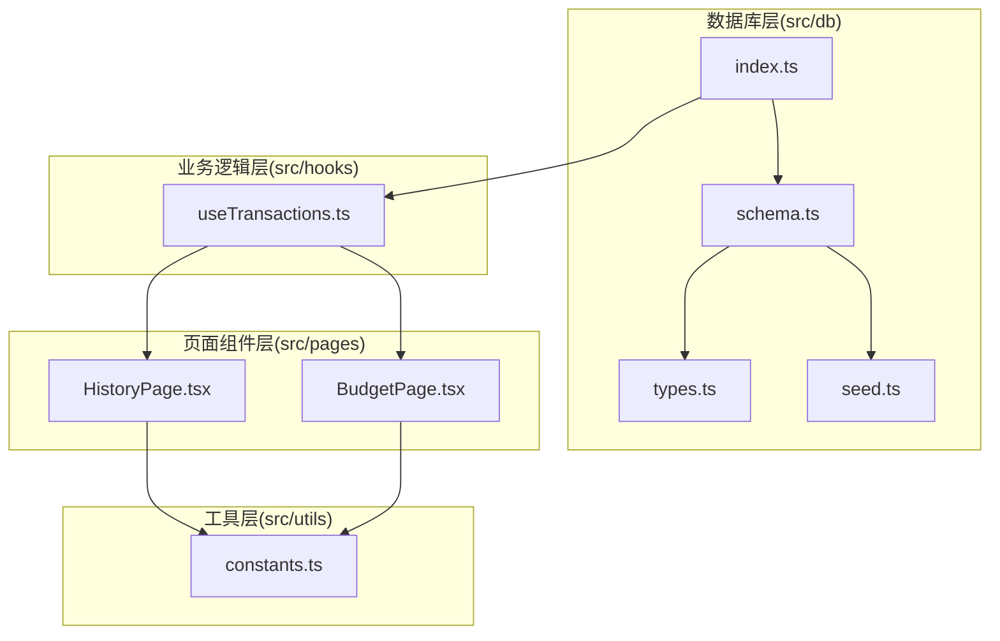
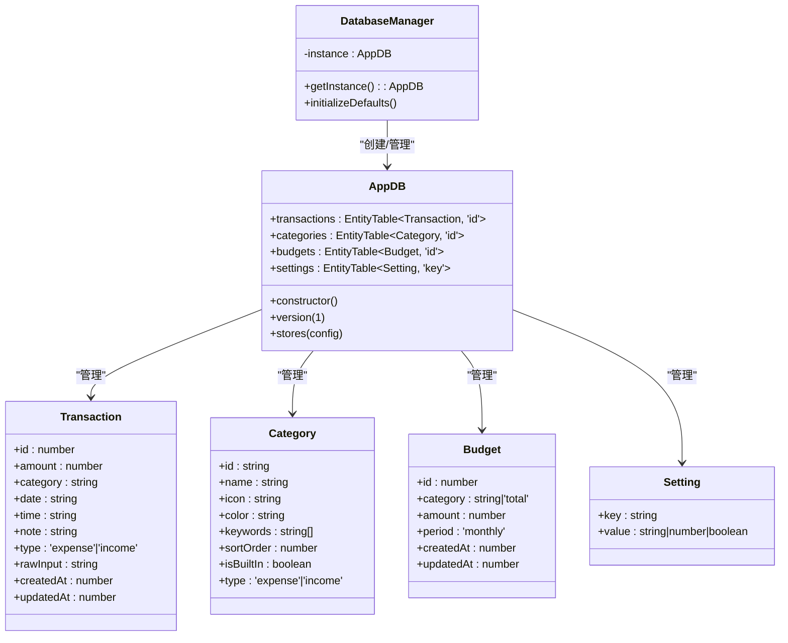
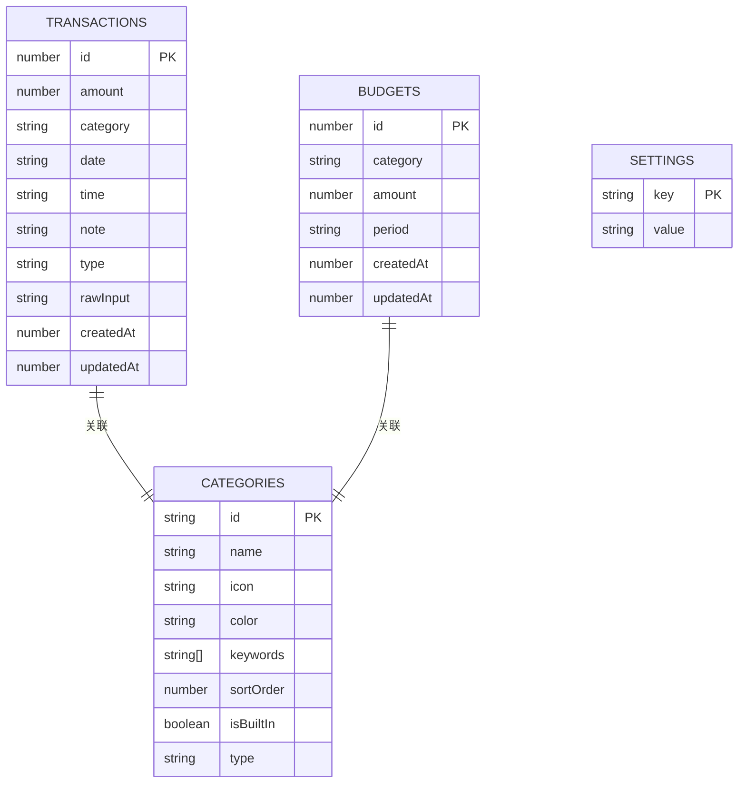
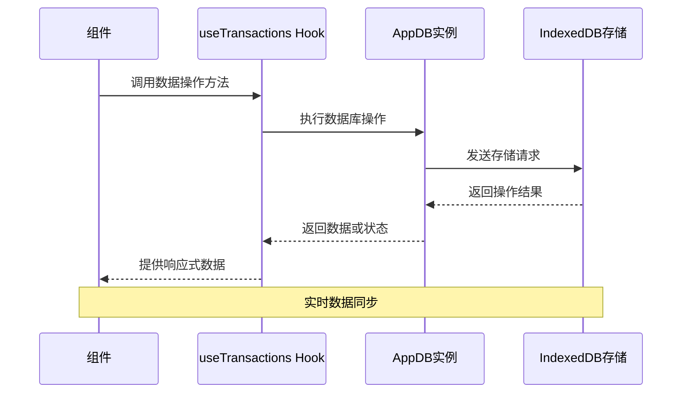
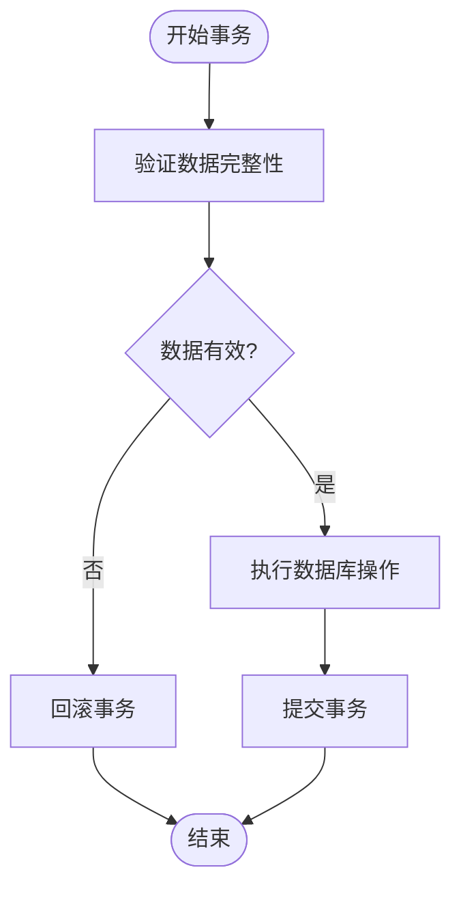
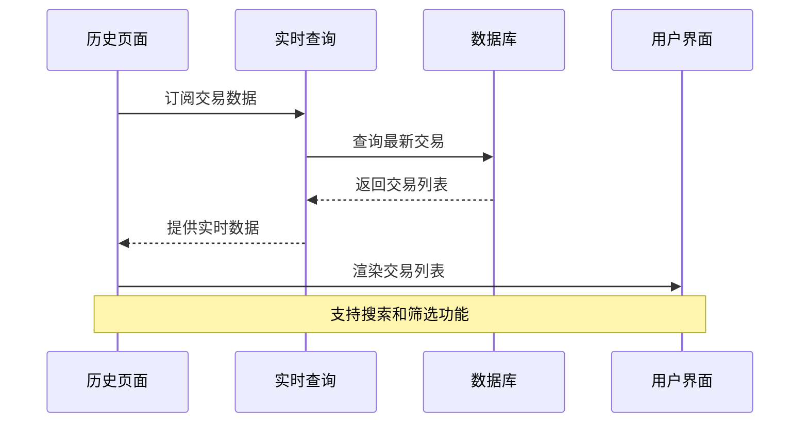
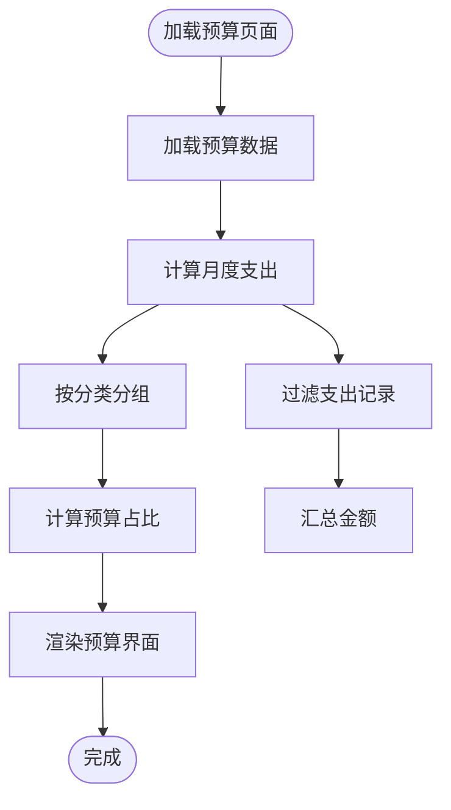
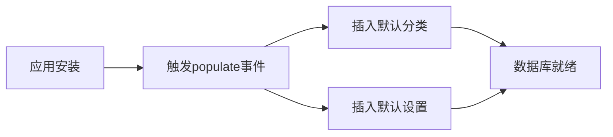
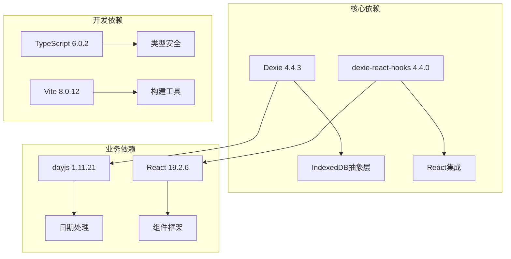
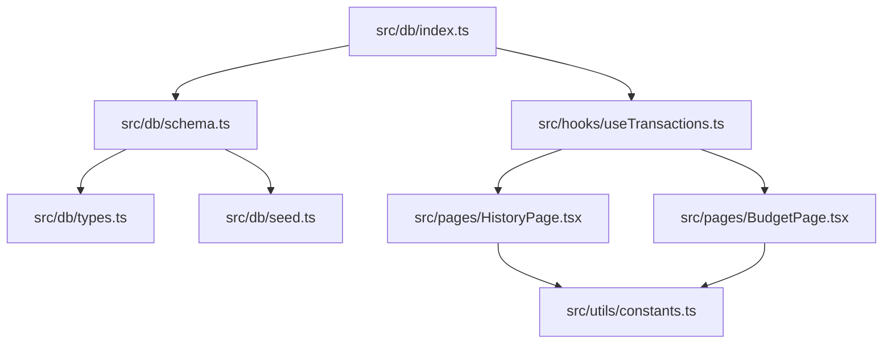

# 数据层架构

<cite>
**本文档引用的文件**
- [src/db/index.ts](file://src/db/index.ts)
- [src/db/schema.ts](file://src/db/schema.ts)
- [src/db/types.ts](file://src/db/types.ts)
- [src/db/seed.ts](file://src/db/seed.ts)
- [src/hooks/useTransactions.ts](file://src/hooks/useTransactions.ts)
- [src/pages/HistoryPage.tsx](file://src/pages/HistoryPage.tsx)
- [src/pages/BudgetPage.tsx](file://src/pages/BudgetPage.tsx)
- [src/utils/constants.ts](file://src/utils/constants.ts)
- [package.json](file://package.json)
</cite>

## 目录
1. [简介](#简介)
2. [项目结构](#项目结构)
3. [核心组件](#核心组件)
4. [架构概览](#架构概览)
5. [详细组件分析](#详细组件分析)
6. [依赖分析](#依赖分析)
7. [性能考虑](#性能考虑)
8. [故障排除指南](#故障排除指南)
9. [结论](#结论)

## 简介

MoneyNote项目采用Dexie ORM作为前端数据库解决方案，实现了完整的离线数据持久化架构。本项目专注于个人财务管理应用，通过IndexedDB提供高性能的数据存储能力，支持实时数据同步和复杂的查询操作。

该项目的数据层架构具有以下特点：
- 基于Dexie ORM的现代化数据库设计
- TypeScript强类型支持确保数据完整性
- React Hooks集成实现响应式数据绑定
- 原生IndexedDB存储策略优化性能表现
- 完整的CRUD操作和事务处理机制

## 项目结构

数据层相关文件组织遵循模块化设计原则，主要包含以下核心目录：



**图表来源**
- [src/db/index.ts:1-14](file://src/db/index.ts#L1-L14)
- [src/db/schema.ts:1-21](file://src/db/schema.ts#L1-L21)
- [src/hooks/useTransactions.ts:1-66](file://src/hooks/useTransactions.ts#L1-L66)

**章节来源**
- [src/db/index.ts:1-14](file://src/db/index.ts#L1-L14)
- [src/db/schema.ts:1-21](file://src/db/schema.ts#L1-L21)
- [src/db/types.ts:1-60](file://src/db/types.ts#L1-L60)

## 核心组件

### 数据库实例管理

项目通过单例模式管理数据库连接，确保全局唯一性和资源优化：



**图表来源**
- [src/db/schema.ts:4-20](file://src/db/schema.ts#L4-L20)
- [src/db/types.ts:3-46](file://src/db/types.ts#L3-L46)

### 数据模型定义

系统采用强类型设计，所有实体都通过TypeScript接口定义：

**事务模型(Transaction)**
- 主键：自增ID
- 关键字段：金额、分类、日期、类型
- 时间戳：创建时间和更新时间
- 索引优化：支持按日期排序和类型过滤

**分类模型(Category)**
- 主键：字符串ID
- 属性：名称、图标、颜色、关键词
- 排序：sortOrder决定显示顺序
- 类型：区分支出和收入

**预算模型(Budget)**
- 主键：自增ID
- 复合键：[category+period]确保唯一性
- 周期：当前版本支持月度预算

**设置模型(Setting)**
- 主键：键值对形式
- 支持多种数据类型：字符串、数字、布尔值

**章节来源**
- [src/db/types.ts:3-60](file://src/db/types.ts#L3-L60)

## 架构概览

### 数据库模式设计

项目采用版本化的数据库架构，当前版本为1：



**图表来源**
- [src/db/schema.ts:13-18](file://src/db/schema.ts#L13-L18)
- [src/db/types.ts:3-46](file://src/db/types.ts#L3-L46)

### 索引配置策略

每个表都经过精心设计的索引配置以优化查询性能：

**transactions表索引**
- 主键索引：`++id` (自增主键)
- 单字段索引：`date` (日期查询)
- 单字段索引：`category` (分类过滤)
- 单字段索引：`type` (收支类型)
- 复合索引：`[type+date]` (高频组合查询)

**categories表索引**
- 主键索引：`id` (字符串主键)
- 单字段索引：`sortOrder` (排序显示)

**budgets表索引**
- 主键索引：`++id` (自增主键)
- 复合索引：`[category+period]` (预算唯一性)

**settings表索引**
- 主键索引：`key` (配置项标识)

### 查询优化策略

基于索引设计，系统实现了高效的查询模式：

1. **时间范围查询**：利用`date`索引快速获取指定日期范围的交易
2. **类型过滤查询**：使用`type`索引分离收支数据
3. **复合条件查询**：通过`[type+date]`索引实现高频组合查询
4. **分类关联查询**：通过外键关联实现数据一致性

**章节来源**
- [src/db/schema.ts:13-18](file://src/db/schema.ts#L13-L18)

## 详细组件分析

### 数据访问层实现

数据访问层通过React Hooks实现响应式数据管理：



**图表来源**
- [src/hooks/useTransactions.ts:6-66](file://src/hooks/useTransactions.ts#L6-L66)
- [src/db/index.ts:4-12](file://src/db/index.ts#L4-L12)

#### CRUD操作封装

**创建操作**
- 自动设置时间戳字段
- 批量插入默认数据
- 错误处理和回滚机制

**读取操作**
- 实时查询和缓存
- 条件过滤和排序
- 分页和限制结果集

**更新操作**
- 部分字段更新
- 自动更新时间戳
- 数据验证和转换

**删除操作**
- 单条记录删除
- 批量删除支持
- 级联删除处理

#### 事务处理机制

系统采用Dexie的内置事务管理：



**图表来源**
- [src/db/index.ts:7-10](file://src/db/index.ts#L7-L10)

**章节来源**
- [src/hooks/useTransactions.ts:21-39](file://src/hooks/useTransactions.ts#L21-L39)

### 页面级数据集成

#### 历史页面数据流

历史页面展示了完整的数据读取和展示流程：



**图表来源**
- [src/pages/HistoryPage.tsx:19-21](file://src/pages/HistoryPage.tsx#L19-L21)
- [src/hooks/useTransactions.ts:8-19](file://src/hooks/useTransactions.ts#L8-L19)

#### 预算页面数据流

预算页面实现了复杂的数据聚合和计算：



**图表来源**
- [src/pages/BudgetPage.tsx:21-31](file://src/pages/BudgetPage.tsx#L21-L31)
- [src/db/schema.ts:14-16](file://src/db/schema.ts#L14-L16)

**章节来源**
- [src/pages/HistoryPage.tsx:19-50](file://src/pages/HistoryPage.tsx#L19-L50)
- [src/pages/BudgetPage.tsx:19-58](file://src/pages/BudgetPage.tsx#L19-L58)

### 默认数据初始化

系统在首次安装时自动初始化基础数据：



**图表来源**
- [src/db/index.ts:7-10](file://src/db/index.ts#L7-L10)
- [src/db/seed.ts:3-92](file://src/db/seed.ts#L3-L92)

**章节来源**
- [src/db/seed.ts:3-92](file://src/db/seed.ts#L3-L92)

## 依赖分析

### 外部依赖关系

项目的核心依赖包括：



**图表来源**
- [package.json:12-21](file://package.json#L12-L21)
- [package.json:22-38](file://package.json#L22-L38)

### 内部模块依赖

数据层内部模块之间的依赖关系清晰明确：



**图表来源**
- [src/db/index.ts:1-2](file://src/db/index.ts#L1-L2)
- [src/hooks/useTransactions.ts:2-4](file://src/hooks/useTransactions.ts#L2-L4)

**章节来源**
- [package.json:12-38](file://package.json#L12-L38)

## 性能考虑

### 存储策略优化

1. **索引设计优化**
   - 为高频查询字段建立适当索引
   - 使用复合索引支持复杂查询条件
   - 避免过度索引影响写入性能

2. **数据类型选择**
   - 使用数字类型存储金额，避免浮点数精度问题
   - 采用字符串格式存储日期，便于范围查询
   - 使用布尔类型表示开关状态

3. **内存管理**
   - 利用Dexie的自动缓存机制
   - 实现按需加载和懒加载策略
   - 及时清理不再使用的查询结果

### 查询性能优化

1. **查询计划优化**
   - 优先使用索引字段进行过滤
   - 合理使用范围查询和精确查询
   - 避免SELECT *，只查询必要字段

2. **批量操作优化**
   - 使用bulkAdd进行大量数据插入
   - 合并多个小操作为批量操作
   - 在事务中执行批量操作

3. **缓存策略**
   - 利用dexie-react-hooks的自动缓存
   - 实现智能缓存失效机制
   - 平衡内存使用和查询性能

## 故障排除指南

### 常见问题诊断

**数据库连接问题**
- 检查浏览器是否支持IndexedDB
- 验证数据库版本兼容性
- 确认权限设置正确

**查询性能问题**
- 分析查询执行计划
- 检查索引使用情况
- 优化查询条件和排序

**数据一致性问题**
- 验证事务边界
- 检查并发访问控制
- 实施适当的错误恢复机制

### 调试技巧

1. **启用Dexie调试模式**
   ```javascript
   // 在开发环境中启用详细日志
   Dexie.debug = true;
   ```

2. **监控数据库操作**
   - 使用浏览器开发者工具观察IndexedDB操作
   - 监控内存使用情况
   - 分析网络请求和数据库交互

3. **数据完整性检查**
   - 定期验证数据格式
   - 检查外键约束
   - 实施数据迁移策略

**章节来源**
- [src/db/schema.ts:10-19](file://src/db/schema.ts#L10-L19)

## 结论

MoneyNote项目的数据层架构展现了现代前端数据库应用的最佳实践。通过Dexie ORM的精心设计和TypeScript的强类型支持，系统实现了高性能、可维护的数据持久化解决方案。

### 架构优势

1. **技术选型合理**：Dexie ORM提供了优秀的前端数据库解决方案
2. **类型安全**：完整的TypeScript支持确保编译时类型检查
3. **性能优化**：合理的索引设计和查询策略
4. **开发体验**：与React生态系统的无缝集成

### 最佳实践总结

1. **数据库设计**：遵循ACID特性，合理设计表结构和索引
2. **数据访问**：通过Hooks实现响应式数据管理
3. **错误处理**：完善的异常捕获和恢复机制
4. **性能监控**：持续关注查询性能和内存使用

该架构为类似财务管理应用提供了完整的参考模板，既保证了功能完整性，又确保了良好的用户体验和系统性能。