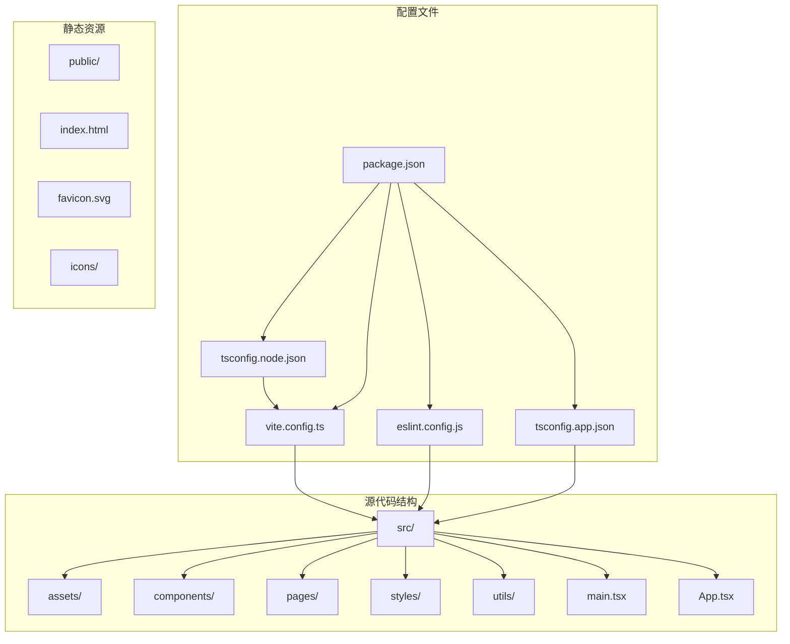
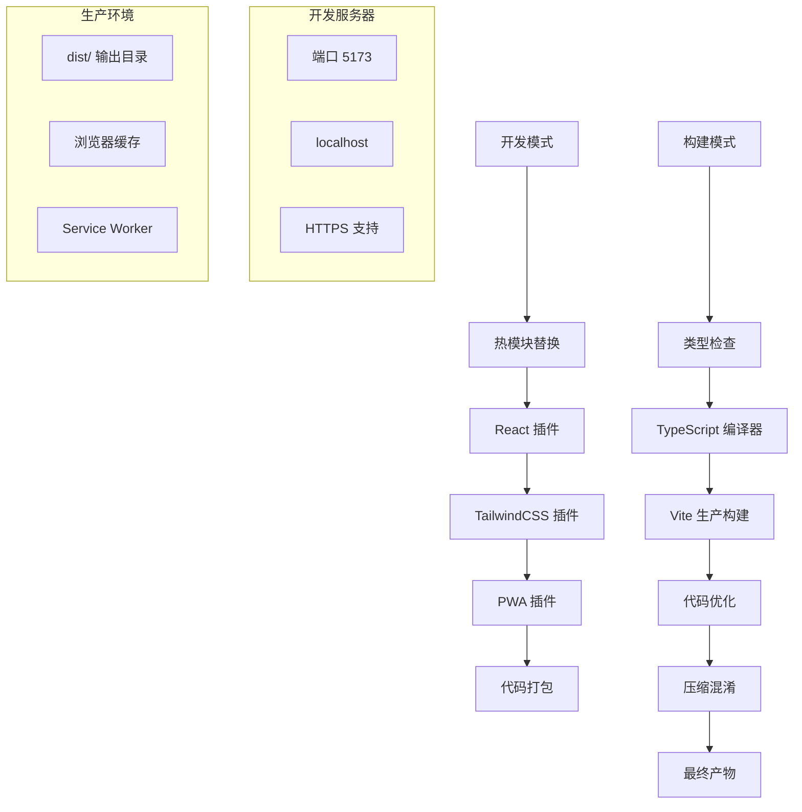
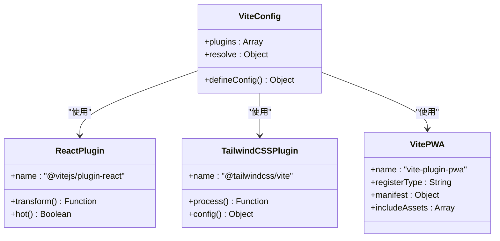
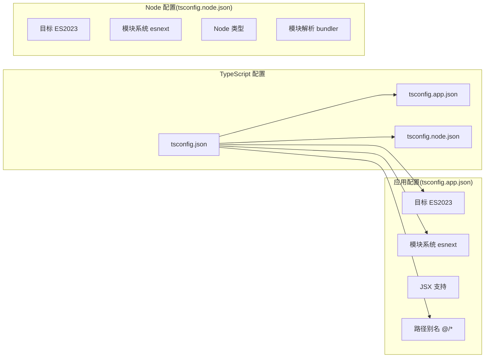
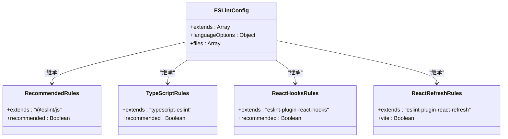
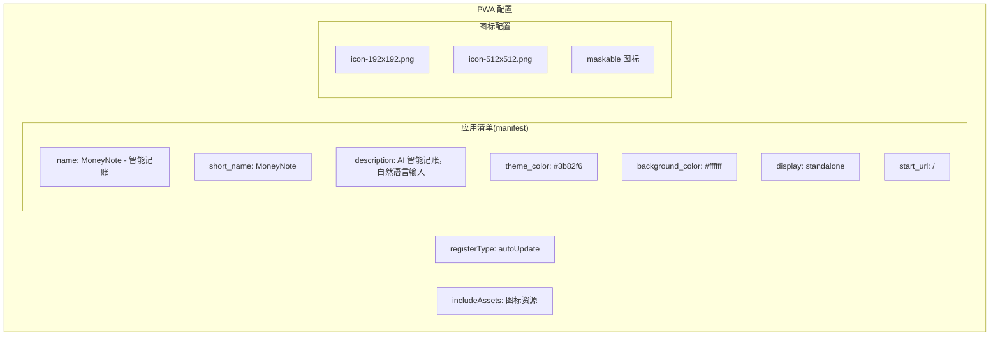
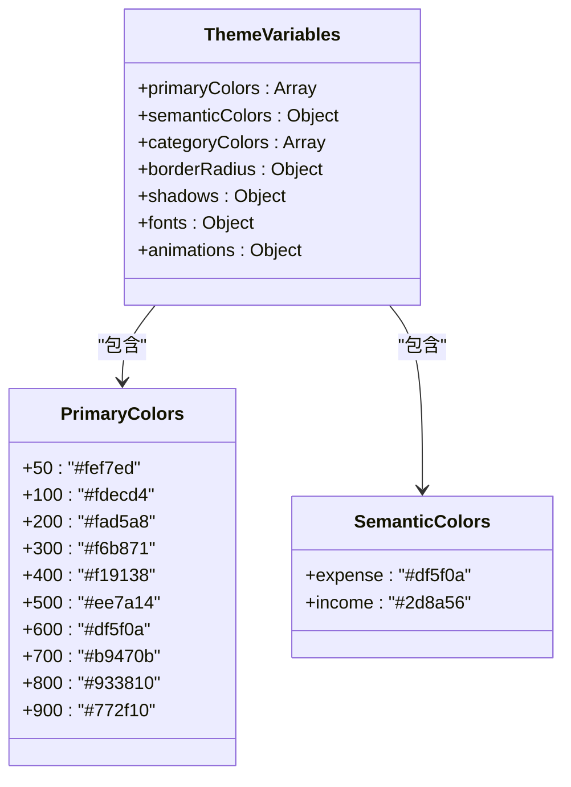

# 构建系统配置

<cite>
**本文档引用的文件**
- [vite.config.ts](file://vite.config.ts)
- [package.json](file://package.json)
- [eslint.config.js](file://eslint.config.js)
- [tsconfig.json](file://tsconfig.json)
- [tsconfig.app.json](file://tsconfig.app.json)
- [tsconfig.node.json](file://tsconfig.node.json)
- [index.html](file://index.html)
- [src/styles/index.css](file://src/styles/index.css)
</cite>

## 目录
1. [简介](#简介)
2. [项目结构](#项目结构)
3. [核心组件](#核心组件)
4. [架构概览](#架构概览)
5. [详细组件分析](#详细组件分析)
6. [依赖关系分析](#依赖关系分析)
7. [性能考虑](#性能考虑)
8. [故障排除指南](#故障排除指南)
9. [结论](#结论)
10. [附录](#附录)

## 简介
本项目采用现代前端构建工具链，基于 Vite 提供快速开发体验，结合 TypeScript 进行类型安全检查，使用 ESLint 确保代码质量，并通过 PWA 插件实现渐进式 Web 应用功能。该构建系统配置支持热模块替换(HMR)、自动刷新、代码分割和生产环境优化。

## 项目结构
项目采用标准的 React + TypeScript + Vite 模板结构，主要目录组织如下：
- `src/`: 源代码目录，包含所有 TypeScript/React 组件
- `public/`: 静态资源目录，包含图标和配置文件
- `dist/`: 构建输出目录（由 Vite 自动生成）
- 根目录配置文件：构建、类型检查和代码质量配置



**图表来源**
- [vite.config.ts:1-36](file://vite.config.ts#L1-L36)
- [package.json:1-40](file://package.json#L1-L40)

**章节来源**
- [vite.config.ts:1-36](file://vite.config.ts#L1-L36)
- [package.json:1-40](file://package.json#L1-L40)

## 核心组件
构建系统由四个核心组件构成，每个组件都有特定的功能和配置：

### Vite 构建引擎
Vite 作为主要的构建工具，提供快速的开发服务器和高效的生产构建。配置中集成了 React 和 TailwindCSS 插件，并启用了 PWA 支持。

### TypeScript 类型系统
采用双配置文件策略，分别针对应用代码和 Node.js 环境进行类型检查，确保开发和构建时的类型安全。

### ESLint 代码质量检查
配置了推荐的 ESLint 规则集，包括 React Hooks、React Refresh 和 TypeScript ESLint 支持。

### PWA 渐进式应用
通过 VitePWA 插件实现 Service Worker 注册、应用清单生成和缓存策略配置。

**章节来源**
- [vite.config.ts:7-35](file://vite.config.ts#L7-L35)
- [tsconfig.json:1-8](file://tsconfig.json#L1-L8)
- [eslint.config.js:1-23](file://eslint.config.js#L1-L23)

## 架构概览
构建系统的整体架构展示了从开发到生产的完整流程：



**图表来源**
- [vite.config.ts:8-29](file://vite.config.ts#L8-L29)
- [package.json:6-11](file://package.json#L6-L11)

## 详细组件分析

### Vite 配置分析
Vite 配置文件定义了完整的构建环境，包括插件集成、路径别名和 PWA 设置。

#### 插件集成配置


**图表来源**
- [vite.config.ts:8-29](file://vite.config.ts#L8-L29)

#### 路径别名配置
配置使用 `@` 作为源代码根目录的别名，简化导入路径：

**章节来源**
- [vite.config.ts:30-35](file://vite.config.ts#L30-L35)

### TypeScript 配置分析
项目采用双配置文件策略，分别处理应用代码和 Node.js 环境的不同需求。

#### 双配置文件架构


**图表来源**
- [tsconfig.json:3-6](file://tsconfig.json#L3-L6)
- [tsconfig.app.json:2-26](file://tsconfig.app.json#L2-L26)
- [tsconfig.node.json:2-24](file://tsconfig.node.json#L2-L24)

#### 编译选项详解
应用配置中的关键编译选项包括：
- 目标版本：ES2023，支持最新的 JavaScript 特性
- 模块解析：Bundler 模式，与 Vite 的模块系统兼容
- JSX 处理：使用 React JSX 转换
- 路径映射：`@/*` 映射到 `src/*`

**章节来源**
- [tsconfig.app.json:2-26](file://tsconfig.app.json#L2-L26)
- [tsconfig.node.json:2-24](file://tsconfig.node.json#L2-L24)

### ESLint 配置分析
代码质量检查配置基于 Flat Config 格式，提供了全面的规则集。

#### ESLint 配置结构


**图表来源**
- [eslint.config.js:8-22](file://eslint.config.js#L8-L22)

#### 语言环境配置
配置支持浏览器环境的全局变量访问，确保 React 开发的正确性。

**章节来源**
- [eslint.config.js:18-21](file://eslint.config.js#L18-L21)

### PWA 配置分析
PWA 插件提供了完整的渐进式 Web 应用功能，包括 Service Worker 和应用清单。

#### PWA 配置要素


**图表来源**
- [vite.config.ts:11-28](file://vite.config.ts#L11-L28)

#### Service Worker 注册机制
配置采用 `autoUpdate` 模式，确保应用在后台自动更新，提供最佳的用户体验。

**章节来源**
- [vite.config.ts:11-28](file://vite.config.ts#L11-L28)

### TailwindCSS 配置分析
项目使用 TailwindCSS 作为样式框架，通过自定义主题变量实现品牌色彩统一。

#### 主题变量配置


**图表来源**
- [src/styles/index.css:3-48](file://src/styles/index.css#L3-L48)

#### 品牌色彩系统
项目实现了完整的色彩体系，包括主色调、语义色和分类色，确保视觉一致性。

**章节来源**
- [src/styles/index.css:1-48](file://src/styles/index.css#L1-L48)

## 依赖关系分析
构建系统的依赖关系展示了各组件之间的相互作用和数据流向。

```mermaid
graph TB
subgraph "开发依赖"
VITE[vite ^8.0.12]
REACT[@vitejs/plugin-react ^6.0.1]
TAILWIND[@tailwindcss/vite ^4.3.0]
PWA[vite-plugin-pwa ^1.3.0]
TYPESCRIPT[typescript ~6.0.2]
ESLINT[eslint ^10.3.0]
end
subgraph "运行时依赖"
REACTLIB[react ^19.2.6]
REACTDOM[react-dom ^19.2.6]
ROUTER[react-router-dom ^7.17.0]
DEXIE[dexie ^4.4.3]
FRAMER[framer-motion ^12.40.0]
RECHARTS[recharts ^3.8.1]
end
subgraph "脚本命令"
DEV[dev: vite]
BUILD[build: tsc -b && vite build]
LINT[lint: eslint .]
PREVIEW[preview: vite preview]
end
VITE --> REACT
VITE --> TAILWIND
VITE --> PWA
TYPESCRIPT --> VITE
ESLINT --> VITE
REACTLIB --> VITE
REACTDOM --> VITE
```

**图表来源**
- [package.json:12-38](file://package.json#L12-L38)
- [package.json:6-11](file://package.json#L6-L11)

**章节来源**
- [package.json:12-38](file://package.json#L12-L38)
- [package.json:6-11](file://package.json#L6-L11)

## 性能考虑
构建系统在多个方面进行了性能优化，以确保开发和生产环境的最佳体验。

### 开发服务器优化
- 使用 Vite 的原生 HMR 实现快速模块更新
- 启用热重载和自动刷新功能
- 支持 HTTPS 开发环境

### 生产构建优化
- TypeScript 编译器预构建优化
- 代码分割和懒加载支持
- 自动 Tree Shaking 和 Dead Code Elimination

### 缓存策略
- Service Worker 实现智能缓存
- PWA 清单配置优化离线体验
- 图标资源预加载

### 调试技巧
- 开发模式下启用详细的错误信息
- 生产模式下保留必要的调试信息
- 支持 Source Map 便于问题排查

## 故障排除指南
常见构建问题和解决方案：

### TypeScript 相关问题
1. **类型检查失败**：检查 `tsconfig.app.json` 中的编译选项
2. **路径解析错误**：确认 `@` 别名配置正确
3. **模块解析问题**：验证 `moduleResolution` 设置

### Vite 配置问题
1. **插件冲突**：检查插件加载顺序和版本兼容性
2. **开发服务器启动失败**：验证端口占用情况
3. **热重载失效**：检查 HMR 配置和浏览器兼容性

### PWA 功能问题
1. **Service Worker 注册失败**：检查 HTTPS 环境和域名配置
2. **缓存更新问题**：验证 `registerType` 设置
3. **应用清单加载失败**：确认清单文件路径正确

**章节来源**
- [vite.config.ts:11-28](file://vite.config.ts#L11-L28)
- [tsconfig.app.json:10-14](file://tsconfig.app.json#L10-L14)

## 结论
MoneyNote 项目的构建系统配置展现了现代前端开发的最佳实践。通过 Vite 的高性能构建、TypeScript 的类型安全保障、ESLint 的代码质量控制和 PWA 的渐进式应用特性，为用户提供了优秀的开发和使用体验。配置文件结构清晰，扩展性强，便于后续的功能增强和维护。

## 附录

### 构建脚本说明
- `npm run dev`: 启动开发服务器，支持热重载
- `npm run build`: 执行 TypeScript 预构建和 Vite 生产构建
- `npm run lint`: 运行 ESLint 代码质量检查
- `npm run preview`: 预览生产构建结果

### 关键配置参数速查
- **开发端口**: 默认 5173
- **目标环境**: ES2023
- **模块系统**: esnext
- **路径别名**: `@` -> `src/`
- **PWA 注册类型**: `autoUpdate`