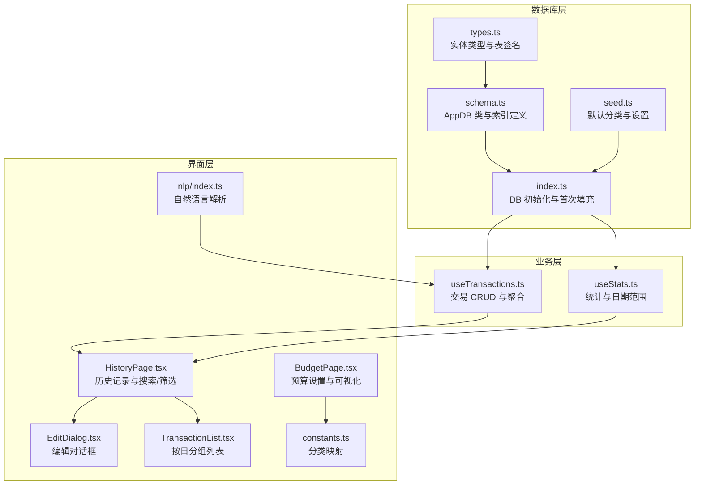
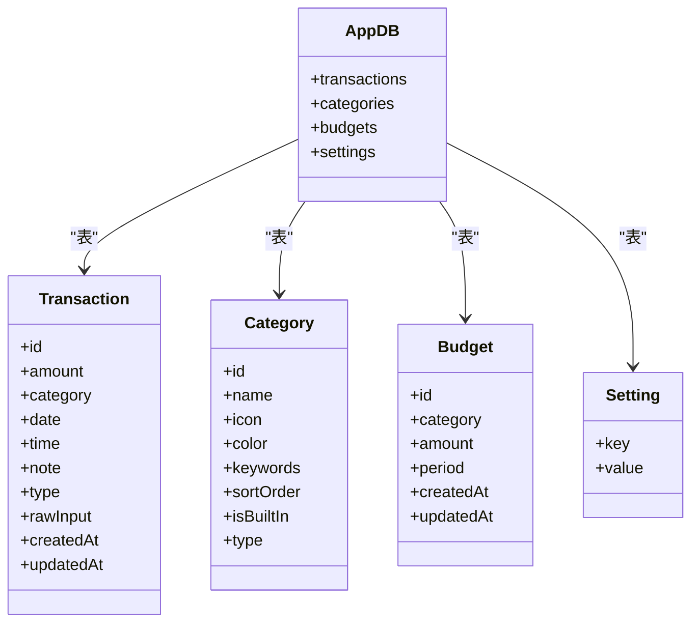
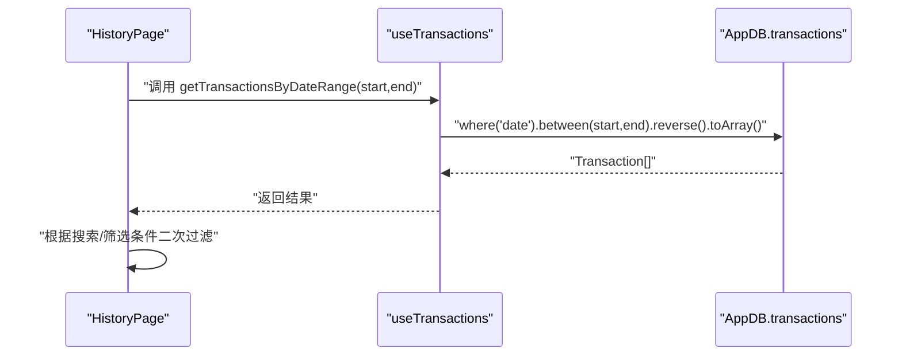
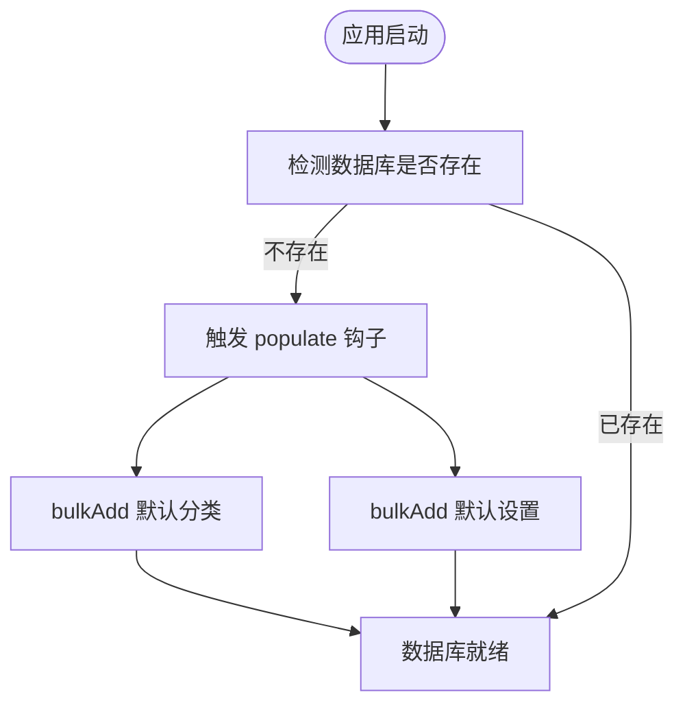
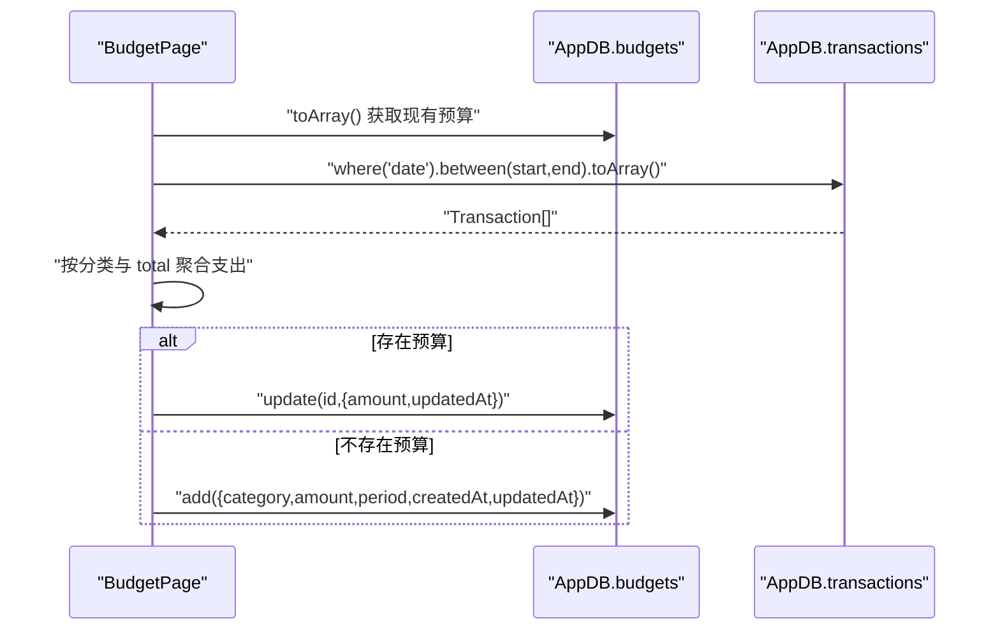
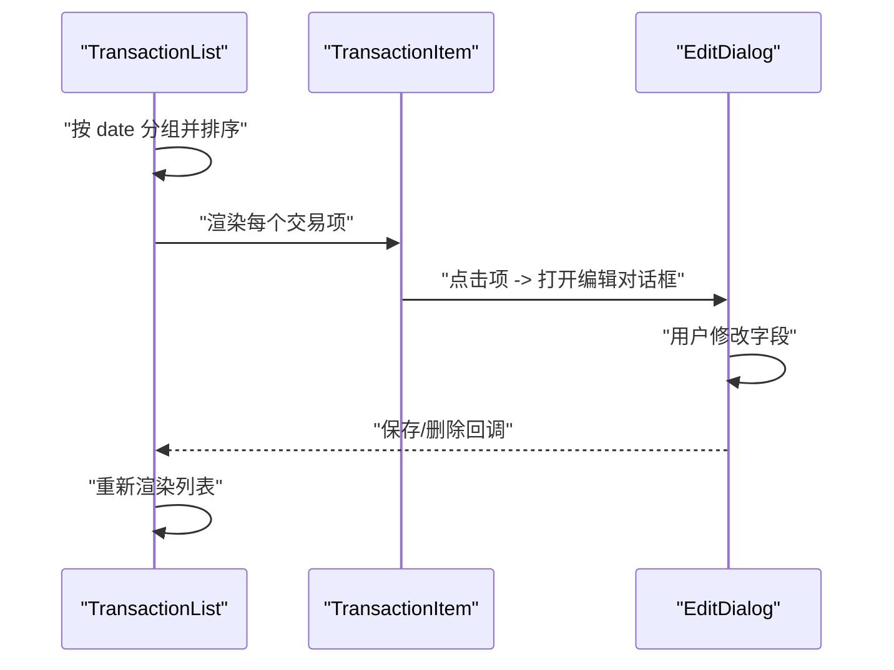
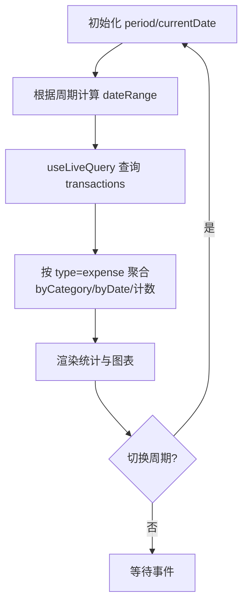
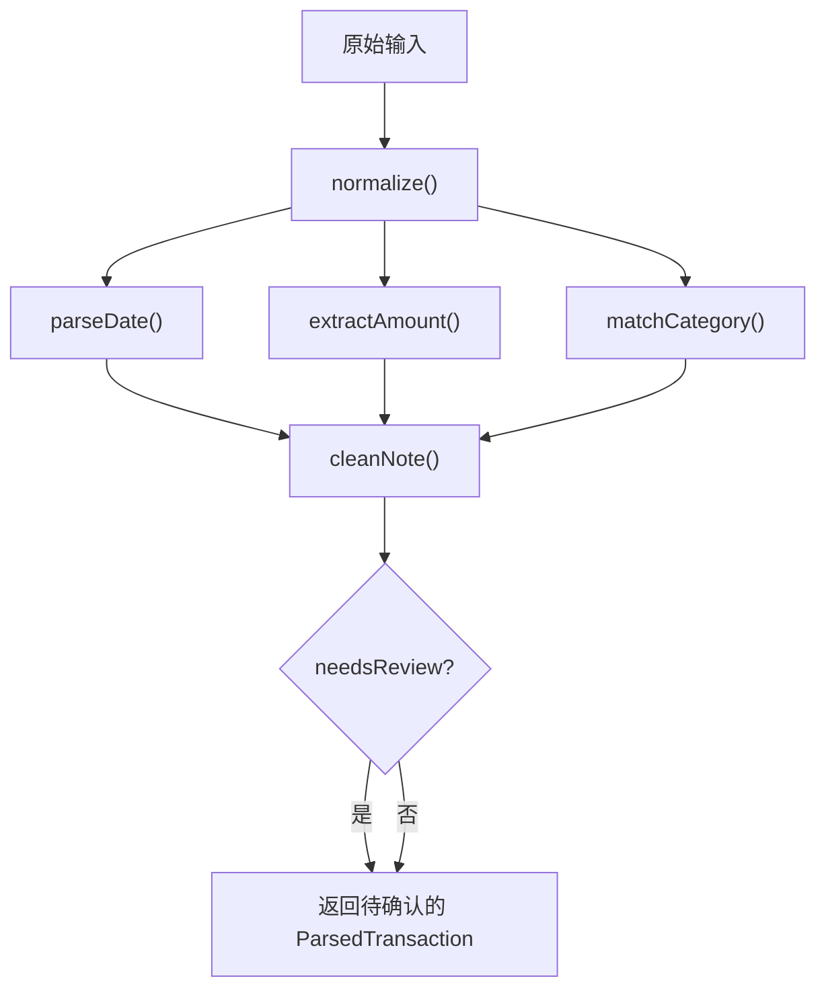
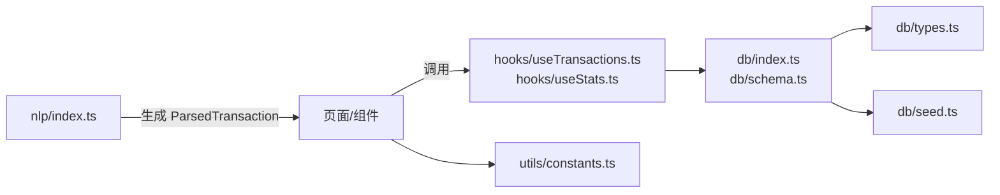

# CRUD操作

<cite>
**本文引用的文件**
- [src/db/index.ts](file://src/db/index.ts)
- [src/db/schema.ts](file://src/db/schema.ts)
- [src/db/types.ts](file://src/db/types.ts)
- [src/db/seed.ts](file://src/db/seed.ts)
- [src/hooks/useTransactions.ts](file://src/hooks/useTransactions.ts)
- [src/hooks/useStats.ts](file://src/hooks/useStats.ts)
- [src/pages/HistoryPage.tsx](file://src/pages/HistoryPage.tsx)
- [src/pages/BudgetPage.tsx](file://src/pages/BudgetPage.tsx)
- [src/components/transaction/EditDialog.tsx](file://src/components/transaction/EditDialog.tsx)
- [src/components/transaction/TransactionList.tsx](file://src/components/transaction/TransactionList.tsx)
- [src/utils/constants.ts](file://src/utils/constants.ts)
- [src/nlp/index.ts](file://src/nlp/index.ts)
</cite>

## 目录
1. [引言](#引言)
2. [项目结构](#项目结构)
3. [核心组件](#核心组件)
4. [架构总览](#架构总览)
5. [详细组件分析](#详细组件分析)
6. [依赖关系分析](#依赖关系分析)
7. [性能考量](#性能考量)
8. [故障排查指南](#故障排查指南)
9. [结论](#结论)
10. [附录](#附录)

## 引言
本文件系统性梳理 MoneyNote 的数据库 CRUD 实现，围绕 Transaction（交易）、Category（分类）、Budget（预算）三大实体，结合 Dexie ORM 的查询语法、索引与排序、批量操作、事务与错误处理策略进行深入解析，并给出分页、搜索过滤、聚合查询的实现思路与性能优化建议。同时覆盖数据同步、缓存策略与离线处理的实践要点。

## 项目结构
数据库相关代码集中在 src/db 目录，采用 Dexie 作为 IndexedDB 封装，通过自定义类 AppDB 声明表结构与索引；业务层通过 React Hooks 使用 dexie-react-hooks 的 useLiveQuery 实现实时订阅；页面组件负责交互与展示，配合 NLP 解析模块完成自然语言输入到结构化交易的转换。

图表来源
- [src/db/schema.ts:1-21](file://src/db/schema.ts#L1-L21)
- [src/db/types.ts:1-60](file://src/db/types.ts#L1-L60)
- [src/db/seed.ts:1-93](file://src/db/seed.ts#L1-L93)
- [src/db/index.ts:1-14](file://src/db/index.ts#L1-L14)
- [src/hooks/useTransactions.ts:1-67](file://src/hooks/useTransactions.ts#L1-L67)
- [src/hooks/useStats.ts:1-79](file://src/hooks/useStats.ts#L1-L79)
- [src/pages/HistoryPage.tsx:1-105](file://src/pages/HistoryPage.tsx#L1-L105)
- [src/components/transaction/EditDialog.tsx:1-113](file://src/components/transaction/EditDialog.tsx#L1-L113)
- [src/components/transaction/TransactionList.tsx:1-50](file://src/components/transaction/TransactionList.tsx#L1-L50)
- [src/pages/BudgetPage.tsx:1-169](file://src/pages/BudgetPage.tsx#L1-L169)
- [src/utils/constants.ts:1-19](file://src/utils/constants.ts#L1-L19)
- [src/nlp/index.ts:1-62](file://src/nlp/index.ts#L1-L62)

章节来源
- [src/db/schema.ts:1-21](file://src/db/schema.ts#L1-L21)
- [src/db/types.ts:1-60](file://src/db/types.ts#L1-L60)
- [src/db/seed.ts:1-93](file://src/db/seed.ts#L1-L93)
- [src/db/index.ts:1-14](file://src/db/index.ts#L1-L14)

## 核心组件
- 数据库实例与版本迁移：AppDB 继承 Dexie，声明 transactions、categories、budgets、settings 表及索引；首次打开时 populate 钩子写入默认分类与设置。
- 实体模型：Transaction、Category、Budget、Setting 及 ParsedTransaction，明确字段与约束。
- 业务钩子：useTransactions 提供交易增删改查、最近记录、按日期范围查询、当日/当月支出聚合；useStats 提供周期切换、日期范围计算与统计聚合。
- 页面与组件：HistoryPage 负责历史记录展示、搜索与筛选；EditDialog 支持编辑与删除；TransactionList 实现按日分组；BudgetPage 管理预算并可视化对比支出。

章节来源
- [src/db/index.ts:1-14](file://src/db/index.ts#L1-L14)
- [src/db/schema.ts:10-19](file://src/db/schema.ts#L10-L19)
- [src/db/types.ts:3-39](file://src/db/types.ts#L3-L39)
- [src/hooks/useTransactions.ts:6-66](file://src/hooks/useTransactions.ts#L6-L66)
- [src/hooks/useStats.ts:7-78](file://src/hooks/useStats.ts#L7-L78)
- [src/pages/HistoryPage.tsx:12-104](file://src/pages/HistoryPage.tsx#L12-L104)
- [src/components/transaction/EditDialog.tsx:18-112](file://src/components/transaction/EditDialog.tsx#L18-L112)
- [src/components/transaction/TransactionList.tsx:12-49](file://src/components/transaction/TransactionList.tsx#L12-L49)
- [src/pages/BudgetPage.tsx:13-168](file://src/pages/BudgetPage.tsx#L13-L168)

## 架构总览
Dexie 在浏览器端提供类 SQL 查询语法，支持索引扫描、范围查询、复合索引与排序。MoneyNote 的索引设计覆盖高频查询路径：
- transactions：主键自增 id；普通索引 date、category、type；复合索引 [type+date] 用于快速按类型+日期检索。
- categories：主键 id，索引 sortOrder。
- budgets：主键自增 id，复合索引 [category+period] 便于按分类+周期查询。
- settings：主键 key。

图表来源
- [src/db/schema.ts:4-19](file://src/db/schema.ts#L4-L19)
- [src/db/types.ts:3-39](file://src/db/types.ts#L3-L39)

## 详细组件分析

### 交易（Transaction）CRUD 与查询
- 新增：useTransactions 中 addTransaction 自动注入 createdAt/updatedAt，返回新增 id。
- 更新：updateTransaction 接收部分字段，统一更新 updatedAt。
- 删除：deleteTransaction 传入 id 删除。
- 查询：
  - 最近记录：orderBy('date').reverse().limit(10).toArray。
  - 指定日期范围：where('date').between(start, end, true, true).reverse().toArray。
  - 当日/当月支出：利用复合索引 [type+date] 或按 date 范围过滤后在内存聚合。
- 搜索与筛选：HistoryPage 在前端对 transactions 进行 filter（备注、分类名、金额），属于“客户端聚合”；也可改为服务端过滤以提升大体量数据性能。

图表来源
- [src/hooks/useTransactions.ts:13-19](file://src/hooks/useTransactions.ts#L13-L19)
- [src/pages/HistoryPage.tsx:19-37](file://src/pages/HistoryPage.tsx#L19-L37)

章节来源
- [src/hooks/useTransactions.ts:8-19](file://src/hooks/useTransactions.ts#L8-L19)
- [src/hooks/useTransactions.ts:22-39](file://src/hooks/useTransactions.ts#L22-L39)
- [src/pages/HistoryPage.tsx:19-37](file://src/pages/HistoryPage.tsx#L19-L37)

### 分类（Category）CRUD 与默认数据
- 模型：Category 包含 id、name、icon、color、keywords、sortOrder、isBuiltIn、type。
- 默认数据：首次打开数据库时 populate 钩子写入 defaultCategories 与 defaultSettings。
- 使用：CATEGORY_MAP 提供分类名称、图标与颜色映射，EditDialog 与 BudgetPage 均依赖该常量。

图表来源
- [src/db/index.ts:7-10](file://src/db/index.ts#L7-L10)
- [src/db/seed.ts:3-84](file://src/db/seed.ts#L3-L84)
- [src/utils/constants.ts:1-10](file://src/utils/constants.ts#L1-L10)

章节来源
- [src/db/types.ts:16-25](file://src/db/types.ts#L16-L25)
- [src/db/index.ts:7-10](file://src/db/index.ts#L7-L10)
- [src/db/seed.ts:3-84](file://src/db/seed.ts#L3-L84)
- [src/utils/constants.ts:1-10](file://src/utils/constants.ts#L1-L10)

### 预算（Budget）CRUD 与聚合
- 模型：Budget 包含 category、amount、period、createdAt、updatedAt；period 为 monthly；category 可为具体分类或 'total'。
- 查询：BudgetPage 读取 budgets.toArray；按月统计支出使用 transactions 的 date 范围查询后在内存聚合。
- 写入：若存在则 update，否则 add；统一注入 createdAt/updatedAt。

图表来源
- [src/pages/BudgetPage.tsx:19-58](file://src/pages/BudgetPage.tsx#L19-L58)
- [src/db/types.ts:27-34](file://src/db/types.ts#L27-L34)

章节来源
- [src/pages/BudgetPage.tsx:19-58](file://src/pages/BudgetPage.tsx#L19-L58)
- [src/db/types.ts:27-34](file://src/db/types.ts#L27-L34)

### 编辑对话框与列表渲染
- EditDialog：接收当前交易，支持修改金额、备注、日期、分类，保存时调用父级回调；删除时触发删除流程。
- TransactionList：按 date 分组，支持显示/隐藏日期标题，计算当日支出小计。

图表来源
- [src/components/transaction/TransactionList.tsx:17-46](file://src/components/transaction/TransactionList.tsx#L17-L46)
- [src/components/transaction/EditDialog.tsx:33-48](file://src/components/transaction/EditDialog.tsx#L33-L48)

章节来源
- [src/components/transaction/TransactionList.tsx:12-49](file://src/components/transaction/TransactionList.tsx#L12-L49)
- [src/components/transaction/EditDialog.tsx:18-112](file://src/components/transaction/EditDialog.tsx#L18-L112)

### 统计与周期切换
- useStats：维护 period 与 currentDate，计算 dateRange；通过 useLiveQuery 订阅 transactions 并在内存中聚合总支出、按分类与按日期汇总。
- 支持 day/month/year 三种周期，导航函数按周期步进。

图表来源
- [src/hooks/useStats.ts:11-29](file://src/hooks/useStats.ts#L11-L29)
- [src/hooks/useStats.ts:31-48](file://src/hooks/useStats.ts#L31-L48)

章节来源
- [src/hooks/useStats.ts:7-78](file://src/hooks/useStats.ts#L7-L78)

### 自然语言解析（NLP）
- parseInput：对原始输入执行标准化、日期提取、金额提取、分类匹配、备注清理，输出 ParsedTransaction；当置信度不足时标记 needsReview。
- 与交易 CRUD 结合：可将解析结果直接提交为新交易，或在 UI 中提示用户确认。

图表来源
- [src/nlp/index.ts:8-55](file://src/nlp/index.ts#L8-L55)

章节来源
- [src/nlp/index.ts:1-62](file://src/nlp/index.ts#L1-L62)

## 依赖关系分析
- 数据层依赖 Dexie，通过 AppDB 统一暴露表接口；index.ts 负责初始化与 populate。
- 业务层通过 useTransactions/useStats 访问数据库，二者均依赖 useLiveQuery 实现实时响应。
- 界面层依赖常量映射与组件库，EditDialog 与 BudgetPage 分别驱动交易编辑与预算配置。
- NLP 模块独立于数据库，但可产出可用于新增交易的数据结构。

图表来源
- [src/nlp/index.ts:1-62](file://src/nlp/index.ts#L1-L62)
- [src/hooks/useTransactions.ts:1-67](file://src/hooks/useTransactions.ts#L1-L67)
- [src/hooks/useStats.ts:1-79](file://src/hooks/useStats.ts#L1-L79)
- [src/db/index.ts:1-14](file://src/db/index.ts#L1-L14)
- [src/db/schema.ts:1-21](file://src/db/schema.ts#L1-L21)
- [src/db/types.ts:1-60](file://src/db/types.ts#L1-L60)
- [src/db/seed.ts:1-93](file://src/db/seed.ts#L1-L93)
- [src/utils/constants.ts:1-19](file://src/utils/constants.ts#L1-L19)

章节来源
- [src/db/index.ts:1-14](file://src/db/index.ts#L1-L14)
- [src/db/schema.ts:1-21](file://src/db/schema.ts#L1-L21)
- [src/db/types.ts:1-60](file://src/db/types.ts#L1-L60)
- [src/db/seed.ts:1-93](file://src/db/seed.ts#L1-L93)
- [src/hooks/useTransactions.ts:1-67](file://src/hooks/useTransactions.ts#L1-L67)
- [src/hooks/useStats.ts:1-79](file://src/hooks/useStats.ts#L1-L79)
- [src/utils/constants.ts:1-19](file://src/utils/constants.ts#L1-L19)
- [src/nlp/index.ts:1-62](file://src/nlp/index.ts#L1-L62)

## 性能考量
- 索引与查询
  - transactions 的 [type+date] 复合索引适合按类型与日期快速检索；where('[type+date]') 可显著减少扫描范围。
  - 按日期范围查询使用 between(start, end, true, true)，确保闭区间命中索引。
- 聚合与分页
  - 当前 HistoryPage 对大量数据进行前端 filter/aggregate，建议在大数据量场景下优先使用数据库侧聚合（如 groupBy）或服务端分页。
  - 若需分页，可在查询中限制 limit 与 offset，或基于游标（lastKey）实现无间隙分页。
- 批量操作
  - populate 钩子使用 bulkAdd 写入默认数据，避免逐条 add 的性能损耗。
  - 可在导入/重算场景使用 bulkPut/bulkAdd 提升吞吐。
- 事务与并发
  - Dexie 事务由底层 IDB 管理；对多表一致性需求可通过 Promise.all 并行提交并在失败时回滚策略实现。
- 内存与订阅
  - useLiveQuery 会自动订阅变更并重跑查询；对超大集合建议拆分查询范围或延迟订阅。
- I/O 优化
  - 减少不必要的反向排序与多次 toArray；尽量在 where 条件中使用索引字段。

## 故障排查指南
- 查询无结果
  - 检查日期格式是否为 "YYYY-MM-DD"，范围边界是否正确；确认 between 是否使用了正确的闭区间参数。
  - 复合索引使用 where('[type+date]') 时，传入数组顺序需与索引定义一致。
- 更新时间未变化
  - 确认 updateTransaction 是否统一更新 updatedAt 字段。
- 预算未生效
  - 确认 budgets.toArray 返回值与预算表数据一致；检查 period 与 category 组合是否匹配。
- 首次打开无默认数据
  - 检查 populate 钩子是否触发；确认数据库版本升级或删除 IndexedDB 后是否重建。
- 前端搜索不准确
  - 检查搜索关键词大小写与空格处理；必要时在数据库侧增加全文索引或规范化字段。

章节来源
- [src/hooks/useTransactions.ts:42-55](file://src/hooks/useTransactions.ts#L42-L55)
- [src/pages/BudgetPage.tsx:44-58](file://src/pages/BudgetPage.tsx#L44-L58)
- [src/db/index.ts:7-10](file://src/db/index.ts#L7-L10)

## 结论
MoneyNote 的数据库层以 Dexie 为核心，通过合理的索引设计与 useLiveQuery 实现实时订阅，实现了 Transaction、Category、Budget 的完整 CRUD 与常见聚合查询。前端页面通过组合式 Hooks 与组件化 UI 完成交互闭环。建议在数据规模扩大后引入数据库侧聚合、分页与更严格的事务控制，以进一步提升性能与可靠性。

## 附录
- 常用查询模式参考路径
  - 按日期范围查询：[src/hooks/useTransactions.ts:13-19](file://src/hooks/useTransactions.ts#L13-L19)
  - 复合索引查询：[src/hooks/useTransactions.ts:42-46](file://src/hooks/useTransactions.ts#L42-L46)
  - 按月统计支出：[src/pages/BudgetPage.tsx:21-31](file://src/pages/BudgetPage.tsx#L21-L31)
  - 实时订阅与聚合：[src/hooks/useStats.ts:22-29](file://src/hooks/useStats.ts#L22-L29)
- 业务场景与最佳实践
  - 快速记账：结合 NLP 解析与 EditDialog 一次性完成输入与确认。
  - 预算管理：按月汇总支出并与预算对比，动态更新预算。
  - 历史检索：先用数据库侧过滤，再在小集合上做复杂聚合，平衡性能与体验。