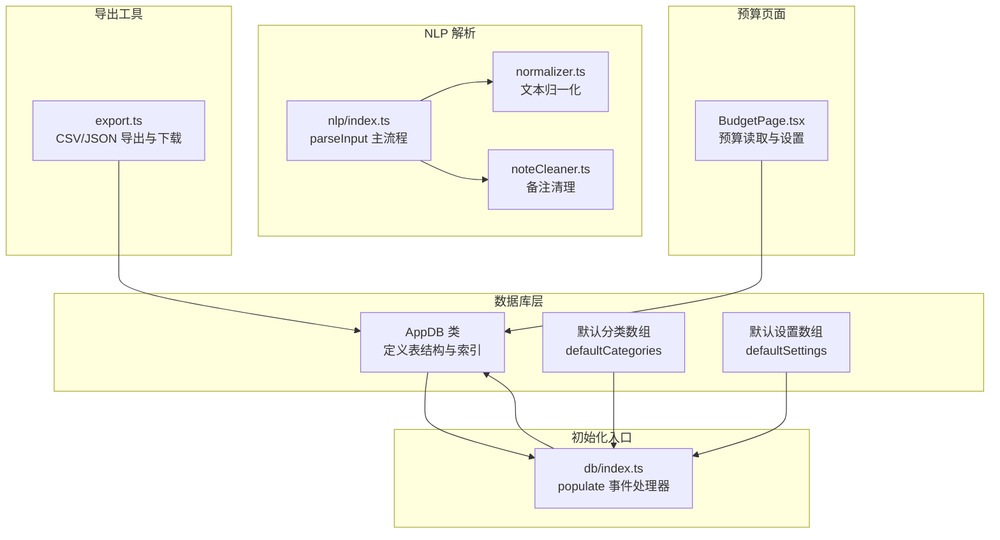
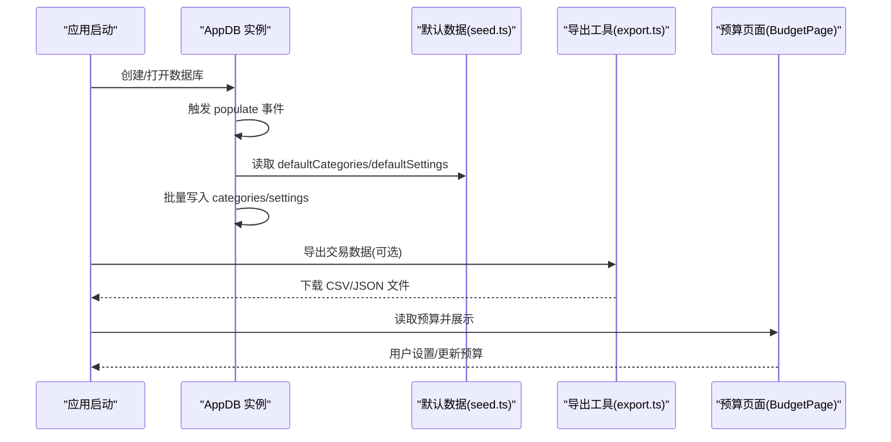
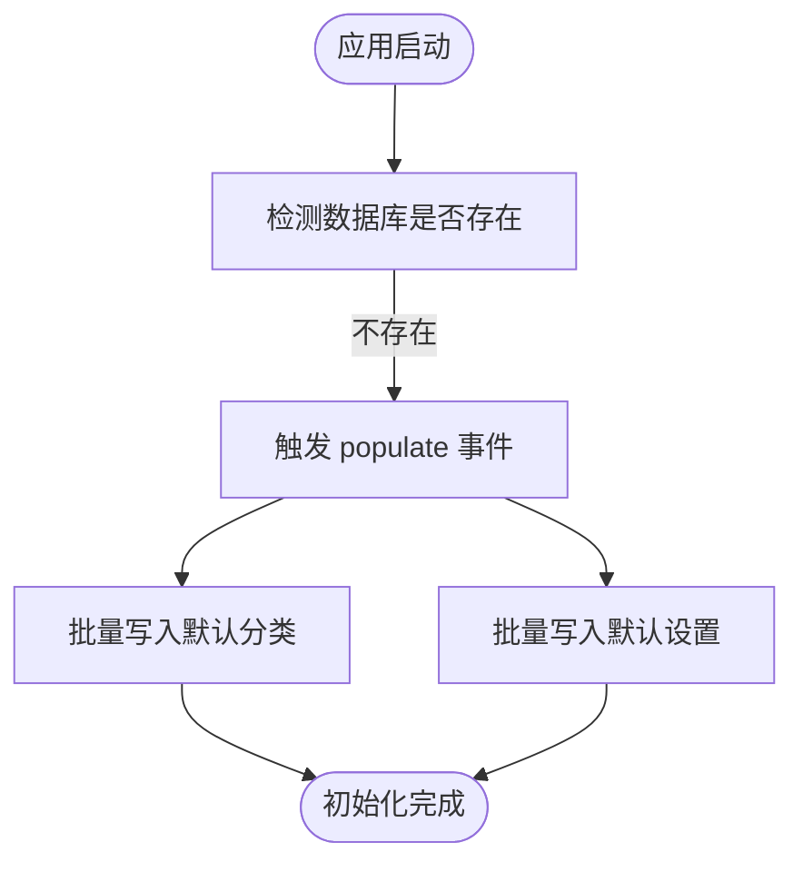
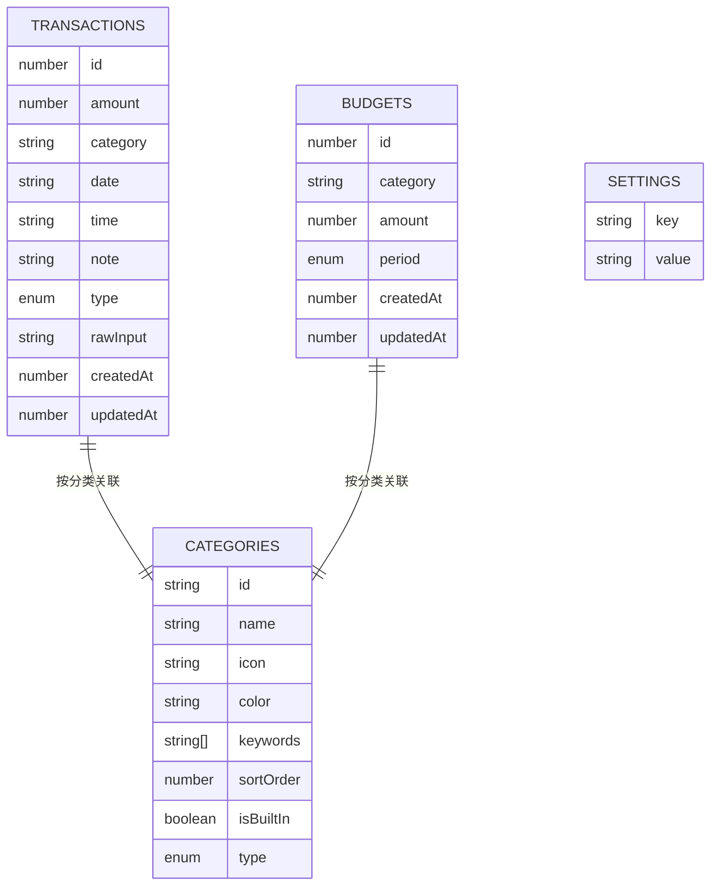
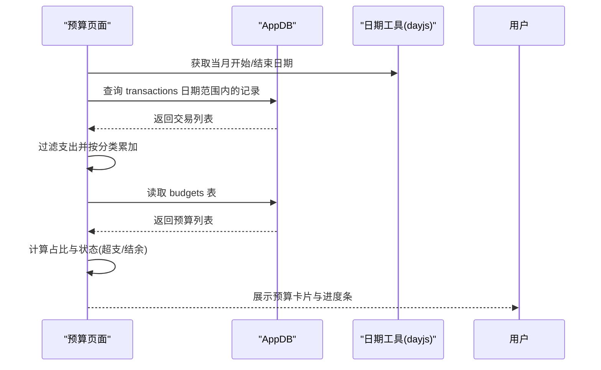
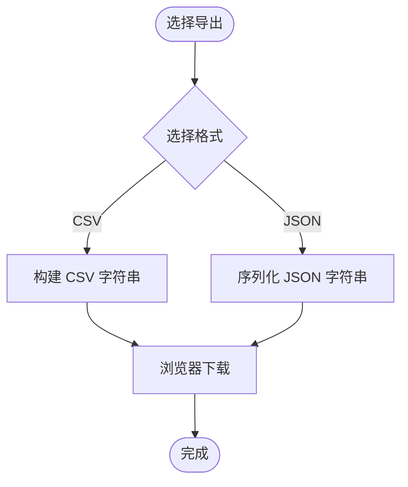
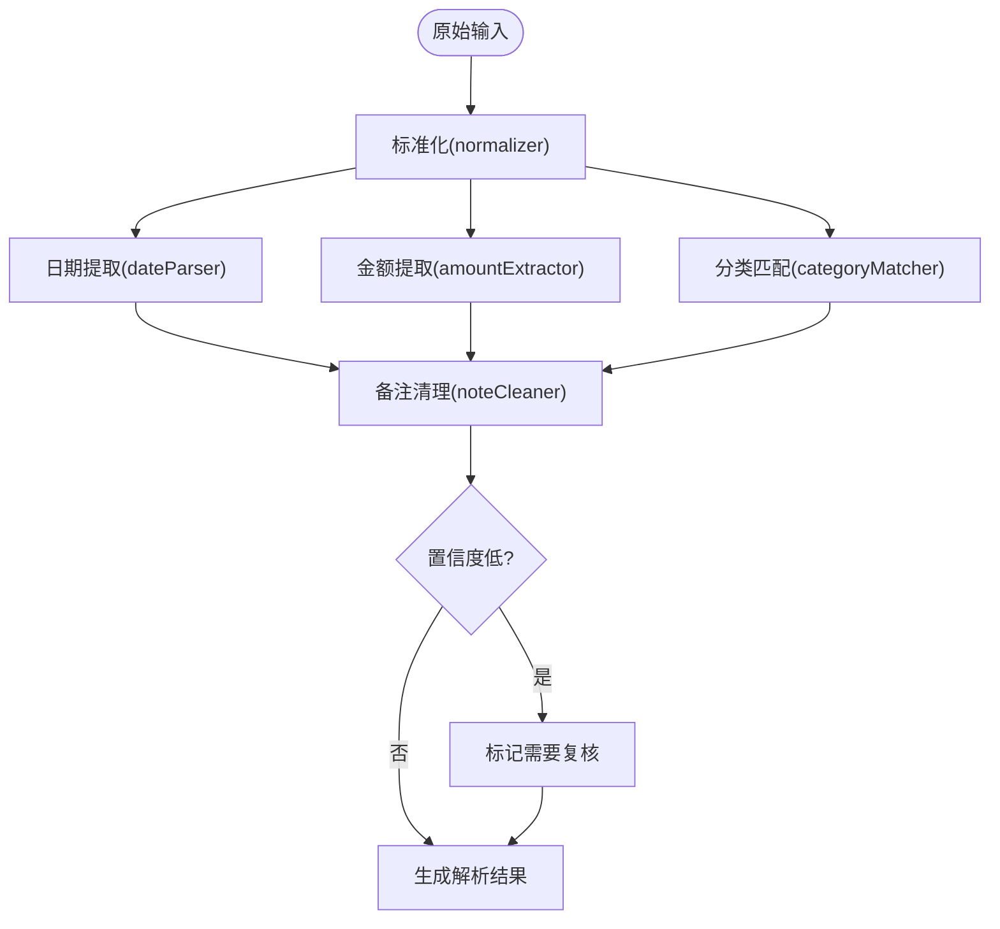
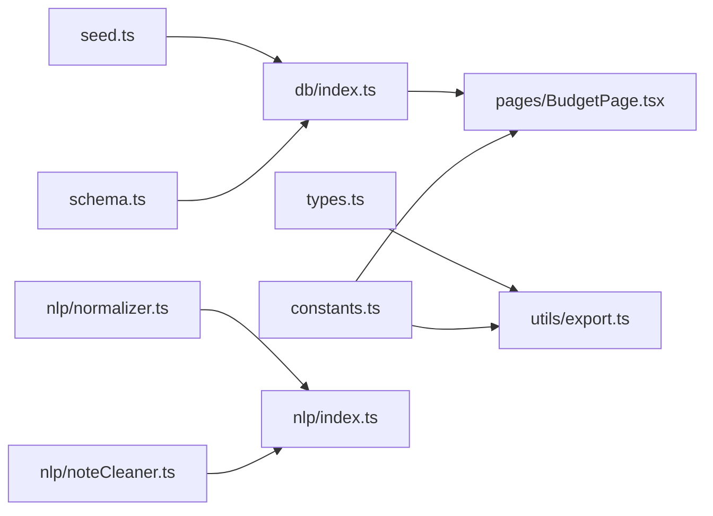

# 数据初始化

<cite>
**本文引用的文件**
- [src/db/seed.ts](file://src/db/seed.ts)
- [src/db/schema.ts](file://src/db/schema.ts)
- [src/db/index.ts](file://src/db/index.ts)
- [src/db/types.ts](file://src/db/types.ts)
- [src/utils/export.ts](file://src/utils/export.ts)
- [src/utils/constants.ts](file://src/utils/constants.ts)
- [src/nlp/index.ts](file://src/nlp/index.ts)
- [src/nlp/normalizer.ts](file://src/nlp/normalizer.ts)
- [src/nlp/noteCleaner.ts](file://src/nlp/noteCleaner.ts)
- [src/pages/BudgetPage.tsx](file://src/pages/BudgetPage.tsx)
</cite>

## 目录
1. [简介](#简介)
2. [项目结构](#项目结构)
3. [核心组件](#核心组件)
4. [架构总览](#架构总览)
5. [详细组件分析](#详细组件分析)
6. [依赖关系分析](#依赖关系分析)
7. [性能考量](#性能考量)
8. [故障排查指南](#故障排查指南)
9. [结论](#结论)
10. [附录](#附录)

## 简介
本文件系统性阐述 MoneyNote 的数据初始化与管理机制，覆盖种子数据生成策略、默认分类与系统设置的创建流程、预算初始化方式、数据导入导出能力、数据迁移与版本升级建议、数据质量与完整性保障方法，以及测试与开发调试中的数据准备与管理。目标是帮助开发者与维护者在不同阶段（首次安装、升级、迁移、测试）正确地准备与使用数据。

## 项目结构
围绕“数据初始化”主题，核心文件分布如下：
- 数据模型与表结构：db/schema.ts、db/types.ts
- 初始化入口与默认数据：db/index.ts、db/seed.ts
- 导出工具：utils/export.ts
- 分类常量映射：utils/constants.ts
- NLP 输入解析（影响数据质量与一致性）：nlp/index.ts、nlp/normalizer.ts、nlp/noteCleaner.ts
- 预算页面（预算初始化与展示）：pages/BudgetPage.tsx

图表来源
- [src/db/schema.ts:1-21](file://src/db/schema.ts#L1-L21)
- [src/db/seed.ts:1-93](file://src/db/seed.ts#L1-L93)
- [src/db/index.ts:1-14](file://src/db/index.ts#L1-L14)
- [src/utils/export.ts:1-28](file://src/utils/export.ts#L1-L28)
- [src/nlp/index.ts:1-62](file://src/nlp/index.ts#L1-L62)
- [src/nlp/normalizer.ts:1-35](file://src/nlp/normalizer.ts#L1-L35)
- [src/nlp/noteCleaner.ts:1-28](file://src/nlp/noteCleaner.ts#L1-L28)
- [src/pages/BudgetPage.tsx:1-168](file://src/pages/BudgetPage.tsx#L1-L168)

章节来源
- [src/db/schema.ts:1-21](file://src/db/schema.ts#L1-L21)
- [src/db/seed.ts:1-93](file://src/db/seed.ts#L1-L93)
- [src/db/index.ts:1-14](file://src/db/index.ts#L1-L14)
- [src/utils/export.ts:1-28](file://src/utils/export.ts#L1-L28)
- [src/nlp/index.ts:1-62](file://src/nlp/index.ts#L1-L62)
- [src/nlp/normalizer.ts:1-35](file://src/nlp/normalizer.ts#L1-L35)
- [src/nlp/noteCleaner.ts:1-28](file://src/nlp/noteCleaner.ts#L1-L28)
- [src/pages/BudgetPage.tsx:1-168](file://src/pages/BudgetPage.tsx#L1-L168)

## 核心组件
- 默认分类与设置
  - 默认分类来自 seed.ts 中的 defaultCategories，包含内置分类标识、图标、颜色、关键词、排序与收支类型等字段。
  - 默认设置来自 seed.ts 中的 defaultSettings，涵盖货币、主题、月预算、周起始日、引导完成标记等键值。
- 数据库模式与索引
  - schema.ts 定义了 AppDB 类，声明 transactions、categories、budgets、settings 表及其主键与复合索引。
- 初始化入口
  - index.ts 在数据库 populate 事件中批量写入默认分类与设置，确保首次打开即具备可用的基础数据。
- 导出工具
  - export.ts 提供 CSV/JSON 导出与浏览器下载能力，便于数据备份与迁移。
- NLP 解析
  - nlp/index.ts 将用户输入规范化、提取日期与金额、匹配分类、清理备注，并输出解析结果；其质量直接影响种子数据与后续统计的准确性。
- 预算页面
  - BudgetPage.tsx 读取预算并计算当月分类与总计支出，支持设置或更新预算；初始预算为零或未设置状态。

章节来源
- [src/db/seed.ts:1-93](file://src/db/seed.ts#L1-L93)
- [src/db/schema.ts:1-21](file://src/db/schema.ts#L1-L21)
- [src/db/index.ts:1-14](file://src/db/index.ts#L1-L14)
- [src/utils/export.ts:1-28](file://src/utils/export.ts#L1-L28)
- [src/nlp/index.ts:1-62](file://src/nlp/index.ts#L1-L62)
- [src/pages/BudgetPage.tsx:1-168](file://src/pages/BudgetPage.tsx#L1-L168)

## 架构总览
下图展示了“首次启动写入默认数据”的端到端流程，以及与导出、预算页面的关系：

图表来源
- [src/db/index.ts:1-14](file://src/db/index.ts#L1-L14)
- [src/db/seed.ts:1-93](file://src/db/seed.ts#L1-L93)
- [src/utils/export.ts:1-28](file://src/utils/export.ts#L1-L28)
- [src/pages/BudgetPage.tsx:1-168](file://src/pages/BudgetPage.tsx#L1-L168)

## 详细组件分析

### 默认分类与设置的生成策略
- 分类策略
  - 每个分类包含唯一 id、显示名称、图标、颜色、关键词列表、排序序号、是否内置、收支类型等字段。关键词用于 NLP 匹配，提升输入解析准确率。
  - 排序序号决定界面展示顺序，内置标志用于区分系统默认与用户自定义。
- 设置策略
  - 默认设置包含货币单位、主题、月预算、周起始日、引导完成标记等。这些键值在系统运行期被读取以控制界面与行为。
- 写入时机
  - 通过数据库的 populate 事件一次性批量写入，避免重复初始化与竞态。

图表来源
- [src/db/index.ts:1-14](file://src/db/index.ts#L1-L14)
- [src/db/seed.ts:1-93](file://src/db/seed.ts#L1-L93)

章节来源
- [src/db/seed.ts:1-93](file://src/db/seed.ts#L1-L93)
- [src/db/index.ts:1-14](file://src/db/index.ts#L1-L14)

### 数据模型与索引设计
- 表与字段
  - transactions：主键自增，包含金额、分类、日期、时间、类型、备注、原始输入及时间戳。
  - categories：主键为分类 id，包含排序字段。
  - budgets：主键自增，按分类+周期组合索引，周期目前限定 monthly。
  - settings：主键为键名，存储键值对。
- 索引与查询
  - transactions 对 type+date 建有复合索引，有利于按类型与日期范围检索。
  - categories 对 id 和 sortOrder 建有索引，便于快速定位与排序。
  - budgets 对 [category+period] 建有索引，便于按分类与周期查询预算。

图表来源
- [src/db/types.ts:1-60](file://src/db/types.ts#L1-L60)
- [src/db/schema.ts:1-21](file://src/db/schema.ts#L1-L21)

章节来源
- [src/db/types.ts:1-60](file://src/db/types.ts#L1-L60)
- [src/db/schema.ts:1-21](file://src/db/schema.ts#L1-L21)

### 预算初始化与展示
- 初始化状态
  - 预算默认未设置或为零，BudgetPage 会根据当前月份统计各类别与总计支出，并允许用户设置或更新预算。
- 计算逻辑
  - 使用 useLiveQuery 读取当月日期范围内的交易，过滤支出类型后按分类累加金额，同时汇总总计。
- 用户交互
  - 支持点击卡片打开预算设置对话框，输入金额后保存至 budgets 表。

图表来源
- [src/pages/BudgetPage.tsx:1-168](file://src/pages/BudgetPage.tsx#L1-L168)

章节来源
- [src/pages/BudgetPage.tsx:1-168](file://src/pages/BudgetPage.tsx#L1-L168)

### 数据导入导出机制
- 导出能力
  - export.ts 提供导出为 CSV 与 JSON 的函数，并封装浏览器下载逻辑。
  - CSV 导出包含日期、时间、类型、分类、金额、备注等列；JSON 导出为完整交易数组。
- 使用场景
  - 备份：将当前交易数据导出为 JSON 或 CSV，便于离线保存。
  - 迁移：在新设备或新版本中，结合导入流程进行数据迁移（本仓库未提供导入实现，需另行扩展）。
- 注意事项
  - 分类名称在导出时通过常量映射转换为中文名称，确保可读性。
  - 备注中的逗号会被替换为中文逗号，避免 CSV 列错位。

图表来源
- [src/utils/export.ts:1-28](file://src/utils/export.ts#L1-L28)
- [src/utils/constants.ts:1-19](file://src/utils/constants.ts#L1-L19)

章节来源
- [src/utils/export.ts:1-28](file://src/utils/export.ts#L1-L28)
- [src/utils/constants.ts:1-19](file://src/utils/constants.ts#L1-L19)

### 数据质量与完整性保障
- 输入解析质量
  - nlp/index.ts 将原始输入分阶段处理：标准化、日期提取、金额提取、分类匹配、备注清理，并根据置信度判断是否需要人工复核。
  - normalizer.ts 负责全角字符转换、货币单位统一、大小写处理与空白压缩，减少歧义。
  - noteCleaner.ts 从原始文本中剔除已解析的日期与金额片段，保留有效备注。
- 分类与设置约束
  - 分类 id 与设置键均为唯一标识，避免重复写入导致的冲突。
  - 初始化阶段采用批量写入，降低并发风险。
- 建议的完整性检查
  - 交易金额与类型一致性校验。
  - 日期格式与范围校验。
  - 分类 id 存在性校验。
  - 预算金额非负校验。

图表来源
- [src/nlp/index.ts:1-62](file://src/nlp/index.ts#L1-L62)
- [src/nlp/normalizer.ts:1-35](file://src/nlp/normalizer.ts#L1-L35)
- [src/nlp/noteCleaner.ts:1-28](file://src/nlp/noteCleaner.ts#L1-L28)

章节来源
- [src/nlp/index.ts:1-62](file://src/nlp/index.ts#L1-L62)
- [src/nlp/normalizer.ts:1-35](file://src/nlp/normalizer.ts#L1-L35)
- [src/nlp/noteCleaner.ts:1-28](file://src/nlp/noteCleaner.ts#L1-L28)

### 测试与开发调试数据管理
- 初始化即有数据
  - 首次启动自动写入默认分类与设置，便于测试与演示。
- 开发调试建议
  - 在本地开发时，可在浏览器开发者工具中清空 IndexedDB 或直接删除数据库，以重新触发 populate 初始化。
  - 通过导出功能定期备份测试数据，便于回放与回归。
  - 在 BudgetPage 中手动设置少量预算与交易，验证预算计算与展示逻辑。

章节来源
- [src/db/index.ts:1-14](file://src/db/index.ts#L1-L14)
- [src/utils/export.ts:1-28](file://src/utils/export.ts#L1-L28)
- [src/pages/BudgetPage.tsx:1-168](file://src/pages/BudgetPage.tsx#L1-L168)

### 自定义初始化脚本编写指导
- 目标
  - 在新环境或新版本中，快速注入种子数据（分类、设置、示例交易），并保持与现有数据不冲突。
- 步骤
  1) 读取默认分类与设置数组（来自 seed.ts）。
  2) 通过数据库事务批量写入 categories 与 settings。
  3) 可选：批量写入示例交易（注意日期、金额、分类、类型与备注的合法性）。
  4) 校验：检查关键键值是否存在、索引是否生效、预算与统计是否正确。
- 注意事项
  - 使用批量写入以减少事务开销。
  - 对于新增字段或表结构变更，需配合数据库版本升级策略（见下一节）。

章节来源
- [src/db/seed.ts:1-93](file://src/db/seed.ts#L1-L93)
- [src/db/index.ts:1-14](file://src/db/index.ts#L1-L14)

## 依赖关系分析
- 组件耦合
  - db/index.ts 依赖 db/seed.ts 提供的默认数据。
  - db/schema.ts 定义表结构，被 db/index.ts 使用。
  - utils/export.ts 依赖 db/types.ts 的类型定义与 utils/constants.ts 的分类映射。
  - nlp/index.ts 依赖 normalizer.ts 与 noteCleaner.ts 的子模块。
  - pages/BudgetPage.tsx 依赖 db/index.ts 的数据库实例与 utils/constants.ts 的分类映射。
- 外部依赖
  - Dexie 用于 IndexedDB 封装与版本管理。
  - dexie-react-hooks 提供 useLiveQuery 等 React Hooks（在 BudgetPage 中体现）。

图表来源
- [src/db/seed.ts:1-93](file://src/db/seed.ts#L1-L93)
- [src/db/index.ts:1-14](file://src/db/index.ts#L1-L14)
- [src/db/schema.ts:1-21](file://src/db/schema.ts#L1-L21)
- [src/db/types.ts:1-60](file://src/db/types.ts#L1-L60)
- [src/utils/export.ts:1-28](file://src/utils/export.ts#L1-L28)
- [src/utils/constants.ts:1-19](file://src/utils/constants.ts#L1-L19)
- [src/nlp/index.ts:1-62](file://src/nlp/index.ts#L1-L62)
- [src/nlp/normalizer.ts:1-35](file://src/nlp/normalizer.ts#L1-L35)
- [src/nlp/noteCleaner.ts:1-28](file://src/nlp/noteCleaner.ts#L1-L28)
- [src/pages/BudgetPage.tsx:1-168](file://src/pages/BudgetPage.tsx#L1-L168)

章节来源
- [src/db/seed.ts:1-93](file://src/db/seed.ts#L1-L93)
- [src/db/index.ts:1-14](file://src/db/index.ts#L1-L14)
- [src/db/schema.ts:1-21](file://src/db/schema.ts#L1-L21)
- [src/db/types.ts:1-60](file://src/db/types.ts#L1-L60)
- [src/utils/export.ts:1-28](file://src/utils/export.ts#L1-L28)
- [src/utils/constants.ts:1-19](file://src/utils/constants.ts#L1-L19)
- [src/nlp/index.ts:1-62](file://src/nlp/index.ts#L1-L62)
- [src/nlp/normalizer.ts:1-35](file://src/nlp/normalizer.ts#L1-L35)
- [src/nlp/noteCleaner.ts:1-28](file://src/nlp/noteCleaner.ts#L1-L28)
- [src/pages/BudgetPage.tsx:1-168](file://src/pages/BudgetPage.tsx#L1-L168)

## 性能考量
- 批量写入
  - 初始化阶段使用 bulkAdd 减少多次事务开销，提高首次启动速度。
- 索引优化
  - transactions 的复合索引支持高效的时间范围查询；categories 的排序索引支持稳定展示顺序。
- 导出性能
  - 导出为 JSON 适合大体量数据备份；CSV 更利于人工审阅与第三方工具处理。
- NLP 处理
  - 归一化与清理步骤在前端执行，建议对长文本进行分段处理或限制输入长度，避免阻塞主线程。

## 故障排查指南
- 初始化未生效
  - 确认数据库是否首次创建或版本升级触发了 populate 事件。
  - 检查 categories 与 settings 是否存在重复键值导致写入失败。
- 导出异常
  - 确认传入的交易数组非空且字段完整。
  - 检查备注中特殊字符是否被正确转义。
- 预算显示异常
  - 确认当月日期范围计算正确，且预算表与交易表数据一致。
  - 检查分类映射与预算类别是否匹配。

章节来源
- [src/db/index.ts:1-14](file://src/db/index.ts#L1-L14)
- [src/utils/export.ts:1-28](file://src/utils/export.ts#L1-L28)
- [src/pages/BudgetPage.tsx:1-168](file://src/pages/BudgetPage.tsx#L1-L168)

## 结论
MoneyNote 的数据初始化以“首次 populate 写入默认分类与设置”为核心，辅以完善的表结构与索引设计、可读性强的导出工具、以及基于 NLP 的输入解析流程。预算页面提供了直观的预算初始化与可视化展示。建议在版本升级与迁移时，遵循数据库版本管理与数据迁移策略，确保数据一致性与可追溯性。

## 附录

### 种子数据示例（字段说明）
- 默认分类（示例字段）
  - id：分类唯一标识（如餐饮、交通等）
  - name：显示名称
  - icon：图标
  - color：颜色
  - keywords：关键词列表（用于 NLP 匹配）
  - sortOrder：排序序号
  - isBuiltIn：是否内置
  - type：支出或收入
- 默认设置（示例键值）
  - currency：货币单位
  - theme：主题
  - monthlyBudget：月预算
  - firstDayOfWeek：周起始日
  - onboardingDone：引导完成标记

章节来源
- [src/db/seed.ts:1-93](file://src/db/seed.ts#L1-L93)