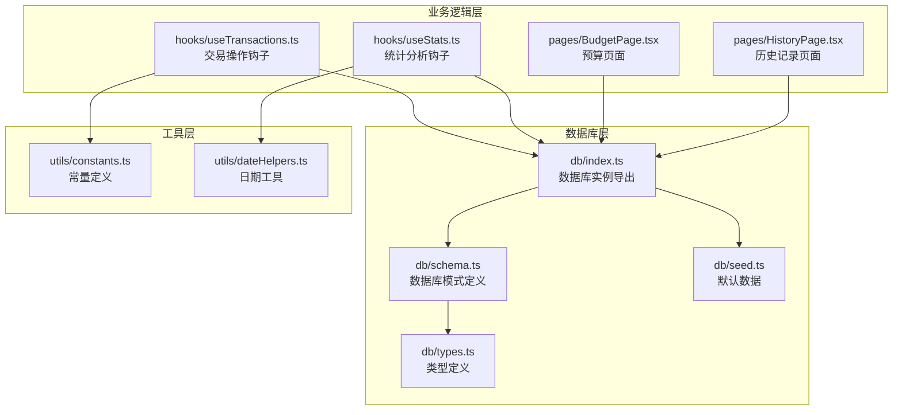
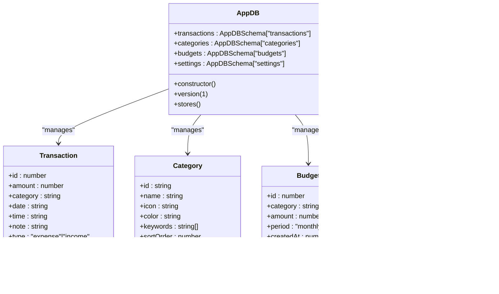
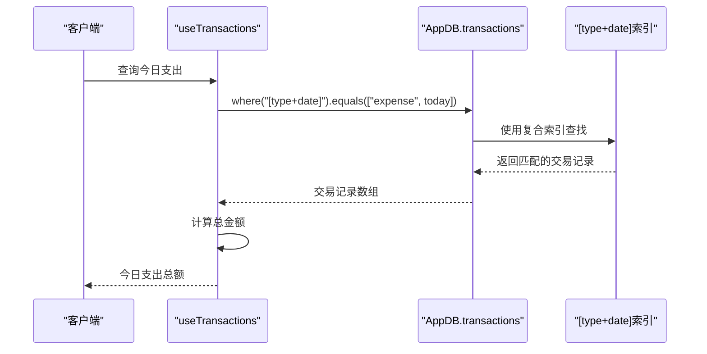
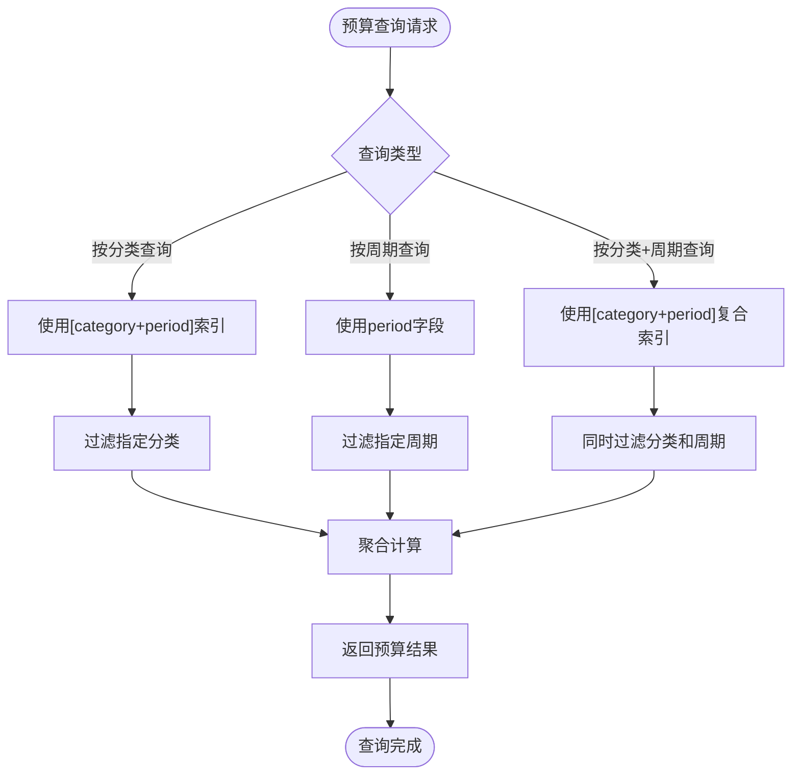
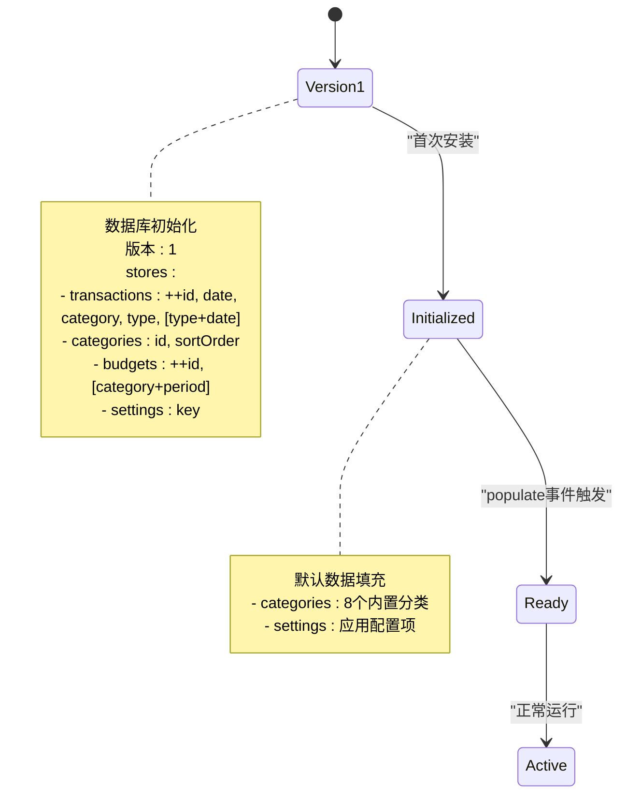
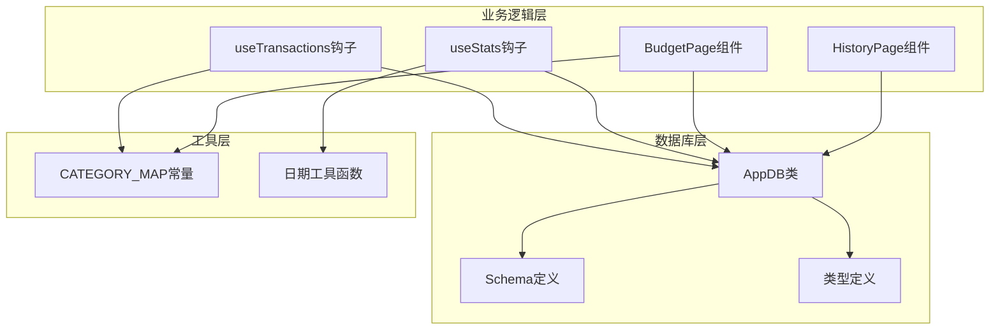
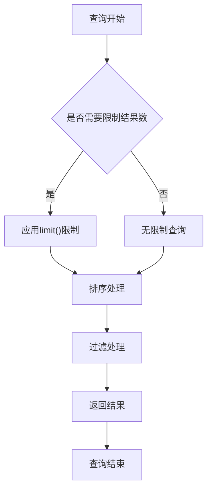

# 数据库模式

<cite>
**本文档引用的文件**
- [src/db/index.ts](file://src/db/index.ts)
- [src/db/schema.ts](file://src/db/schema.ts)
- [src/db/types.ts](file://src/db/types.ts)
- [src/db/seed.ts](file://src/db/seed.ts)
- [src/pages/BudgetPage.tsx](file://src/pages/BudgetPage.tsx)
- [src/pages/HistoryPage.tsx](file://src/pages/HistoryPage.tsx)
- [src/hooks/useTransactions.ts](file://src/hooks/useTransactions.ts)
- [src/hooks/useStats.ts](file://src/hooks/useStats.ts)
- [src/utils/constants.ts](file://src/utils/constants.ts)
- [src/utils/dateHelpers.ts](file://src/utils/dateHelpers.ts)
</cite>

## 目录
1. [简介](#简介)
2. [项目结构](#项目结构)
3. [核心组件](#核心组件)
4. [架构概览](#架构概览)
5. [详细组件分析](#详细组件分析)
6. [依赖关系分析](#依赖关系分析)
7. [性能考虑](#性能考虑)
8. [故障排除指南](#故障排除指南)
9. [结论](#结论)

## 简介

MoneyNote是一个基于React和TypeScript构建的个人财务管理应用，采用Dexie ORM作为本地数据库解决方案。该应用专注于提供直观的预算管理和交易记录功能，支持中文界面和本地化特性。

本项目的核心数据库架构围绕四个主要实体表构建：transactions（交易记录）、categories（分类）、budgets（预算）和settings（设置）。数据库采用IndexedDB作为底层存储，通过Dexie提供类型安全的ORM接口。

## 项目结构

项目采用模块化的数据库架构设计，所有数据库相关代码集中在`src/db/`目录下：



**图表来源**
- [src/db/index.ts:1-14](file://src/db/index.ts#L1-L14)
- [src/db/schema.ts:1-21](file://src/db/schema.ts#L1-L21)
- [src/db/types.ts:1-60](file://src/db/types.ts#L1-L60)

**章节来源**
- [src/db/index.ts:1-14](file://src/db/index.ts#L1-L14)
- [src/db/schema.ts:1-21](file://src/db/schema.ts#L1-L21)
- [src/db/types.ts:1-60](file://src/db/types.ts#L1-L60)

## 核心组件

### 数据库实例管理

应用程序通过单例模式管理数据库实例，确保全局唯一性和一致性：



**图表来源**
- [src/db/schema.ts:4-20](file://src/db/schema.ts#L4-L20)
- [src/db/types.ts:3-39](file://src/db/types.ts#L3-L39)

### 数据库初始化配置

数据库初始化采用Dexie的版本化迁移策略，当前版本为1：

**章节来源**
- [src/db/schema.ts:10-19](file://src/db/schema.ts#L10-L19)
- [src/db/index.ts:4-10](file://src/db/index.ts#L4-L10)

## 架构概览

### 数据库模式设计

系统采用四表关联的设计模式，每个表都有明确的职责分工：

```mermaid
erDiagram
TRANSACTIONS {
number id PK
number amount
string category
string date
string time
string note
string type
string rawInput
number createdAt
number updatedAt
}
CATEGORIES {
string id PK
string name
string icon
string color
string[] keywords
number sortOrder
boolean isBuiltIn
string type
}
BUDGETS {
number id PK
string category
number amount
string period
number createdAt
number updatedAt
}
SETTINGS {
string key PK
string|number|boolean value
}
TRANSACTIONS ||--|| CATEGORIES : "belongs_to"
BUDGETS ||--|| CATEGORIES : "applies_to"
```

**图表来源**
- [src/db/types.ts:3-39](file://src/db/types.ts#L3-L39)

### 主键设计策略

每个表都采用了最适合其业务场景的主键策略：

| 表名 | 主键类型 | 设计理由 | 使用场景 |
|------|----------|----------|----------|
| transactions | 自增主键 (`++id`) | 支持时间序列查询和快速排序 | 交易记录的插入、查询、删除 |
| categories | 字符串主键 (`id`) | 唯一标识分类，便于关联查询 | 分类信息的维护和展示 |
| budgets | 自增主键 (`++id`) | 支持多期预算管理 | 预算设置和更新 |
| settings | 字符串主键 (`key`) | 键值对配置，直接访问 | 应用设置管理 |

**章节来源**
- [src/db/types.ts:41-46](file://src/db/types.ts#L41-L46)

## 详细组件分析

### Transactions表分析

Transactions表是整个应用的核心表，负责存储所有的财务交易记录。

#### 复合索引策略

应用实现了两个关键的复合索引来优化查询性能：

1. **[type+date]复合索引**：用于快速查询特定类型和日期范围的交易
2. **date索引**：支持按日期排序和范围查询



**图表来源**
- [src/hooks/useTransactions.ts:42-46](file://src/hooks/useTransactions.ts#L42-L46)

#### 查询优化方案

应用在多个场景中实现了高效的查询优化：

**章节来源**
- [src/db/schema.ts:14](file://src/db/schema.ts#L14)
- [src/hooks/useTransactions.ts:42-46](file://src/hooks/useTransactions.ts#L42-L46)

### Budgets表分析

Budgets表专门用于管理用户的预算设置，支持按分类和时间段的预算控制。

#### 复合索引配置

**[category+period]复合索引**的设计针对预算查询进行了优化：



**图表来源**
- [src/db/schema.ts:16](file://src/db/schema.ts#L16)

**章节来源**
- [src/db/schema.ts:16](file://src/db/schema.ts#L16)

### 数据库版本管理

当前数据库版本为1，采用Dexie的版本化迁移机制：



**图表来源**
- [src/db/schema.ts:13-18](file://src/db/schema.ts#L13-L18)
- [src/db/index.ts:7-10](file://src/db/index.ts#L7-L10)

**章节来源**
- [src/db/schema.ts:13-18](file://src/db/schema.ts#L13-L18)
- [src/db/index.ts:7-10](file://src/db/index.ts#L7-L10)

## 依赖关系分析

### 组件耦合分析

应用的数据库层与业务逻辑层之间建立了清晰的依赖关系：



**图表来源**
- [src/db/schema.ts:4-8](file://src/db/schema.ts#L4-L8)
- [src/hooks/useTransactions.ts:1-67](file://src/hooks/useTransactions.ts#L1-L67)
- [src/hooks/useStats.ts:1-79](file://src/hooks/useStats.ts#L1-L79)

### 外部依赖关系

应用依赖于以下关键外部库：

| 依赖库 | 版本 | 用途 | 关键特性 |
|--------|------|------|----------|
| dexie | 最新版本 | 数据库ORM | 类型安全、异步查询、版本迁移 |
| dexie-react-hooks | 最新版本 | React集成 | 实时数据绑定、自动重渲染 |
| dayjs | 最新版本 | 日期处理 | 轻量级、链式API、插件系统 |

**章节来源**
- [src/hooks/useTransactions.ts:1-67](file://src/hooks/useTransactions.ts#L1-L67)
- [src/hooks/useStats.ts:1-79](file://src/hooks/useStats.ts#L1-L79)

## 性能考虑

### 查询性能优化

应用在多个层面实现了查询性能优化：

#### 索引使用策略

1. **Transactions表的复合索引**：
   - `[type+date]`：优化按类型和日期的组合查询
   - `date`：支持按日期排序和范围查询

2. **Budgets表的复合索引**：
   - `[category+period]`：优化按分类和周期的预算查询

#### 内存管理

应用采用分页和限制策略来控制内存使用：



**图表来源**
- [src/hooks/useTransactions.ts:8-10](file://src/hooks/useTransactions.ts#L8-L10)

### 并发控制机制

Dexie提供了内置的并发控制机制：

1. **事务隔离**：每个数据库操作都在独立的事务中执行
2. **读写分离**：读取操作不会阻塞写入操作
3. **冲突检测**：自动处理并发访问时的数据一致性

### 监控指标建议

为了更好地监控数据库性能，建议关注以下指标：

| 指标类型 | 监控内容 | 建议阈值 |
|----------|----------|----------|
| 查询响应时间 | 单次查询耗时 | <100ms |
| 内存使用率 | IndexedDB内存占用 | <50MB |
| 索引命中率 | 复合索引使用频率 | >80% |
| 数据库大小 | 存储空间使用 | <100MB |
| 连接数 | 并发连接数量 | <10 |

**章节来源**
- [src/hooks/useTransactions.ts:8-10](file://src/hooks/useTransactions.ts#L8-L10)

## 故障排除指南

### 常见问题诊断

#### 数据库初始化失败

**症状**：应用无法启动或显示空白页面

**可能原因**：
1. IndexedDB权限被拒绝
2. 浏览器不支持IndexedDB
3. 数据库版本不兼容

**解决步骤**：
1. 检查浏览器控制台错误信息
2. 验证IndexedDB功能是否可用
3. 清除浏览器缓存和IndexedDB数据

#### 查询性能问题

**症状**：页面加载缓慢或查询响应超时

**诊断方法**：
1. 检查复合索引是否正确使用
2. 分析查询语句的复杂度
3. 监控数据库大小增长情况

**优化建议**：
1. 使用适当的索引覆盖查询条件
2. 实施分页和结果限制
3. 定期清理历史数据

#### 数据一致性问题

**症状**：数据显示不一致或重复

**排查步骤**：
1. 检查主键约束是否正确
2. 验证外键关联关系
3. 确认事务提交状态

**预防措施**：
1. 使用Dexie的事务API
2. 实施数据验证规则
3. 定期进行数据完整性检查

**章节来源**
- [src/db/schema.ts:13-18](file://src/db/schema.ts#L13-L18)
- [src/db/index.ts:7-10](file://src/db/index.ts#L7-L10)

## 结论

MoneyNote的数据库架构展现了现代Web应用的最佳实践，通过精心设计的表结构、索引策略和查询优化，为用户提供流畅的财务管理体验。

### 架构优势

1. **类型安全**：完整的TypeScript类型定义确保编译时错误检测
2. **性能优化**：合理的索引设计和查询策略提升用户体验
3. **扩展性**：模块化的数据库设计便于功能扩展
4. **可靠性**：Dexie提供的事务和并发控制机制保障数据一致性

### 发展建议

随着应用功能的扩展，建议考虑以下改进方向：

1. **版本迁移策略**：为未来的数据库结构变更制定清晰的迁移计划
2. **备份机制**：实现数据导出和导入功能
3. **监控增强**：添加更详细的性能监控和错误追踪
4. **测试覆盖**：建立全面的数据库单元测试和集成测试

通过持续的优化和改进，MoneyNote的数据库架构将继续为用户提供可靠、高效、易用的财务管理服务。