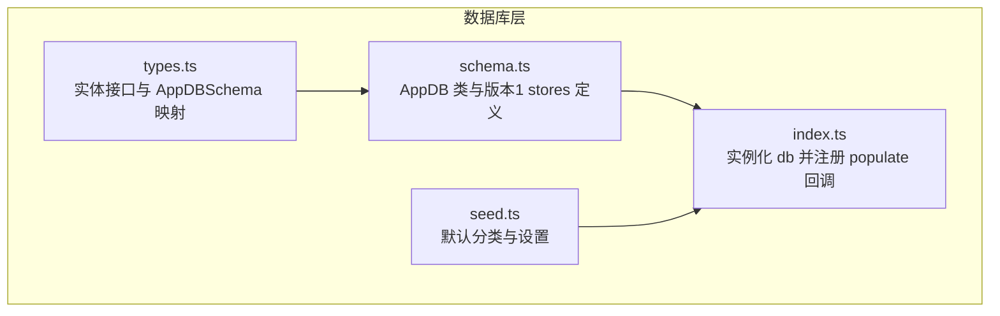
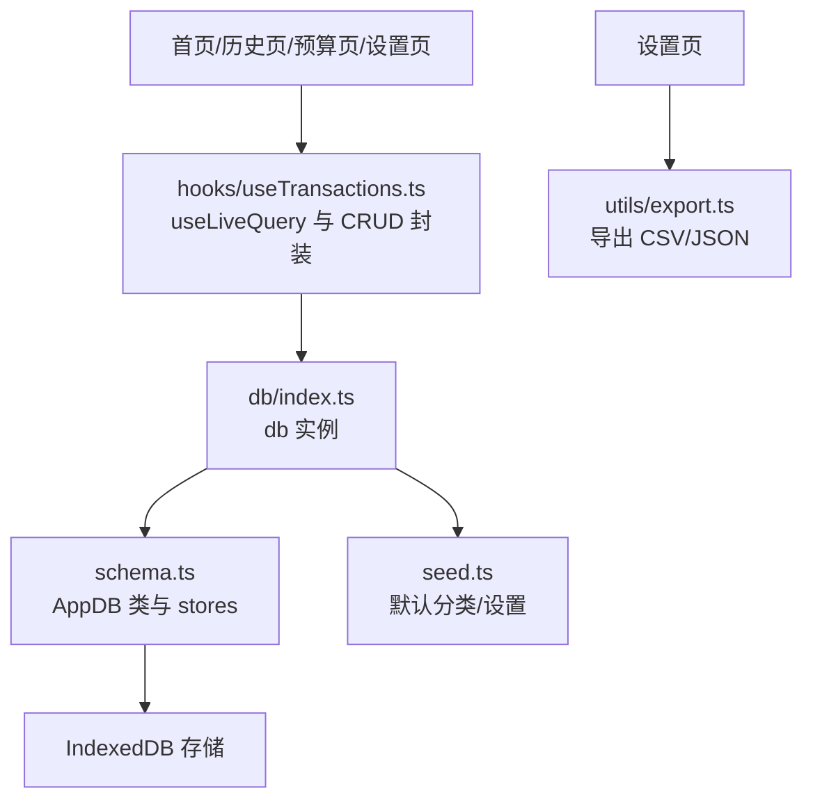
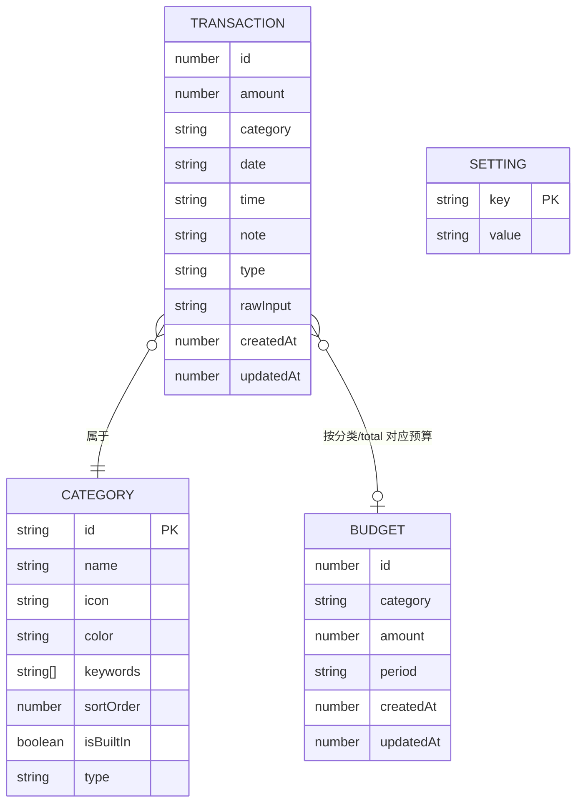
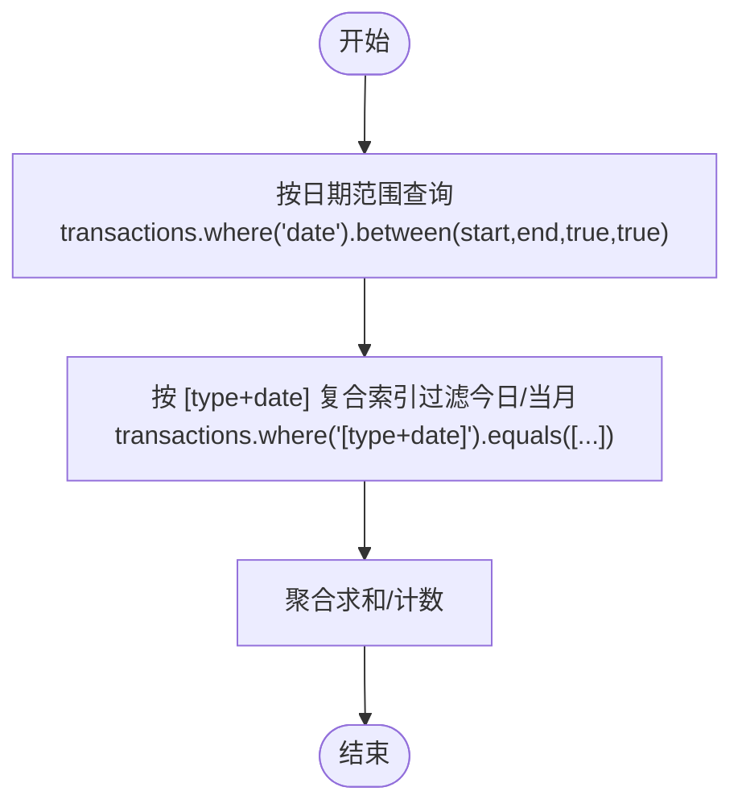
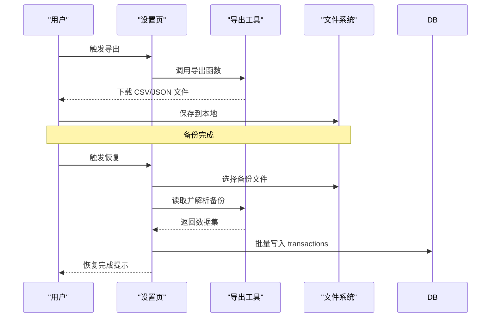
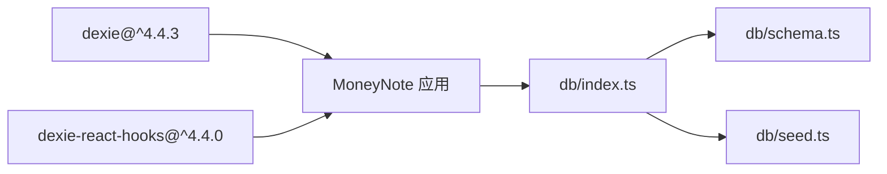
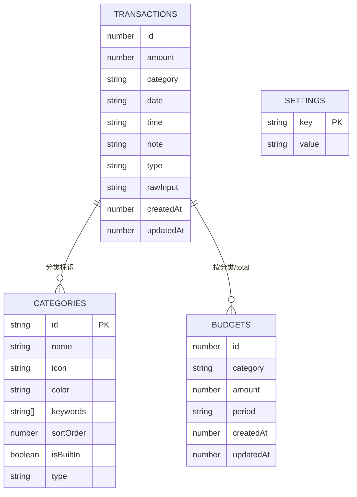

# 数据库设计

<cite>
**本文引用的文件**
- [src/db/schema.ts](file://src/db/schema.ts)
- [src/db/types.ts](file://src/db/types.ts)
- [src/db/index.ts](file://src/db/index.ts)
- [src/db/seed.ts](file://src/db/seed.ts)
- [src/hooks/useTransactions.ts](file://src/hooks/useTransactions.ts)
- [src/pages/BudgetPage.tsx](file://src/pages/BudgetPage.tsx)
- [src/pages/SettingsPage.tsx](file://src/pages/SettingsPage.tsx)
- [src/utils/constants.ts](file://src/utils/constants.ts)
- [src/utils/export.ts](file://src/utils/export.ts)
</cite>

## 目录
1. [简介](#简介)
2. [项目结构](#项目结构)
3. [核心组件](#核心组件)
4. [架构总览](#架构总览)
5. [详细组件分析](#详细组件分析)
6. [依赖分析](#依赖分析)
7. [性能考虑](#性能考虑)
8. [故障排查指南](#故障排查指南)
9. [结论](#结论)
10. [附录](#附录)

## 简介
本文件系统性梳理 MoneyNote 的数据库设计与实现，围绕 IndexedDB 与 Dexie ORM 的配置、数据模型、索引策略、查询优化、数据完整性、迁移与版本管理、备份与恢复机制展开，并提供实体关系图与模式图，帮助开发者与使用者理解本地存储的优势、限制与最佳实践。

## 项目结构
数据库相关代码集中在 src/db 目录，采用“类 + 类型 + 初始化 + 种子数据”的分层组织方式：
- schema.ts：定义 AppDB 类（继承 Dexie），声明表结构与初始版本的 stores 声明
- types.ts：定义 Transaction、Category、Budget、Setting 等实体接口及 AppDBSchema 映射
- index.ts：实例化数据库，注册首次填充回调，导出 db 实例与类型
- seed.ts：内置默认分类与设置项，用于首次打开数据库时写入

图表来源
- [src/db/schema.ts:1-21](file://src/db/schema.ts#L1-L21)
- [src/db/types.ts:1-60](file://src/db/types.ts#L1-L60)
- [src/db/index.ts:1-14](file://src/db/index.ts#L1-L14)
- [src/db/seed.ts:1-93](file://src/db/seed.ts#L1-L93)

章节来源
- [src/db/schema.ts:1-21](file://src/db/schema.ts#L1-L21)
- [src/db/types.ts:1-60](file://src/db/types.ts#L1-L60)
- [src/db/index.ts:1-14](file://src/db/index.ts#L1-L14)
- [src/db/seed.ts:1-93](file://src/db/seed.ts#L1-L93)

## 核心组件
- 数据库类 AppDB：继承 Dexie，定义数据库名与初始版本 stores
- 实体接口：Transaction、Category、Budget、Setting
- 数据库实例 db：在首次打开时写入默认分类与设置
- 查询与状态绑定：通过 dexie-react-hooks 在页面中实时查询与渲染

章节来源
- [src/db/schema.ts:4-20](file://src/db/schema.ts#L4-L20)
- [src/db/types.ts:3-39](file://src/db/types.ts#L3-L39)
- [src/db/index.ts:4-10](file://src/db/index.ts#L4-L10)
- [src/hooks/useTransactions.ts:1-66](file://src/hooks/useTransactions.ts#L1-L66)

## 架构总览
下图展示数据库层与应用层的交互关系：页面组件通过 hooks 访问 db 表，实现增删改查与聚合计算；数据库初始化时写入种子数据。

图表来源
- [src/hooks/useTransactions.ts:1-66](file://src/hooks/useTransactions.ts#L1-L66)
- [src/db/index.ts:4-10](file://src/db/index.ts#L4-L10)
- [src/db/schema.ts:10-19](file://src/db/schema.ts#L10-L19)
- [src/db/seed.ts:1-93](file://src/db/seed.ts#L1-L93)
- [src/pages/SettingsPage.tsx:11-39](file://src/pages/SettingsPage.tsx#L11-L39)
- [src/utils/export.ts:1-27](file://src/utils/export.ts#L1-L27)

## 详细组件分析

### 数据库类与版本管理
- 数据库名：MoneyNoteDB
- 初始版本：version(1)
- stores 声明：
  - transactions：自增主键 id，索引 date、category、type；复合索引 [type+date]
  - categories：主键 id，索引 sortOrder
  - budgets：自增主键 id，复合索引 [category+period]，period 当前为 monthly
  - settings：主键 key

该版本声明构成了后续查询优化与迁移的基础。

章节来源
- [src/db/schema.ts:10-19](file://src/db/schema.ts#L10-L19)

### 数据模型与实体关系
- Transaction：金额、分类、日期、类型（收入/支出）、备注、原始输入、时间戳
- Category：分类标识、名称、图标、颜色、关键词、排序、是否内置、类型
- Budget：分类或 total，预算金额，周期（当前为 monthly），时间戳
- Setting：键值对设置项

实体关系图如下：

图表来源
- [src/db/types.ts:3-39](file://src/db/types.ts#L3-L39)

章节来源
- [src/db/types.ts:3-39](file://src/db/types.ts#L3-L39)

### 索引策略与查询优化
- 交易查询
  - 最近记录：按 date 降序取前 10 条
  - 日期范围：基于 date 字段 between 查询
  - 今日/当月汇总：利用 [type+date] 复合索引进行高效过滤
- 预算查询
  - 按 [category+period] 复合索引查询对应预算
- 分类查询
  - 使用 id 主键与 sortOrder 辅助排序

图表来源
- [src/hooks/useTransactions.ts:8-19](file://src/hooks/useTransactions.ts#L8-L19)
- [src/hooks/useTransactions.ts:42-46](file://src/hooks/useTransactions.ts#L42-L46)
- [src/pages/BudgetPage.tsx:21-31](file://src/pages/BudgetPage.tsx#L21-L31)

章节来源
- [src/hooks/useTransactions.ts:8-19](file://src/hooks/useTransactions.ts#L8-L19)
- [src/hooks/useTransactions.ts:42-46](file://src/hooks/useTransactions.ts#L42-L46)
- [src/pages/BudgetPage.tsx:21-31](file://src/pages/BudgetPage.tsx#L21-L31)

### 数据完整性与一致性
- 写入时统一注入 createdAt/updatedAt 时间戳，确保审计与排序需求
- 交易与预算通过字符串分类标识关联，避免外键约束但保持逻辑一致
- 预算周期 period 当前限定 monthly，便于查询与展示

章节来源
- [src/hooks/useTransactions.ts:22-29](file://src/hooks/useTransactions.ts#L22-L29)
- [src/pages/BudgetPage.tsx:39-58](file://src/pages/BudgetPage.tsx#L39-L58)

### 迁移策略与版本管理
- 当前版本为 1，未定义后续版本的 stores 升级逻辑
- 建议在新增字段或索引时，添加新的 this.version(n) 块并在 stores 中扩展
- 迁移时注意：
  - 保留现有主键与复合索引策略
  - 对于新增字段，提供默认值或回退逻辑
  - 通过批量升级任务处理历史数据

章节来源
- [src/db/schema.ts:13-18](file://src/db/schema.ts#L13-L18)

### 备份与恢复机制
- 导出功能：支持导出为 CSV 与 JSON，便于离线备份
- 清除数据：一键清空交易与预算，谨慎使用
- 恢复流程建议：
  - 从 JSON 文件导入时，逐条写入 transactions 表
  - 导入后重建必要的索引与视图（如需要）

图表来源
- [src/pages/SettingsPage.tsx:14-39](file://src/pages/SettingsPage.tsx#L14-L39)
- [src/utils/export.ts:4-17](file://src/utils/export.ts#L4-L17)

章节来源
- [src/pages/SettingsPage.tsx:14-39](file://src/pages/SettingsPage.tsx#L14-L39)
- [src/utils/export.ts:4-17](file://src/utils/export.ts#L4-L17)

### 数据库初始化与默认数据
- 首次打开数据库时，触发 populate 事件，批量写入默认分类与设置
- 默认分类覆盖常用场景，内置关键词便于 NLP 匹配
- 默认设置包括货币、主题、首日等基础配置

章节来源
- [src/db/index.ts:7-10](file://src/db/index.ts#L7-L10)
- [src/db/seed.ts:3-84](file://src/db/seed.ts#L3-L84)
- [src/db/seed.ts:86-92](file://src/db/seed.ts#L86-L92)

### 页面与数据库交互示例
- 预算页：按月统计各分类支出，结合 budgets 表进行对比展示
- 设置页：导出交易数据为 CSV/JSON，支持清除所有数据
- 交易钩子：提供最近交易、日期范围查询、增删改、今日/当月汇总

章节来源
- [src/pages/BudgetPage.tsx:19-31](file://src/pages/BudgetPage.tsx#L19-L31)
- [src/pages/SettingsPage.tsx:11-39](file://src/pages/SettingsPage.tsx#L11-L39)
- [src/hooks/useTransactions.ts:6-66](file://src/hooks/useTransactions.ts#L6-L66)

## 依赖分析
- Dexie：提供 IndexedDB 的轻量 ORM 封装
- dexie-react-hooks：提供 useLiveQuery 等 React Hooks，简化响应式查询
- 应用层依赖 db/index.ts 导出的 db 实例与类型

图表来源
- [src/db/index.ts:1-2](file://src/db/index.ts#L1-L2)
- [src/db/schema.ts:1](file://src/db/schema.ts#L1)

章节来源
- [src/db/index.ts:1-2](file://src/db/index.ts#L1-L2)
- [src/db/schema.ts:1](file://src/db/schema.ts#L1)

## 性能考虑
- 索引命中优先：尽量使用已建立的索引字段进行查询（如 date、[type+date]、[category+period]）
- 复合索引设计：[type+date] 适合“按类型+日期”快速过滤；[category+period] 适合预算查询
- 聚合计算：在应用层进行 reduce 聚合，避免复杂索引带来的维护成本
- 批量写入：populate 时使用 bulkAdd 提高初始化效率
- 查询粒度：避免全表扫描，优先使用 between、equals 等精确条件

章节来源
- [src/db/schema.ts:14-17](file://src/db/schema.ts#L14-L17)
- [src/hooks/useTransactions.ts:8-19](file://src/hooks/useTransactions.ts#L8-L19)
- [src/pages/BudgetPage.tsx:21-31](file://src/pages/BudgetPage.tsx#L21-L31)

## 故障排查指南
- 数据为空或未显示
  - 检查是否已触发 populate 并写入默认数据
  - 确认浏览器 IndexedDB 是否被禁用或清理
- 查询异常或性能差
  - 确认查询条件是否命中索引（如使用 between/equals）
  - 避免在大结果集上做昂贵的客户端聚合
- 导出/导入失败
  - 确认导出格式与文件大小限制
  - 导入时校验数据结构与字段类型
- 清除数据后异常
  - 确认是否同时清空了相关表（transactions、budgets 等）

章节来源
- [src/db/index.ts:7-10](file://src/db/index.ts#L7-L10)
- [src/pages/SettingsPage.tsx:34-39](file://src/pages/SettingsPage.tsx#L34-L39)

## 结论
MoneyNote 的数据库设计以 Dexie 为核心，采用简洁的实体模型与合理的索引策略，满足本地记账场景下的高频查询与聚合需求。通过种子数据与导出/导入能力，兼顾易用性与可移植性。未来可在版本管理中逐步完善迁移策略，并在需要时引入更复杂的索引或视图以提升查询性能。

## 附录

### 数据库模式图（版本 1）

图表来源
- [src/db/types.ts:3-39](file://src/db/types.ts#L3-L39)
- [src/db/schema.ts:13-18](file://src/db/schema.ts#L13-L18)

### 实体关系图（ERD）

图表来源
- [src/db/types.ts:3-39](file://src/db/types.ts#L3-L39)

### 本地存储优势、限制与最佳实践
- 优势
  - 无需服务器，离线可用；数据本地可控
  - 查询简单，索引命中快；批量写入高效
- 限制
  - 浏览器兼容与存储配额；迁移需谨慎
  - 缺少 ACID 事务与外键约束
- 最佳实践
  - 明确索引策略，避免全表扫描
  - 统一时间戳字段，便于审计与排序
  - 使用批量写入与增量迁移
  - 提供导出/导入与数据清理能力

章节来源
- [src/db/schema.ts:13-18](file://src/db/schema.ts#L13-L18)
- [src/db/index.ts:7-10](file://src/db/index.ts#L7-L10)
- [src/pages/SettingsPage.tsx:14-39](file://src/pages/SettingsPage.tsx#L14-L39)