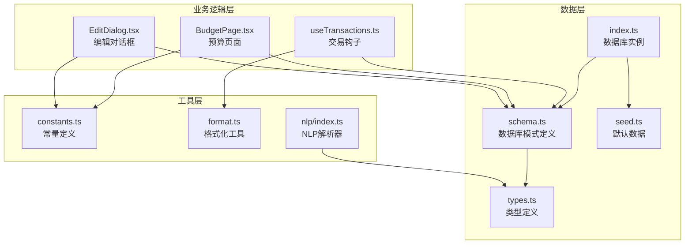
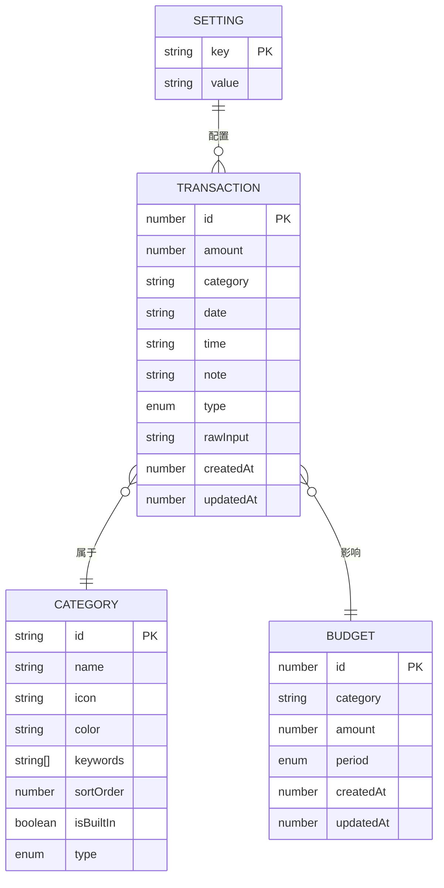
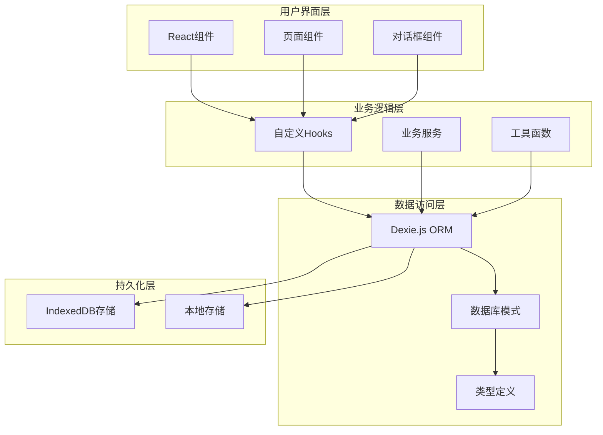
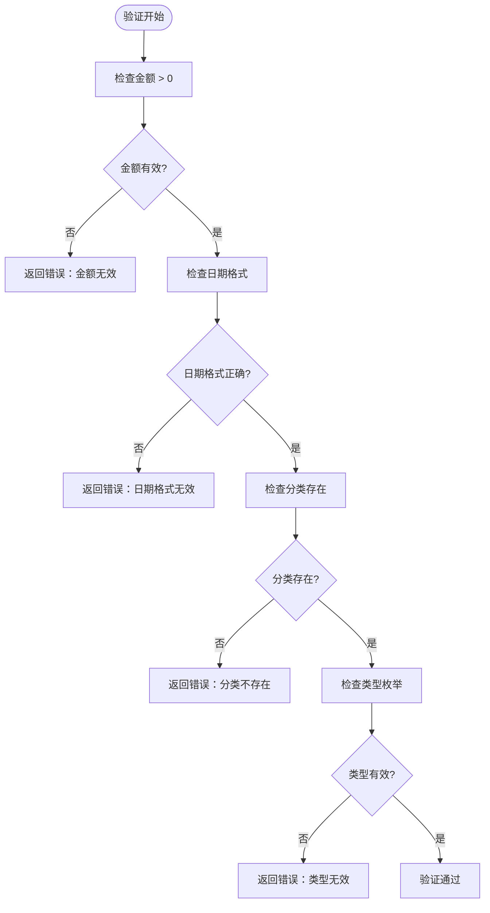
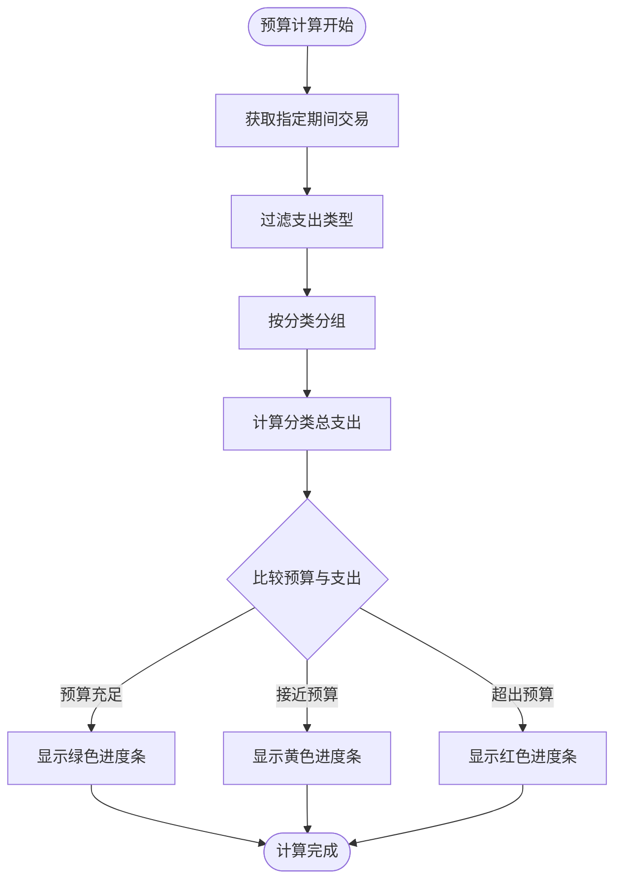
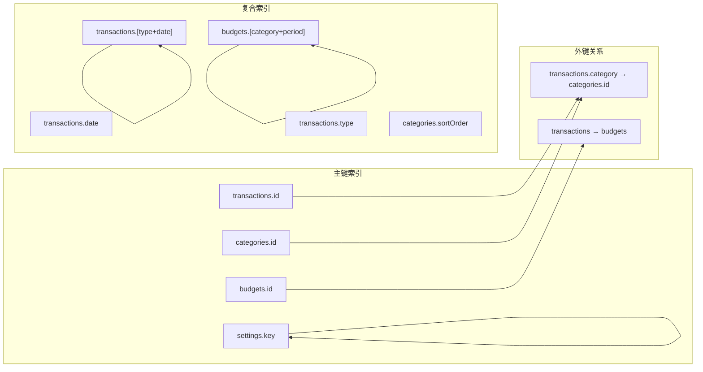
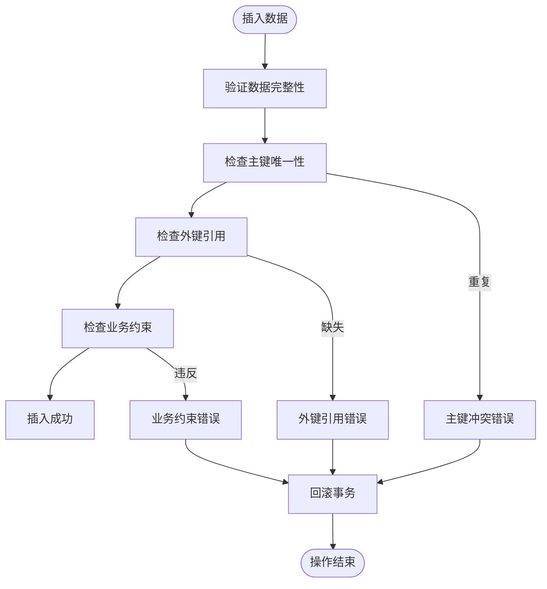

# 数据模型

<cite>
**本文档引用的文件**
- [schema.ts](file://src/db/schema.ts)
- [types.ts](file://src/db/types.ts)
- [index.ts](file://src/db/index.ts)
- [seed.ts](file://src/db/seed.ts)
- [useTransactions.ts](file://src/hooks/useTransactions.ts)
- [BudgetPage.tsx](file://src/pages/BudgetPage.tsx)
- [EditDialog.tsx](file://src/components/transaction/EditDialog.tsx)
- [constants.ts](file://src/utils/constants.ts)
- [format.ts](file://src/utils/format.ts)
- [index.ts](file://src/nlp/index.ts)
</cite>

## 目录
1. [简介](#简介)
2. [项目结构](#项目结构)
3. [核心实体](#核心实体)
4. [架构概览](#架构概览)
5. [详细实体分析](#详细实体分析)
6. [依赖关系分析](#依赖关系分析)
7. [性能考量](#性能考量)
8. [故障排除指南](#故障排除指南)
9. [结论](#结论)

## 简介

MoneyNote是一个基于Dexie.js的本地化个人财务管理应用，采用SQLite风格的数据库设计。该应用专注于移动端体验，提供简洁直观的记账功能，支持自然语言输入解析、预算管理和统计分析。

本数据模型文档深入解释了Transaction（交易）、Category（分类）、Budget（预算）、Settings（设置）等核心实体的数据结构、字段定义、业务规则和实体关系。文档还包含了数据验证规则、默认值设置、字段长度限制以及实际的数据示例和常见使用场景。

## 项目结构

MoneyNote的数据层采用模块化设计，主要包含以下组件：

**图表来源**
- [schema.ts:1-21](file://src/db/schema.ts#L1-L21)
- [types.ts:1-60](file://src/db/types.ts#L1-L60)
- [index.ts:1-14](file://src/db/index.ts#L1-L14)

**章节来源**
- [schema.ts:1-21](file://src/db/schema.ts#L1-L21)
- [types.ts:1-60](file://src/db/types.ts#L1-L60)
- [index.ts:1-14](file://src/db/index.ts#L1-L14)

## 核心实体

MoneyNote应用的核心数据模型由四个主要实体组成，每个实体都有明确的职责和约束条件：

### 实体关系图

**图表来源**
- [types.ts:3-39](file://src/db/types.ts#L3-L39)

### 设计原则

1. **轻量化设计**：所有实体都设计为轻量级，避免不必要的复杂性
2. **本地存储优先**：使用Dexie.js进行本地存储，确保离线可用性
3. **类型安全**：通过TypeScript接口确保编译时类型检查
4. **可扩展性**：预留扩展字段和灵活的查询机制
5. **用户体验**：简化字段输入，提供智能默认值

## 架构概览

MoneyNote的数据架构采用分层设计，确保数据访问的清晰性和可维护性：

**图表来源**
- [index.ts:1-14](file://src/db/index.ts#L1-L14)
- [schema.ts:4-20](file://src/db/schema.ts#L4-L20)

## 详细实体分析

### Transaction（交易）实体

Transaction实体是MoneyNote的核心数据模型，用于记录所有的财务交易信息。

#### 字段定义

| 字段名 | 类型 | 必填 | 默认值 | 约束 | 描述 |
|--------|------|------|--------|------|------|
| id | number | 否 | 自增 | 主键 | 交易记录唯一标识符 |
| amount | number | 是 | - | > 0 | 交易金额，单位为分 |
| category | string | 是 | - | 外键 | 分类ID，关联Category表 |
| date | string | 是 | 当前日期 | YYYY-MM-DD格式 | 交易发生日期 |
| time | string | 否 | - | HH:mm格式 | 交易发生时间 |
| note | string | 否 | 空字符串 | 最大长度255字符 | 交易备注说明 |
| type | 'expense' \| 'income' | 是 | - | 枚举值 | 交易类型：支出或收入 |
| rawInput | string | 否 | - | 最大长度1000字符 | 原始输入文本 |
| createdAt | number | 是 | 当前时间戳 | 时间戳 | 记录创建时间 |
| updatedAt | number | 是 | 当前时间戳 | 时间戳 | 记录最后更新时间 |

#### 业务规则

1. **金额验证**：amount必须大于0，支持小数点后两位精度
2. **日期格式**：date必须符合"YYYY-MM-DD"格式
3. **时间格式**：time必须符合"HH:mm"格式
4. **分类关联**：category必须存在于Category表中
5. **类型约束**：type只能是'expense'或'income'

#### 数据验证规则

**图表来源**
- [types.ts:3-14](file://src/db/types.ts#L3-L14)

**章节来源**
- [types.ts:3-14](file://src/db/types.ts#L3-L14)
- [useTransactions.ts:22-29](file://src/hooks/useTransactions.ts#L22-L29)

### Category（分类）实体

Category实体定义了所有可能的交易分类，支持内置分类和用户自定义分类。

#### 字段定义

| 字段名 | 类型 | 必填 | 默认值 | 约束 | 描述 |
|--------|------|------|--------|------|------|
| id | string | 是 | - | 主键 | 分类唯一标识符 |
| name | string | 是 | - | 最大长度50字符 | 分类显示名称 |
| icon | string | 是 | - | Unicode字符 | 分类图标 |
| color | string | 是 | - | HEX颜色格式 | 分类颜色代码 |
| keywords | string[] | 是 | 空数组 | 关键词数组 | 用于NLP匹配的关键字 |
| sortOrder | number | 是 | - | 正整数 | 显示排序顺序 |
| isBuiltIn | boolean | 是 | false | 布尔值 | 是否为内置分类 |
| type | 'expense' \| 'income' | 是 | - | 枚举值 | 分类适用类型 |

#### 默认分类

系统预置了8个常用分类，覆盖日常生活的各个方面：

| 分类ID | 名称 | 图标 | 颜色 | 关键词数量 | 用途 |
|--------|------|------|------|------------|------|
| food | 餐饮 | 🍜 | #f97316 | 20+ | 餐厅、外卖、食材购买 |
| transport | 交通 | 🚗 | #3b82f6 | 18+ | 出租车、公共交通、加油 |
| shopping | 购物 | 🛍️ | #ec4899 | 14+ | 服装、电子产品、日用品 |
| entertainment | 娱乐 | 🎮 | #8b5cf6 | 16+ | 电影、游戏、旅游 |
| housing | 住房 | 🏠 | #14b8a6 | 10+ | 房租、水电费、物业费 |
| medical | 医疗 | 💊 | #ef4444 | 12+ | 医院、药品、体检 |
| education | 教育 | 📚 | #f59e0b | 10+ | 学费、书籍、培训 |
| other | 其他 | 📦 | #6b7280 | 0 | 通用分类 |

#### 业务规则

1. **唯一性约束**：id必须唯一且不可重复
2. **关键词匹配**：keywords数组中的每个关键字都应与交易描述相关
3. **排序逻辑**：sortOrder决定UI中的显示顺序
4. **内置标识**：isBuiltIn为true的分类不能被删除
5. **类型一致性**：type必须与交易类型保持一致

**章节来源**
- [types.ts:16-25](file://src/db/types.ts#L16-L25)
- [seed.ts:3-84](file://src/db/seed.ts#L3-L84)

### Budget（预算）实体

Budget实体用于设置和跟踪各类别的预算限额，支持月度预算管理。

#### 字段定义

| 字段名 | 类型 | 必填 | 默认值 | 约束 | 描述 |
|--------|------|------|--------|------|------|
| id | number | 否 | 自增 | 主键 | 预算记录唯一标识符 |
| category | string \| 'total' | 是 | - | 外键或特殊值 | 分类ID或'total'表示总预算 |
| amount | number | 是 | - | > 0 | 预算金额，单位为分 |
| period | 'monthly' | 是 | 'monthly' | 枚举值 | 预算周期，当前仅支持月度 |
| createdAt | number | 是 | 当前时间戳 | 时间戳 | 预算设置时间 |
| updatedAt | number | 是 | 当前时间戳 | 时间戳 | 预算最后修改时间 |

#### 特殊规则

1. **总预算**：当category为'total'时，表示整个月度总预算
2. **分类预算**：当category为具体分类ID时，表示该分类的预算限额
3. **周期固定**：目前仅支持'monthly'周期，未来可扩展其他周期
4. **金额验证**：amount必须大于0，支持小数点后两位精度

#### 预算计算逻辑

**图表来源**
- [BudgetPage.tsx:21-31](file://src/pages/BudgetPage.tsx#L21-L31)
- [types.ts:27-34](file://src/db/types.ts#L27-L34)

**章节来源**
- [types.ts:27-34](file://src/db/types.ts#L27-L34)
- [BudgetPage.tsx:19-58](file://src/pages/BudgetPage.tsx#L19-L58)

### Setting（设置）实体

Setting实体存储应用的各种配置选项和用户偏好设置。

#### 字段定义

| 字段名 | 类型 | 必填 | 默认值 | 约束 | 描述 |
|--------|------|------|--------|------|------|
| key | string | 是 | - | 主键 | 设置项唯一标识符 |
| value | string \| number \| boolean | 是 | - | 任意类型 | 设置值 |

#### 默认设置项

| 键名 | 类型 | 默认值 | 描述 |
|------|------|--------|------|
| currency | string | 'CNY' | 货币代码 |
| theme | string | 'light' | 主题设置（light/dark） |
| monthlyBudget | number | 0 | 月度总预算限额 |
| firstDayOfWeek | number | 1 | 每周第一天（1=周一，7=周日） |
| onboardingDone | boolean | false | 是否已完成引导流程 |

#### 业务规则

1. **键值唯一**：每个key只能有一个设置项
2. **类型安全**：value必须与key对应的预期类型匹配
3. **默认值**：首次使用时自动初始化默认设置
4. **持久化**：设置会持久化到本地存储中

**章节来源**
- [types.ts:36-39](file://src/db/types.ts#L36-L39)
- [seed.ts:86-92](file://src/db/seed.ts#L86-L92)

## 依赖关系分析

### 实体间关系

MoneyNote的数据模型遵循标准的关系型设计原则，但通过Dexie.js实现了更灵活的查询能力：

**图表来源**
- [schema.ts:13-18](file://src/db/schema.ts#L13-L18)

### 查询优化策略

1. **复合索引**：`[type+date]`索引支持快速的时间范围查询
2. **前缀索引**：`[category+period]`索引支持预算查询
3. **排序优化**：`sortOrder`字段支持高效的分类排序
4. **全文搜索**：keywords数组支持NLP关键字匹配

### 数据完整性约束

**图表来源**
- [schema.ts:13-18](file://src/db/schema.ts#L13-L18)
- [types.ts:3-39](file://src/db/types.ts#L3-L39)

**章节来源**
- [schema.ts:13-18](file://src/db/schema.ts#L13-L18)
- [types.ts:3-39](file://src/db/types.ts#L3-L39)

## 性能考量

### 查询性能优化

1. **索引策略**
   - 为高频查询字段建立索引
   - 使用复合索引优化复杂查询
   - 避免全表扫描

2. **数据分页**
   - 使用`limit()`方法控制返回数量
   - 实现虚拟滚动处理大量数据
   - 懒加载机制减少初始负载

3. **缓存策略**
   - 利用Dexie的实时查询特性
   - 避免重复的数据库查询
   - 合理使用`useLiveQuery` Hook

### 内存管理

1. **数据压缩**
   - 数字类型使用紧凑存储
   - 字符串字段合理限制长度
   - 数组字段避免过大

2. **垃圾回收**
   - 及时释放不再使用的数据引用
   - 避免内存泄漏
   - 定期清理过期数据

## 故障排除指南

### 常见问题及解决方案

#### 数据库连接问题

**症状**：应用无法启动或数据库操作失败
**原因**：
- IndexedDB不兼容
- 浏览器隐私模式限制
- 存储空间不足

**解决方案**：
1. 检查浏览器兼容性
2. 确认存储权限
3. 清理过期数据

#### 数据同步问题

**症状**：不同设备间数据不一致
**原因**：
- 本地存储与服务器同步失败
- 数据版本冲突
- 网络连接异常

**解决方案**：
1. 实现数据版本控制
2. 添加冲突解决机制
3. 提供手动同步选项

#### 性能问题

**症状**：应用响应缓慢或卡顿
**原因**：
- 查询过于复杂
- 数据量过大
- 缺少适当的索引

**解决方案**：
1. 优化查询语句
2. 实施数据分片
3. 添加必要的索引

**章节来源**
- [index.ts:7-10](file://src/db/index.ts#L7-L10)

## 结论

MoneyNote的数据模型设计体现了现代Web应用的最佳实践，通过精心设计的实体关系、严格的类型约束和优化的查询策略，为用户提供了一个高效、可靠的个人财务管理工具。

### 设计优势

1. **简洁性**：实体设计简单明了，易于理解和维护
2. **扩展性**：预留了足够的扩展空间，支持未来功能添加
3. **性能**：通过合理的索引和查询优化，确保良好的用户体验
4. **可靠性**：完善的错误处理和数据验证机制

### 扩展建议

1. **多周期支持**：扩展Budget实体支持日、周、年等多种周期
2. **标签系统**：引入标签实体支持更灵活的分类管理
3. **导入导出**：实现CSV/Excel格式的数据导入导出功能
4. **备份恢复**：提供数据备份和恢复机制
5. **多账户支持**：扩展支持多个财务账户管理

这个数据模型为MoneyNote应用提供了坚实的基础，既满足了当前的功能需求，又为未来的功能扩展做好了充分准备。