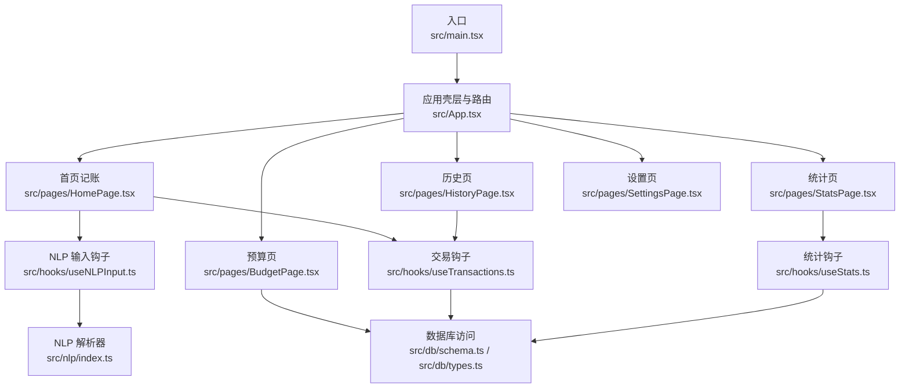
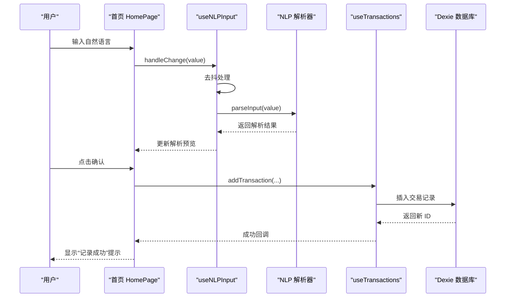
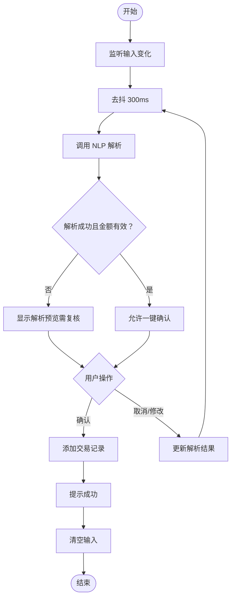
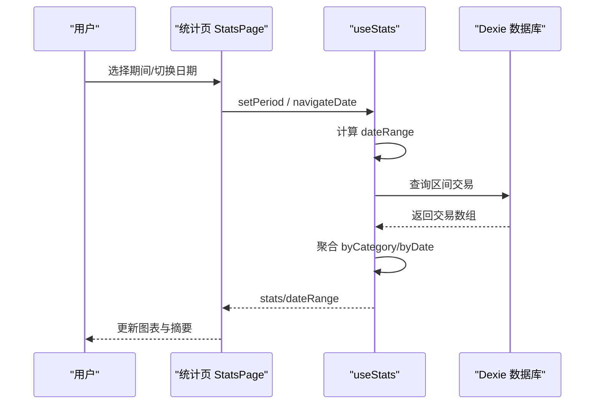
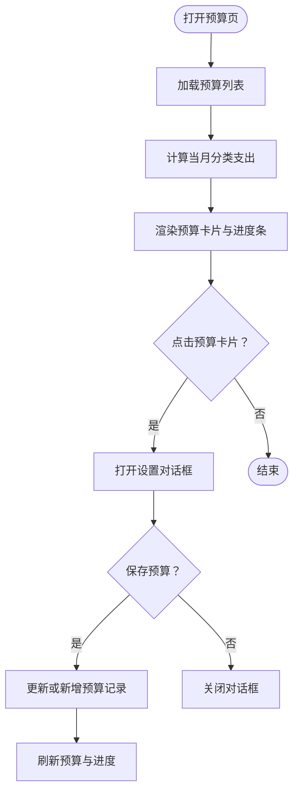
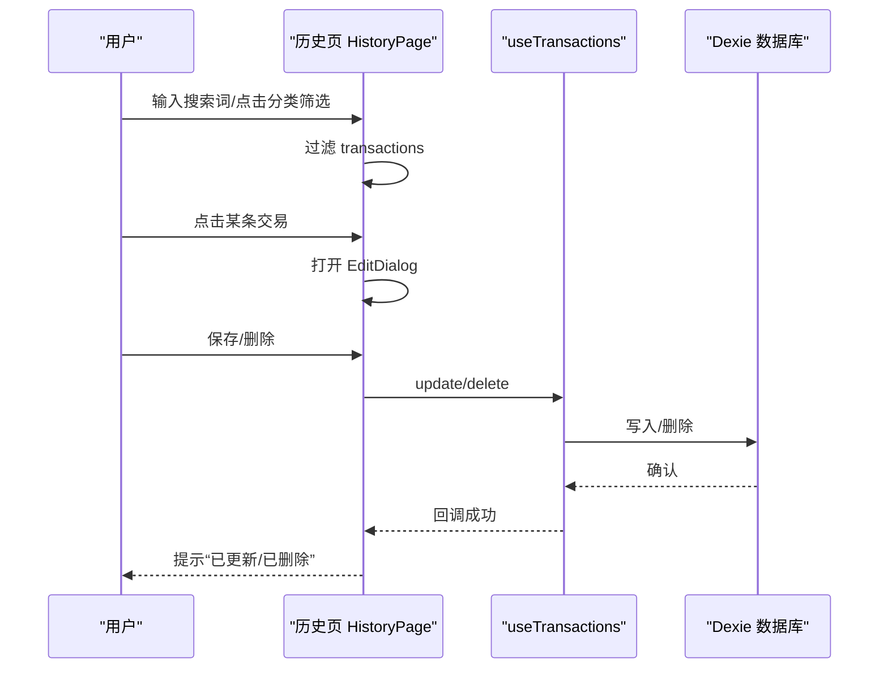
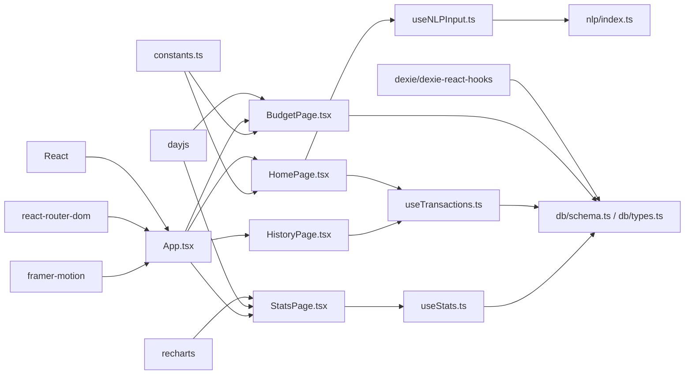

# 核心功能模块

<cite>
**本文引用的文件**
- [src/App.tsx](file://src/App.tsx)
- [src/main.tsx](file://src/main.tsx)
- [src/db/schema.ts](file://src/db/schema.ts)
- [src/db/types.ts](file://src/db/types.ts)
- [src/pages/HomePage.tsx](file://src/pages/HomePage.tsx)
- [src/pages/StatsPage.tsx](file://src/pages/StatsPage.tsx)
- [src/pages/BudgetPage.tsx](file://src/pages/BudgetPage.tsx)
- [src/pages/HistoryPage.tsx](file://src/pages/HistoryPage.tsx)
- [src/hooks/useNLPInput.ts](file://src/hooks/useNLPInput.ts)
- [src/hooks/useTransactions.ts](file://src/hooks/useTransactions.ts)
- [src/hooks/useStats.ts](file://src/hooks/useStats.ts)
- [src/nlp/index.ts](file://src/nlp/index.ts)
- [src/utils/constants.ts](file://src/utils/constants.ts)
- [package.json](file://package.json)
</cite>

## 目录
1. [简介](#简介)
2. [项目结构](#项目结构)
3. [核心组件](#核心组件)
4. [架构总览](#架构总览)
5. [详细组件分析](#详细组件分析)
6. [依赖分析](#依赖分析)
7. [性能考量](#性能考量)
8. [故障排查指南](#故障排查指南)
9. [结论](#结论)
10. [附录](#附录)

## 简介
本文件系统性梳理 MoneyNote 的核心功能模块，围绕记账、统计分析、预算管理、历史记录与设置配置展开，解释业务逻辑、用户交互流程与数据处理机制，明确模块间依赖关系、状态管理与数据流转，并提供使用场景、扩展点与优化建议。目标读者包括初学者与进阶开发者。

## 项目结构
- 前端框架：React + TypeScript + Vite
- 路由：react-router-dom
- 数据层：Dexie（IndexedDB 封装）+ dexie-react-hooks
- 图表：Recharts
- 动画：Framer Motion
- 工具库：Day.js

图表来源
- [src/main.tsx:1-14](file://src/main.tsx#L1-L14)
- [src/App.tsx:1-51](file://src/App.tsx#L1-L51)
- [src/pages/HomePage.tsx:1-100](file://src/pages/HomePage.tsx#L1-L100)
- [src/pages/StatsPage.tsx:1-38](file://src/pages/StatsPage.tsx#L1-L38)
- [src/pages/HistoryPage.tsx:1-105](file://src/pages/HistoryPage.tsx#L1-L105)
- [src/pages/BudgetPage.tsx:1-169](file://src/pages/BudgetPage.tsx#L1-L169)
- [src/hooks/useNLPInput.ts:1-51](file://src/hooks/useNLPInput.ts#L1-L51)
- [src/hooks/useTransactions.ts:1-67](file://src/hooks/useTransactions.ts#L1-L67)
- [src/hooks/useStats.ts:1-79](file://src/hooks/useStats.ts#L1-L79)
- [src/nlp/index.ts:1-62](file://src/nlp/index.ts#L1-L62)
- [src/db/schema.ts:1-21](file://src/db/schema.ts#L1-L21)
- [src/db/types.ts:1-60](file://src/db/types.ts#L1-L60)

章节来源
- [src/main.tsx:1-14](file://src/main.tsx#L1-L14)
- [src/App.tsx:1-51](file://src/App.tsx#L1-L51)
- [package.json:1-40](file://package.json#L1-L40)

## 核心组件
- 记账模块（首页）
  - 自然语言输入与解析、解析预览、快速确认、最近交易列表、编辑弹窗。
  - 关键交互：输入变更触发去抖解析；解析结果满足条件时可一键确认；支持编辑与删除。
- 统计分析模块
  - 期间切换（日/月/年）、总支出与笔数、分类占比饼图、时间趋势折线图。
  - 关键交互：切换期间与导航日期，实时计算区间内交易并聚合统计。
- 预算管理模块
  - 月度总预算与分类预算卡片、进度条与超支提醒、预算设置对话框。
  - 关键交互：点击预算卡片打开编辑对话框，保存后实时刷新。
- 历史记录模块
  - 全量交易列表、搜索与分类筛选、编辑弹窗。
  - 关键交互：Live 查询驱动列表更新；支持按备注/分类/金额过滤。
- 设置配置模块
  - 页面占位，预留扩展空间（如主题、语言、导出等）。

章节来源
- [src/pages/HomePage.tsx:1-100](file://src/pages/HomePage.tsx#L1-L100)
- [src/pages/StatsPage.tsx:1-38](file://src/pages/StatsPage.tsx#L1-L38)
- [src/pages/BudgetPage.tsx:1-169](file://src/pages/BudgetPage.tsx#L1-L169)
- [src/pages/HistoryPage.tsx:1-105](file://src/pages/HistoryPage.tsx#L1-L105)

## 架构总览
- 应用启动与路由
  - 入口渲染 BrowserRouter 包裹 App；App 使用 AppShell 容器与动画过渡包装 Routes；按路径映射到各页面。
- 数据层
  - Dexie 定义数据库版本与表结构（transactions、categories、budgets、settings），提供 CRUD 能力。
  - 类型定义涵盖 Transaction、Category、Budget、Setting 及 NLP 解析结果。
- NLP 解析链路
  - 输入文本经标准化、日期提取、金额提取、分类匹配、备注清理，输出解析结果并决定是否需要人工复核。
- 钩子层
  - useNLPInput：输入去抖、解析状态、结果更新。
  - useTransactions：最近交易、范围查询、增删改、当日/当月支出汇总。
  - useStats：期间选择、日期区间、交易聚合、分类与日期维度统计。

图表来源
- [src/pages/HomePage.tsx:19-34](file://src/pages/HomePage.tsx#L19-L34)
- [src/hooks/useNLPInput.ts:11-30](file://src/hooks/useNLPInput.ts#L11-L30)
- [src/nlp/index.ts:8-55](file://src/nlp/index.ts#L8-L55)
- [src/hooks/useTransactions.ts:21-29](file://src/hooks/useTransactions.ts#L21-L29)
- [src/db/schema.ts:4-20](file://src/db/schema.ts#L4-L20)

## 详细组件分析

### 记账模块（首页）
- 业务逻辑
  - 通过自然语言输入快速记录支出；解析结果包含金额、分类、日期、时间、备注与复核标记。
  - 支持解析预览与一键确认；展示今日/当月支出摘要；提供最近交易列表与编辑弹窗。
- 用户交互流程
  - 输入 -> 去抖解析 -> 预览 -> 确认/修改 -> 提示 -> 清空输入。
- 数据处理机制
  - useNLPInput 负责输入监听与去抖调用解析器；useTransactions 负责新增交易并写入数据库；Toast 提示反馈。
- 关键状态与依赖
  - 输入值、解析结果、解析中状态；依赖 NLP 解析器与数据库事务表。
- 扩展点与自定义
  - 可扩展分类关键词库、增强 NLP 置信度阈值、增加收入类型与时间字段。
- 错误处理与体验
  - 输入为空或解析失败时返回低置信度结果并标记需复核；确认前校验金额非空；成功后清空输入并提示。

图表来源
- [src/hooks/useNLPInput.ts:11-30](file://src/hooks/useNLPInput.ts#L11-L30)
- [src/pages/HomePage.tsx:19-34](file://src/pages/HomePage.tsx#L19-L34)
- [src/nlp/index.ts:8-55](file://src/nlp/index.ts#L8-L55)

章节来源
- [src/pages/HomePage.tsx:1-100](file://src/pages/HomePage.tsx#L1-L100)
- [src/hooks/useNLPInput.ts:1-51](file://src/hooks/useNLPInput.ts#L1-L51)
- [src/nlp/index.ts:1-62](file://src/nlp/index.ts#L1-L62)

### 统计分析模块
- 业务逻辑
  - 支持日/月/年三种期间，计算总支出、记录笔数、按分类与日期聚合。
- 用户交互流程
  - 选择期间 -> 导航日期 -> 切换上一/下一周期 -> 实时刷新统计图表。
- 数据处理机制
  - useStats 计算日期区间，useLiveQuery 查询区间交易，Memo 聚合分类与日期维度。
- 关键状态与依赖
  - 当前期、期间类型、日期范围、交易集合、统计结果；依赖数据库 transactions 表。
- 扩展点与自定义
  - 新增期间粒度（周/季度）、自定义聚合维度（商户、标签）、图表样式与指标。

图表来源
- [src/pages/StatsPage.tsx:8-37](file://src/pages/StatsPage.tsx#L8-L37)
- [src/hooks/useStats.ts:11-48](file://src/hooks/useStats.ts#L11-L48)
- [src/db/schema.ts:13-18](file://src/db/schema.ts#L13-L18)

章节来源
- [src/pages/StatsPage.tsx:1-38](file://src/pages/StatsPage.tsx#L1-L38)
- [src/hooks/useStats.ts:1-79](file://src/hooks/useStats.ts#L1-L79)

### 预算管理模块
- 业务逻辑
  - 展示月度总预算与分类预算，计算支出占比与剩余/超支；支持设置与编辑预算。
- 用户交互流程
  - 点击预算卡片 -> 打开设置对话框 -> 输入金额 -> 保存 -> 实时刷新。
- 数据处理机制
  - useLiveQuery 获取预算与当月支出；根据分类与期间聚合支出；保存时更新或新增预算记录。
- 关键状态与依赖
  - 预算列表、当月支出映射、编辑中的预算项；依赖 budgets 与 transactions 表。
- 扩展点与自定义
  - 支持多期间预算（季度/年度）、预算提醒阈值、预算类别分组。

图表来源
- [src/pages/BudgetPage.tsx:13-169](file://src/pages/BudgetPage.tsx#L13-L169)
- [src/db/schema.ts:13-18](file://src/db/schema.ts#L13-L18)

章节来源
- [src/pages/BudgetPage.tsx:1-169](file://src/pages/BudgetPage.tsx#L1-L169)

### 历史记录模块
- 业务逻辑
  - 展示全量交易，支持按备注、分类、金额搜索与分类筛选；提供编辑弹窗进行修改或删除。
- 用户交互流程
  - 输入搜索词 -> 过滤交易列表 -> 点击分类筛选 -> 点击交易打开编辑 -> 保存/删除。
- 数据处理机制
  - useLiveQuery 排序读取交易；useTransactions 提供更新与删除；EditDialog 调用保存/删除回调。
- 关键状态与依赖
  - 搜索词、筛选分类、编辑中的交易、过滤后的交易列表；依赖 transactions 表。
- 扩展点与自定义
  - 支持更多筛选条件（时间范围、金额区间、分类树）、批量操作、导出。

图表来源
- [src/pages/HistoryPage.tsx:12-105](file://src/pages/HistoryPage.tsx#L12-L105)
- [src/hooks/useTransactions.ts:31-39](file://src/hooks/useTransactions.ts#L31-L39)
- [src/db/schema.ts:13-18](file://src/db/schema.ts#L13-L18)

章节来源
- [src/pages/HistoryPage.tsx:1-105](file://src/pages/HistoryPage.tsx#L1-L105)
- [src/hooks/useTransactions.ts:1-67](file://src/hooks/useTransactions.ts#L1-L67)

### 设置配置模块
- 业务逻辑
  - 页面占位，预留配置项扩展（如主题、语言、导出、备份等）。
- 用户交互流程
  - 点击设置页 -> 进入配置界面 -> 保存设置 -> 生效。
- 数据处理机制
  - 通过 settings 表存储键值对配置；读取与更新由数据库访问层提供。
- 关键状态与依赖
  - 配置键值对；依赖 settings 表。
- 扩展点与自定义
  - 新增配置项、默认值、校验规则与持久化策略。

章节来源
- [src/pages/SettingsPage.tsx](file://src/pages/SettingsPage.tsx)

## 依赖分析
- 外部依赖
  - react、react-router-dom、dexie、dexie-react-hooks、framer-motion、recharts、dayjs。
- 内部依赖
  - 页面组件依赖 hooks 与数据库；hooks 依赖数据库；NLP 解析器依赖各子模块；常量提供分类与期间配置。

图表来源
- [package.json:12-21](file://package.json#L12-L21)
- [src/App.tsx:1-51](file://src/App.tsx#L1-L51)
- [src/db/schema.ts:1-21](file://src/db/schema.ts#L1-L21)
- [src/db/types.ts:1-60](file://src/db/types.ts#L1-L60)
- [src/hooks/useNLPInput.ts:1-51](file://src/hooks/useNLPInput.ts#L1-L51)
- [src/hooks/useTransactions.ts:1-67](file://src/hooks/useTransactions.ts#L1-L67)
- [src/hooks/useStats.ts:1-79](file://src/hooks/useStats.ts#L1-L79)
- [src/nlp/index.ts:1-62](file://src/nlp/index.ts#L1-L62)
- [src/utils/constants.ts:1-19](file://src/utils/constants.ts#L1-L19)

章节来源
- [package.json:1-40](file://package.json#L1-L40)

## 性能考量
- 去抖与节流
  - NLP 输入使用 300ms 去抖，避免频繁解析；可结合更智能的触发条件（如检测到金额/日期模式后再解析）。
- Live 查询与索引
  - 使用 useLiveQuery 实时响应数据库变更；数据库为 transactions、categories、budgets、settings 建立合适索引，提升查询效率。
- 图表渲染
  - Recharts 在大数据量下可通过分页或采样聚合降低渲染压力；统计页仅在日期区间变化时重算。
- 动画与路由
  - Framer Motion 的路由切换动画参数已设定，保持流畅与轻量。
- 存储与备份
  - IndexedDB 本地存储，注意定期清理过期数据与迁移策略；可扩展导入/导出能力。

## 故障排查指南
- NLP 解析不准确
  - 检查输入是否包含金额/日期/分类关键词；适当调整解析器置信度阈值；必要时引导用户手动修正。
- 解析结果需复核
  - 若金额或分类置信度低，界面会标记需复核；引导用户确认或手动修改。
- 交易记录异常
  - 检查 transactions 表索引与查询条件；确认日期格式与范围边界；核对更新/删除回调。
- 预算显示异常
  - 确认 budgets 表存在对应分类/总预算记录；检查当月支出聚合逻辑与日期范围。
- 统计数据偏差
  - 核对期间选择与日期区间的边界；确认过滤条件与 Memo 依赖项是否正确更新。

章节来源
- [src/nlp/index.ts:38-55](file://src/nlp/index.ts#L38-L55)
- [src/hooks/useTransactions.ts:42-55](file://src/hooks/useTransactions.ts#L42-L55)
- [src/pages/BudgetPage.tsx:21-31](file://src/pages/BudgetPage.tsx#L21-L31)
- [src/hooks/useStats.ts:31-48](file://src/hooks/useStats.ts#L31-L48)

## 结论
MoneyNote 以 Dexie 为核心的数据层与 React Hooks 协作，构建了从自然语言记账到统计分析与预算控制的完整闭环。模块职责清晰、状态管理直观、数据流可追踪。通过合理的索引设计、去抖与 Live 查询，兼顾了交互流畅与性能稳定。建议后续在 NLP 精准度、统计可视化与配置扩展方面持续迭代。

## 附录
- 使用场景示例
  - 快速记账：输入“午餐在麦当劳花了67块”，自动解析并预览，点击确认即可记录。
  - 查看趋势：进入统计页，选择“月”，查看分类占比与时间趋势。
  - 控制预算：在预算页设置“餐饮”月预算，观察当月支出进度与剩余。
  - 管理明细：在历史页按分类筛选与关键词搜索，编辑或删除错误记录。
- 扩展建议
  - 引入收入类型与转账；增加分类树与标签；完善导出/导入；增强 NLP 语义理解与上下文识别。