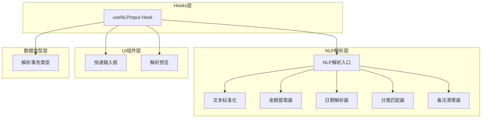
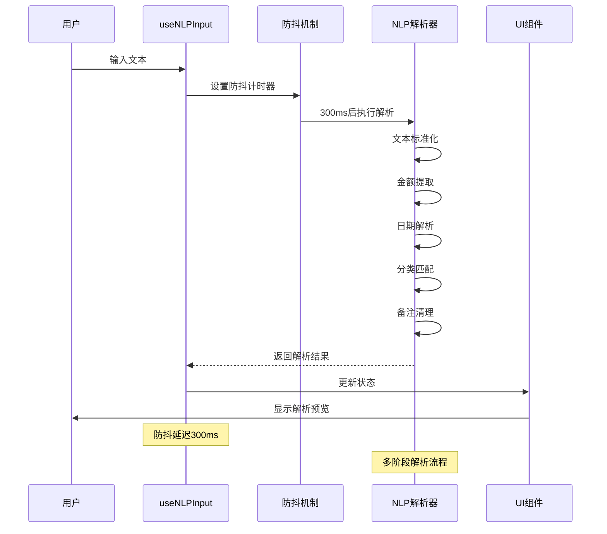
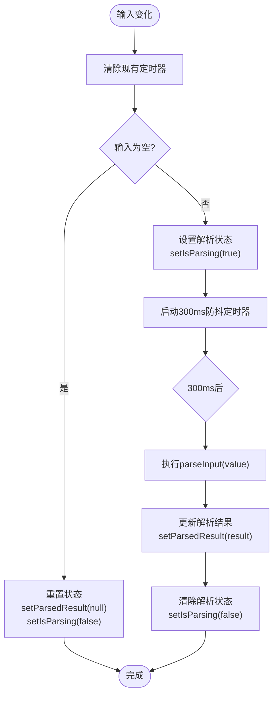
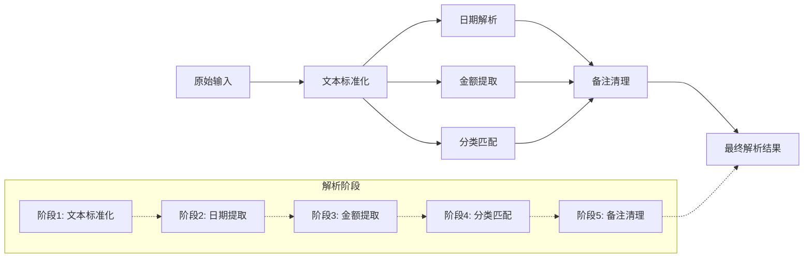
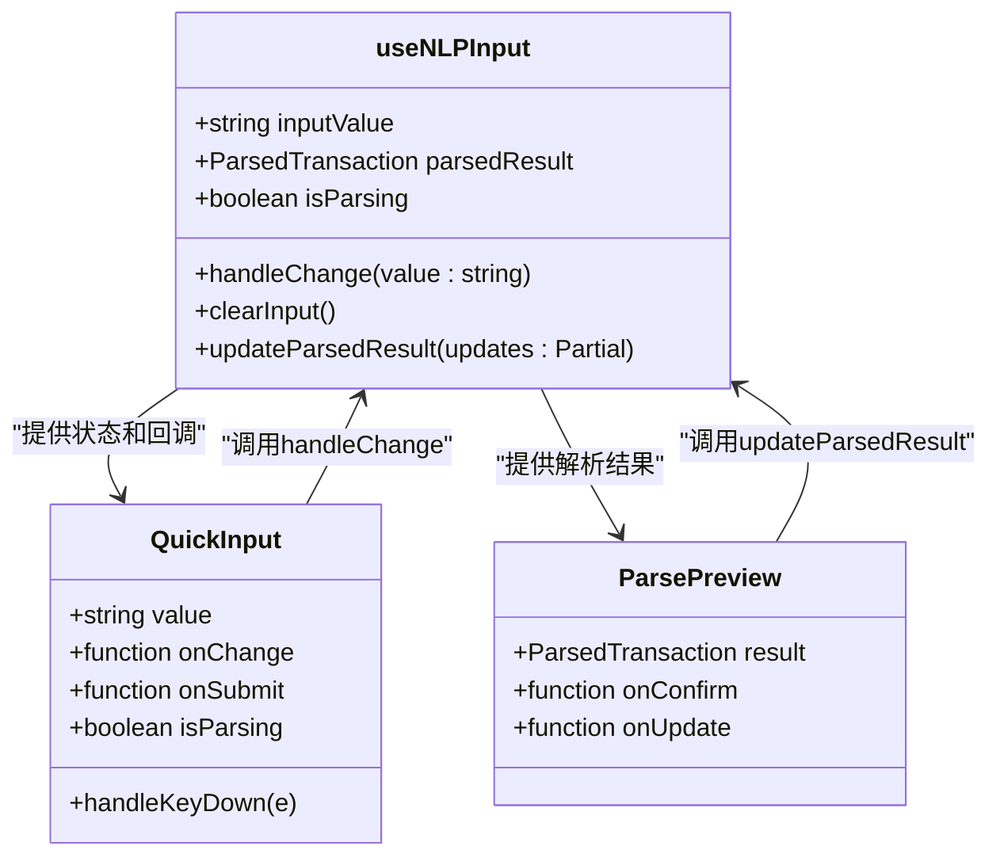
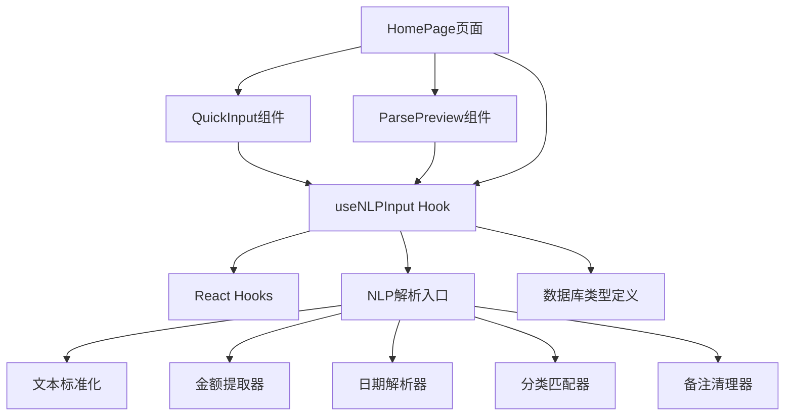

# NLP输入处理Hook

<cite>
**本文档引用的文件**
- [useNLPInput.ts](file://src/hooks/useNLPInput.ts)
- [QuickInput.tsx](file://src/components/input/QuickInput.tsx)
- [ParsePreview.tsx](file://src/components/input/ParsePreview.tsx)
- [index.ts](file://src/nlp/index.ts)
- [amountExtractor.ts](file://src/nlp/amountExtractor.ts)
- [categoryMatcher.ts](file://src/nlp/categoryMatcher.ts)
- [dateParser.ts](file://src/nlp/dateParser.ts)
- [normalizer.ts](file://src/nlp/normalizer.ts)
- [noteCleaner.ts](file://src/nlp/noteCleaner.ts)
- [types.ts](file://src/db/types.ts)
- [HomePage.tsx](file://src/pages/HomePage.tsx)
</cite>

## 目录
1. [简介](#简介)
2. [项目结构](#项目结构)
3. [核心组件](#核心组件)
4. [架构概览](#架构概览)
5. [详细组件分析](#详细组件分析)
6. [依赖关系分析](#依赖关系分析)
7. [性能考虑](#性能考虑)
8. [故障排除指南](#故障排除指南)
9. [结论](#结论)

## 简介

useNLPInput Hook是MoneyNote应用中的核心自然语言处理组件，负责将用户的自然语言输入转换为结构化的财务交易数据。该Hook实现了智能的输入状态管理、防抖机制和完整的解析流程，为用户提供流畅的语音输入体验。

该Hook的主要功能包括：
- 实时输入状态跟踪和管理
- 智能防抖机制防止频繁解析
- 异步NLP解析处理
- 解析结果的状态更新和验证
- 输入重置和错误处理机制

## 项目结构

useNLPInput Hook位于项目的hooks目录中，与NLP解析系统紧密集成：



**图表来源**
- [useNLPInput.ts:1-51](file://src/hooks/useNLPInput.ts#L1-L51)
- [index.ts:1-62](file://src/nlp/index.ts#L1-L62)
- [QuickInput.tsx:1-68](file://src/components/input/QuickInput.tsx#L1-L68)
- [ParsePreview.tsx:1-123](file://src/components/input/ParsePreview.tsx#L1-L123)

**章节来源**
- [useNLPInput.ts:1-51](file://src/hooks/useNLPInput.ts#L1-L51)
- [HomePage.tsx:13-14](file://src/pages/HomePage.tsx#L13-L14)

## 核心组件

useNLPInput Hook提供了完整的状态管理和事件处理机制：

### 主要状态管理

Hook内部维护三个核心状态：
- `inputValue`: 当前输入的自然语言字符串
- `parsedResult`: 解析后的结构化交易数据
- `isParsing`: 解析状态指示器

### 核心函数接口

Hook返回以下公共接口：
- `handleChange`: 处理输入变化的回调函数
- `clearInput`: 清空输入和解析结果
- `updateParsedResult`: 更新解析结果的辅助函数
- `inputValue`, `parsedResult`, `isParsing`: 状态访问器

**章节来源**
- [useNLPInput.ts:5-50](file://src/hooks/useNLPInput.ts#L5-L50)

## 架构概览

useNLPInput Hook采用模块化设计，与NLP解析系统形成清晰的层次结构：



**图表来源**
- [useNLPInput.ts:11-30](file://src/hooks/useNLPInput.ts#L11-L30)
- [index.ts:8-55](file://src/nlp/index.ts#L8-L55)

## 详细组件分析

### useNLPInput Hook实现详解

#### 防抖机制实现

Hook使用ref存储防抖定时器，确保只有最后一次输入会被处理：



**图表来源**
- [useNLPInput.ts:11-30](file://src/hooks/useNLPInput.ts#L11-L30)

#### handleChange回调函数实现

handleChange函数是Hook的核心逻辑，实现了完整的输入处理流程：

1. **输入值更新**: 立即更新inputValue状态
2. **防抖控制**: 清除之前的定时器，避免重复解析
3. **空输入处理**: 空输入时重置所有状态
4. **异步解析**: 启动300ms防抖后执行解析
5. **状态更新**: 解析完成后更新parsedResult和isParsing

#### parsedResult状态数据结构

ParsedTransaction接口定义了完整的解析结果结构：

| 字段名 | 类型 | 描述 | 置信度 |
|--------|------|------|--------|
| amount | number \| null | 金额数值 | high/medium/low |
| amountConfidence | 'high' \| 'medium' \| 'low' | 金额置信度 | - |
| category | string | 分类标识符 | high/medium/low |
| categoryConfidence | 'high' \| 'medium' \| 'low' | 分类置信度 | - |
| date | string | 日期字符串(YYYY-MM-DD) | - |
| time | string \| null | 时间字符串(HH:mm) | - |
| note | string | 备注内容 | - |
| rawInput | string | 原始输入文本 | - |
| needsReview | boolean | 是否需要人工确认 | - |

#### updateParsedResult函数使用方法

updateParsedResult提供安全的结果更新机制：
- 接受Partial<ParsedTransaction>类型的更新对象
- 使用条件更新确保只有存在解析结果时才更新
- 支持部分字段更新，保持其他字段不变
- 自动触发React重新渲染

#### clearInput函数重置逻辑

clearInput函数提供完整的状态重置：
- 清空inputValue为''
- 将parsedResult设置为null
- 关闭isParsing状态
- 确保UI完全重置到初始状态

**章节来源**
- [useNLPInput.ts:11-40](file://src/hooks/useNLPInput.ts#L11-L40)
- [types.ts:49-59](file://src/db/types.ts#L49-L59)

### NLP解析系统集成

#### 解析流程架构

NLP解析系统采用多阶段处理架构，每个阶段都有特定的职责：



**图表来源**
- [index.ts:8-55](file://src/nlp/index.ts#L8-L55)
- [normalizer.ts:17-35](file://src/nlp/normalizer.ts#L17-L35)

#### 各解析器详细实现

**金额提取器(ExtractAmount)**:
- 支持多种金额表达模式
- 按优先级匹配不同格式
- 提供置信度评估
- 处理边界情况和异常输入

**分类匹配器(MatchCategory)**:
- 内置丰富的关键词词典
- 支持多类别分类
- 基于关键词匹配得分
- 动态置信度计算

**日期解析器(ParseDate)**:
- 支持中文日期表达
- 复杂的时间模式匹配
- 使用dayjs进行日期计算
- 处理相对时间概念

**章节来源**
- [index.ts:8-55](file://src/nlp/index.ts#L8-L55)
- [amountExtractor.ts:27-43](file://src/nlp/amountExtractor.ts#L27-L43)
- [categoryMatcher.ts:45-89](file://src/nlp/categoryMatcher.ts#L45-L89)
- [dateParser.ts:101-120](file://src/nlp/dateParser.ts#L101-L120)

### UI组件集成

#### QuickInput组件集成

QuickInput组件通过props接收useNLPInput Hook的状态和回调：



**图表来源**
- [QuickInput.tsx:4-9](file://src/components/input/QuickInput.tsx#L4-L9)
- [ParsePreview.tsx:9-13](file://src/components/input/ParsePreview.tsx#L9-L13)
- [useNLPInput.ts:42-49](file://src/hooks/useNLPInput.ts#L42-L49)

#### 实际使用示例

在HomePage组件中，useNLPInput Hook被完整集成：

```typescript
// 获取Hook实例
const { 
  inputValue, 
  parsedResult, 
  isParsing, 
  handleChange, 
  clearInput, 
  updateParsedResult 
} = useNLPInput()

// 集成到UI组件
<QuickInput
  value={inputValue}
  onChange={handleChange}
  onSubmit={handleQuickSubmit}
  isParsing={isParsing}
/>

// 条件渲染解析预览
{parsedResult && (
  <ParsePreview
    result={parsedResult}
    onConfirm={handleConfirm}
    onUpdate={updateParsedResult}
  />
)}
```

**章节来源**
- [HomePage.tsx:13-71](file://src/pages/HomePage.tsx#L13-L71)

## 依赖关系分析

useNLPInput Hook与各个模块之间的依赖关系如下：



**图表来源**
- [useNLPInput.ts:1-3](file://src/hooks/useNLPInput.ts#L1-L3)
- [index.ts:1-6](file://src/nlp/index.ts#L1-L6)

### 错误处理策略

Hook实现了多层次的错误处理机制：

1. **输入验证**: 空输入时自动重置状态
2. **解析容错**: NLP解析失败时提供默认值
3. **状态保护**: 使用React的useState确保状态一致性
4. **防抖保护**: 避免频繁解析导致的性能问题

**章节来源**
- [useNLPInput.ts:18-22](file://src/hooks/useNLPInput.ts#L18-L22)
- [index.ts:9-21](file://src/nlp/index.ts#L9-L21)

## 性能考虑

### 防抖优化

- **延迟时间**: 300ms的防抖延迟平衡了响应性和性能
- **定时器管理**: 使用ref存储定时器，避免内存泄漏
- **条件解析**: 空输入时不执行解析，节省计算资源

### 内存管理

- **状态清理**: clearInput函数确保完全重置
- **定时器清理**: handleChange中自动清理旧定时器
- **引用优化**: 使用useCallback优化回调函数引用

### 解析效率

- **阶段化处理**: 将复杂解析分解为多个简单步骤
- **早期退出**: 某些阶段失败时可提前结束
- **缓存策略**: 避免重复计算相同输入

## 故障排除指南

### 常见问题及解决方案

**问题1: 输入无响应**
- 检查handleChange回调是否正确传递给QuickInput
- 确认防抖定时器没有被意外清除
- 验证NLP解析函数是否可用

**问题2: 解析结果不准确**
- 检查输入文本格式是否符合预期
- 验证各解析器的配置和规则
- 确认置信度阈值设置合理

**问题3: UI状态不同步**
- 确认parsedResult状态更新时机
- 检查updateParsedResult函数调用
- 验证React组件重新渲染机制

**章节来源**
- [useNLPInput.ts:32-40](file://src/hooks/useNLPInput.ts#L32-L40)
- [HomePage.tsx:19-34](file://src/pages/HomePage.tsx#L19-L34)

## 结论

useNLPInput Hook是一个精心设计的自然语言处理组件，它将复杂的NLP解析逻辑封装在一个简洁易用的接口中。通过智能的防抖机制、完善的错误处理和优雅的UI集成，该Hook为用户提供了流畅的自然语言输入体验。

主要优势包括：
- **高性能**: 防抖机制有效减少不必要的解析操作
- **易用性**: 简洁的API设计降低了使用复杂度
- **可靠性**: 完善的状态管理和错误处理机制
- **可扩展性**: 模块化的NLP解析系统便于功能扩展

该Hook的成功实现展示了现代React应用中自定义Hook的最佳实践，为类似的功能开发提供了优秀的参考模板。