# 交易数据管理Hook

<cite>
**本文档引用的文件**
- [useTransactions.ts](file://src/hooks/useTransactions.ts)
- [index.ts](file://src/db/index.ts)
- [schema.ts](file://src/db/schema.ts)
- [types.ts](file://src/db/types.ts)
- [HistoryPage.tsx](file://src/pages/HistoryPage.tsx)
- [TransactionList.tsx](file://src/components/transaction/TransactionList.tsx)
- [EditDialog.tsx](file://src/components/transaction/EditDialog.tsx)
- [constants.ts](file://src/utils/constants.ts)
- [Toast.tsx](file://src/components/ui/Toast.tsx)
</cite>

## 目录
1. [简介](#简介)
2. [项目结构](#项目结构)
3. [核心组件](#核心组件)
4. [架构概览](#架构概览)
5. [详细组件分析](#详细组件分析)
6. [依赖关系分析](#依赖关系分析)
7. [性能考虑](#性能考虑)
8. [故障排除指南](#故障排除指南)
9. [结论](#结论)

## 简介

useTransactions Hook 是 MoneyNote 应用中的核心数据管理组件，专门负责交易数据的 CRUD（创建、读取、更新、删除）操作。该 Hook 深度集成了 Dexie 数据库，提供了完整的离线优先的数据管理解决方案。

本 Hook 的主要目标是：
- 提供交易数据的实时同步和响应式更新
- 实现高效的本地数据存储和检索
- 支持复杂的查询和过滤功能
- 提供用户友好的数据操作接口
- 确保数据一致性和完整性

## 项目结构

MoneyNote 采用模块化架构设计，交易数据管理相关的文件组织如下：

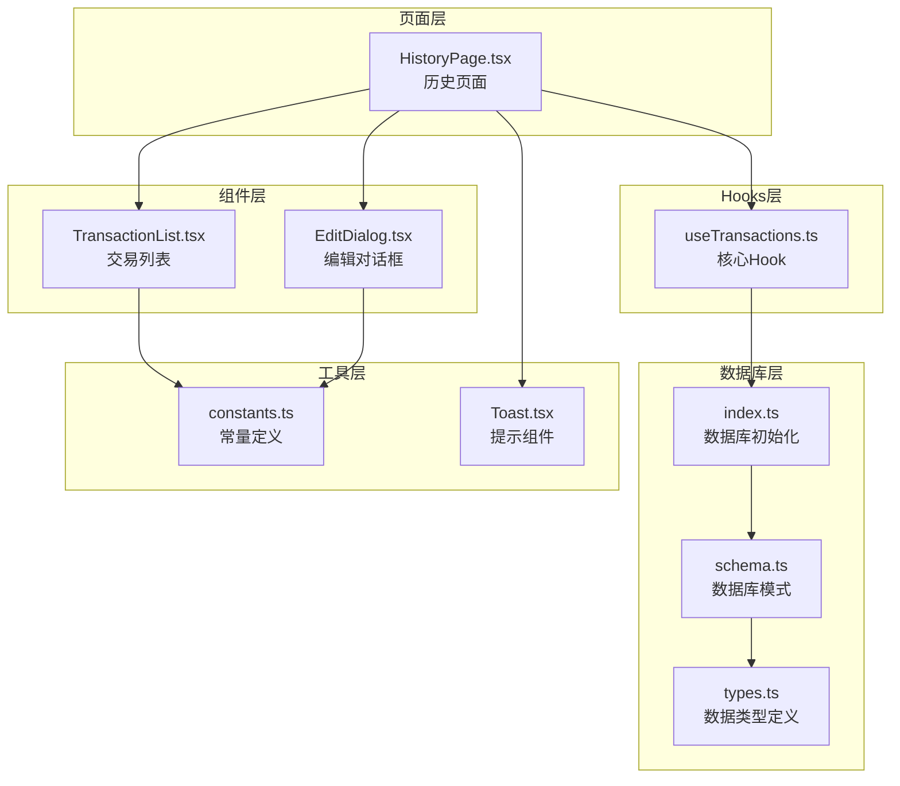

**图表来源**
- [useTransactions.ts:1-67](file://src/hooks/useTransactions.ts#L1-L67)
- [index.ts:1-14](file://src/db/index.ts#L1-L14)
- [schema.ts:1-21](file://src/db/schema.ts#L1-L21)

**章节来源**
- [useTransactions.ts:1-67](file://src/hooks/useTransactions.ts#L1-L67)
- [index.ts:1-14](file://src/db/index.ts#L1-L14)
- [schema.ts:1-21](file://src/db/schema.ts#L1-L21)

## 核心组件

### useTransactions Hook 架构

useTransactions Hook 提供了完整的交易数据管理功能，包括：

#### 主要功能模块

1. **数据获取模块**
   - 最近交易获取：实时获取最新的10条交易记录
   - 范围查询：按日期范围检索交易数据
   - 实时监听：使用 Dexie React Hooks 实现实时数据同步

2. **CRUD 操作模块**
   - 交易创建：支持完整的交易信息添加
   - 交易更新：支持部分字段更新和时间戳自动管理
   - 交易删除：安全的单条记录删除操作

3. **统计计算模块**
   - 今日支出统计：基于当前日期的支出汇总
   - 本月支出统计：基于当前月份的支出汇总

#### 数据模型

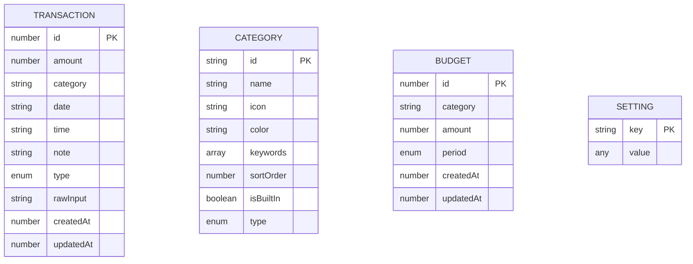

**图表来源**
- [types.ts:3-39](file://src/db/types.ts#L3-L39)

**章节来源**
- [useTransactions.ts:6-66](file://src/hooks/useTransactions.ts#L6-L66)
- [types.ts:3-39](file://src/db/types.ts#L3-L39)

## 架构概览

### 数据流架构

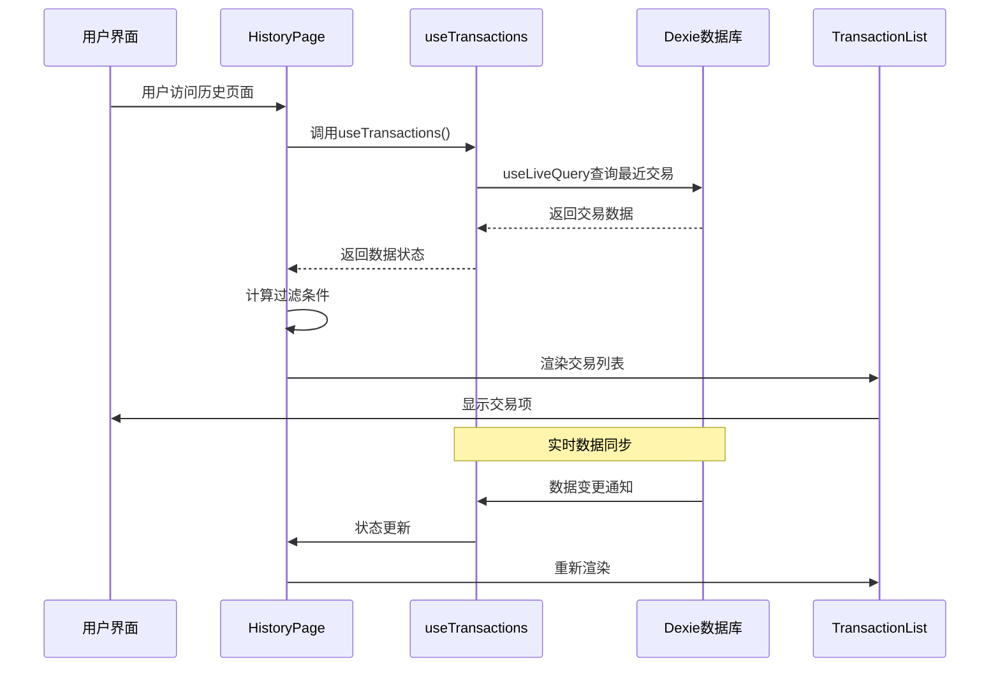

**图表来源**
- [HistoryPage.tsx:12-104](file://src/pages/HistoryPage.tsx#L12-L104)
- [useTransactions.ts:8-19](file://src/hooks/useTransactions.ts#L8-L19)

### 数据库集成架构

```mermaid
graph LR
subgraph "应用层"
UT[useTransactions Hook]
HP[HistoryPage 页面]
TL[TransactionList 组件]
ED[EditDialog 组件]
end
subgraph "数据库层"
DB[AppDB 类]
TX[transactions 表]
CT[categories 表]
BY[budgets 表]
ST[settings 表]
end
subgraph "索引层"
IDX1[主键索引: ++id]
IDX2[复合索引: [type+date]]
IDX3[普通索引: date, category, type]
end
UT --> DB
HP --> UT
TL --> UT
ED --> UT
DB --> TX
DB --> CT
DB --> BY
DB --> ST
TX --> IDX1
TX --> IDX2
TX --> IDX3
```

**图表来源**
- [schema.ts:4-19](file://src/db/schema.ts#L4-L19)
- [useTransactions.ts:2-4](file://src/hooks/useTransactions.ts#L2-L4)

## 详细组件分析

### useTransactions Hook 详细实现

#### 数据获取功能

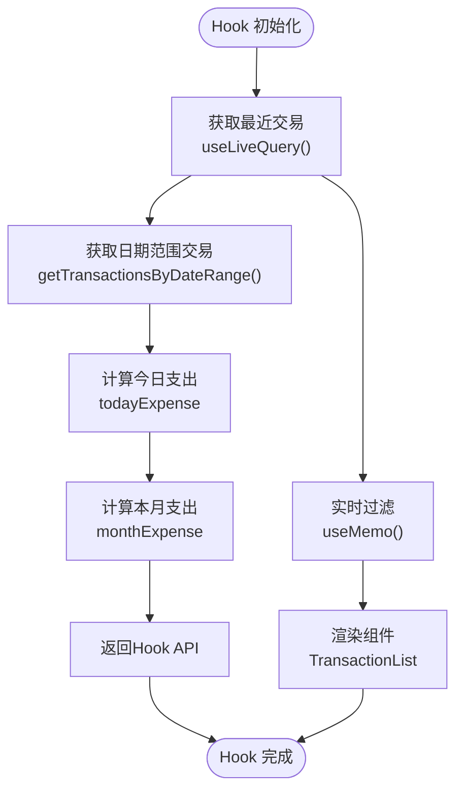

**图表来源**
- [useTransactions.ts:8-55](file://src/hooks/useTransactions.ts#L8-L55)

##### 最近交易获取

最近交易功能通过 `useLiveQuery` 实现实时数据监听：

- 使用 `orderBy('date').reverse().limit(10)` 实现按日期倒序排列
- 自动监听数据库变化，实现响应式更新
- 限制返回数量为10条，确保性能优化

##### 日期范围查询

`getTransactionsByDateRange` 函数提供灵活的日期范围查询：

- 支持任意日期范围的精确匹配
- 使用 `between(start, end, true, true)` 包含边界值
- 按日期倒序排列，最新记录在前

#### CRUD 操作实现

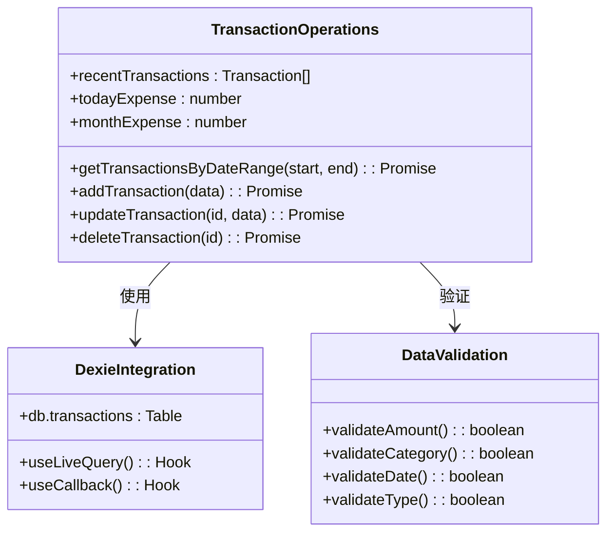

**图表来源**
- [useTransactions.ts:21-39](file://src/hooks/useTransactions.ts#L21-L39)

##### 交易创建流程

交易创建操作包含以下步骤：

1. **数据准备**：自动设置 `createdAt` 和 `updatedAt` 时间戳
2. **数据验证**：确保必需字段的完整性和有效性
3. **数据库操作**：通过 Dexie 的 `add` 方法插入新记录
4. **状态更新**：自动触发实时监听器更新相关组件

##### 交易更新机制

交易更新采用部分更新策略：

- 支持任意字段的部分更新
- 自动更新 `updatedAt` 字段为当前时间
- 使用 `useCallback` 优化函数引用，避免不必要的重渲染

##### 交易删除处理

删除操作具有以下特性：

- 单条记录删除，不涉及级联操作
- 删除后自动更新所有相关的实时监听组件
- 提供安全的删除确认机制

#### 统计计算功能

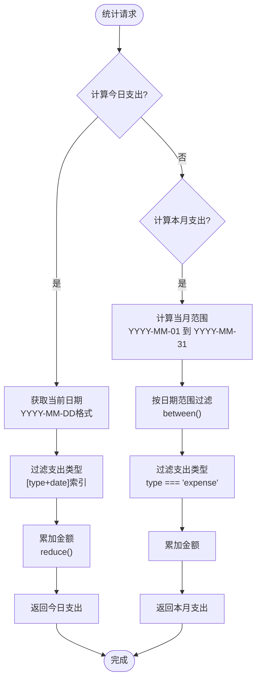

**图表来源**
- [useTransactions.ts:42-55](file://src/hooks/useTransactions.ts#L42-L55)

### TransactionList 组件集成

#### 数据分组和排序

TransactionList 组件实现了智能的数据分组和排序：

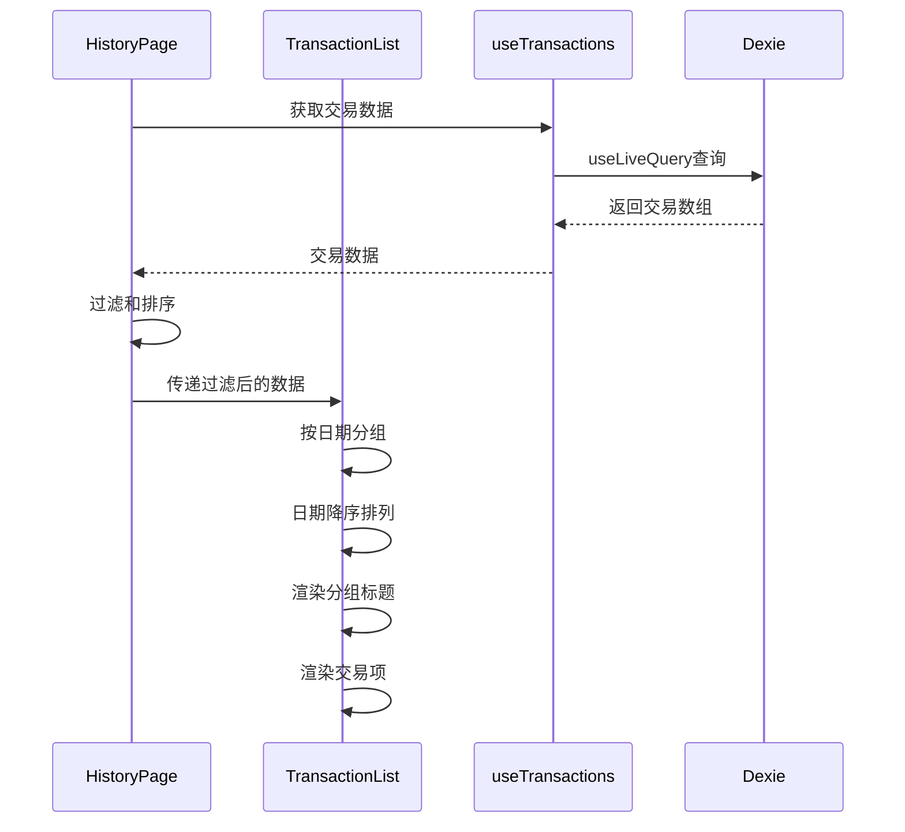

**图表来源**
- [TransactionList.tsx:17-25](file://src/components/transaction/TransactionItem.tsx#L17-L25)

##### 数据分组逻辑

组件使用 `reduce` 函数实现按日期分组：

- 创建以日期为键的分组映射
- 将相同日期的交易归类到同一数组
- 使用 `Object.keys().sort()` 实现日期降序排列

##### 交易项渲染

每个交易项包含以下信息：

- 分类图标和名称
- 备注或分类名称
- 时间显示（如果存在）
- 金额显示，正负号区分收支

#### 编辑对话框集成

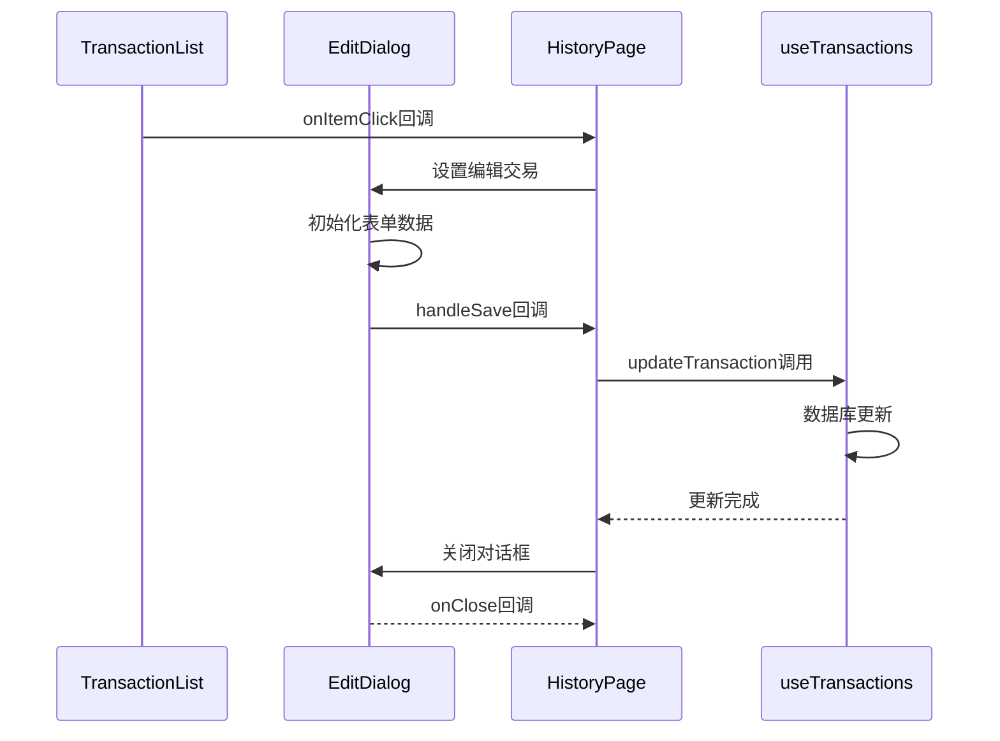

**图表来源**
- [EditDialog.tsx:33-42](file://src/components/transaction/EditDialog.tsx#L33-L42)

**章节来源**
- [useTransactions.ts:6-66](file://src/hooks/useTransactions.ts#L6-L66)
- [TransactionList.tsx:12-49](file://src/components/transaction/TransactionList.tsx#L12-L49)
- [EditDialog.tsx:18-48](file://src/components/transaction/EditDialog.tsx#L18-L48)

## 依赖关系分析

### 组件间依赖关系

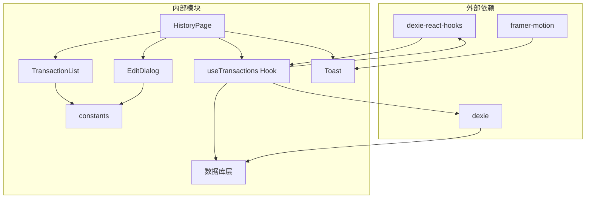

**图表来源**
- [useTransactions.ts:1-4](file://src/hooks/useTransactions.ts#L1-L4)
- [HistoryPage.tsx:1-17](file://src/pages/HistoryPage.tsx#L1-L17)

### 数据库依赖分析

#### 索引策略

数据库设计采用了多层索引策略：

1. **主键索引**：`++id` - 支持快速的单条记录查找
2. **复合索引**：`[type+date]` - 支持按类型和日期的高效查询
3. **普通索引**：`date, category, type` - 支持常规字段查询

#### 查询优化

```mermaid
flowchart LR
subgraph "查询类型"
Q1[按日期范围查询]
Q2[按类型查询]
Q3[按类别查询]
Q4[复合条件查询]
end
subgraph "索引利用"
I1[日期索引]
I2[类型索引]
I3[类别索引]
I4[复合索引[type+date]]
end
Q1 --> I1
Q2 --> I2
Q3 --> I3
Q4 --> I4
```

**图表来源**
- [schema.ts:13-18](file://src/db/schema.ts#L13-L18)

**章节来源**
- [useTransactions.ts:13-19](file://src/hooks/useTransactions.ts#L13-L19)
- [schema.ts:13-18](file://src/db/schema.ts#L13-L18)

## 性能考虑

### 实时查询优化

#### useLiveQuery 使用策略

useTransactions Hook 采用 `useLiveQuery` 实现高性能的实时数据同步：

- **懒加载**：只有在组件挂载时才执行查询
- **自动去重**：React 级别的组件去重机制
- **增量更新**：数据库变更时只更新受影响的组件

#### 内存管理

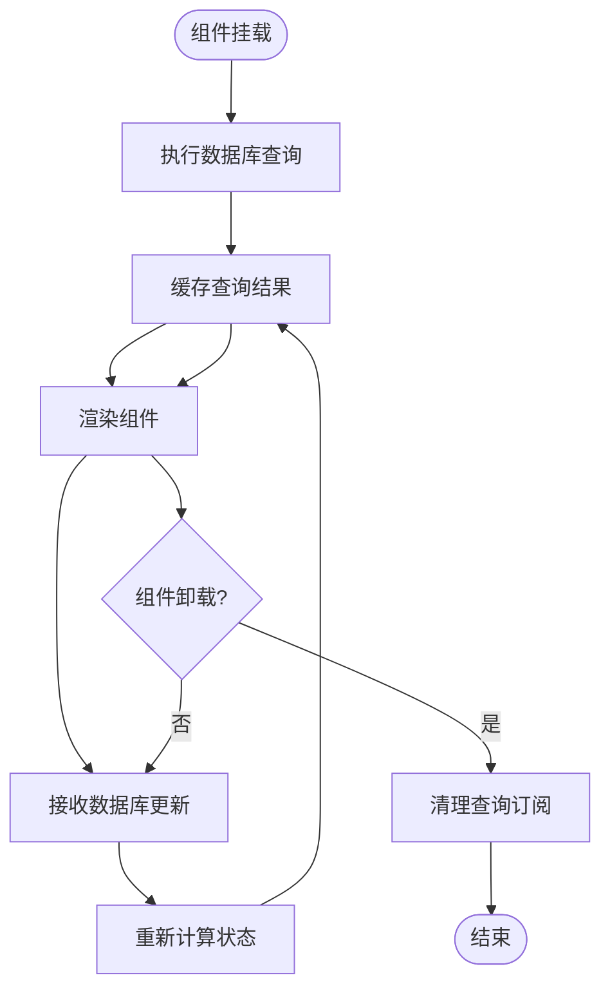

**图表来源**
- [useTransactions.ts:8-10](file://src/hooks/useTransactions.ts#L8-L10)

### 查询性能优化

#### 索引使用策略

1. **范围查询优化**：使用 `between()` 方法配合日期索引
2. **复合查询优化**：利用 `[type+date]` 复合索引进行高效过滤
3. **限制结果集**：最近交易使用 `limit(10)` 限制返回数量

#### 内存使用控制

- **分页加载**：历史页面使用分页策略避免大量数据一次性加载
- **虚拟滚动**：对于大量数据场景可考虑实现虚拟滚动
- **数据压缩**：对历史数据进行适当的压缩存储

### 缓存策略

#### 本地缓存机制

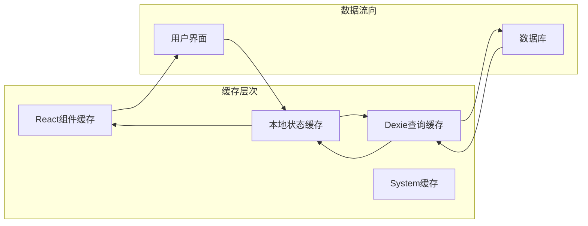

**图表来源**
- [useTransactions.ts:8-19](file://src/hooks/useTransactions.ts#L8-L19)

## 故障排除指南

### 常见问题诊断

#### 数据不同步问题

**症状**：更新后界面没有反映最新数据

**排查步骤**：
1. 检查 `useLiveQuery` 是否正确使用
2. 验证数据库事务是否正确提交
3. 确认组件是否正确响应状态变化

**解决方案**：
- 确保使用 `useCallback` 包装异步函数
- 检查 `updatedAt` 字段是否正确更新
- 验证 Dexie 版本兼容性

#### 查询性能问题

**症状**：大数据量查询响应缓慢

**排查步骤**：
1. 检查数据库索引使用情况
2. 分析查询执行计划
3. 评估内存使用情况

**优化方案**：
- 实现分页加载策略
- 使用更精确的查询条件
- 考虑数据分区存储

#### 数据一致性问题

**症状**：并发操作导致数据冲突

**解决方法**：
- 使用数据库事务确保原子性
- 实现乐观锁机制
- 加强前端状态管理

### 错误处理机制

#### 异步操作错误处理

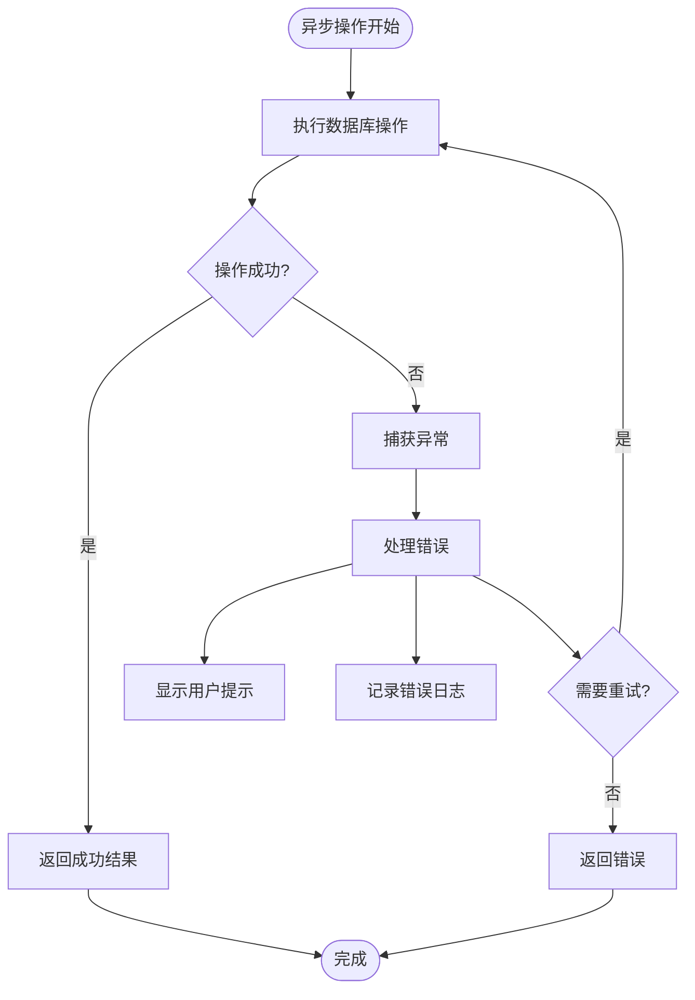

**图表来源**
- [HistoryPage.tsx:41-50](file://src/pages/HistoryPage.tsx#L41-L50)

**章节来源**
- [HistoryPage.tsx:41-50](file://src/pages/HistoryPage.tsx#L41-L50)
- [Toast.tsx:26-32](file://src/components/ui/Toast.tsx#L26-L32)

## 结论

useTransactions Hook 为 MoneyNote 应用提供了强大而灵活的交易数据管理能力。通过深度集成 Dexie 数据库和 React Hooks，该 Hook 实现了以下关键优势：

### 技术优势

1. **实时响应**：基于 Dexie React Hooks 的实时数据同步
2. **高性能**：合理的索引策略和查询优化
3. **易用性**：简洁的 API 设计和类型安全
4. **可扩展性**：模块化的架构便于功能扩展

### 架构特点

- **分层清晰**：明确的职责分离和依赖管理
- **数据驱动**：以数据为中心的设计理念
- **用户体验**：流畅的交互和即时反馈
- **维护友好**：良好的代码结构和文档

### 未来改进方向

1. **批量操作支持**：实现交易记录的批量导入导出
2. **高级搜索**：增强搜索功能，支持复杂查询条件
3. **数据备份**：实现本地和云端的数据备份机制
4. **性能监控**：添加详细的性能指标和监控功能

该 Hook 为 MoneyNote 的交易管理功能奠定了坚实的技术基础，为用户提供了一个可靠、高效、易用的财务管理工具。