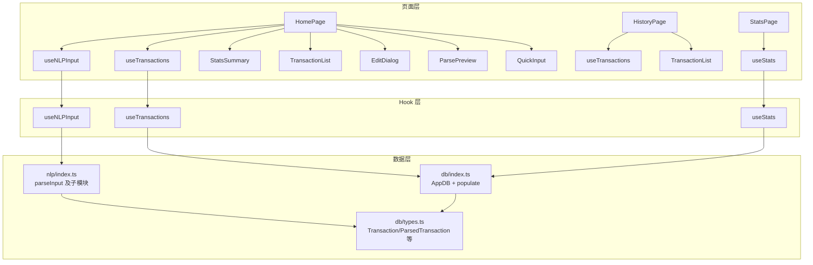
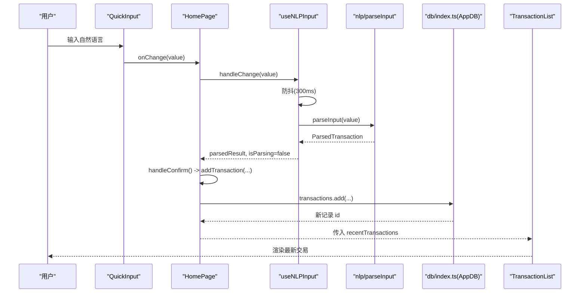
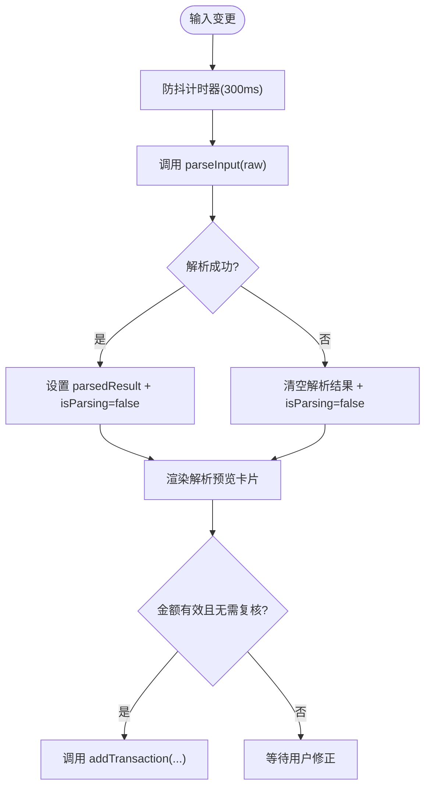
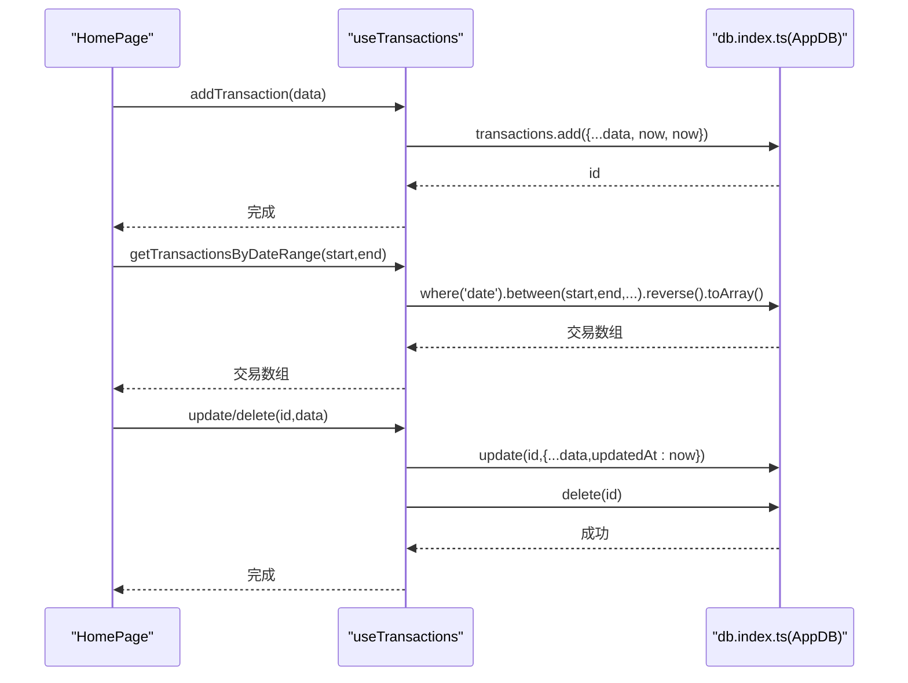
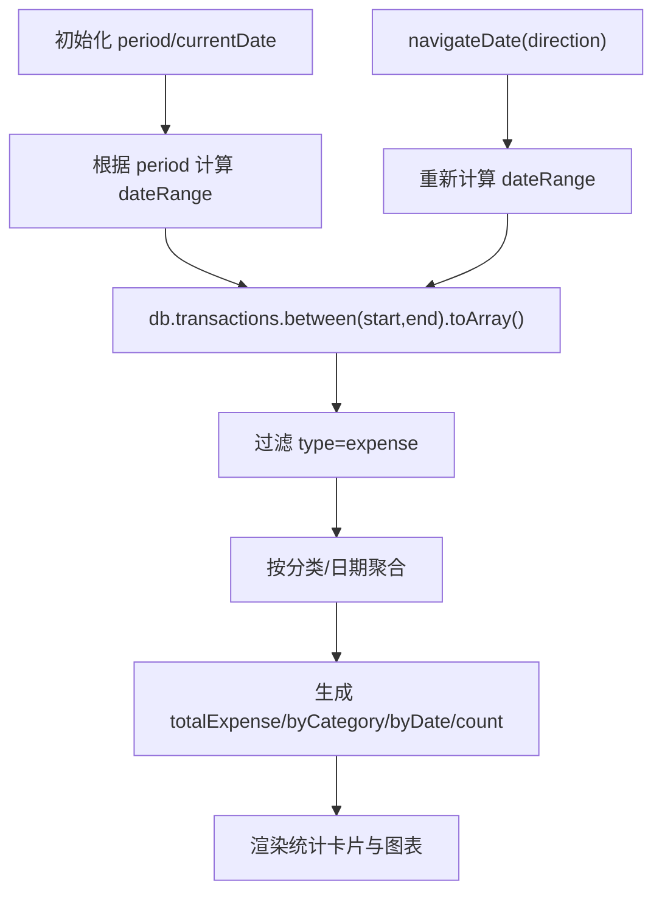
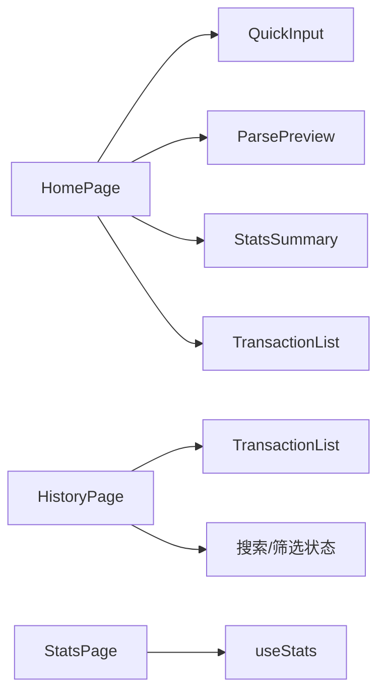
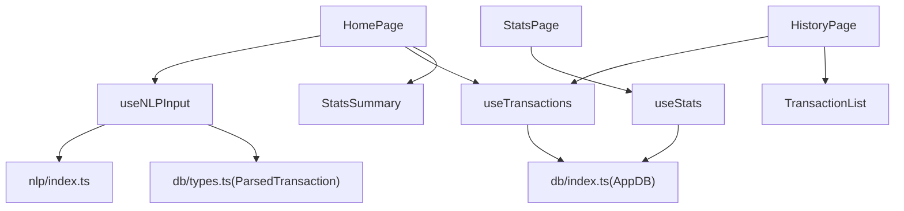
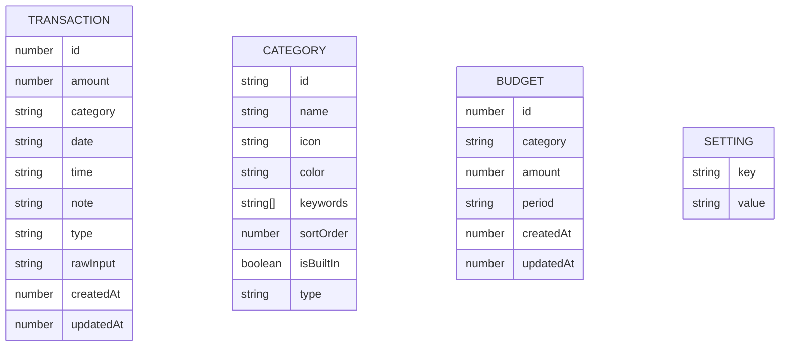

# 状态管理

<cite>
**本文引用的文件**
- [src/hooks/useNLPInput.ts](file://src/hooks/useNLPInput.ts)
- [src/hooks/useTransactions.ts](file://src/hooks/useTransactions.ts)
- [src/hooks/useStats.ts](file://src/hooks/useStats.ts)
- [src/nlp/index.ts](file://src/nlp/index.ts)
- [src/db/types.ts](file://src/db/types.ts)
- [src/db/index.ts](file://src/db/index.ts)
- [src/utils/constants.ts](file://src/utils/constants.ts)
- [src/pages/HomePage.tsx](file://src/pages/HomePage.tsx)
- [src/pages/HistoryPage.tsx](file://src/pages/HistoryPage.tsx)
- [src/pages/StatsPage.tsx](file://src/pages/StatsPage.tsx)
- [src/components/input/QuickInput.tsx](file://src/components/input/QuickInput.tsx)
- [src/components/input/ParsePreview.tsx](file://src/components/input/ParsePreview.tsx)
- [src/components/transaction/TransactionList.tsx](file://src/components/transaction/TransactionList.tsx)
- [src/components/stats/StatsSummary.tsx](file://src/components/stats/StatsSummary.tsx)
</cite>

## 目录
1. [简介](#简介)
2. [项目结构](#项目结构)
3. [核心组件](#核心组件)
4. [架构总览](#架构总览)
5. [详细组件分析](#详细组件分析)
6. [依赖关系分析](#依赖关系分析)
7. [性能考量](#性能考量)
8. [故障排查指南](#故障排查指南)
9. [结论](#结论)
10. [附录](#附录)

## 简介
本文件系统性梳理 MoneyNote 的状态管理方案，重点围绕 React Hooks 模式与本地数据库（IndexedDB/Dexie）的结合使用，解释自定义 Hook 的职责、参数与返回值，以及跨组件的数据流与通信机制。文档覆盖以下主题：
- useNLPInput：自然语言输入解析与预览状态管理
- useTransactions：交易数据的读取、增删改与聚合指标
- useStats：统计周期切换、时间窗口计算与派生统计
- 状态提升、数据流与组件通信
- 状态持久化、异步处理与错误边界
- 性能优化、最佳实践与调试方法
- 扩展思路与第三方状态库集成建议

## 项目结构
本项目采用“按功能域划分”的目录组织方式，状态管理相关代码主要集中在 hooks、pages、components 与 db 目录中：
- hooks：封装可复用的状态逻辑与副作用
- pages：页面级容器，组合多个 Hook 并向下传递 props
- components：UI 组件，接收来自 Hook 的状态与回调
- db：数据库定义与默认数据初始化
- nlp：自然语言解析模块，为 useNLPInput 提供解析能力
- utils：常量与工具函数（如周期类型）

图表来源
- [src/pages/HomePage.tsx:13-99](file://src/pages/HomePage.tsx#L13-L99)
- [src/pages/HistoryPage.tsx:12-104](file://src/pages/HistoryPage.tsx#L12-L104)
- [src/pages/StatsPage.tsx:8-37](file://src/pages/StatsPage.tsx#L8-L37)
- [src/hooks/useNLPInput.ts:5-50](file://src/hooks/useNLPInput.ts#L5-L50)
- [src/hooks/useTransactions.ts:6-66](file://src/hooks/useTransactions.ts#L6-L66)
- [src/hooks/useStats.ts:7-78](file://src/hooks/useStats.ts#L7-L78)
- [src/db/index.ts:1-14](file://src/db/index.ts#L1-L14)
- [src/db/types.ts:3-60](file://src/db/types.ts#L3-L60)
- [src/nlp/index.ts:8-55](file://src/nlp/index.ts#L8-L55)

章节来源
- [src/pages/HomePage.tsx:13-99](file://src/pages/HomePage.tsx#L13-L99)
- [src/pages/HistoryPage.tsx:12-104](file://src/pages/HistoryPage.tsx#L12-L104)
- [src/pages/StatsPage.tsx:8-37](file://src/pages/StatsPage.tsx#L8-L37)
- [src/hooks/useNLPInput.ts:5-50](file://src/hooks/useNLPInput.ts#L5-L50)
- [src/hooks/useTransactions.ts:6-66](file://src/hooks/useTransactions.ts#L6-L66)
- [src/hooks/useStats.ts:7-78](file://src/hooks/useStats.ts#L7-L78)
- [src/db/index.ts:1-14](file://src/db/index.ts#L1-L14)
- [src/db/types.ts:3-60](file://src/db/types.ts#L3-L60)
- [src/nlp/index.ts:8-55](file://src/nlp/index.ts#L8-L55)

## 核心组件
本节聚焦三个自定义 Hook 的职责、参数与返回值，以及它们如何驱动页面行为。

- useNLPInput
  - 职责：管理自然语言输入、防抖解析、解析结果缓存与编辑
  - 关键状态：inputValue、parsedResult、isParsing
  - 关键回调：handleChange(value)、clearInput()、updateParsedResult(updates)
  - 返回对象：{ inputValue, parsedResult, isParsing, handleChange, clearInput, updateParsedResult }

- useTransactions
  - 职责：查询交易、按日期范围过滤、增删改、聚合指标（今日/当月支出）
  - 查询：recentTransactions、getTransactionsByDateRange(start, end)
  - 写操作：addTransaction(data)、updateTransaction(id, data)、deleteTransaction(id)
  - 聚合：todayExpense、monthExpense
  - 返回对象：{ recentTransactions, getTransactionsByDateRange, addTransaction, updateTransaction, deleteTransaction, todayExpense, monthExpense }

- useStats
  - 职责：管理统计周期与当前日期、计算日期区间、派生统计、导航
  - 状态：period、currentDate
  - 计算：dateRange、transactions、stats（总支出、按分类、按日期、数量）
  - 导航：navigateDate(direction)
  - 返回对象：{ period, setPeriod, currentDate, dateRange, stats, transactions, navigateDate, periodLabel }

章节来源
- [src/hooks/useNLPInput.ts:5-50](file://src/hooks/useNLPInput.ts#L5-L50)
- [src/hooks/useTransactions.ts:6-66](file://src/hooks/useTransactions.ts#L6-L66)
- [src/hooks/useStats.ts:7-78](file://src/hooks/useStats.ts#L7-L78)

## 架构总览
下图展示从页面到 Hook、再到数据库与 NLP 解析的整体数据流与交互关系。

图表来源
- [src/pages/HomePage.tsx:14-34](file://src/pages/HomePage.tsx#L14-L34)
- [src/hooks/useNLPInput.ts:11-30](file://src/hooks/useNLPInput.ts#L11-L30)
- [src/nlp/index.ts:8-55](file://src/nlp/index.ts#L8-L55)
- [src/db/index.ts:1-14](file://src/db/index.ts#L1-L14)
- [src/components/input/QuickInput.tsx:11-22](file://src/components/input/QuickInput.tsx#L11-L22)
- [src/components/transaction/TransactionList.tsx:12-49](file://src/components/transaction/TransactionList.tsx#L12-L49)

## 详细组件分析

### useNLPInput：自然语言输入与解析预览
- 状态与行为
  - inputValue：受控输入值
  - parsedResult：解析后的交易结构（金额、分类、日期、备注等），可能需要人工确认
  - isParsing：解析进行中指示
  - 防抖：输入变更后延时触发解析，避免频繁调用
  - 清空：重置输入与解析结果
  - 更新：允许局部更新解析结果（如手动修正金额或分类）
- 数据模型
  - ParsedTransaction 定义于数据库类型文件，包含置信度与是否需要复核字段
- 页面集成
  - HomePage 使用该 Hook 管理输入与解析预览卡片，支持一键快速提交

图表来源
- [src/hooks/useNLPInput.ts:11-30](file://src/hooks/useNLPInput.ts#L11-L30)
- [src/nlp/index.ts:8-55](file://src/nlp/index.ts#L8-L55)
- [src/pages/HomePage.tsx:19-34](file://src/pages/HomePage.tsx#L19-L34)

章节来源
- [src/hooks/useNLPInput.ts:5-50](file://src/hooks/useNLPInput.ts#L5-L50)
- [src/nlp/index.ts:8-55](file://src/nlp/index.ts#L8-L55)
- [src/db/types.ts:48-59](file://src/db/types.ts#L48-L59)
- [src/pages/HomePage.tsx:14-34](file://src/pages/HomePage.tsx#L14-L34)
- [src/components/input/ParsePreview.tsx:17-121](file://src/components/input/ParsePreview.tsx#L17-L121)
- [src/components/input/QuickInput.tsx:11-22](file://src/components/input/QuickInput.tsx#L11-L22)

### useTransactions：交易数据读取、增删改与聚合
- 查询与过滤
  - 最近交易：按日期倒序取前 10 条
  - 指定日期范围：闭区间 between 查询
- 写操作
  - 新增：自动填充 createdAt/updatedAt
  - 更新：统一更新 updatedAt
  - 删除：按 id 删除
- 聚合指标
  - 今日支出：基于 [type+date] 复合索引过滤并求和
  - 本月支出：构造月初/月末日期区间后过滤求和
- 页面集成
  - HomePage：显示最近交易、今日/月度汇总
  - HistoryPage：全量交易列表与搜索/筛选

图表来源
- [src/hooks/useTransactions.ts:8-39](file://src/hooks/useTransactions.ts#L8-L39)
- [src/db/index.ts:1-14](file://src/db/index.ts#L1-L14)
- [src/pages/HomePage.tsx:22-30](file://src/pages/HomePage.tsx#L22-L30)
- [src/pages/HistoryPage.tsx:19-21](file://src/pages/HistoryPage.tsx#L19-L21)

章节来源
- [src/hooks/useTransactions.ts:6-66](file://src/hooks/useTransactions.ts#L6-L66)
- [src/pages/HomePage.tsx:15-50](file://src/pages/HomePage.tsx#L15-L50)
- [src/pages/HistoryPage.tsx:12-50](file://src/pages/HistoryPage.tsx#L12-L50)
- [src/components/transaction/TransactionList.tsx:12-49](file://src/components/transaction/TransactionList.tsx#L12-L49)

### useStats：周期统计与派生数据
- 周期管理
  - period：day/month/year
  - currentDate：当前基准日期
  - dateRange：根据 period 与 currentDate 计算开始/结束日期
- 数据源与派生
  - transactions：基于 dateRange 的实时查询
  - stats：按 expense 过滤，计算 totalExpense、byCategory、byDate、count
- 导航与标签
  - navigateDate：按 period 步进/回退
  - periodLabel：格式化显示文本
- 页面集成
  - StatsPage：周期切换器、总支出卡片、饼图与趋势图

图表来源
- [src/hooks/useStats.ts:11-48](file://src/hooks/useStats.ts#L11-L48)
- [src/pages/StatsPage.tsx:8-37](file://src/pages/StatsPage.tsx#L8-L37)
- [src/utils/constants.ts:12-19](file://src/utils/constants.ts#L12-L19)

章节来源
- [src/hooks/useStats.ts:7-78](file://src/hooks/useStats.ts#L7-L78)
- [src/pages/StatsPage.tsx:8-37](file://src/pages/StatsPage.tsx#L8-L37)
- [src/utils/constants.ts:12-19](file://src/utils/constants.ts#L12-L19)

### 组件间通信与状态提升
- HomePage
  - 合并 useNLPInput 与 useTransactions，实现“输入-解析-确认-新增-刷新列表”的闭环
  - 将 parsedResult 作为 ParsePreview 的输入，支持用户修正后再提交
  - 将 recentTransactions 传给 TransactionList，实现“输入即刷新”
- HistoryPage
  - 在本地维护搜索词与分类筛选状态，通过 useMemo 过滤交易列表
  - 与 useTransactions 协作完成编辑与删除
- StatsPage
  - 通过 useStats 的 period 与 navigateDate 实现周期切换
  - 将派生 stats 与 dateRange 传递给图表组件

图表来源
- [src/pages/HomePage.tsx:13-99](file://src/pages/HomePage.tsx#L13-L99)
- [src/pages/HistoryPage.tsx:12-104](file://src/pages/HistoryPage.tsx#L12-L104)
- [src/pages/StatsPage.tsx:8-37](file://src/pages/StatsPage.tsx#L8-L37)

章节来源
- [src/pages/HomePage.tsx:13-99](file://src/pages/HomePage.tsx#L13-L99)
- [src/pages/HistoryPage.tsx:12-104](file://src/pages/HistoryPage.tsx#L12-L104)
- [src/pages/StatsPage.tsx:8-37](file://src/pages/StatsPage.tsx#L8-L37)

## 依赖关系分析
- 模块耦合
  - useNLPInput 依赖 nlp/index.ts 的 parseInput 与类型 ParsedTransaction
  - useTransactions 与 useStats 依赖 db/index.ts 的 AppDB 与 live query
  - 页面组件通过 props 向下传递状态与回调，形成“单向数据流”
- 外部依赖
  - dexie-react-hooks：提供 useLiveQuery，实现数据库变更的响应式订阅
  - dayjs：用于日期计算与格式化
- 类型一致性
  - db/types.ts 统一定义 Transaction 与 ParsedTransaction，确保 Hook 与组件之间的类型安全

图表来源
- [src/hooks/useNLPInput.ts:1-3](file://src/hooks/useNLPInput.ts#L1-L3)
- [src/nlp/index.ts:1-7](file://src/nlp/index.ts#L1-L7)
- [src/db/types.ts:3-60](file://src/db/types.ts#L3-L60)
- [src/hooks/useTransactions.ts:1-4](file://src/hooks/useTransactions.ts#L1-L4)
- [src/hooks/useStats.ts:1-5](file://src/hooks/useStats.ts#L1-L5)
- [src/pages/HomePage.tsx:8-16](file://src/pages/HomePage.tsx#L8-L16)
- [src/pages/HistoryPage.tsx:6-16](file://src/pages/HistoryPage.tsx#L6-L16)
- [src/pages/StatsPage.tsx:6-9](file://src/pages/StatsPage.tsx#L6-L9)

章节来源
- [src/hooks/useNLPInput.ts:1-3](file://src/hooks/useNLPInput.ts#L1-L3)
- [src/hooks/useTransactions.ts:1-4](file://src/hooks/useTransactions.ts#L1-L4)
- [src/hooks/useStats.ts:1-5](file://src/hooks/useStats.ts#L1-L5)
- [src/db/types.ts:3-60](file://src/db/types.ts#L3-L60)
- [src/nlp/index.ts:1-7](file://src/nlp/index.ts#L1-L7)

## 性能考量
- 防抖与去抖
  - useNLPInput 对输入变更进行 300ms 防抖，减少解析压力与 UI 抖动
- 响应式查询
  - useTransactions 与 useStats 使用 useLiveQuery，仅在依赖变化时重新查询，避免手动订阅与内存泄漏
- 计算缓存
  - useStats 使用 useMemo 缓存 dateRange 与 stats，降低重复计算成本
- 本地过滤
  - HistoryPage 在组件内使用 useMemo 对交易列表进行本地过滤，避免每次渲染都执行昂贵运算
- 渲染优化
  - TransactionList 按日期分组渲染，减少不必要的子节点重排

章节来源
- [src/hooks/useNLPInput.ts:11-30](file://src/hooks/useNLPInput.ts#L11-L30)
- [src/hooks/useTransactions.ts:8-19](file://src/hooks/useTransactions.ts#L8-L19)
- [src/hooks/useStats.ts:11-29](file://src/hooks/useStats.ts#L11-L29)
- [src/pages/HistoryPage.tsx:23-37](file://src/pages/HistoryPage.tsx#L23-L37)
- [src/components/transaction/TransactionList.tsx:17-26](file://src/components/transaction/TransactionList.tsx#L17-L26)

## 故障排查指南
- 解析失败或为空
  - 现象：输入为空或解析结果为 null
  - 排查：确认 parseInput 的输入非空；检查 normalize/extractAmount/dateParser/categoryMatcher 的中间结果
  - 参考路径：[src/nlp/index.ts:8-21](file://src/nlp/index.ts#L8-L21)
- 解析结果需要复核
  - 现象：needsReview 为 true，需用户确认金额或分类
  - 排查：检查 amountConfidence 与 categoryConfidence 是否为 low；确认 ParsePreview 的修正入口是否可用
  - 参考路径：[src/components/input/ParsePreview.tsx:93-107](file://src/components/input/ParsePreview.tsx#L93-L107)
- 数据库写入异常
  - 现象：add/update/delete 无反应或报错
  - 排查：确认 AppDB 初始化与 populate 是否执行；检查事务权限与表结构
  - 参考路径：[src/db/index.ts:7-10](file://src/db/index.ts#L7-L10)
- 查询结果不更新
  - 现象：交易列表未随新增/修改而刷新
  - 排查：确认 useLiveQuery 的依赖数组是否正确；确认页面是否使用 recentTransactions 或重新查询
  - 参考路径：[src/hooks/useTransactions.ts:8-19](file://src/hooks/useTransactions.ts#L8-L19)
- 统计不准确
  - 现象：总支出/分类统计与预期不符
  - 排查：核对 dateRange 计算与过滤条件；确认只统计 expense 类型
  - 参考路径：[src/hooks/useStats.ts:31-48](file://src/hooks/useStats.ts#L31-L48)

章节来源
- [src/nlp/index.ts:8-21](file://src/nlp/index.ts#L8-L21)
- [src/components/input/ParsePreview.tsx:93-107](file://src/components/input/ParsePreview.tsx#L93-L107)
- [src/db/index.ts:7-10](file://src/db/index.ts#L7-L10)
- [src/hooks/useTransactions.ts:8-19](file://src/hooks/useTransactions.ts#L8-L19)
- [src/hooks/useStats.ts:31-48](file://src/hooks/useStats.ts#L31-L48)

## 结论
本项目以 React Hooks 为核心，结合 Dexie 的 useLiveQuery 实现了高效、可维护的状态管理方案：
- useNLPInput：通过防抖与解析结果缓存，平衡用户体验与性能
- useTransactions：统一的 CRUD 与聚合指标，简化页面逻辑
- useStats：周期化与派生数据，支撑可视化与报表
- 页面层通过 props 下发状态与回调，形成清晰的单向数据流
- 数据持久化由 IndexedDB/Dexie 负责，无需额外服务端状态管理

## 附录

### 数据模型关系

图表来源
- [src/db/types.ts:3-39](file://src/db/types.ts#L3-L39)

### 最佳实践与扩展建议
- 最佳实践
  - 使用 useMemo 缓存派生数据，避免重复计算
  - 使用 useLiveQuery 替代手动订阅，确保组件卸载时自动清理
  - 将 UI 与状态逻辑解耦，通过 props 传递状态与回调
  - 对输入进行防抖与校验，提升交互体验
- 扩展建议
  - 若业务复杂度上升，可考虑引入 Zustand 或 Jotai 作为轻量全局状态库，保留现有 Hook 作为局部状态
  - 对历史数据导出/导入增加批量操作与进度反馈
  - 为关键查询增加错误边界与重试机制，增强健壮性