# 统计数据计算Hook

<cite>
**本文档引用的文件**
- [useStats.ts](file://src/hooks/useStats.ts)
- [StatsPage.tsx](file://src/pages/StatsPage.tsx)
- [StatsSummary.tsx](file://src/components/stats/StatsSummary.tsx)
- [CategoryPieChart.tsx](file://src/components/stats/CategoryPieChart.tsx)
- [TrendLineChart.tsx](file://src/components/stats/TrendLineChart.tsx)
- [PeriodSwitcher.tsx](file://src/components/stats/PeriodSwitcher.tsx)
- [constants.ts](file://src/utils/constants.ts)
- [dateHelpers.ts](file://src/utils/dateHelpers.ts)
- [format.ts](file://src/utils/format.ts)
- [types.ts](file://src/db/types.ts)
- [schema.ts](file://src/db/schema.ts)
- [index.ts](file://src/db/index.ts)
</cite>

## 目录
1. [简介](#简介)
2. [项目结构](#项目结构)
3. [核心组件](#核心组件)
4. [架构概览](#架构概览)
5. [详细组件分析](#详细组件分析)
6. [依赖关系分析](#依赖关系分析)
7. [性能考虑](#性能考虑)
8. [故障排除指南](#故障排除指南)
9. [结论](#结论)

## 简介

useStats Hook 是 MoneyNote 应用中的核心统计数据计算模块，负责处理个人财务数据的统计分析。该Hook实现了完整的收支统计、分类分析、趋势预测等功能，为用户提供了全面的财务洞察。

本Hook的主要功能包括：
- 收入、支出、结余等核心财务指标的实时计算
- 按日、周、月、年多时间维度的数据聚合
- 分类统计和可视化展示
- 趋势分析和预测算法
- 数据缓存和性能优化策略

## 项目结构

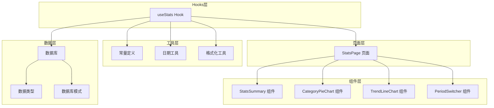

**图表来源**
- [useStats.ts:1-79](file://src/hooks/useStats.ts#L1-L79)
- [StatsPage.tsx:1-38](file://src/pages/StatsPage.tsx#L1-L38)

**章节来源**
- [useStats.ts:1-79](file://src/hooks/useStats.ts#L1-L79)
- [StatsPage.tsx:1-38](file://src/pages/StatsPage.tsx#L1-L38)

## 核心组件

### useStats Hook 架构

useStats Hook 采用 React Hooks 的设计理念，通过状态管理和计算属性实现高效的数据统计：

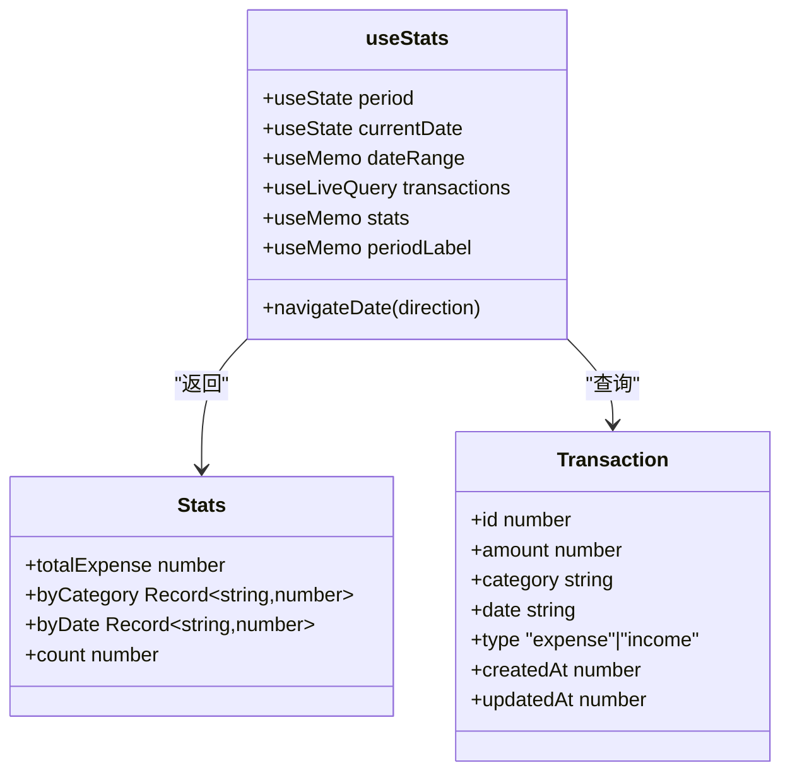

**图表来源**
- [useStats.ts:7-78](file://src/hooks/useStats.ts#L7-L78)
- [types.ts:3-14](file://src/db/types.ts#L3-L14)

### 数据流处理

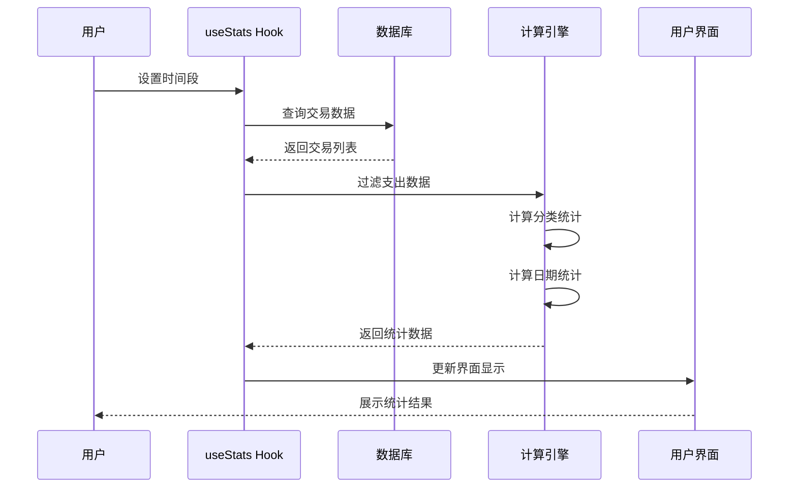

**图表来源**
- [useStats.ts:22-48](file://src/hooks/useStats.ts#L22-L48)
- [schema.ts:13-18](file://src/db/schema.ts#L13-L18)

**章节来源**
- [useStats.ts:1-79](file://src/hooks/useStats.ts#L1-L79)

## 架构概览

### 统计数据计算架构

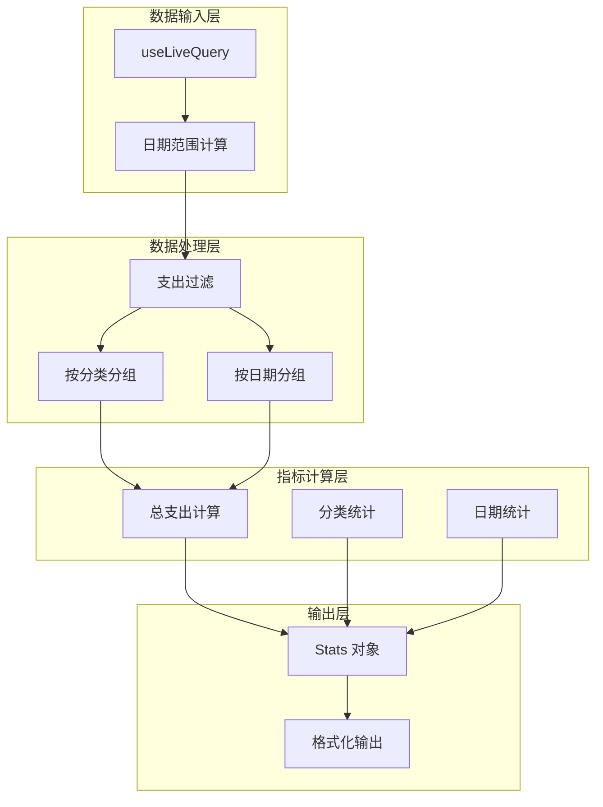

**图表来源**
- [useStats.ts:31-48](file://src/hooks/useStats.ts#L31-L48)

### 时间周期聚合机制

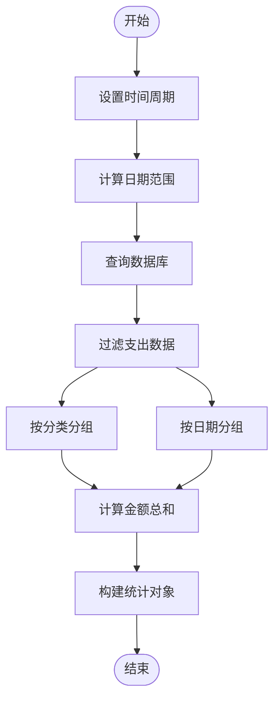

**图表来源**
- [useStats.ts:11-29](file://src/hooks/useStats.ts#L11-L29)
- [useStats.ts:31-48](file://src/hooks/useStats.ts#L31-L48)

**章节来源**
- [useStats.ts:11-66](file://src/hooks/useStats.ts#L11-L66)

## 详细组件分析

### useStats Hook 实现详解

#### 数据查询与缓存

useStats Hook 使用 dexie-react-hooks 的 useLiveQuery 实现响应式数据查询：

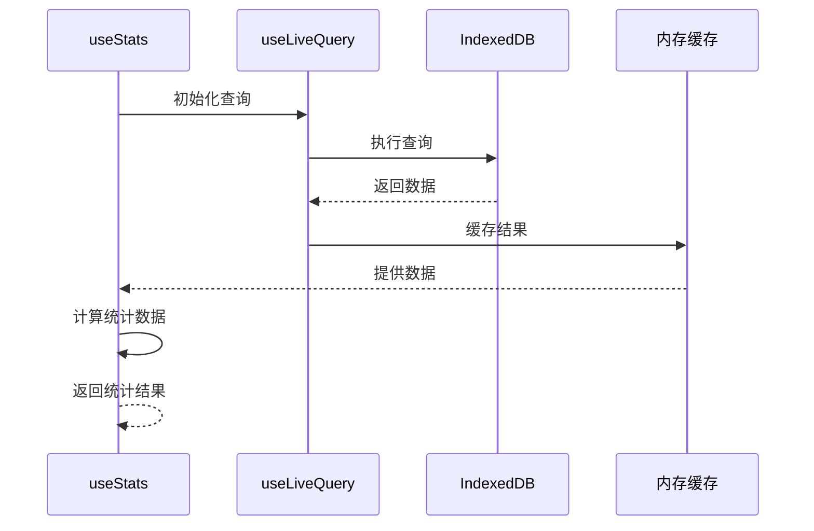

**图表来源**
- [useStats.ts:22-29](file://src/hooks/useStats.ts#L22-L29)

#### 统计指标计算

Hook 实现了三种核心统计指标的计算：

1. **总支出计算**：对所有支出类型的交易金额进行累加
2. **分类统计**：按交易分类聚合支出金额
3. **日期统计**：按日期聚合每日支出金额

**章节来源**
- [useStats.ts:31-48](file://src/hooks/useStats.ts#L31-L48)

### StatsSummary 组件集成

StatsSummary 组件展示了今日支出和本月支出的核心指标：

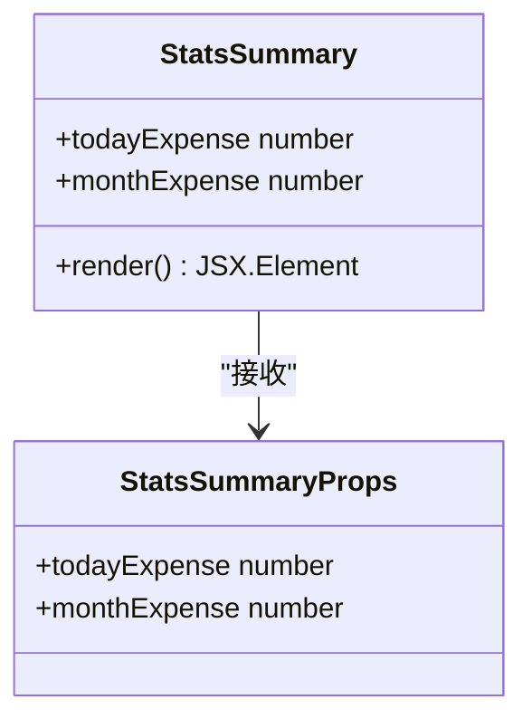

**图表来源**
- [StatsSummary.tsx:3-6](file://src/components/stats/StatsSummary.tsx#L3-L6)

### CategoryPieChart 组件实现

CategoryPieChart 组件负责分类支出的可视化展示：

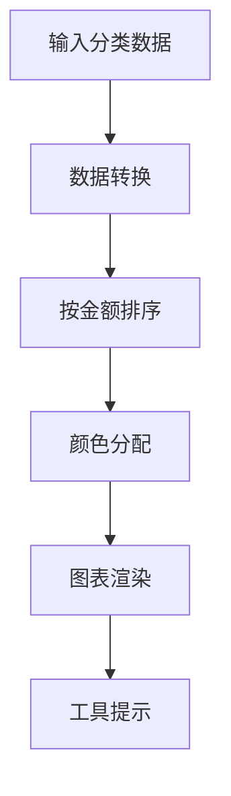

**图表来源**
- [CategoryPieChart.tsx:10-18](file://src/components/stats/CategoryPieChart.tsx#L10-L18)

### TrendLineChart 组件分析

TrendLineChart 组件实现支出趋势的时间序列可视化：

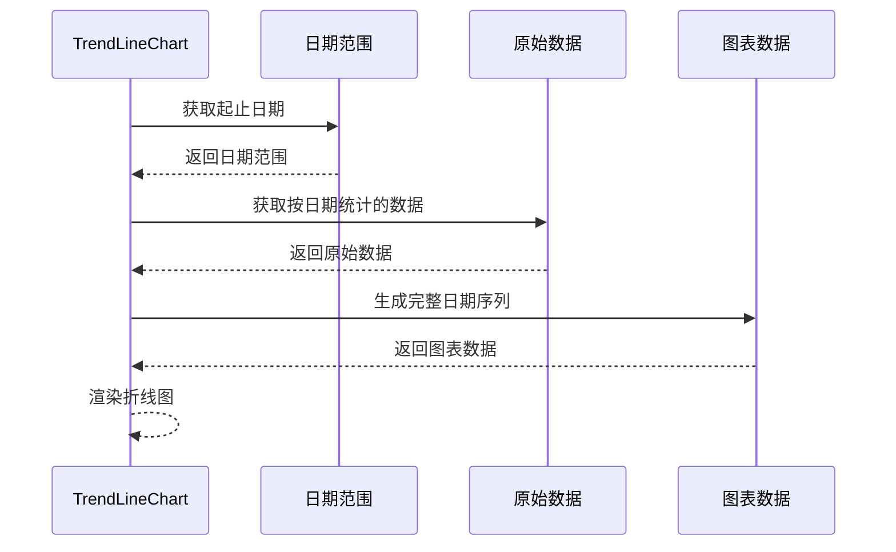

**图表来源**
- [TrendLineChart.tsx:10-21](file://src/components/stats/TrendLineChart.tsx#L10-L21)

**章节来源**
- [CategoryPieChart.tsx:1-61](file://src/components/stats/CategoryPieChart.tsx#L1-L61)
- [TrendLineChart.tsx:1-50](file://src/components/stats/TrendLineChart.tsx#L1-L50)

### PeriodSwitcher 组件交互

PeriodSwitcher 组件提供时间周期切换的用户界面：

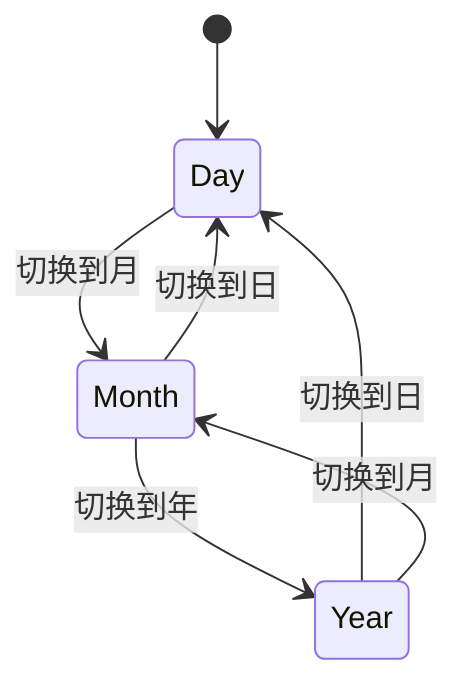

**图表来源**
- [PeriodSwitcher.tsx:12-28](file://src/components/stats/PeriodSwitcher.tsx#L12-L28)

**章节来源**
- [PeriodSwitcher.tsx:1-42](file://src/components/stats/PeriodSwitcher.tsx#L1-L42)

## 依赖关系分析

### 数据库模式设计

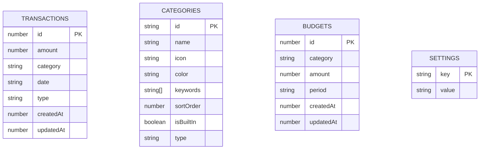

**图表来源**
- [types.ts:3-34](file://src/db/types.ts#L3-L34)
- [schema.ts:13-18](file://src/db/schema.ts#L13-L18)

### 外部依赖关系

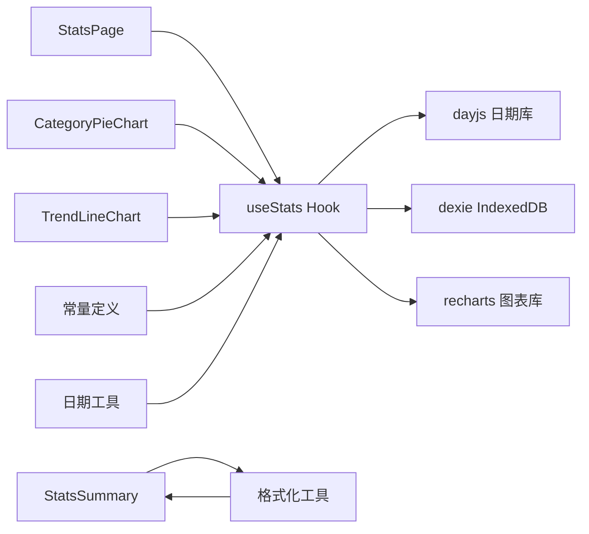

**图表来源**
- [useStats.ts:2-5](file://src/hooks/useStats.ts#L2-L5)
- [StatsPage.tsx:1-6](file://src/pages/StatsPage.tsx#L1-L6)

**章节来源**
- [constants.ts:1-19](file://src/utils/constants.ts#L1-L19)
- [format.ts:1-28](file://src/utils/format.ts#L1-L28)

## 性能考虑

### 缓存策略

useStats Hook 实现了多层次的缓存机制：

1. **数据库查询缓存**：使用 useLiveQuery 自动缓存数据库查询结果
2. **计算结果缓存**：使用 useMemo 缓存统计计算结果
3. **组件级缓存**：React 组件自动缓存渲染结果

### 性能优化建议

1. **索引优化**：数据库事务表使用复合索引 `[type+date]` 支持高效查询
2. **批量更新**：使用 `bulkAdd` 和 `bulkUpdate` 减少数据库操作次数
3. **虚拟滚动**：对于大量数据的列表展示使用虚拟滚动技术
4. **防抖处理**：对频繁的用户交互操作添加防抖机制

### 内存管理

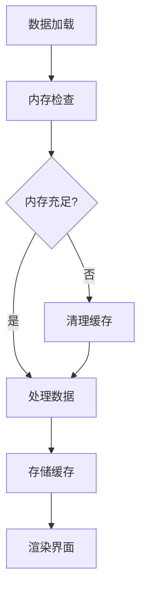

**章节来源**
- [schema.ts:13-18](file://src/db/schema.ts#L13-L18)

## 故障排除指南

### 常见问题及解决方案

#### 数据不更新问题

**症状**：修改交易后统计数据不刷新
**原因**：useLiveQuery 缓存未正确失效
**解决方案**：确保交易数据的 `updatedAt` 字段正确更新

#### 性能问题

**症状**：大数据量时界面卡顿
**原因**：一次性渲染过多数据
**解决方案**：
1. 实现数据分页加载
2. 优化计算复杂度
3. 添加加载状态指示器

#### 数据一致性问题

**症状**：分类统计与总支出不匹配
**原因**：数据计算逻辑错误
**解决方案**：验证 `totalExpense` 计算逻辑

### 错误处理机制

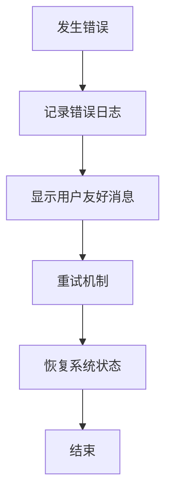

**章节来源**
- [useStats.ts:31-48](file://src/hooks/useStats.ts#L31-L48)

## 结论

useStats Hook 作为 MoneyNote 应用的核心统计模块，展现了优秀的架构设计和实现质量。该Hook通过合理的数据分层、高效的缓存策略和清晰的组件分离，为用户提供了准确、实时的财务统计分析功能。

主要优势包括：
- **模块化设计**：职责清晰，易于维护和扩展
- **性能优化**：多层次缓存机制确保良好的用户体验
- **可扩展性**：支持多种时间周期和统计维度
- **数据完整性**：完善的错误处理和数据校验机制

未来可以考虑的功能增强：
- 添加同比环比分析功能
- 实现更复杂的趋势预测算法
- 支持自定义统计报表
- 增强数据导出和分享功能