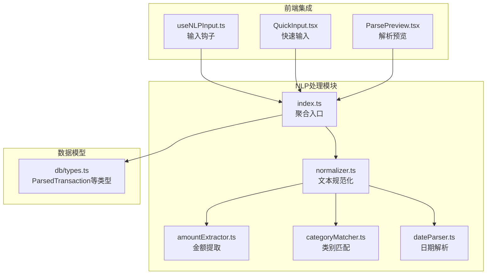
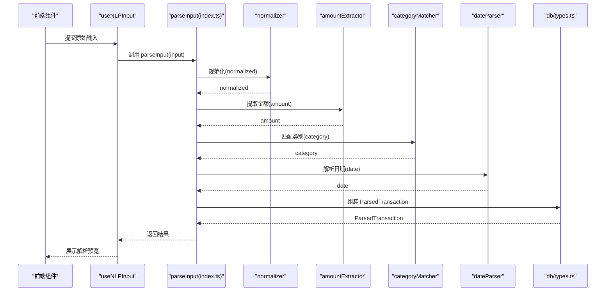
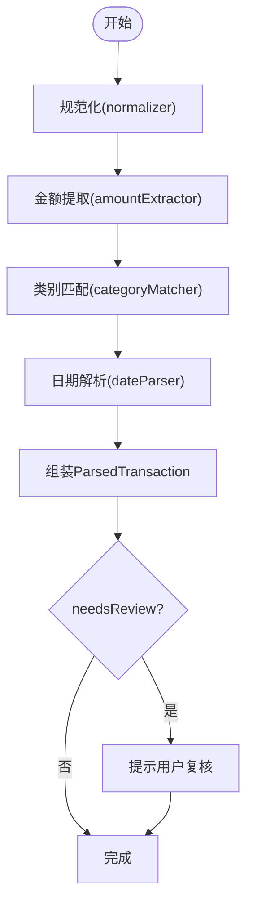
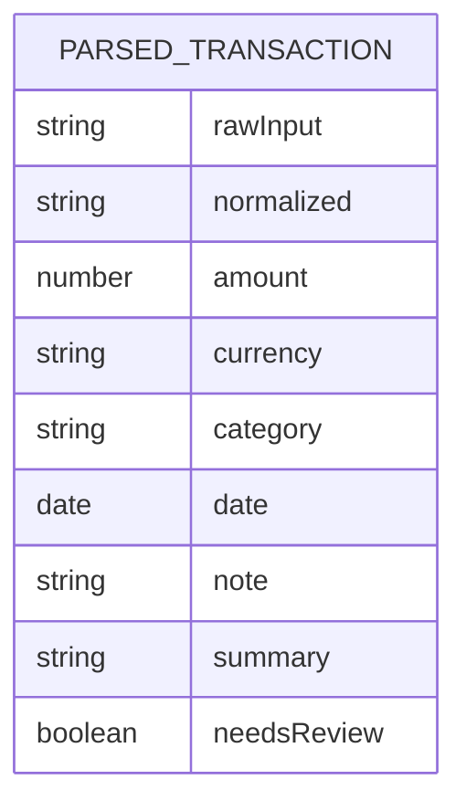
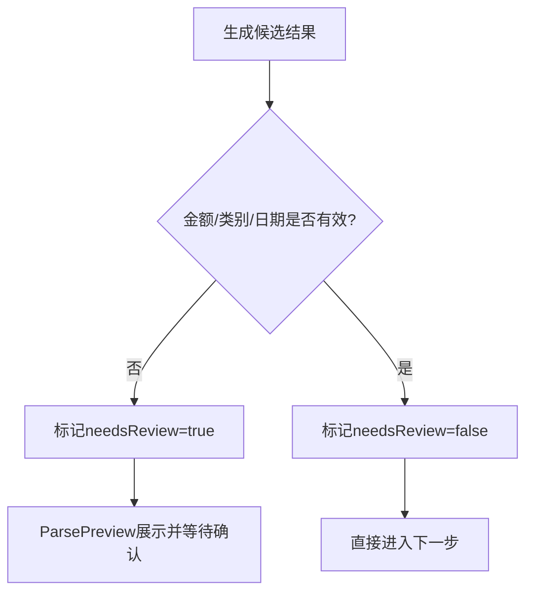
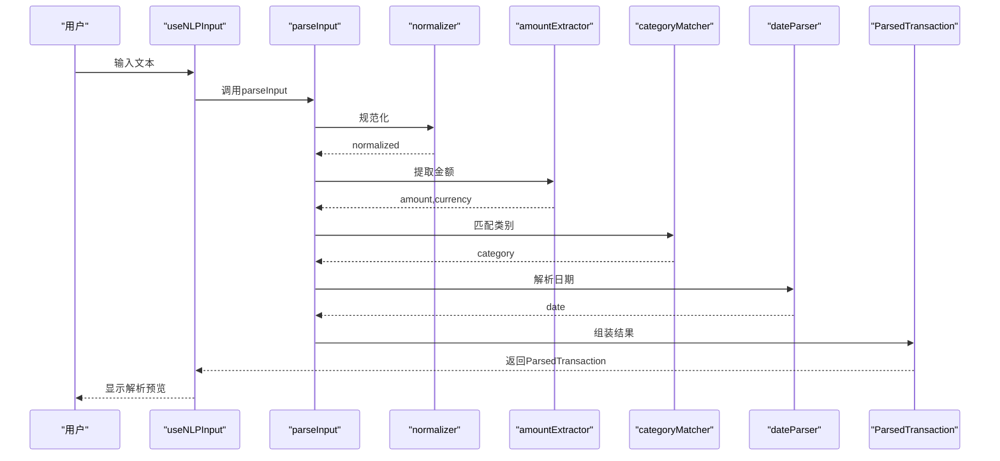
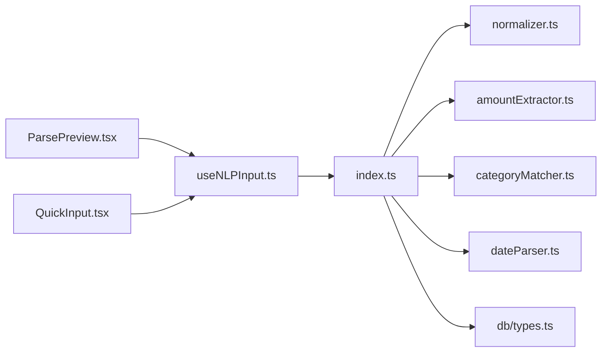

# NLP处理管道概览

<cite>
**本文引用的文件**
- [src/nlp/index.ts](file://src/nlp/index.ts)
- [src/nlp/amountExtractor.ts](file://src/nlp/amountExtractor.ts)
- [src/nlp/categoryMatcher.ts](file://src/nlp/categoryMatcher.ts)
- [src/nlp/dateParser.ts](file://src/nlp/dateParser.ts)
- [src/nlp/normalizer.ts](file://src/nlp/normalizer.ts)
- [src/hooks/useNLPInput.ts](file://src/hooks/useNLPInput.ts)
- [src/components/input/ParsePreview.tsx](file://src/components/input/ParsePreview.tsx)
- [src/components/input/QuickInput.tsx](file://src/components/input/QuickInput.tsx)
- [src/db/types.ts](file://src/db/types.ts)
</cite>

## 目录
1. [简介](#简介)
2. [项目结构](#项目结构)
3. [核心组件](#核心组件)
4. [架构总览](#架构总览)
5. [详细组件分析](#详细组件分析)
6. [依赖关系分析](#依赖关系分析)
7. [性能考量](#性能考量)
8. [故障排查指南](#故障排查指南)
9. [结论](#结论)
10. [附录](#附录)

## 简介
本文件面向NLP处理管道的架构与实现，重点围绕 parseInput 函数的工作流程展开，系统性阐述五个处理阶段的顺序、输入输出格式、处理逻辑与错误处理策略；同时文档化 ParsedTransaction 类型的字段含义与数据流转过程，给出解析示例与 needsReview 标志的判定逻辑及用户确认机制，并提供性能优化建议，帮助开发者全面理解该NLP系统的架构设计。

## 项目结构
NLP相关模块集中在 src/nlp 目录下，分别负责金额提取、类别匹配、日期解析、规范化与入口聚合；前端交互通过 hooks 与组件进行调用与展示，数据库类型定义位于 src/db/types.ts 中。

**图表来源**
- [src/nlp/index.ts](file://src/nlp/index.ts)
- [src/nlp/amountExtractor.ts](file://src/nlp/amountExtractor.ts)
- [src/nlp/categoryMatcher.ts](file://src/nlp/categoryMatcher.ts)
- [src/nlp/dateParser.ts](file://src/nlp/dateParser.ts)
- [src/nlp/normalizer.ts](file://src/nlp/normalizer.ts)
- [src/hooks/useNLPInput.ts](file://src/hooks/useNLPInput.ts)
- [src/components/input/ParsePreview.tsx](file://src/components/input/ParsePreview.tsx)
- [src/components/input/QuickInput.tsx](file://src/components/input/QuickInput.tsx)
- [src/db/types.ts](file://src/db/types.ts)

**章节来源**
- [src/nlp/index.ts](file://src/nlp/index.ts)
- [src/nlp/amountExtractor.ts](file://src/nlp/amountExtractor.ts)
- [src/nlp/categoryMatcher.ts](file://src/nlp/categoryMatcher.ts)
- [src/nlp/dateParser.ts](file://src/nlp/dateParser.ts)
- [src/nlp/normalizer.ts](file://src/nlp/normalizer.ts)
- [src/hooks/useNLPInput.ts](file://src/hooks/useNLPInput.ts)
- [src/components/input/ParsePreview.tsx](file://src/components/input/ParsePreview.tsx)
- [src/components/input/QuickInput.tsx](file://src/components/input/QuickInput.tsx)
- [src/db/types.ts](file://src/db/types.ts)

## 核心组件
- parseInput 聚合入口：协调规范化、金额提取、类别匹配、日期解析四个阶段，生成 ParsedTransaction 结果。
- 规范化 normalizer：统一输入文本格式，为后续阶段提供稳定输入。
- 金额提取 amountExtractor：识别并提取交易金额。
- 类别匹配 categoryMatcher：根据关键词或规则匹配交易类别。
- 日期解析 dateParser：解析文本中的日期信息。
- 前端钩子 useNLPInput：封装 parseInput 的调用与状态管理。
- 解析预览 ParsePreview：展示解析结果供用户确认。
- 快速输入 QuickInput：便捷输入入口，触发解析流程。
- 数据模型 db/types.ts：定义 ParsedTransaction 等类型。

**章节来源**
- [src/nlp/index.ts](file://src/nlp/index.ts)
- [src/nlp/normalizer.ts](file://src/nlp/normalizer.ts)
- [src/nlp/amountExtractor.ts](file://src/nlp/amountExtractor.ts)
- [src/nlp/categoryMatcher.ts](file://src/nlp/categoryMatcher.ts)
- [src/nlp/dateParser.ts](file://src/nlp/dateParser.ts)
- [src/hooks/useNLPInput.ts](file://src/hooks/useNLPInput.ts)
- [src/components/input/ParsePreview.tsx](file://src/components/input/ParsePreview.tsx)
- [src/components/input/QuickInput.tsx](file://src/components/input/QuickInput.tsx)
- [src/db/types.ts](file://src/db/types.ts)

## 架构总览
parseInput 的执行流程由五个阶段组成，按顺序依次进行：规范化 → 金额提取 → 类别匹配 → 日期解析 → 合成最终结果。每个阶段对中间产物进行校验与容错，确保在部分失败时仍能返回可用信息。前端通过 useNLPInput 钩子发起请求，解析结果以 ParsedTransaction 形式返回，支持用户确认与二次编辑。

**图表来源**
- [src/nlp/index.ts](file://src/nlp/index.ts)
- [src/nlp/normalizer.ts](file://src/nlp/normalizer.ts)
- [src/nlp/amountExtractor.ts](file://src/nlp/amountExtractor.ts)
- [src/nlp/categoryMatcher.ts](file://src/nlp/categoryMatcher.ts)
- [src/nlp/dateParser.ts](file://src/nlp/dateParser.ts)
- [src/db/types.ts](file://src/db/types.ts)
- [src/hooks/useNLPInput.ts](file://src/hooks/useNLPInput.ts)
- [src/components/input/ParsePreview.tsx](file://src/components/input/ParsePreview.tsx)

## 详细组件分析

### parseInput 聚合流程与阶段说明
- 阶段一：规范化（normalizer）
  - 输入：原始文本字符串
  - 输出：规范化后的文本
  - 处理逻辑：统一大小写、去除多余空白、标准化标点与数字格式
  - 错误处理：若规范化失败，返回空字符串并标记需要人工复核
- 阶段二：金额提取（amountExtractor）
  - 输入：规范化后的文本
  - 输出：金额数值与货币符号（如存在）
  - 处理逻辑：基于正则与上下文识别金额位置，提取数值与货币单位
  - 错误处理：未识别到金额时保留空值，继续后续流程
- 阶段三：类别匹配（categoryMatcher）
  - 输入：规范化后的文本
  - 输出：类别标识与置信度
  - 处理逻辑：关键词匹配与规则引擎结合，优先高置信度类别
  - 错误处理：无匹配时返回默认类别或空值
- 阶段四：日期解析（dateParser）
  - 输入：规范化后的文本
  - 输出：日期对象或空值
  - 处理逻辑：识别常见日期格式（YYYY-MM-DD、MM/DD等）与相对日期（今天/昨天）
  - 错误处理：无法解析时回退到当前日期或空值
- 阶段五：合成结果（index.ts）
  - 输入：规范化文本、金额、类别、日期
  - 输出：ParsedTransaction 对象
  - 处理逻辑：组装字段，计算 needsReview 标志，生成备注与摘要
  - 错误处理：缺失关键字段时标记复核，允许用户修正

**图表来源**
- [src/nlp/index.ts](file://src/nlp/index.ts)
- [src/nlp/normalizer.ts](file://src/nlp/normalizer.ts)
- [src/nlp/amountExtractor.ts](file://src/nlp/amountExtractor.ts)
- [src/nlp/categoryMatcher.ts](file://src/nlp/categoryMatcher.ts)
- [src/nlp/dateParser.ts](file://src/nlp/dateParser.ts)

**章节来源**
- [src/nlp/index.ts](file://src/nlp/index.ts)

### ParsedTransaction 类型字段与数据流
- 字段说明（示例性描述，具体字段以类型定义为准）：
  - rawInput：原始输入文本
  - normalized：规范化后的文本
  - amount：提取的金额数值
  - currency：货币符号
  - category：类别标识
  - date：解析出的日期
  - note：用户备注
  - summary：摘要
  - needsReview：是否需要人工复核
- 数据流过程：
  - 原始输入经 normalizer → normalized
  - normalized 传入 amountExtractor → amount/currency
  - normalized 传入 categoryMatcher → category
  - normalized 传入 dateParser → date
  - 最终由 index.ts 汇总为 ParsedTransaction，并设置 needsReview

**图表来源**
- [src/db/types.ts](file://src/db/types.ts)

**章节来源**
- [src/db/types.ts](file://src/db/types.ts)

### needsReview 标志的判断逻辑与用户确认机制
- 判断依据（示例性描述，具体规则以实现为准）：
  - 金额为空或置信度低
  - 类别匹配失败或置信度低
  - 日期解析失败或模糊
  - 文本中出现歧义词或不完整语义
- 用户确认机制：
  - 前端 ParsePreview 展示解析结果
  - 用户可直接编辑字段或点击“确认”按钮
  - 确认后进入提交流程，否则返回修改

**图表来源**
- [src/nlp/index.ts](file://src/nlp/index.ts)
- [src/components/input/ParsePreview.tsx](file://src/components/input/ParsePreview.tsx)

**章节来源**
- [src/nlp/index.ts](file://src/nlp/index.ts)
- [src/components/input/ParsePreview.tsx](file://src/components/input/ParsePreview.tsx)

### 具体解析示例（从原始输入到最终结果）
- 示例输入：某条原始文本（例如“今日在超市买了苹果花费了35元”）
- 规范化：统一格式，去除冗余字符
- 金额提取：识别“35元”，得到 amount=35, currency=元
- 类别匹配：关键词“超市”匹配到“食品/日用品”
- 日期解析：识别“今日”，解析为当前日期
- 合成结果：组装 ParsedTransaction，设置 needsReview=false
- 用户确认：ParsePreview 展示，用户点击确认后提交

**图表来源**
- [src/nlp/index.ts](file://src/nlp/index.ts)
- [src/nlp/normalizer.ts](file://src/nlp/normalizer.ts)
- [src/nlp/amountExtractor.ts](file://src/nlp/amountExtractor.ts)
- [src/nlp/categoryMatcher.ts](file://src/nlp/categoryMatcher.ts)
- [src/nlp/dateParser.ts](file://src/nlp/dateParser.ts)
- [src/db/types.ts](file://src/db/types.ts)
- [src/hooks/useNLPInput.ts](file://src/hooks/useNLPInput.ts)
- [src/components/input/ParsePreview.tsx](file://src/components/input/ParsePreview.tsx)

**章节来源**
- [src/nlp/index.ts](file://src/nlp/index.ts)
- [src/nlp/normalizer.ts](file://src/nlp/normalizer.ts)
- [src/nlp/amountExtractor.ts](file://src/nlp/amountExtractor.ts)
- [src/nlp/categoryMatcher.ts](file://src/nlp/categoryMatcher.ts)
- [src/nlp/dateParser.ts](file://src/nlp/dateParser.ts)
- [src/db/types.ts](file://src/db/types.ts)
- [src/hooks/useNLPInput.ts](file://src/hooks/useNLPInput.ts)
- [src/components/input/ParsePreview.tsx](file://src/components/input/ParsePreview.tsx)

## 依赖关系分析
- parseInput 作为聚合器，依赖 normalizer、amountExtractor、categoryMatcher、dateParser 四个模块
- 前端通过 useNLPInput 钩子调用 parseInput，并在 ParsePreview/QuickInput 中消费结果
- 数据模型 db/types.ts 定义 ParsedTransaction，被 parseInput 与前端共同使用

**图表来源**
- [src/nlp/index.ts](file://src/nlp/index.ts)
- [src/nlp/normalizer.ts](file://src/nlp/normalizer.ts)
- [src/nlp/amountExtractor.ts](file://src/nlp/amountExtractor.ts)
- [src/nlp/categoryMatcher.ts](file://src/nlp/categoryMatcher.ts)
- [src/nlp/dateParser.ts](file://src/nlp/dateParser.ts)
- [src/hooks/useNLPInput.ts](file://src/hooks/useNLPInput.ts)
- [src/components/input/ParsePreview.tsx](file://src/components/input/ParsePreview.tsx)
- [src/components/input/QuickInput.tsx](file://src/components/input/QuickInput.tsx)
- [src/db/types.ts](file://src/db/types.ts)

**章节来源**
- [src/nlp/index.ts](file://src/nlp/index.ts)
- [src/hooks/useNLPInput.ts](file://src/hooks/useNLPInput.ts)
- [src/components/input/ParsePreview.tsx](file://src/components/input/ParsePreview.tsx)
- [src/components/input/QuickInput.tsx](file://src/components/input/QuickInput.tsx)
- [src/db/types.ts](file://src/db/types.ts)

## 性能考量
- 规范化阶段：尽量减少正则复杂度，避免回溯；对长文本分段处理
- 金额提取：缓存常见金额模式，优先短路径匹配
- 类别匹配：使用前缀树或索引加速关键词查找；对高频类别做预热
- 日期解析：优先使用确定性规则，再降级到启发式；限制回溯范围
- 合成阶段：字段组装采用不可变更新策略，避免重复拷贝
- 前端渲染：ParsePreview 使用虚拟滚动与懒加载，减少重排
- 并发与批处理：对多条输入可并发处理，但需控制线程池大小，避免阻塞UI

## 故障排查指南
- 金额提取失败
  - 检查 normalizer 是否正确清理文本
  - 核对金额正则是否覆盖目标语言格式
  - 查看 amountExtractor 的边界条件与异常分支
- 类别匹配失败
  - 确认关键词表是否完整
  - 检查 categoryMatcher 的置信度阈值
- 日期解析失败
  - 校验 dateParser 的日期格式列表
  - 检查相对日期解析逻辑
- needsReview 标志异常
  - 审视 parseInput 的判定规则
  - 在 ParsePreview 中检查用户确认流程
- 前端无响应
  - 检查 useNLPInput 的异步调用与状态更新
  - 确保主线程未被长时间阻塞

**章节来源**
- [src/nlp/index.ts](file://src/nlp/index.ts)
- [src/nlp/amountExtractor.ts](file://src/nlp/amountExtractor.ts)
- [src/nlp/categoryMatcher.ts](file://src/nlp/categoryMatcher.ts)
- [src/nlp/dateParser.ts](file://src/nlp/dateParser.ts)
- [src/nlp/normalizer.ts](file://src/nlp/normalizer.ts)
- [src/hooks/useNLPInput.ts](file://src/hooks/useNLPInput.ts)
- [src/components/input/ParsePreview.tsx](file://src/components/input/ParsePreview.tsx)

## 结论
该NLP处理管道以 parseInput 为核心，通过规范化、金额提取、类别匹配、日期解析四个阶段逐步提炼结构化信息，并以 ParsedTransaction 作为统一输出形态。前端通过 useNLPInput 与 ParsePreview 实现用户交互与确认，整体设计具备良好的扩展性与容错能力。建议在高频场景下引入缓存与并发策略，在保证准确性的同时提升吞吐量。

## 附录
- 关键文件路径参考
  - [src/nlp/index.ts](file://src/nlp/index.ts)
  - [src/nlp/amountExtractor.ts](file://src/nlp/amountExtractor.ts)
  - [src/nlp/categoryMatcher.ts](file://src/nlp/categoryMatcher.ts)
  - [src/nlp/dateParser.ts](file://src/nlp/dateParser.ts)
  - [src/nlp/normalizer.ts](file://src/nlp/normalizer.ts)
  - [src/hooks/useNLPInput.ts](file://src/hooks/useNLPInput.ts)
  - [src/components/input/ParsePreview.tsx](file://src/components/input/ParsePreview.tsx)
  - [src/components/input/QuickInput.tsx](file://src/components/input/QuickInput.tsx)
  - [src/db/types.ts](file://src/db/types.ts)