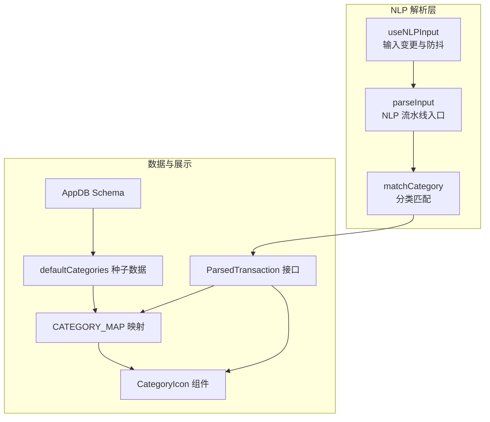
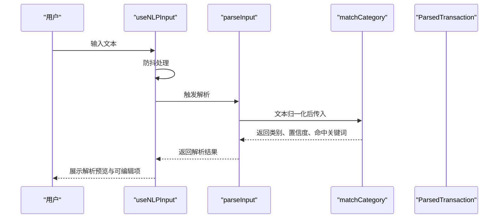
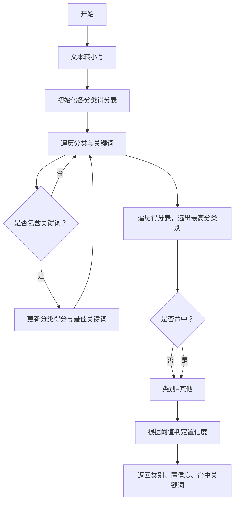
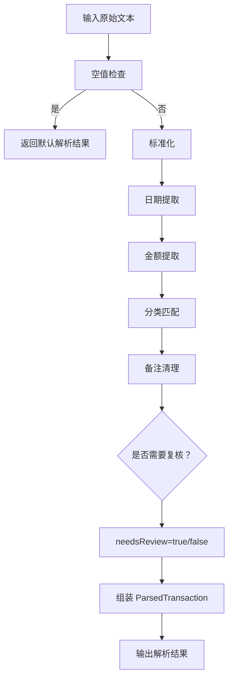
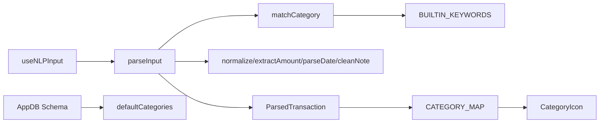

# 分类匹配系统

<cite>
**本文引用的文件**
- [src/nlp/categoryMatcher.ts](file://src/nlp/categoryMatcher.ts)
- [src/nlp/index.ts](file://src/nlp/index.ts)
- [src/hooks/useNLPInput.ts](file://src/hooks/useNLPInput.ts)
- [src/db/types.ts](file://src/db/types.ts)
- [src/db/schema.ts](file://src/db/schema.ts)
- [src/db/seed.ts](file://src/db/seed.ts)
- [src/utils/constants.ts](file://src/utils/constants.ts)
- [src/components/ui/CategoryIcon.tsx](file://src/components/ui/CategoryIcon.tsx)
</cite>

## 目录
1. [简介](#简介)
2. [项目结构](#项目结构)
3. [核心组件](#核心组件)
4. [架构总览](#架构总览)
5. [详细组件分析](#详细组件分析)
6. [依赖关系分析](#依赖关系分析)
7. [性能考虑](#性能考虑)
8. [故障排查指南](#故障排查指南)
9. [结论](#结论)
10. [附录](#附录)

## 简介
本文件面向“分类匹配模块”的技术文档，聚焦于 matchCategory 函数的匹配算法与分类逻辑，系统性阐述分类体系设计、规则定义、关键词权重计算、置信度评分机制以及多分类候选处理策略。同时提供分类扩展与自定义方法、性能优化技巧与准确性提升建议，并给出常见场景示例与最佳实践。

## 项目结构
分类匹配系统位于 NLP 子模块中，围绕输入文本解析流程展开，主要涉及以下文件：
- 分类匹配核心：src/nlp/categoryMatcher.ts
- NLP 入口与流水线：src/nlp/index.ts
- 输入解析 Hook：src/hooks/useNLPInput.ts
- 数据模型与数据库结构：src/db/types.ts、src/db/schema.ts、src/db/seed.ts
- 常量与分类映射：src/utils/constants.ts
- UI 展示：src/components/ui/CategoryIcon.tsx

图表来源
- [src/nlp/index.ts:8-55](file://src/nlp/index.ts#L8-L55)
- [src/nlp/categoryMatcher.ts:45-89](file://src/nlp/categoryMatcher.ts#L45-L89)
- [src/hooks/useNLPInput.ts:11-30](file://src/hooks/useNLPInput.ts#L11-L30)
- [src/db/types.ts:49-59](file://src/db/types.ts#L49-L59)
- [src/utils/constants.ts:1-10](file://src/utils/constants.ts#L1-L10)
- [src/components/ui/CategoryIcon.tsx:14-24](file://src/components/ui/CategoryIcon.tsx#L14-L24)
- [src/db/schema.ts:4-20](file://src/db/schema.ts#L4-L20)
- [src/db/seed.ts:3-38](file://src/db/seed.ts#L3-L38)

章节来源
- [src/nlp/index.ts:8-55](file://src/nlp/index.ts#L8-L55)
- [src/nlp/categoryMatcher.ts:45-89](file://src/nlp/categoryMatcher.ts#L45-L89)
- [src/hooks/useNLPInput.ts:11-30](file://src/hooks/useNLPInput.ts#L11-L30)
- [src/db/types.ts:49-59](file://src/db/types.ts#L49-L59)
- [src/utils/constants.ts:1-10](file://src/utils/constants.ts#L1-L10)
- [src/components/ui/CategoryIcon.tsx:14-24](file://src/components/ui/CategoryIcon.tsx#L14-L24)
- [src/db/schema.ts:4-20](file://src/db/schema.ts#L4-L20)
- [src/db/seed.ts:3-38](file://src/db/seed.ts#L3-L38)

## 核心组件
- 分类匹配器：提供 matchCategory(text) 接口，返回类别、置信度与命中关键词。
- NLP 解析器：整合标准化、日期、金额、分类与备注清理，输出统一的解析结果。
- 输入 Hook：负责输入变更监听、防抖触发与解析结果缓存。
- 数据模型：定义交易、分类、预算、设置等实体及解析结果接口。
- 分类常量与图标：维护内置分类映射与 UI 展示。

章节来源
- [src/nlp/categoryMatcher.ts:1-90](file://src/nlp/categoryMatcher.ts#L1-L90)
- [src/nlp/index.ts:8-55](file://src/nlp/index.ts#L8-L55)
- [src/hooks/useNLPInput.ts:5-50](file://src/hooks/useNLPInput.ts#L5-L50)
- [src/db/types.ts:3-60](file://src/db/types.ts#L3-L60)
- [src/utils/constants.ts:1-10](file://src/utils/constants.ts#L1-L10)

## 架构总览
下图展示了从用户输入到分类结果的关键调用链与数据流：

图表来源
- [src/hooks/useNLPInput.ts:11-30](file://src/hooks/useNLPInput.ts#L11-L30)
- [src/nlp/index.ts:8-55](file://src/nlp/index.ts#L8-L55)
- [src/nlp/categoryMatcher.ts:45-89](file://src/nlp/categoryMatcher.ts#L45-L89)

## 详细组件分析

### 分类匹配器：matchCategory 算法与规则
- 关键词词典：内置分类与关键词集合，覆盖餐饮、交通、购物、娱乐、住房、医疗、教育等类别。
- 匹配策略：
  - 将输入文本与关键词均转为小写进行包含匹配。
  - 对每个命中关键词，累加基础分与关键词长度作为该类别的得分。
  - 记录每个类别得分最高的关键词。
- 最优类别选择：遍历所有类别的得分，取最高分者；若无任何命中，默认类别为“其他”。
- 置信度判定：
  - 得分阈值用于划分高/中/低置信度等级。
  - 当前阈值为 15 与 10，分别对应高与中置信度。

图表来源
- [src/nlp/categoryMatcher.ts:45-89](file://src/nlp/categoryMatcher.ts#L45-L89)

章节来源
- [src/nlp/categoryMatcher.ts:1-90](file://src/nlp/categoryMatcher.ts#L1-L90)

### NLP 解析流水线：parseInput
- 输入为空时，直接返回默认解析结果（日期为当天，类别为“其他”，置信度低）。
- 解析阶段：
  1) 文本标准化
  2) 日期提取
  3) 金额提取
  4) 分类匹配
  5) 备注清理
- 需要人工复核的条件：金额缺失或金额置信度低，或分类置信度低。

图表来源
- [src/nlp/index.ts:8-55](file://src/nlp/index.ts#L8-L55)

章节来源
- [src/nlp/index.ts:8-55](file://src/nlp/index.ts#L8-L55)

### 输入 Hook：useNLPInput
- 负责监听输入变化，使用防抖在 300ms 后触发解析。
- 支持清空输入、更新解析结果等操作。
- 将解析结果传递给上层组件进行展示与二次编辑。

章节来源
- [src/hooks/useNLPInput.ts:5-50](file://src/hooks/useNLPInput.ts#L5-L50)

### 数据模型与数据库结构
- ParsedTransaction：NLP 输出的统一结构，包含金额、日期、类别、备注与是否需要复核。
- AppDB Schema：定义 transactions、categories、budgets、settings 的索引与字段。
- defaultCategories：内置分类种子数据，包含分类 ID、名称、图标、颜色、关键词列表、排序与类型等。

章节来源
- [src/db/types.ts:3-60](file://src/db/types.ts#L3-L60)
- [src/db/schema.ts:4-20](file://src/db/schema.ts#L4-L20)
- [src/db/seed.ts:3-38](file://src/db/seed.ts#L3-L38)

### 分类映射与 UI 展示
- CATEGORY_MAP：将分类 ID 映射到显示名称、图标与颜色。
- CategoryIcon：根据分类 ID 渲染带颜色边框与图标的分类徽标。

章节来源
- [src/utils/constants.ts:1-10](file://src/utils/constants.ts#L1-L10)
- [src/components/ui/CategoryIcon.tsx:14-24](file://src/components/ui/CategoryIcon.tsx#L14-L24)

## 依赖关系分析
- useNLPInput 依赖 parseInput。
- parseInput 依赖 matchCategory 与其他 NLP 模块。
- matchCategory 依赖内置关键词词典。
- UI 层依赖 CATEGORY_MAP 进行分类展示。
- 数据层通过 AppDB Schema 与 defaultCategories 提供持久化与默认配置。

图表来源
- [src/hooks/useNLPInput.ts:11-30](file://src/hooks/useNLPInput.ts#L11-L30)
- [src/nlp/index.ts:8-55](file://src/nlp/index.ts#L8-L55)
- [src/nlp/categoryMatcher.ts:45-89](file://src/nlp/categoryMatcher.ts#L45-L89)
- [src/utils/constants.ts:1-10](file://src/utils/constants.ts#L1-L10)
- [src/components/ui/CategoryIcon.tsx:14-24](file://src/components/ui/CategoryIcon.tsx#L14-L24)
- [src/db/schema.ts:4-20](file://src/db/schema.ts#L4-L20)
- [src/db/seed.ts:3-38](file://src/db/seed.ts#L3-L38)

章节来源
- [src/hooks/useNLPInput.ts:11-30](file://src/hooks/useNLPInput.ts#L11-L30)
- [src/nlp/index.ts:8-55](file://src/nlp/index.ts#L8-L55)
- [src/nlp/categoryMatcher.ts:45-89](file://src/nlp/categoryMatcher.ts#L45-L89)
- [src/utils/constants.ts:1-10](file://src/utils/constants.ts#L1-L10)
- [src/components/ui/CategoryIcon.tsx:14-24](file://src/components/ui/CategoryIcon.tsx#L14-L24)
- [src/db/schema.ts:4-20](file://src/db/schema.ts#L4-L20)
- [src/db/seed.ts:3-38](file://src/db/seed.ts#L3-L38)

## 性能考虑
- 时间复杂度：对每个类别遍历其关键词，整体约为 O(C×K)，其中 C 为类别数，K 为关键词平均数量。对于当前内置词典规模较小，性能开销可控。
- 空间复杂度：得分表最多存储每类一个条目，空间复杂度 O(C)。
- 优化建议：
  - 词典预处理：将关键词按长度降序排列，优先匹配更长关键词以更快获得更高初始得分，减少后续累计成本。
  - 剪枝策略：在得分低于阈值时提前终止或跳过剩余类别，降低无效比较次数。
  - 缓存命中词：对已匹配的关键词进行缓存，避免重复计算。
  - 并行化：在支持的运行环境中，可将不同类别的关键词匹配并行化（注意共享状态保护）。
  - 预编译正则：若未来引入更复杂的模式匹配，可考虑预编译正则表达式以减少重复编译开销。
  - 阈值动态调整：根据历史命中分布动态调整置信度阈值，提高整体准确性。

## 故障排查指南
- 问题：未命中任何关键词导致类别为“其他”
  - 排查：确认输入文本是否包含内置关键词；必要时扩展关键词词典。
  - 参考：内置词典路径与结构见分类匹配器文件。
- 问题：置信度偏低
  - 排查：检查得分阈值与关键词长度权重；适当调整阈值或增加关键词长度以提升得分。
  - 参考：置信度判定逻辑与阈值定义。
- 问题：UI 分类图标不显示
  - 排查：确认分类 ID 是否存在于分类映射中；确保 CATEGORY_MAP 完整。
  - 参考：分类映射与图标组件。
- 问题：解析结果未及时更新
  - 排查：确认防抖时间与输入监听是否生效；检查解析结果状态更新逻辑。
  - 参考：输入 Hook 的防抖与状态管理。

章节来源
- [src/nlp/categoryMatcher.ts:45-89](file://src/nlp/categoryMatcher.ts#L45-L89)
- [src/utils/constants.ts:1-10](file://src/utils/constants.ts#L1-L10)
- [src/components/ui/CategoryIcon.tsx:14-24](file://src/components/ui/CategoryIcon.tsx#L14-L24)
- [src/hooks/useNLPInput.ts:11-30](file://src/hooks/useNLPInput.ts#L11-L30)

## 结论
本分类匹配系统采用基于关键词的简单而高效规则引擎，结合得分累加与阈值置信度判定，实现了对日常收支文本的快速分类。通过内置词典与 UI 映射，系统具备良好的可扩展性与一致性。建议在实际应用中持续优化关键词覆盖、调整阈值与权重，并结合业务反馈迭代规则，以进一步提升准确性与用户体验。

## 附录

### 分类体系设计原理与规则定义
- 设计原则
  - 覆盖性：关键词应尽可能覆盖常用表达与品牌名。
  - 稳健性：大小写不敏感，避免因格式差异导致误判。
  - 可扩展性：支持新增类别与关键词，便于本地化与个性化定制。
- 规则定义
  - 包含匹配：只要文本包含关键词即计分。
  - 得分构成：基础分 + 关键词长度，优先选择得分更高的关键词。
  - 最优类别：取最高分类别；无命中默认“其他”。

章节来源
- [src/nlp/categoryMatcher.ts:8-43](file://src/nlp/categoryMatcher.ts#L8-L43)
- [src/nlp/categoryMatcher.ts:45-89](file://src/nlp/categoryMatcher.ts#L45-L89)

### 关键词匹配示例与权重计算方法
- 示例说明（不展示具体代码，仅描述思路）
  - 输入包含“早餐”和“麦当劳”，“麦当劳”较长，得分更高，最终类别倾向“餐饮”。
  - 输入包含“地铁”和“公交”，两者长度相同，得分相同，最终类别由最高分决定。
- 权重计算
  - 基础分 + 关键词长度，关键词越长，权重越高，有助于区分同类别内的细粒度表达。

章节来源
- [src/nlp/categoryMatcher.ts:52-58](file://src/nlp/categoryMatcher.ts#L52-L58)

### 置信度评分机制与多分类候选处理策略
- 置信度机制
  - 通过阈值划分高/中/低置信度，辅助判断是否需要人工复核。
- 多分类候选处理
  - 若同一文本命中多个类别，选择得分最高的类别；若无命中，默认为“其他”。

章节来源
- [src/nlp/categoryMatcher.ts:76-82](file://src/nlp/categoryMatcher.ts#L76-L82)
- [src/nlp/categoryMatcher.ts:63-74](file://src/nlp/categoryMatcher.ts#L63-L74)

### 分类扩展与自定义方法
- 新增分类规则
  - 在内置词典中添加新类别与关键词列表。
  - 更新分类映射与 UI 图标/颜色。
- 自定义关键词
  - 根据业务需求扩展关键词覆盖范围，如品牌名、服务类型等。
- 数据库集成
  - 使用 defaultCategories 初始化内置分类，支持后续用户自定义分类扩展。

章节来源
- [src/nlp/categoryMatcher.ts:8-43](file://src/nlp/categoryMatcher.ts#L8-L43)
- [src/utils/constants.ts:1-10](file://src/utils/constants.ts#L1-L10)
- [src/db/seed.ts:3-38](file://src/db/seed.ts#L3-L38)

### 常见分类场景与最佳实践
- 场景示例
  - “中午在星巴克喝了杯咖啡” → 类别倾向“餐饮”，命中“咖啡/星巴克”。
  - “地铁去上班” → 类别倾向“交通”，命中“地铁”。
  - “买了件新衣服” → 类别倾向“购物”，命中“衣服”。
- 最佳实践
  - 保持关键词简洁明确，避免歧义。
  - 定期回顾命中率与误判案例，迭代关键词。
  - 对低置信度结果进行人工复核与反馈，形成闭环优化。

章节来源
- [src/nlp/categoryMatcher.ts:8-43](file://src/nlp/categoryMatcher.ts#L8-L43)
- [src/nlp/index.ts:38-42](file://src/nlp/index.ts#L38-L42)