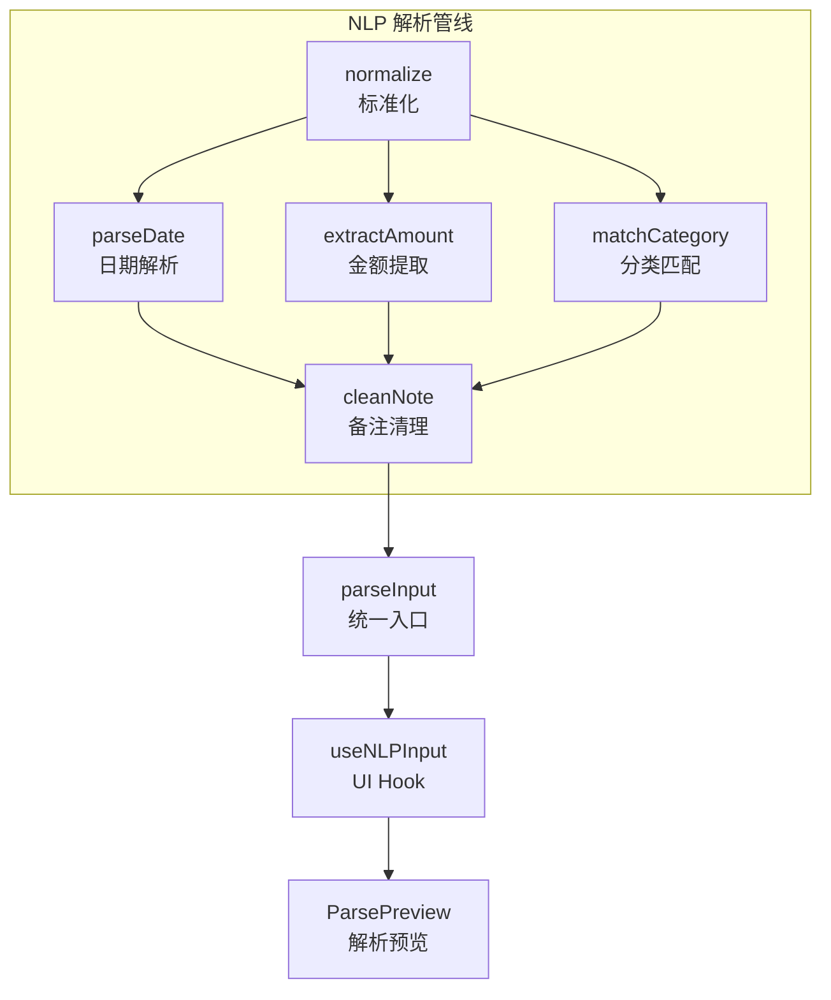
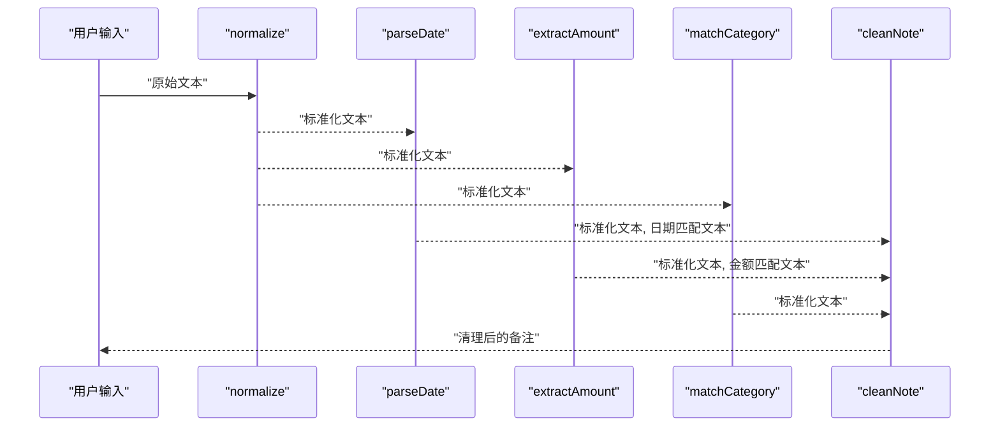
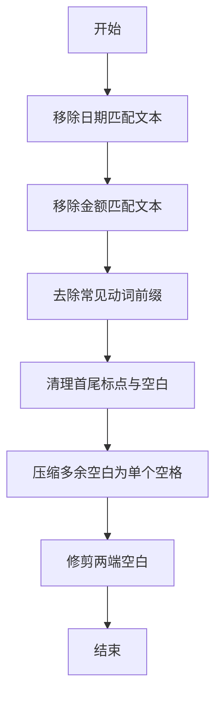
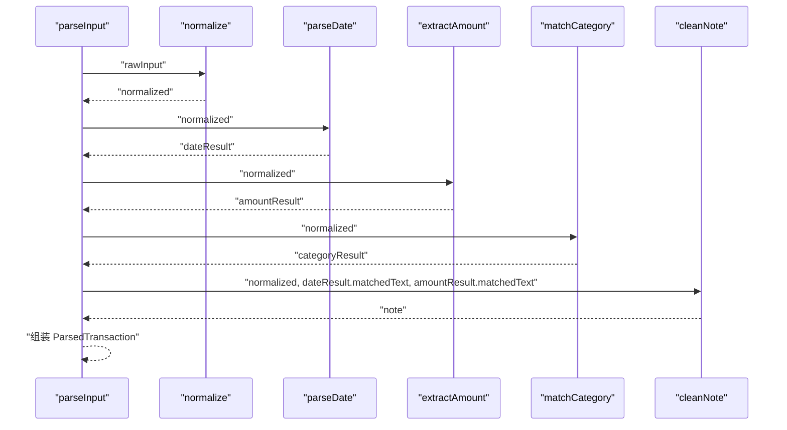
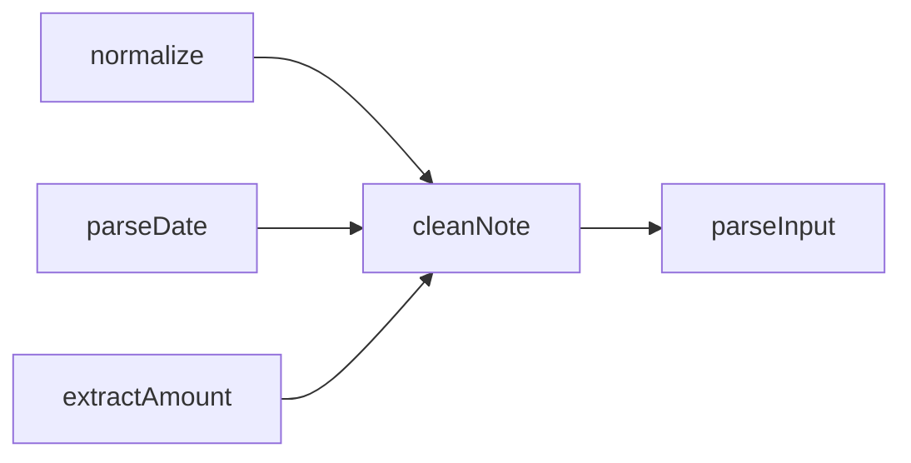

# 备注清理器

<cite>
**本文引用的文件**
- [src/nlp/noteCleaner.ts](file://src/nlp/noteCleaner.ts)
- [src/nlp/index.ts](file://src/nlp/index.ts)
- [src/nlp/normalizer.ts](file://src/nlp/normalizer.ts)
- [src/nlp/amountExtractor.ts](file://src/nlp/amountExtractor.ts)
- [src/nlp/dateParser.ts](file://src/nlp/dateParser.ts)
- [src/nlp/categoryMatcher.ts](file://src/nlp/categoryMatcher.ts)
- [src/hooks/useNLPInput.ts](file://src/hooks/useNLPInput.ts)
- [src/components/input/ParsePreview.tsx](file://src/components/input/ParsePreview.tsx)
</cite>

## 目录
1. [简介](#简介)
2. [项目结构](#项目结构)
3. [核心组件](#核心组件)
4. [架构总览](#架构总览)
5. [详细组件分析](#详细组件分析)
6. [依赖关系分析](#依赖关系分析)
7. [性能考量](#性能考量)
8. [故障排查指南](#故障排查指南)
9. [结论](#结论)
10. [附录](#附录)

## 简介
本文件聚焦“备注清理器”模块，系统性说明 cleanNote 函数的文本清理与规范化逻辑，解释已匹配信息的排除规则与文本去重机制，给出算法实现细节与处理示例，并讨论如何避免误删有效信息、保持备注完整性、处理特殊字符与格式化规则。同时提供自定义清理规则的方法、扩展选项、性能优化建议以及测试与调试要点。

## 项目结构
备注清理器位于 NLP 子系统中，负责在完成日期、金额、分类等解析后，对原始输入进行二次清理，生成最终的“备注”。其上游模块包括标准化器、日期解析器、金额提取器与分类匹配器；下游用于展示解析预览与交互。

图表来源
- [src/nlp/index.ts:8-55](file://src/nlp/index.ts#L8-L55)
- [src/nlp/normalizer.ts:17-35](file://src/nlp/normalizer.ts#L17-L35)
- [src/nlp/dateParser.ts:101-120](file://src/nlp/dateParser.ts#L101-L120)
- [src/nlp/amountExtractor.ts:27-43](file://src/nlp/amountExtractor.ts#L27-L43)
- [src/nlp/categoryMatcher.ts:45-89](file://src/nlp/categoryMatcher.ts#L45-L89)
- [src/nlp/noteCleaner.ts:2-28](file://src/nlp/noteCleaner.ts#L2-L28)
- [src/hooks/useNLPInput.ts:5-50](file://src/hooks/useNLPInput.ts#L5-L50)
- [src/components/input/ParsePreview.tsx:17-65](file://src/components/input/ParsePreview.tsx#L17-L65)

章节来源
- [src/nlp/index.ts:1-62](file://src/nlp/index.ts#L1-L62)

## 核心组件
- 备注清理器（cleanNote）：接收标准化后的文本以及已匹配的日期文本与金额文本，执行排除与规范化，输出最终备注字符串。
- 解析入口（parseInput）：串联标准化、日期解析、金额提取、分类匹配与备注清理，形成完整的解析流水线。
- 标准化器（normalize）：统一全角字符、货币单位、大小写与空白，为后续模块提供一致输入。
- 金额提取器（extractAmount）：按优先级匹配金额，返回金额数值、置信度与匹配文本。
- 日期解析器（parseDate）：解析中文日期表达与时间，返回日期、时间与匹配文本。
- 分类匹配器（matchCategory）：基于内置关键词词典计算得分，返回分类、置信度与命中关键词。
- UI 集成（useNLPInput、ParsePreview）：提供输入监听、防抖解析与解析结果展示。

章节来源
- [src/nlp/noteCleaner.ts:1-29](file://src/nlp/noteCleaner.ts#L1-L29)
- [src/nlp/index.ts:8-55](file://src/nlp/index.ts#L8-L55)
- [src/nlp/normalizer.ts:17-35](file://src/nlp/normalizer.ts#L17-L35)
- [src/nlp/amountExtractor.ts:27-43](file://src/nlp/amountExtractor.ts#L27-L43)
- [src/nlp/dateParser.ts:101-120](file://src/nlp/dateParser.ts#L101-L120)
- [src/nlp/categoryMatcher.ts:45-89](file://src/nlp/categoryMatcher.ts#L45-L89)
- [src/hooks/useNLPInput.ts:5-50](file://src/hooks/useNLPInput.ts#L5-L50)
- [src/components/input/ParsePreview.tsx:17-65](file://src/components/input/ParsePreview.tsx#L17-L65)

## 架构总览
备注清理器处于 NLP 解析管线的末端阶段，其职责是“剔除已解析内容，保留有效备注”。下图展示了 cleanNote 在整体流程中的位置与调用关系。

图表来源
- [src/nlp/index.ts:23-36](file://src/nlp/index.ts#L23-L36)
- [src/nlp/normalizer.ts:17-35](file://src/nlp/normalizer.ts#L17-L35)
- [src/nlp/dateParser.ts:101-120](file://src/nlp/dateParser.ts#L101-L120)
- [src/nlp/amountExtractor.ts:27-43](file://src/nlp/amountExtractor.ts#L27-L43)
- [src/nlp/categoryMatcher.ts:45-89](file://src/nlp/categoryMatcher.ts#L45-L89)
- [src/nlp/noteCleaner.ts:2-28](file://src/nlp/noteCleaner.ts#L2-L28)

## 详细组件分析

### cleanNote 函数详解
- 输入参数
  - text：标准化后的完整文本
  - dateMatchedText：从日期解析阶段得到的匹配文本（可能为空）
  - amountMatchedText：从金额提取阶段得到的匹配文本（可能为空）
- 处理步骤
  1) 排除日期匹配文本：若存在日期匹配文本，则从原文本中移除对应片段。
  2) 排除金额匹配文本：若存在金额匹配文本，则从原文本中移除对应片段。
  3) 去除常见动词前缀：移除诸如“花了/花费/用了/消费/支付/付了”等动词前缀，避免备注重复表达。
  4) 规范化标点与空白：去除首尾的中文/英文标点、顿号、空白字符；将多处空白压缩为单个空格。
  5) 返回修剪后的结果。
- 特殊字符与格式化规则
  - 支持中英文标点与全角字符的清理，确保输出整洁。
  - 保留有效备注中的语义信息，不删除实际描述内容。
- 去重机制
  - 通过移除已匹配文本与动词前缀，避免重复或冗余信息进入备注。
- 误删防护
  - 仅移除明确匹配到的日期/金额片段，不进行全局模糊替换。
  - 动词前缀移除采用固定前缀集合，避免误伤其他词汇。
- 复杂度分析
  - 时间复杂度近似 O(n)，其中 n 为文本长度；涉及多次正则替换与常量集匹配。
  - 空间复杂度近似 O(n)，用于中间字符串副本。

图表来源
- [src/nlp/noteCleaner.ts:2-28](file://src/nlp/noteCleaner.ts#L2-L28)

章节来源
- [src/nlp/noteCleaner.ts:1-29](file://src/nlp/noteCleaner.ts#L1-L29)

### 解析入口与数据流
- parseInput 将标准化后的文本依次交给日期解析、金额提取、分类匹配，最后调用 cleanNote 生成备注。
- 若输入为空，直接返回默认结果并标记需要人工复核。
- 备注是否需要人工复核取决于金额识别结果与分类置信度。

图表来源
- [src/nlp/index.ts:8-55](file://src/nlp/index.ts#L8-L55)
- [src/nlp/normalizer.ts:17-35](file://src/nlp/normalizer.ts#L17-L35)
- [src/nlp/dateParser.ts:101-120](file://src/nlp/dateParser.ts#L101-L120)
- [src/nlp/amountExtractor.ts:27-43](file://src/nlp/amountExtractor.ts#L27-L43)
- [src/nlp/categoryMatcher.ts:45-89](file://src/nlp/categoryMatcher.ts#L45-L89)
- [src/nlp/noteCleaner.ts:2-28](file://src/nlp/noteCleaner.ts#L2-L28)

章节来源
- [src/nlp/index.ts:8-55](file://src/nlp/index.ts#L8-L55)

### 标准化器（normalize）
- 全角数字/标点转半角
- 中文货币单位映射（如“块/毛/大洋/人民币/块钱”映射为“元”）
- 英文小写化
- 压缩多余空白为单个空格

章节来源
- [src/nlp/normalizer.ts:1-36](file://src/nlp/normalizer.ts#L1-L36)

### 金额提取器（extractAmount）
- 按优先级匹配多种金额模式（数字+元/块/￥、动词+数字、货币符号前缀、末尾数字、兜底首个数字）
- 返回金额数值、置信度与匹配文本，供备注清理器排除

章节来源
- [src/nlp/amountExtractor.ts:1-44](file://src/nlp/amountExtractor.ts#L1-L44)

### 日期解析器（parseDate）
- 支持“昨天/前天/大前天”、中文星期、月日、ISO 日期、时间等模式
- 返回日期、时间与匹配文本，供备注清理器排除

章节来源
- [src/nlp/dateParser.ts:1-121](file://src/nlp/dateParser.ts#L1-L121)

### 分类匹配器（matchCategory）
- 基于内置关键词词典计算得分，选择最高分类别
- 返回分类、置信度与命中关键词

章节来源
- [src/nlp/categoryMatcher.ts:1-90](file://src/nlp/categoryMatcher.ts#L1-L90)

### UI 集成与展示
- useNLPInput 提供输入监听与防抖解析，触发 parseInput 并更新解析结果
- ParsePreview 展示解析结果，包括金额、分类、日期/时间与备注

章节来源
- [src/hooks/useNLPInput.ts:1-51](file://src/hooks/useNLPInput.ts#L1-L51)
- [src/components/input/ParsePreview.tsx:1-90](file://src/components/input/ParsePreview.tsx#L1-L90)

## 依赖关系分析
- cleanNote 的直接依赖
  - 输入文本来自标准化器
  - 已匹配文本来自日期解析器与金额提取器
  - 输出作为 parseInput 的一部分，参与最终交易记录对象的构建
- 模块耦合与内聚
  - cleanNote 与上游模块松耦合（仅依赖匹配文本），便于独立演进
  - 与 parseInput 的耦合为单向数据流，职责清晰

图表来源
- [src/nlp/index.ts:23-36](file://src/nlp/index.ts#L23-L36)
- [src/nlp/normalizer.ts:17-35](file://src/nlp/normalizer.ts#L17-L35)
- [src/nlp/dateParser.ts:101-120](file://src/nlp/dateParser.ts#L101-L120)
- [src/nlp/amountExtractor.ts:27-43](file://src/nlp/amountExtractor.ts#L27-L43)
- [src/nlp/noteCleaner.ts:2-28](file://src/nlp/noteCleaner.ts#L2-L28)

章节来源
- [src/nlp/index.ts:1-62](file://src/nlp/index.ts#L1-L62)

## 性能考量
- 正则替换次数与顺序
  - cleanNote 执行多次正则替换，建议在上游减少不必要的冗余文本，降低下游清理成本。
- 匹配文本粒度
  - 使用精确匹配文本而非全文扫描，可显著减少替换范围。
- 防抖与批处理
  - UI 层已采用 300ms 防抖，避免频繁触发解析；可结合批量输入场景进一步优化。
- 字符串操作优化
  - 多次 replace 会产生中间字符串副本，建议在必要时合并正则或采用更高效的字符串处理策略（如一次性正则链）。
- 可扩展性
  - 对于超长文本，可考虑分段处理或限制最大长度，避免内存峰值过高。

## 故障排查指南
- 常见问题
  - 备注被过度清理：检查是否误删了有效描述信息，确认匹配文本是否准确。
  - 动词前缀未移除：确认输入是否包含常见动词前缀集合中的词条。
  - 标点与空白异常：检查是否混入了未覆盖的标点或全角字符。
- 调试方法
  - 在 parseInput 中打印标准化文本与各模块匹配文本，定位清理前后差异。
  - 在 UI 层使用 ParsePreview 实时观察备注变化，快速验证修复效果。
  - 使用 useNLPInput 的 isParsing 状态与解析结果，确认解析链路是否正常执行。
- 建议的日志与断点
  - 记录标准化前后的文本对比
  - 记录日期/金额匹配文本与最终备注
  - 在 cleanNote 关键步骤设置断点，观察中间状态

章节来源
- [src/nlp/index.ts:8-55](file://src/nlp/index.ts#L8-L55)
- [src/nlp/noteCleaner.ts:2-28](file://src/nlp/noteCleaner.ts#L2-L28)
- [src/hooks/useNLPInput.ts:11-30](file://src/hooks/useNLPInput.ts#L11-L30)
- [src/components/input/ParsePreview.tsx:17-65](file://src/components/input/ParsePreview.tsx#L17-L65)

## 结论
备注清理器通过“排除已解析信息 + 去除冗余前缀 + 规范化标点与空白”的策略，在保证备注完整性的同时提升可读性与一致性。其设计遵循单一职责与松耦合原则，便于扩展与维护。建议在上游严格控制匹配文本的准确性，并在必要时引入更精细的正则策略与性能优化手段。

## 附录

### 自定义清理规则与扩展选项
- 新增排除规则
  - 在 cleanNote 中增加新的匹配文本排除逻辑，确保不影响现有日期/金额排除。
- 动词前缀扩展
  - 在前缀集合中添加新词条，注意与分类关键词区分，避免误伤。
- 标点与空白策略
  - 可根据业务需求调整首尾清理与空白压缩策略，平衡简洁性与可读性。
- 性能优化建议
  - 合并正则、减少中间字符串复制
  - 对超长文本进行分段处理或长度限制
  - 在 UI 层进一步优化防抖与并发控制

### 测试用例与验证思路
- 输入为空：应返回默认结果并标记需要复核
- 仅含日期/金额：备注应为空或极简
- 含冗余动词前缀：应被正确移除
- 混合中英文标点：应统一清理为首尾干净、中间单空格
- 边界情况：全角字符、连续空白、无意义标点等

章节来源
- [src/nlp/index.ts:9-21](file://src/nlp/index.ts#L9-L21)
- [src/nlp/noteCleaner.ts:19-25](file://src/nlp/noteCleaner.ts#L19-L25)