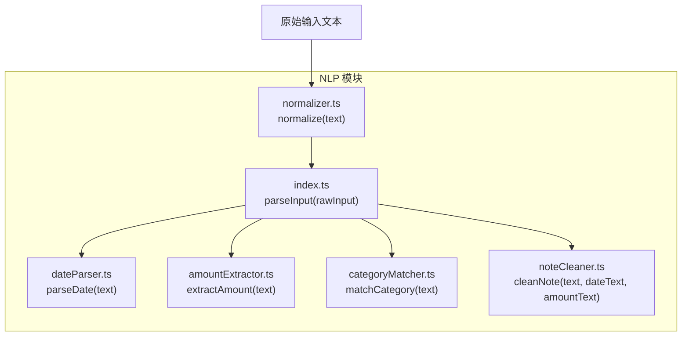
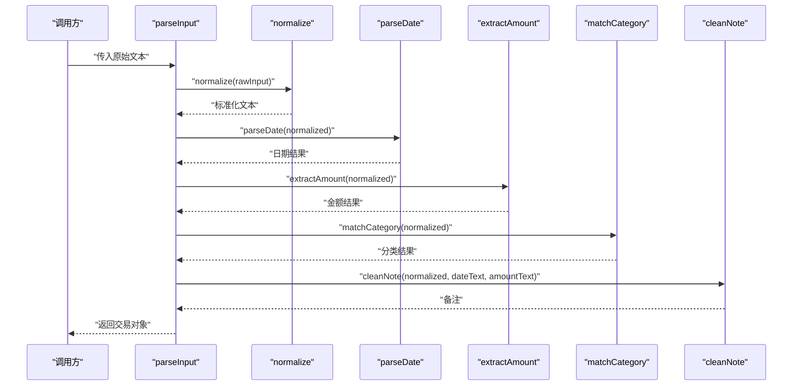
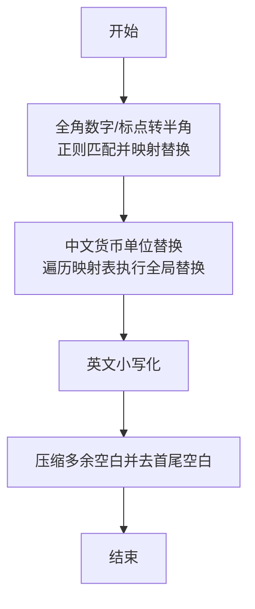
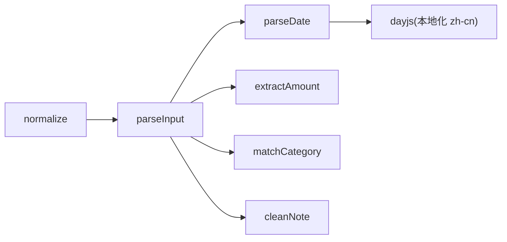

# 文本标准化处理

<cite>
**本文引用的文件**
- [src/nlp/normalizer.ts](file://src/nlp/normalizer.ts)
- [src/nlp/index.ts](file://src/nlp/index.ts)
- [src/nlp/noteCleaner.ts](file://src/nlp/noteCleaner.ts)
- [src/nlp/amountExtractor.ts](file://src/nlp/amountExtractor.ts)
- [src/nlp/dateParser.ts](file://src/nlp/dateParser.ts)
- [src/nlp/categoryMatcher.ts](file://src/nlp/categoryMatcher.ts)
- [package.json](file://package.json)
</cite>

## 目录
1. [简介](#简介)
2. [项目结构](#项目结构)
3. [核心组件](#核心组件)
4. [架构总览](#架构总览)
5. [详细组件分析](#详细组件分析)
6. [依赖分析](#依赖分析)
7. [性能考量](#性能考量)
8. [故障排查指南](#故障排查指南)
9. [结论](#结论)
10. [附录](#附录)

## 简介
本文件聚焦于“文本标准化”模块，系统性阐述 normalize 函数的实现原理与处理规则，覆盖字符转换、格式统一、特殊字符处理等关键步骤，并结合实际代码路径说明正则表达式与处理逻辑。同时给出不同语言环境下（中文为主）的处理差异与本地化注意事项，提供常见问题处理方案、性能优化建议、测试与调试方法，帮助开发者理解与扩展标准化规则。

## 项目结构
NLP 子模块位于 src/nlp，其中 normalize 是文本处理流水线的第一步，后续由 parseInput 将标准化后的文本传递给日期解析、金额提取、分类匹配与备注清理等模块。

图表来源
- [src/nlp/normalizer.ts:17-35](file://src/nlp/normalizer.ts#L17-L35)
- [src/nlp/index.ts:8-55](file://src/nlp/index.ts#L8-L55)
- [src/nlp/dateParser.ts:101-120](file://src/nlp/dateParser.ts#L101-L120)
- [src/nlp/amountExtractor.ts:27-43](file://src/nlp/amountExtractor.ts#L27-L43)
- [src/nlp/categoryMatcher.ts:45-89](file://src/nlp/categoryMatcher.ts#L45-L89)
- [src/nlp/noteCleaner.ts:2-28](file://src/nlp/noteCleaner.ts#L2-L28)

章节来源
- [src/nlp/index.ts:8-55](file://src/nlp/index.ts#L8-L55)

## 核心组件
- normalize(text: string): string  
  - 功能：对输入文本进行多轮规范化，确保后续 NLP 步骤（日期、金额、分类、备注）能稳定识别。
  - 关键步骤：
    1) 全角数字与标点转半角（基于字符映射表与正则替换）。
    2) 中文货币单位替换（如“块/毛/大洋/人民币/块钱”统一为“元”）。
    3) 英文小写化（便于关键词匹配与一致性）。
    4) 多余空白压缩并去除首尾空白。
  - 返回：标准化后的字符串。

章节来源
- [src/nlp/normalizer.ts:17-35](file://src/nlp/normalizer.ts#L17-L35)

## 架构总览
parseInput 将原始输入文本交给 normalize，随后依次调用日期解析、金额提取、分类匹配与备注清理，最终输出结构化的交易对象。normalize 的质量直接影响后续模块的准确率与稳定性。

图表来源
- [src/nlp/index.ts:8-55](file://src/nlp/index.ts#L8-L55)
- [src/nlp/normalizer.ts:17-35](file://src/nlp/normalizer.ts#L17-L35)
- [src/nlp/dateParser.ts:101-120](file://src/nlp/dateParser.ts#L101-L120)
- [src/nlp/amountExtractor.ts:27-43](file://src/nlp/amountExtractor.ts#L27-L43)
- [src/nlp/categoryMatcher.ts:45-89](file://src/nlp/categoryMatcher.ts#L45-L89)
- [src/nlp/noteCleaner.ts:2-28](file://src/nlp/noteCleaner.ts#L2-L28)

## 详细组件分析

### normalize 函数详解
- 输入：原始文本字符串。
- 输出：经过多轮处理的标准化字符串。
- 处理步骤与规则：
  1) 全角数字与标点转半角
     - 使用正则匹配全角范围字符，通过映射表进行替换。
     - 正则范围涵盖全角数字与特定全角标点。
  2) 中文货币单位替换
     - 以固定映射表将“块/毛/大洋/人民币/块钱”等替换为“元”，提升金额提取的一致性。
  3) 英文小写化
     - 统一为小写，降低关键词匹配大小写的复杂度。
  4) 多余空白压缩与修剪
     - 将连续空白压缩为单个空格，并去除首尾空白，保证后续解析的稳定性。
- 性能特征：
  - 字符映射表查找为 O(1)，整体时间复杂度近似 O(n)。
  - 替换操作为线性扫描，适合短至中等长度的输入文本。
- 可扩展性：
  - 可新增映射表或正则规则，以支持更多货币单位或标点。
  - 若未来需要保留某些全角格式，可调整替换策略或引入开关参数。

图表来源
- [src/nlp/normalizer.ts:17-35](file://src/nlp/normalizer.ts#L17-L35)

章节来源
- [src/nlp/normalizer.ts:17-35](file://src/nlp/normalizer.ts#L17-L35)

### 备注清理 cleanNote
- 目标：从标准化文本中移除已解析的日期与金额片段，再清理常见动词前缀与多余标点，得到最终备注。
- 关键步骤：
  - 移除日期匹配文本与金额匹配文本。
  - 去除常见动词前缀（如“花了/花费/用了/消费/支付/付了”）。
  - 清理前后多余标点与空白，并统一中间空白为单个空格。
- 注意事项：
  - 若日期/金额未匹配到，对应分支不会产生替换。
  - 前缀正则需与 normalize 后的小写化保持一致。

章节来源
- [src/nlp/noteCleaner.ts:2-28](file://src/nlp/noteCleaner.ts#L2-L28)

### 金额提取 extractAmount
- 规则优先级（从高到低）：
  - 数字+元/块/￥
  - 动词+数字（常见消费动词后跟金额）
  - ¥/￥ 前缀
  - 数字+元（空格分隔）
  - 末尾纯数字
  - 任意数字（兜底）
- 匹配策略：
  - 按优先级顺序尝试匹配，首个有效正则即返回。
  - 金额必须为大于 0 的数值，否则视为未匹配。
- 置信度：
  - 高：明确金额表达式
  - 中：末尾数字
  - 低：任意数字

章节来源
- [src/nlp/amountExtractor.ts:7-25](file://src/nlp/amountExtractor.ts#L7-L25)
- [src/nlp/amountExtractor.ts:27-43](file://src/nlp/amountExtractor.ts#L27-L43)

### 日期解析 parseDate
- 支持模式（按优先级）：
  - 昨天/前天/大前天
  - 今天/刚才/刚刚
  - N天前（支持阿拉伯数字与中文数字）
  - 上周X / 这周X（中文星期）
  - X月X日/号
  - ISO 格式 YYYY-MM-DD 或 YYYY/MM/DD
  - 时间 HH:mm
- 解析策略：
  - 逐条尝试匹配，命中即返回对应日期与时间。
  - 默认返回当天日期。
- 本地化：
  - 使用 dayjs 并设置 zh-cn 本地化，确保中文表达正确解析。

章节来源
- [src/nlp/dateParser.ts:12-21](file://src/nlp/dateParser.ts#L12-L21)
- [src/nlp/dateParser.ts:28-99](file://src/nlp/dateParser.ts#L28-L99)
- [src/nlp/dateParser.ts:101-120](file://src/nlp/dateParser.ts#L101-L120)
- [package.json:12-21](file://package.json#L12-L21)

### 分类匹配 matchCategory
- 关键词词典：内置多个类别的关键词集合（如食物、交通、购物、娱乐、住房、医疗、教育）。
- 匹配策略：
  - 将输入文本与关键词均转为小写，进行包含关系匹配。
  - 计算每个类别的得分（关键词长度加权），取最高分类别作为结果。
  - 根据得分阈值确定置信度（高/中/低）。
- 置信度：
  - 高：得分 ≥ 15
  - 中：得分 ∈ [10, 15)
  - 低：得分 < 10

章节来源
- [src/nlp/categoryMatcher.ts:45-89](file://src/nlp/categoryMatcher.ts#L45-L89)

## 依赖分析
- normalize 作为 parseInput 的前置步骤，其输出直接影响后续模块的输入质量。
- 依赖外部库 dayjs 用于日期解析与本地化。
- 模块间耦合度低，职责清晰：normalize 负责“格式统一”，其余模块负责“语义抽取”。

图表来源
- [src/nlp/index.ts:8-55](file://src/nlp/index.ts#L8-L55)
- [src/nlp/dateParser.ts:101-120](file://src/nlp/dateParser.ts#L101-L120)
- [package.json:12-21](file://package.json#L12-L21)

章节来源
- [src/nlp/index.ts:8-55](file://src/nlp/index.ts#L8-L55)
- [src/nlp/dateParser.ts:101-120](file://src/nlp/dateParser.ts#L101-L120)
- [package.json:12-21](file://package.json#L12-L21)

## 性能考量
- normalize 的时间复杂度近似 O(n)，适合大多数输入规模；若输入文本极长，可考虑：
  - 预先裁剪或分段处理。
  - 缓存 normalize 结果（在相同输入重复出现时）。
- 正则替换与映射表查找均为常数时间，整体开销可控。
- 若需支持更多货币单位或标点，建议：
  - 使用更高效的批量替换策略（如一次性构建复合正则）。
  - 对映射表进行预编译与缓存。

## 故障排查指南
- normalize 后仍存在全角字符
  - 检查全角范围正则是否覆盖输入字符集。
  - 确认映射表是否包含新增字符。
- 货币单位未统一
  - 核对映射表键值是否完整。
  - 确保 normalize 在 parseInput 中被调用且顺序正确。
- 备注清理异常
  - 确认 cleanNote 的日期/金额匹配文本与 normalize 后的文本一致。
  - 检查前缀正则是否与小写化结果匹配。
- 金额/日期/分类不准确
  - 调整优先级或正则表达式，参考对应模块的规则定义。
  - 增加边界用例与回归测试。

## 结论
normalize 作为 NLP 流水线的“数据清洗器”，通过全角转半角、货币单位统一、小写化与空白压缩，显著提升了后续日期、金额、分类与备注抽取的稳定性与准确性。结合模块化的职责划分与清晰的处理流程，开发者可以安全地扩展与优化标准化规则，以适配更多输入场景与语言环境。

## 附录

### 常见处理示例（以路径代替具体代码）
- 全角数字与标点替换
  - 参考路径：[src/nlp/normalizer.ts:20-21](file://src/nlp/normalizer.ts#L20-L21)
- 中文货币单位替换
  - 参考路径：[src/nlp/normalizer.ts:23-26](file://src/nlp/normalizer.ts#L23-L26)
- 英文小写化
  - 参考路径：[src/nlp/normalizer.ts:28-29](file://src/nlp/normalizer.ts#L28-L29)
- 多余空白压缩与修剪
  - 参考路径：[src/nlp/normalizer.ts:31-32](file://src/nlp/normalizer.ts#L31-L32)
- 备注清理（移除日期/金额与前缀）
  - 参考路径：[src/nlp/noteCleaner.ts:9-20](file://src/nlp/noteCleaner.ts#L9-L20)
- 金额提取优先级与正则
  - 参考路径：[src/nlp/amountExtractor.ts:7-25](file://src/nlp/amountExtractor.ts#L7-L25)
- 日期解析模式与本地化
  - 参考路径：[src/nlp/dateParser.ts:28-99](file://src/nlp/dateParser.ts#L28-L99), [src/nlp/dateParser.ts:4](file://src/nlp/dateParser.ts#L4)
- 分类匹配关键词与得分
  - 参考路径：[src/nlp/categoryMatcher.ts:45-89](file://src/nlp/categoryMatcher.ts#L45-L89)