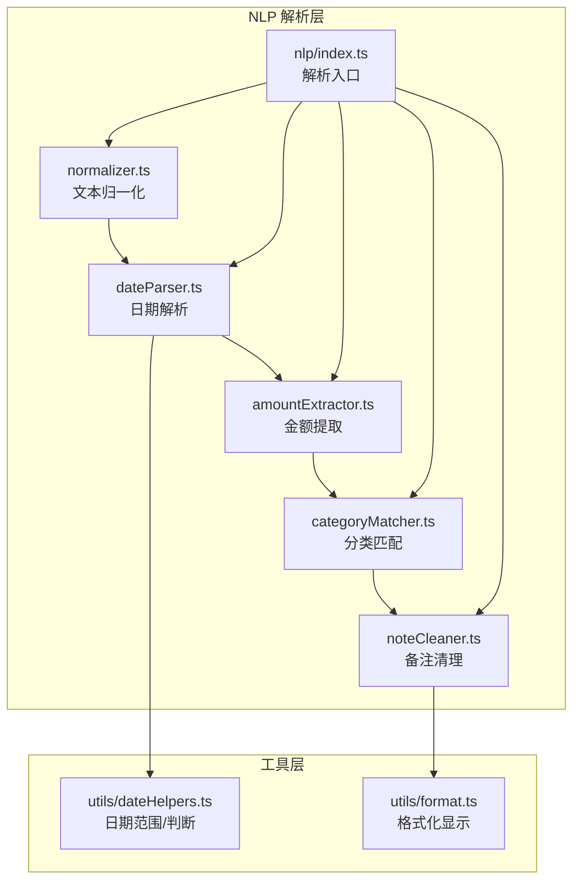
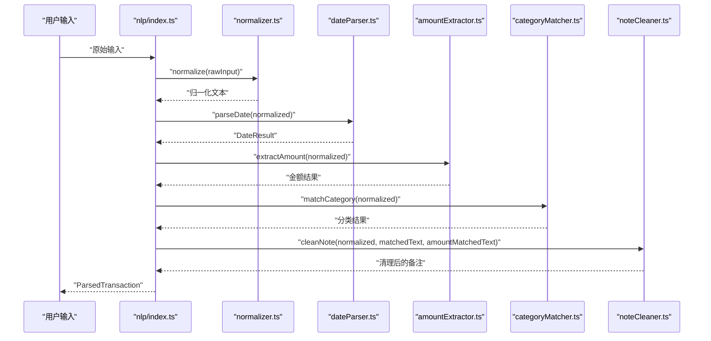
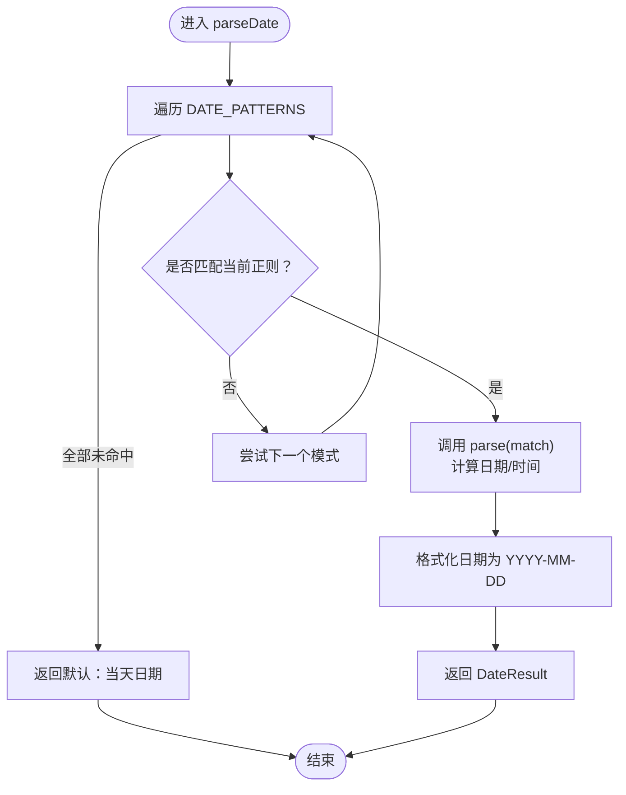
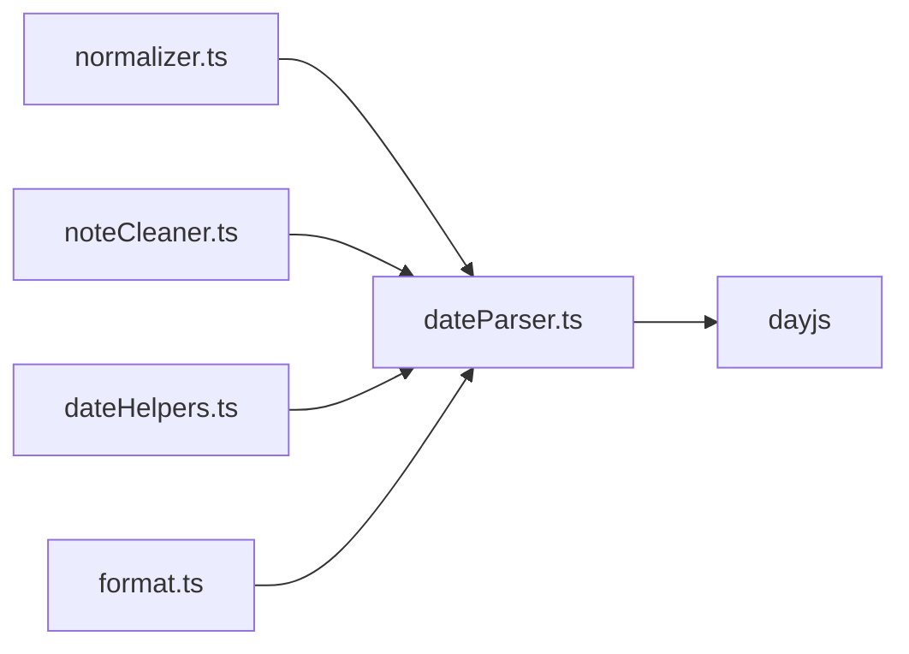

# 日期解析器

<cite>
**本文引用的文件**
- [src/nlp/dateParser.ts](file://src/nlp/dateParser.ts)
- [src/nlp/index.ts](file://src/nlp/index.ts)
- [src/nlp/normalizer.ts](file://src/nlp/normalizer.ts)
- [src/nlp/noteCleaner.ts](file://src/nlp/noteCleaner.ts)
- [src/utils/dateHelpers.ts](file://src/utils/dateHelpers.ts)
- [src/utils/format.ts](file://src/utils/format.ts)
</cite>

## 目录
1. [简介](#简介)
2. [项目结构](#项目结构)
3. [核心组件](#核心组件)
4. [架构总览](#架构总览)
5. [详细组件分析](#详细组件分析)
6. [依赖关系分析](#依赖关系分析)
7. [性能考量](#性能考量)
8. [故障排查指南](#故障排查指南)
9. [结论](#结论)
10. [附录](#附录)

## 简介
本文件为 MoneyNote 应用中的“日期解析模块”提供系统化技术文档。重点围绕 parseDate 函数的日期识别与解析算法，覆盖以下方面：
- 解析流程与控制流
- 支持的日期格式与正则规则
- 中文日期与相对日期的处理策略
- 时区与本地化注意事项
- 错误处理与默认回退
- 扩展新日期格式的方法与自定义规则步骤
- 性能优化建议与常见问题解决方案

## 项目结构
该模块位于 NLP 子系统内，与文本归一化、金额提取、分类匹配、备注清理共同组成自然语言输入的解析流水线。

图表来源
- [src/nlp/index.ts:1-62](file://src/nlp/index.ts#L1-L62)
- [src/nlp/normalizer.ts:1-36](file://src/nlp/normalizer.ts#L1-L36)
- [src/nlp/dateParser.ts:1-121](file://src/nlp/dateParser.ts#L1-L121)
- [src/nlp/noteCleaner.ts:1-28](file://src/nlp/noteCleaner.ts#L1-L28)
- [src/utils/dateHelpers.ts:1-35](file://src/utils/dateHelpers.ts#L1-L35)
- [src/utils/format.ts:1-27](file://src/utils/format.ts#L1-L27)

章节来源
- [src/nlp/index.ts:1-62](file://src/nlp/index.ts#L1-L62)

## 核心组件
- parseDate(text: string): DateResult
  - 功能：在输入文本中识别并解析日期，返回标准化日期字符串、可选时间以及匹配到的文本片段；若未识别，默认返回当天日期。
  - 返回值：包含 date、time、matchedText 的对象。
- DATE_PATTERNS：按优先级排列的正则模式数组，每个条目包含 pattern 和 parse 两个字段。
- 辅助映射：
  - CN_NUM：中文数字到阿拉伯数字的映射，用于支持“几”类中文数字。
  - WEEKDAY_MAP：中文星期到数字的映射，便于计算上周/本周的对应日期。

章节来源
- [src/nlp/dateParser.ts:6-121](file://src/nlp/dateParser.ts#L6-L121)

## 架构总览
parseInput 将输入文本交给 NLP 流水线处理，其中 parseDate 负责日期抽取。解析结果被传递给后续阶段，并最终生成交易记录对象。

图表来源
- [src/nlp/index.ts:8-55](file://src/nlp/index.ts#L8-L55)
- [src/nlp/normalizer.ts:17-35](file://src/nlp/normalizer.ts#L17-L35)
- [src/nlp/dateParser.ts:101-120](file://src/nlp/dateParser.ts#L101-L120)
- [src/nlp/noteCleaner.ts:2-28](file://src/nlp/noteCleaner.ts#L2-L28)

## 详细组件分析

### parseDate 函数与解析算法
- 输入：经过归一化的文本
- 处理流程：
  1) 按顺序对每个 DATE_PATTERNS 条目进行正则匹配；
  2) 若命中，则调用对应 parse 方法生成 dayjs 对象与可选时间；
  3) 格式化日期为 "YYYY-MM-DD"，保留匹配文本片段；
  4) 若无任何模式命中，则默认返回当天日期。
- 关键实现要点：
  - 正则优先级决定解析优先级，靠前的模式优先匹配；
  - parse 方法内部通过 dayjs 计算相对日期或设置月份/日期；
  - 时间解析仅设置 time 字段，不改变日期。

图表来源
- [src/nlp/dateParser.ts:101-120](file://src/nlp/dateParser.ts#L101-L120)

章节来源
- [src/nlp/dateParser.ts:101-120](file://src/nlp/dateParser.ts#L101-L120)

### 支持的日期格式与正则规则
- 相对日期
  - “大前天”、“前天”、“昨天”：直接减去固定天数
  - “今天/刚才/刚刚”：当前日期
  - “N天前”：支持阿拉伯数字与中文数字（如“一”“十”“两”等）
- 相对星期
  - “上周X”“上(周|个)(星期|周)X”：根据目标星期计算回溯天数
  - “这周X/(这)?(周|星期)X”：根据目标星期计算前进或当天
- 月日
  - “X月X日/号”：解析当年度的月与日
- ISO 格式
  - “YYYY-MM-DD”或“YYYY/MM/DD”：解析完整日期
- 时间
  - “HH:mm”：仅提取时间，日期保持不变

章节来源
- [src/nlp/dateParser.ts:28-99](file://src/nlp/dateParser.ts#L28-L99)

### 中文数字与星期映射
- CN_NUM：将“一”到“十”及“两”映射为对应的阿拉伯数字，用于“N天前”等场景
- WEEKDAY_MAP：将“一二三四五六日天”映射为 1..7/0，其中“日/天”均映射为 0（周日）

章节来源
- [src/nlp/dateParser.ts:13-21](file://src/nlp/dateParser.ts#L13-L21)

### 文本归一化与本地化
- 归一化 normalizer.ts
  - 全角数字/标点转半角
  - 中文货币单位替换为“元”
  - 英文小写化
  - 压缩多余空白
- 本地化
  - 引入 zh-cn 语言包并设置全局 locale，确保相对时间与星期等显示符合中文习惯

章节来源
- [src/nlp/normalizer.ts:17-35](file://src/nlp/normalizer.ts#L17-L35)
- [src/nlp/dateParser.ts:1-5](file://src/nlp/dateParser.ts#L1-L5)

### 备注清理与日期/金额片段剔除
- noteCleaner.ts
  - 基于 parseDate 返回的 matchedText 与金额匹配文本，从原始输入中移除已解析片段
  - 去除常见动词前缀（如“花了/花费/用了...”）
  - 清理多余标点与空白，保留单个空格分隔

章节来源
- [src/nlp/noteCleaner.ts:2-28](file://src/nlp/noteCleaner.ts#L2-L28)

### 日期范围与日期判断工具
- dateHelpers.ts
  - 提供今日/月/年/周范围边界
  - 提供某月天数、是否今天、是否本月等辅助判断

章节来源
- [src/utils/dateHelpers.ts:3-34](file://src/utils/dateHelpers.ts#L3-L34)

### 输出格式化
- format.ts
  - 提供日期人性化格式化（例如“今天/昨天/M月D日/YYYY年M月D日”）
  - 时间格式化保持原样

章节来源
- [src/utils/format.ts:14-27](file://src/utils/format.ts#L14-L27)

## 依赖关系分析
- parseDate 依赖 dayjs 进行日期计算与格式化
- 归一化 normalizer.ts 为 parseDate 提供清洗后的输入
- 备注清理 noteCleaner.ts 使用 parseDate 的 matchedText 进行片段剔除
- 工具层 dateHelpers.ts 与 format.ts 为上层展示与范围计算提供支撑

图表来源
- [src/nlp/dateParser.ts:1-121](file://src/nlp/dateParser.ts#L1-L121)
- [src/nlp/normalizer.ts:17-35](file://src/nlp/normalizer.ts#L17-L35)
- [src/nlp/noteCleaner.ts:2-28](file://src/nlp/noteCleaner.ts#L2-L28)
- [src/utils/dateHelpers.ts:1-35](file://src/utils/dateHelpers.ts#L1-L35)
- [src/utils/format.ts:1-27](file://src/utils/format.ts#L1-L27)

## 性能考量
- 匹配顺序与复杂度
  - 当前实现为线性扫描 DATE_PATTERNS，整体复杂度 O(P)，P 为模式数量；由于 P 很小且均为短文本/简单正则，常数开销低。
- 正则优化建议
  - 合理组织正则优先级，将高频/确定性强的模式前置，减少不必要的回溯。
  - 对重复使用的复杂正则，可考虑预编译以避免重复构造。
- 本地化与格式化
  - 本地化设置在模块初始化时完成，避免在热路径重复设置。
- I/O 与内存
  - 解析过程纯函数式，无外部 I/O；注意避免在循环中频繁创建临时字符串。

[本节为通用性能建议，无需特定文件引用]

## 故障排查指南
- 未识别到日期
  - 检查输入是否经过归一化（全角字符、中文单位等）；确认是否包含支持的相对/绝对日期表达。
  - 若输入为空或仅空白，parseInput 会直接返回默认日期。
- 相对日期计算异常
  - 确认 WEEKDAY_MAP 与 CN_NUM 的映射是否覆盖所需输入；检查 parse 方法中的 dayjs 计算逻辑。
- 时间解析冲突
  - “HH:mm”仅设置时间，不改变日期；若需要“今天”语义，请确保先有日期上下文或使用“今天/刚刚”等模式。
- 备注清理后残留
  - 检查 noteCleaner 是否正确移除了 matchedText 与金额匹配文本；确认正则边界与替换策略。

章节来源
- [src/nlp/index.ts:8-21](file://src/nlp/index.ts#L8-L21)
- [src/nlp/noteCleaner.ts:2-28](file://src/nlp/noteCleaner.ts#L2-L28)

## 结论
该日期解析模块以“正则模式 + 解析器”的方式实现，具备良好的可扩展性与中文本地化支持。通过明确的匹配顺序与辅助映射，能够稳定地从自然语言输入中提取日期与时间，并与金额、分类、备注清理形成完整的解析链路。建议在新增日期格式时遵循现有模式结构，保持正则清晰与解析逻辑简洁，以维持高性能与高可维护性。

[本节为总结性内容，无需特定文件引用]

## 附录

### 扩展新日期格式的步骤
- 在 DATE_PATTERNS 中新增一个条目：
  - pattern：新的正则表达式，捕获必要的组（如月、日、时、分等）
  - parse：根据匹配结果计算 dayjs 对象与可选时间
- 将新模式放置在合适的优先级位置（更具体/更确定的模式应靠前）
- 如需中文数字/星期支持，可在 CN_NUM/WEEKDAY_MAP 中补充映射
- 编写测试用例，覆盖典型输入与边界情况
- 在 noteCleaner 中确认不会误删新格式产生的匹配文本

章节来源
- [src/nlp/dateParser.ts:23-99](file://src/nlp/dateParser.ts#L23-L99)

### 常见日期解析问题与解决方案
- 问题：中文数字“十”与“两”未被识别
  - 方案：在 CN_NUM 中添加映射，并在 parse 中统一转换为整数
- 问题：相对星期“这周X”与“上周X”混淆
  - 方案：明确正则边界，确保“这周/上周”前缀与“星期/周”组合的唯一性
- 问题：ISO 日期“YYYY/MM/DD”与“YYYY-MM-DD”混用导致解析失败
  - 方案：在正则中统一使用“[-/]”以兼容两种分隔符
- 问题：时间“HH:mm”与日期“X月X日”同时出现时顺序不确定
  - 方案：调整 DATE_PATTERNS 顺序，使日期模式优先于时间模式；或在 parse 中显式合并日期与时间

章节来源
- [src/nlp/dateParser.ts:48-98](file://src/nlp/dateParser.ts#L48-L98)