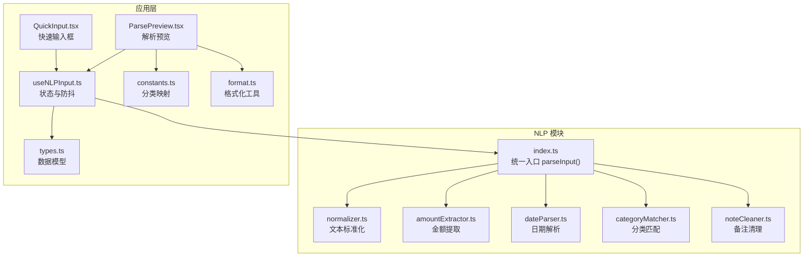
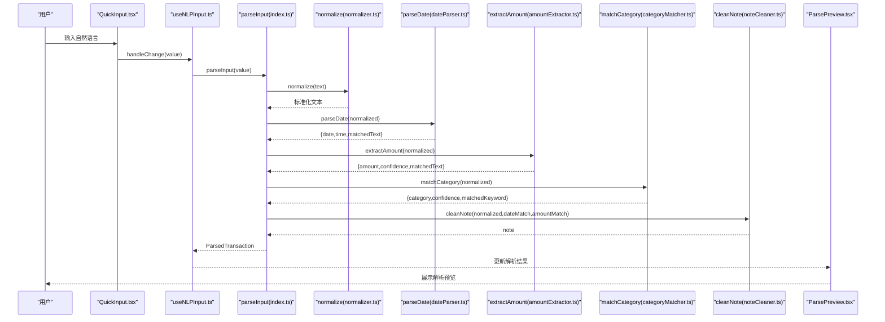
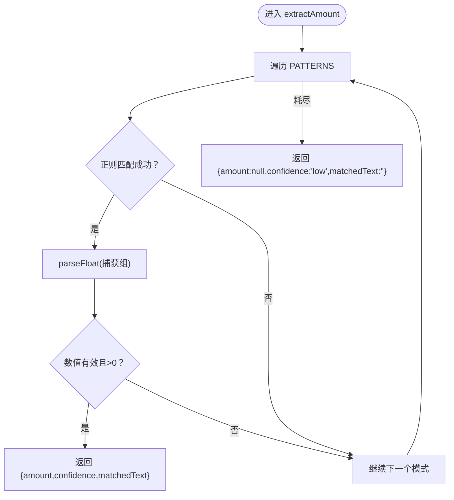
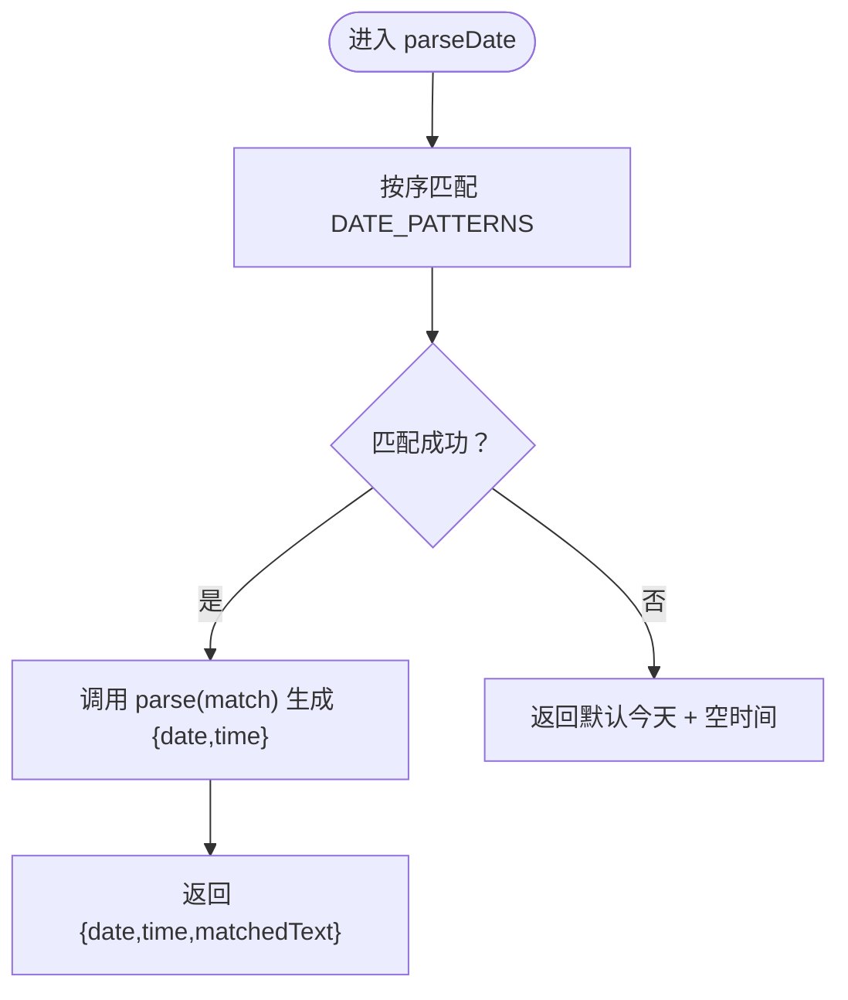
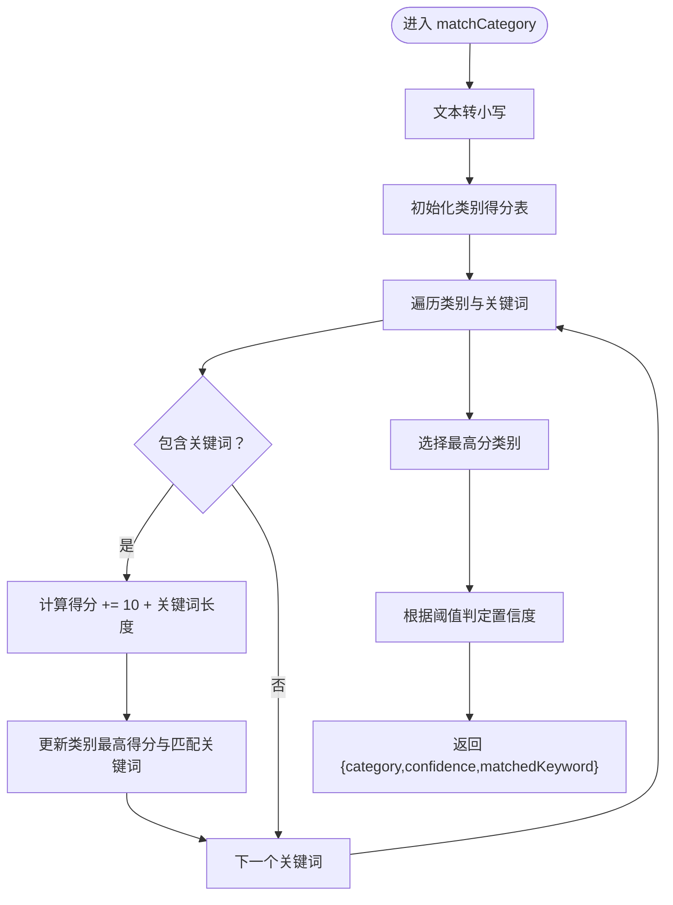
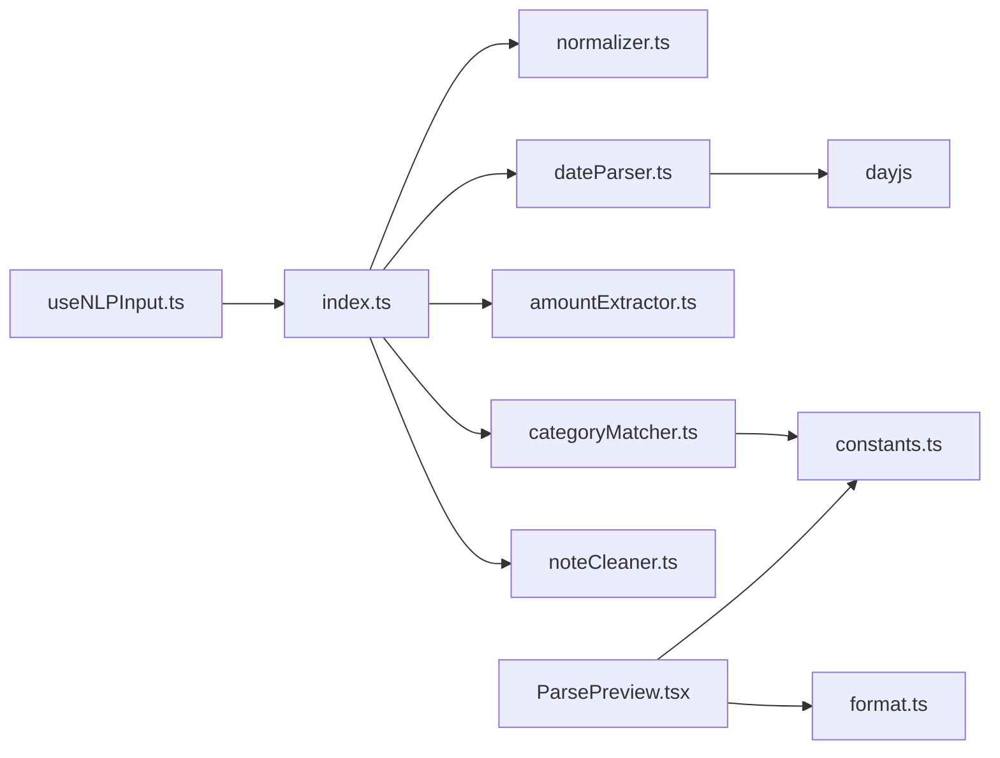

# 自然语言处理系统

<cite>
**本文档引用的文件**
- [src/nlp/index.ts](file://src/nlp/index.ts)
- [src/nlp/amountExtractor.ts](file://src/nlp/amountExtractor.ts)
- [src/nlp/categoryMatcher.ts](file://src/nlp/categoryMatcher.ts)
- [src/nlp/dateParser.ts](file://src/nlp/dateParser.ts)
- [src/nlp/normalizer.ts](file://src/nlp/normalizer.ts)
- [src/nlp/noteCleaner.ts](file://src/nlp/noteCleaner.ts)
- [src/db/types.ts](file://src/db/types.ts)
- [src/hooks/useNLPInput.ts](file://src/hooks/useNLPInput.ts)
- [src/components/input/ParsePreview.tsx](file://src/components/input/ParsePreview.tsx)
- [src/components/input/QuickInput.tsx](file://src/components/input/QuickInput.tsx)
- [src/utils/constants.ts](file://src/utils/constants.ts)
- [src/utils/format.ts](file://src/utils/format.ts)
</cite>

## 目录
1. [简介](#简介)
2. [项目结构](#项目结构)
3. [核心组件](#核心组件)
4. [架构总览](#架构总览)
5. [详细组件分析](#详细组件分析)
6. [依赖关系分析](#依赖关系分析)
7. [性能考虑](#性能考虑)
8. [故障排除指南](#故障排除指南)
9. [结论](#结论)
10. [附录](#附录)

## 简介
本文件为 MoneyNote 的自然语言处理（NLP）系统技术文档，聚焦于“自然语言解析整体流程与各处理模块功能”。文档覆盖以下关键主题：
- 文本标准化机制与货币单位归一化
- 金额提取算法与置信度判定
- 分类匹配逻辑与关键词评分体系
- 日期解析器与时间抽取
- 备注清理与文本去噪
- NLP 处理管道的阶段划分、输入输出格式与错误处理策略
- 具体解析示例、正则表达式规则与匹配算法
- 扩展与自定义解析规则的方法
- 性能优化技巧、调试工具与测试方法

## 项目结构
NLP 模块位于 src/nlp 目录，采用“单一职责、可组合”的设计，每个模块负责一个解析阶段，并通过统一入口函数进行编排。UI 层通过 hooks 和组件消费解析结果，形成端到端的输入-解析-展示闭环。

图表来源
- [src/nlp/index.ts:1-62](file://src/nlp/index.ts#L1-L62)
- [src/nlp/normalizer.ts:1-36](file://src/nlp/normalizer.ts#L1-L36)
- [src/nlp/amountExtractor.ts:1-44](file://src/nlp/amountExtractor.ts#L1-L44)
- [src/nlp/dateParser.ts:1-121](file://src/nlp/dateParser.ts#L1-L121)
- [src/nlp/categoryMatcher.ts:1-90](file://src/nlp/categoryMatcher.ts#L1-L90)
- [src/nlp/noteCleaner.ts:1-29](file://src/nlp/noteCleaner.ts#L1-L29)
- [src/hooks/useNLPInput.ts:1-51](file://src/hooks/useNLPInput.ts#L1-L51)
- [src/components/input/QuickInput.tsx:1-68](file://src/components/input/QuickInput.tsx#L1-L68)
- [src/components/input/ParsePreview.tsx:1-123](file://src/components/input/ParsePreview.tsx#L1-L123)
- [src/db/types.ts:48-60](file://src/db/types.ts#L48-L60)
- [src/utils/constants.ts:1-19](file://src/utils/constants.ts#L1-L19)
- [src/utils/format.ts:1-28](file://src/utils/format.ts#L1-L28)

章节来源
- [src/nlp/index.ts:1-62](file://src/nlp/index.ts#L1-L62)
- [src/nlp/normalizer.ts:1-36](file://src/nlp/normalizer.ts#L1-L36)
- [src/nlp/amountExtractor.ts:1-44](file://src/nlp/amountExtractor.ts#L1-L44)
- [src/nlp/dateParser.ts:1-121](file://src/nlp/dateParser.ts#L1-L121)
- [src/nlp/categoryMatcher.ts:1-90](file://src/nlp/categoryMatcher.ts#L1-L90)
- [src/nlp/noteCleaner.ts:1-29](file://src/nlp/noteCleaner.ts#L1-L29)
- [src/hooks/useNLPInput.ts:1-51](file://src/hooks/useNLPInput.ts#L1-L51)
- [src/components/input/QuickInput.tsx:1-68](file://src/components/input/QuickInput.tsx#L1-L68)
- [src/components/input/ParsePreview.tsx:1-123](file://src/components/input/ParsePreview.tsx#L1-L123)
- [src/db/types.ts:48-60](file://src/db/types.ts#L48-L60)
- [src/utils/constants.ts:1-19](file://src/utils/constants.ts#L1-L19)
- [src/utils/format.ts:1-28](file://src/utils/format.ts#L1-L28)

## 核心组件
- 统一入口 parseInput：串联标准化、日期、金额、分类、备注清理五个阶段，生成 ParsedTransaction 结果，并根据置信度决定是否需要人工复核。
- 文本标准化 normalize：全角字符转半角、货币单位统一、英文小写化、空白压缩。
- 金额提取 extractAmount：按优先级匹配多种模式（含货币符号、动词+数字、末尾数字等），返回金额数值、匹配文本与置信度。
- 日期解析 parseDate：支持“昨天/前天/大前天”、“N天前”、“上周/这周+星期X”、“月日”、“ISO日期”、“时间”等多种中文与数字格式。
- 分类匹配 matchCategory：内置关键词词典，基于包含关系与关键词长度加权评分，输出最高分类别与匹配关键词。
- 备注清理 cleanNote：移除已解析的日期/金额片段与常见动词前缀，保留干净的备注文本。
- 数据模型 ParsedTransaction：定义解析结果字段与置信度级别，用于 UI 展示与后续业务处理。

章节来源
- [src/nlp/index.ts:8-55](file://src/nlp/index.ts#L8-L55)
- [src/nlp/normalizer.ts:17-35](file://src/nlp/normalizer.ts#L17-L35)
- [src/nlp/amountExtractor.ts:27-43](file://src/nlp/amountExtractor.ts#L27-L43)
- [src/nlp/dateParser.ts:101-120](file://src/nlp/dateParser.ts#L101-L120)
- [src/nlp/categoryMatcher.ts:45-89](file://src/nlp/categoryMatcher.ts#L45-L89)
- [src/nlp/noteCleaner.ts:2-28](file://src/nlp/noteCleaner.ts#L2-L28)
- [src/db/types.ts:48-60](file://src/db/types.ts#L48-L60)

## 架构总览
下图展示了 NLP 处理管道的端到端流程：输入文本经由标准化后，依次进入日期、金额、分类匹配与备注清理阶段，最终生成解析结果并驱动 UI 展示。

图表来源
- [src/nlp/index.ts:8-55](file://src/nlp/index.ts#L8-L55)
- [src/nlp/normalizer.ts:17-35](file://src/nlp/normalizer.ts#L17-L35)
- [src/nlp/dateParser.ts:101-120](file://src/nlp/dateParser.ts#L101-L120)
- [src/nlp/amountExtractor.ts:27-43](file://src/nlp/amountExtractor.ts#L27-L43)
- [src/nlp/categoryMatcher.ts:45-89](file://src/nlp/categoryMatcher.ts#L45-L89)
- [src/nlp/noteCleaner.ts:2-28](file://src/nlp/noteCleaner.ts#L2-L28)
- [src/hooks/useNLPInput.ts:11-30](file://src/hooks/useNLPInput.ts#L11-L30)
- [src/components/input/ParsePreview.tsx:17-122](file://src/components/input/ParsePreview.tsx#L17-L122)

## 详细组件分析

### 文本标准化模块（normalizer.ts）
- 功能要点
  - 全角数字与标点转换为半角
  - 中文货币单位统一为“元”
  - 英文转小写以提升匹配一致性
  - 多余空白压缩为单个空格并去除首尾空白
- 复杂度
  - 时间复杂度 O(n)，n 为输入文本长度；空间复杂度 O(n)
- 错误处理
  - 对未知字符保持原样，避免异常
- 可扩展性
  - 新增单位映射或标点替换可在 UNIT_MAP/FULL_TO_HALF 中添加键值对

章节来源
- [src/nlp/normalizer.ts:17-35](file://src/nlp/normalizer.ts#L17-L35)

### 金额提取模块（amountExtractor.ts）
- 匹配模式与优先级
  - 数字+元/块/￥（高置信）
  - 花了/花费/用了/支付/付了…+数字（高置信）
  - ¥/￥前缀+数字（高置信）
  - 数字+元（空格分隔）（高置信）
  - 末尾纯数字（中置信）
  - 第一个数字（兜底低置信）
- 算法流程
  - 按顺序尝试每个正则，首次成功即返回金额、匹配文本与置信度；若无匹配则返回空金额与低置信
- 边界与健壮性
  - 过滤非正值，确保金额大于 0
- 可扩展性
  - 新增模式时需在 PATTERNS 中追加条目并指定置信度与名称

图表来源
- [src/nlp/amountExtractor.ts:27-43](file://src/nlp/amountExtractor.ts#L27-L43)

章节来源
- [src/nlp/amountExtractor.ts:7-25](file://src/nlp/amountExtractor.ts#L7-L25)
- [src/nlp/amountExtractor.ts:27-43](file://src/nlp/amountExtractor.ts#L27-L43)

### 日期解析模块（dateParser.ts）
- 支持格式
  - 相对日期：大前天、前天、昨天、今天、刚才、刚刚
  - N天前：支持阿拉伯数字与中文数字
  - 上周/这周+星期X：中文星期映射
  - 月日：如“X月X日/号”
  - ISO日期：YYYY-MM-DD 或 YYYY/MM/DD
  - 时间：HH:mm
- 解析策略
  - 按顺序匹配，首个匹配即调用对应 parse 函数生成 dayjs 对象
  - 默认返回当天日期
- 复杂度
  - 时间复杂度 O(p)，p 为模式数量（常数级）；空间复杂度 O(1)
- 可扩展性
  - 新增模式时在 DATE_PATTERNS 中添加条目，包含 pattern 与 parse 函数

图表来源
- [src/nlp/dateParser.ts:101-120](file://src/nlp/dateParser.ts#L101-L120)

章节来源
- [src/nlp/dateParser.ts:12-21](file://src/nlp/dateParser.ts#L12-L21)
- [src/nlp/dateParser.ts:23-99](file://src/nlp/dateParser.ts#L23-L99)
- [src/nlp/dateParser.ts:101-120](file://src/nlp/dateParser.ts#L101-L120)

### 分类匹配模块（categoryMatcher.ts）
- 关键词词典
  - 内置多类别关键词集合（餐饮、交通、购物、娱乐、住房、医疗、教育）
- 匹配与评分
  - 将输入文本转小写，逐词匹配关键词；若包含则按“基础分 + 关键词长度加权”累计得分
  - 最高分类别即为目标分类；根据阈值确定置信度等级
- 置信度判定
  - ≥15：高置信；≥10：中置信；否则低置信
- 复杂度
  - 时间复杂度 O(t*k)，t 为类别数，k 为关键词平均长度；空间复杂度 O(t)

图表来源
- [src/nlp/categoryMatcher.ts:45-89](file://src/nlp/categoryMatcher.ts#L45-L89)

章节来源
- [src/nlp/categoryMatcher.ts:7-43](file://src/nlp/categoryMatcher.ts#L7-L43)
- [src/nlp/categoryMatcher.ts:45-89](file://src/nlp/categoryMatcher.ts#L45-L89)

### 备注清理模块（noteCleaner.ts）
- 功能
  - 移除已解析的日期/金额片段
  - 去除常见动词前缀（花了/花费/用了/消费/支付/付了）
  - 清理前后标点与多余空白，压缩多余空白
- 复杂度
  - 时间复杂度 O(r)，r 为已解析片段数量（常数级）；空间复杂度 O(n)

章节来源
- [src/nlp/noteCleaner.ts:2-28](file://src/nlp/noteCleaner.ts#L2-L28)

### 统一入口与错误处理（index.ts）
- 控制流
  - 空输入直接返回默认结果（日期为今日，置信度低，needsReview=true）
  - 依次执行标准化、日期、金额、分类、备注清理
  - needsReview 条件：金额为空或金额/分类置信度低
- 输出
  - 返回 ParsedTransaction，包含 amount、category、date/time、note、rawInput、needsReview

章节来源
- [src/nlp/index.ts:8-55](file://src/nlp/index.ts#L8-L55)
- [src/db/types.ts:48-60](file://src/db/types.ts#L48-L60)

### UI 集成与状态管理（useNLPInput.ts、ParsePreview.tsx、QuickInput.tsx）
- useNLPInput
  - 输入值变更触发防抖解析（300ms）
  - 提供更新解析结果与清空输入的能力
- ParsePreview
  - 展示解析结果（金额、分类、日期/时间、备注）
  - 支持手动修改分类与金额，自动取消 needsReview
- QuickInput
  - 快速输入框，支持回车提交

章节来源
- [src/hooks/useNLPInput.ts:5-50](file://src/hooks/useNLPInput.ts#L5-L50)
- [src/components/input/ParsePreview.tsx:17-122](file://src/components/input/ParsePreview.tsx#L17-L122)
- [src/components/input/QuickInput.tsx:11-67](file://src/components/input/QuickInput.tsx#L11-L67)

## 依赖关系分析
- 模块内聚与耦合
  - 各模块职责清晰，仅通过字符串输入/输出交互，耦合度低
  - 统一入口负责编排，便于扩展新阶段
- 外部依赖
  - 使用 dayjs 进行日期解析与格式化
  - 正则表达式用于模式匹配
- 接口契约
  - 所有模块均以字符串为输入，返回结构化对象或空值，便于测试与替换

图表来源
- [src/nlp/index.ts:1-6](file://src/nlp/index.ts#L1-L6)
- [src/nlp/dateParser.ts:1-4](file://src/nlp/dateParser.ts#L1-L4)
- [src/nlp/categoryMatcher.ts:1-5](file://src/nlp/categoryMatcher.ts#L1-L5)
- [src/components/input/ParsePreview.tsx:1-7](file://src/components/input/ParsePreview.tsx#L1-L7)
- [src/utils/constants.ts:1-10](file://src/utils/constants.ts#L1-L10)
- [src/utils/format.ts:1-28](file://src/utils/format.ts#L1-L28)
- [src/hooks/useNLPInput.ts:1-3](file://src/hooks/useNLPInput.ts#L1-L3)

## 性能考虑
- 正则匹配顺序与数量
  - 当前模式数量较少（常数级），性能开销可忽略；新增模式时应保持高命中优先级靠前
- 字符串处理
  - normalize 与 noteCleaner 为 O(n)；建议避免重复多次替换，必要时合并正则
- 分类匹配
  - 当前词典规模可控；若扩展为大规模关键词，可考虑前缀树或倒排索引优化
- 防抖与并发
  - 输入防抖（300ms）可显著降低解析频率；避免同时触发多个解析任务
- 缓存策略
  - 可缓存最近解析结果（基于输入指纹），减少重复计算
- 并发与异步
  - 若未来引入更重的规则引擎或外部服务，可考虑 Web Worker 或异步队列

## 故障排除指南
- 常见问题与定位
  - 金额未识别：检查输入是否包含数字与货币单位；调整 PATTERNS 优先级或新增模式
  - 日期解析偏差：确认输入是否符合支持格式；检查中文数字映射与星期映射
  - 分类误判：核查关键词覆盖范围；适当提高阈值或增加关键词
  - 备注残留：检查 cleanNote 的移除逻辑是否覆盖到实际输入
- 调试建议
  - 在 parseInput 中打印中间结果（标准化文本、各阶段匹配文本、置信度）
  - 使用单元测试验证各模块边界条件（空输入、特殊字符、边界数字）
- 错误处理策略
  - 空输入直接返回默认值，避免抛错
  - 数值解析失败时过滤无效值
  - 分类无匹配时退回“其他”，保证可用性

章节来源
- [src/nlp/index.ts:9-21](file://src/nlp/index.ts#L9-L21)
- [src/nlp/amountExtractor.ts:32-38](file://src/nlp/amountExtractor.ts#L32-L38)
- [src/nlp/categoryMatcher.ts:68-74](file://src/nlp/categoryMatcher.ts#L68-L74)

## 结论
MoneyNote 的 NLP 系统以“模块化、可扩展、易维护”为核心设计原则，通过标准化、日期、金额、分类与备注清理五大阶段，实现了对中文自然语言输入的稳健解析。系统具备良好的可读性与可测试性，适合进一步扩展规则与集成更复杂的语义理解能力。

## 附录

### 输入输出规范
- 输入
  - 字符串：自然语言描述（如“午餐花了35元”）
- 输出（ParsedTransaction）
  - amount：金额（可空）
  - amountConfidence：金额置信度（high/medium/low）
  - category：分类标识（如 food/transport）
  - categoryConfidence：分类置信度（high/medium/low）
  - date：日期（YYYY-MM-DD）
  - time：时间（HH:mm，可空）
  - note：清理后的备注文本
  - rawInput：原始输入
  - needsReview：是否需要人工确认

章节来源
- [src/db/types.ts:48-60](file://src/db/types.ts#L48-L60)

### 解析示例与规则参考
- 金额提取示例
  - “花了35元” → 匹配“花了+数字”，置信度高
  - “35块” → 替换“块”为“元”后匹配“数字+元”，置信度高
  - “今天买了东西花了20” → 匹配“花了+数字”，置信度高
- 日期解析示例
  - “昨天” → 昨天
  - “前天” → 前天
  - “3天前” → 3天前
  - “上周三” → 上周三
  - “这周五” → 本周五
  - “12月25日” → 12月25日
  - “2025-12-25” → 2025-12-25
  - “14:30” → 今日14:30
- 分类匹配示例
  - “吃火锅” → 匹配“火锅”，分类为“餐饮”
  - “打车去机场” → 匹配“打车”，分类为“交通”
  - “买了iPhone” → 匹配“手机”，分类为“购物”
- 备注清理示例
  - “花了35元” → 去除“花了”，保留“35元”
  - “今天在星巴克喝了咖啡” → 去除“今天”，保留“在星巴克喝了咖啡”

章节来源
- [src/nlp/amountExtractor.ts:13-24](file://src/nlp/amountExtractor.ts#L13-L24)
- [src/nlp/dateParser.ts:28-99](file://src/nlp/dateParser.ts#L28-L99)
- [src/nlp/categoryMatcher.ts:8-43](file://src/nlp/categoryMatcher.ts#L8-L43)
- [src/nlp/noteCleaner.ts:19-25](file://src/nlp/noteCleaner.ts#L19-L25)

### 扩展与自定义指南
- 新增金额模式
  - 在 PATTERNS 中添加新的 {pattern, confidence, name} 条目，注意优先级与正则捕获组
- 新增日期模式
  - 在 DATE_PATTERNS 中添加新的 {pattern, parse} 条目，parse 返回 {date, time}
- 扩展分类关键词
  - 在 BUILTIN_KEYWORDS 中为相应类别追加关键词
- 自定义标准化规则
  - 在 normalize 中扩展 FULL_TO_HALF 与 UNIT_MAP
- 自定义备注清理规则
  - 在 cleanNote 中追加移除逻辑与清洗步骤

章节来源
- [src/nlp/amountExtractor.ts:7-25](file://src/nlp/amountExtractor.ts#L7-L25)
- [src/nlp/dateParser.ts:23-99](file://src/nlp/dateParser.ts#L23-L99)
- [src/nlp/categoryMatcher.ts:7-43](file://src/nlp/categoryMatcher.ts#L7-L43)
- [src/nlp/normalizer.ts:2-15](file://src/nlp/normalizer.ts#L2-L15)
- [src/nlp/noteCleaner.ts:2-28](file://src/nlp/noteCleaner.ts#L2-L28)

### 测试方法与调试工具
- 单元测试
  - 为每个模块编写针对边界条件与典型场景的测试用例
  - 示例：空输入、无匹配、多模式竞争、中文数字、大小写混合
- 集成测试
  - 使用 parseInput 对完整输入进行端到端测试，验证 needsReview 与输出字段
- 调试技巧
  - 在 parseInput 中打印中间结果（标准化文本、各阶段 matchedText、置信度）
  - 使用浏览器开发者工具断点跟踪与日志输出
- 性能测试
  - 对大量样本进行基准测试，评估正则匹配与字符串处理的耗时

章节来源
- [src/nlp/index.ts:23-36](file://src/nlp/index.ts#L23-L36)
- [src/hooks/useNLPInput.ts:24-29](file://src/hooks/useNLPInput.ts#L24-L29)