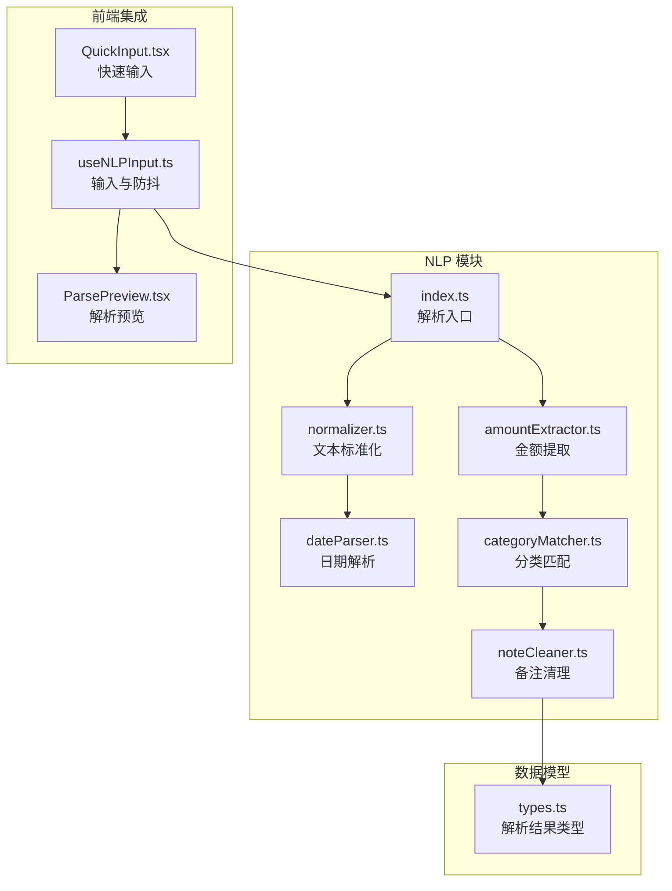
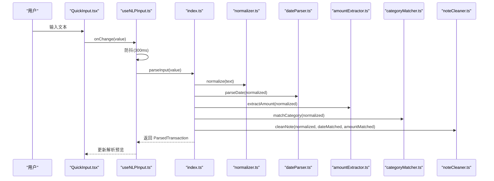
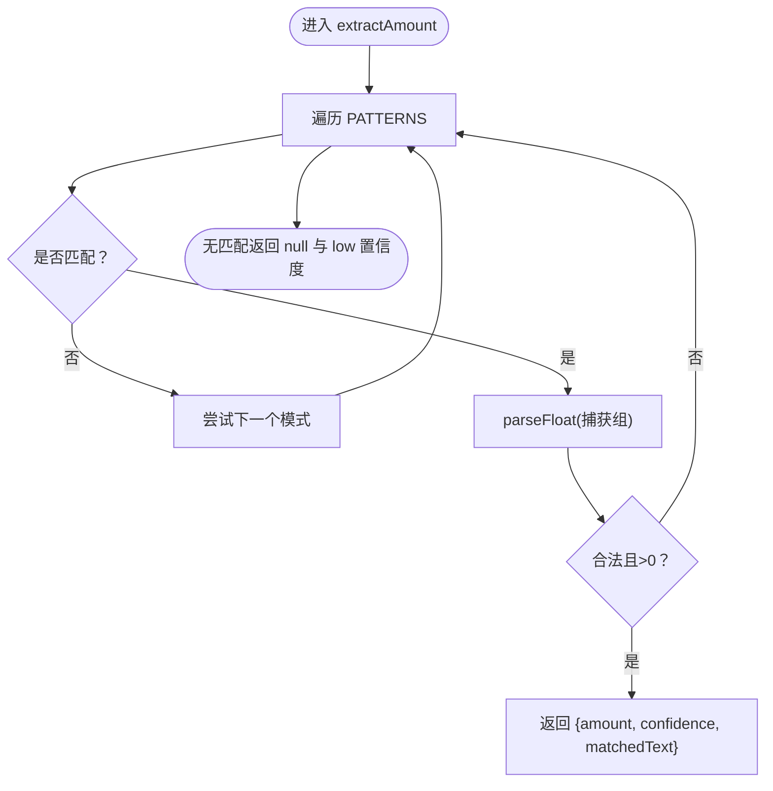
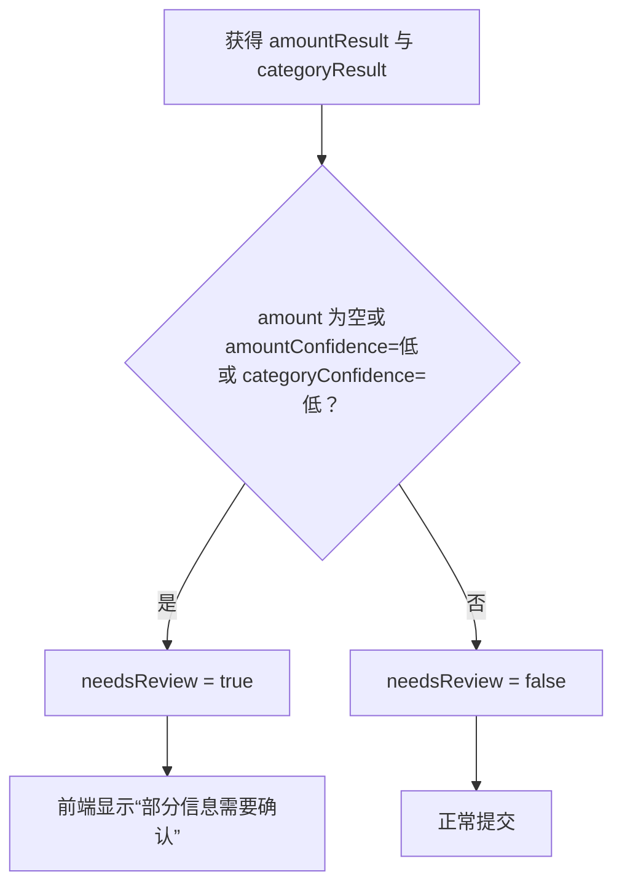
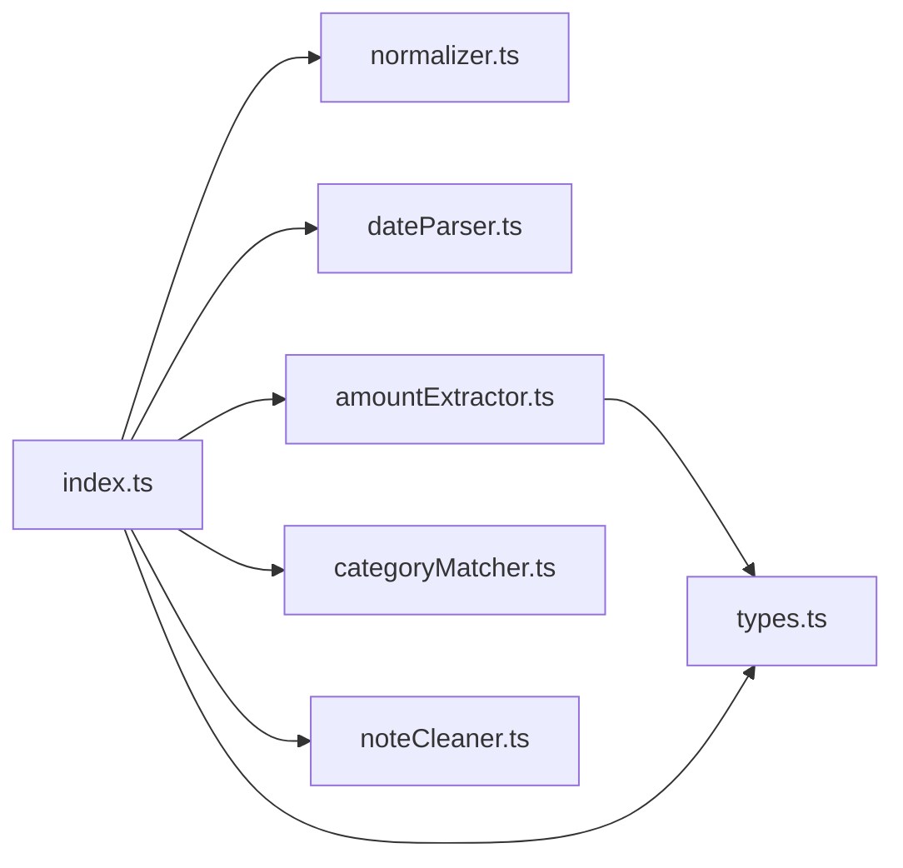

# 金额提取算法

<cite>
**本文引用的文件**
- [amountExtractor.ts](file://src/nlp/amountExtractor.ts)
- [index.ts](file://src/nlp/index.ts)
- [normalizer.ts](file://src/nlp/normalizer.ts)
- [noteCleaner.ts](file://src/nlp/noteCleaner.ts)
- [dateParser.ts](file://src/nlp/dateParser.ts)
- [types.ts](file://src/db/types.ts)
- [useNLPInput.ts](file://src/hooks/useNLPInput.ts)
- [ParsePreview.tsx](file://src/components/input/ParsePreview.tsx)
- [QuickInput.tsx](file://src/components/input/QuickInput.tsx)
</cite>

## 目录
1. [简介](#简介)
2. [项目结构](#项目结构)
3. [核心组件](#核心组件)
4. [架构总览](#架构总览)
5. [详细组件分析](#详细组件分析)
6. [依赖关系分析](#依赖关系分析)
7. [性能考量](#性能考量)
8. [故障排查指南](#故障排查指南)
9. [结论](#结论)
10. [附录](#附录)

## 简介
本文件针对“金额提取模块”的技术实现进行系统化文档化，重点围绕 extractAmount 函数的算法与匹配逻辑展开，覆盖以下主题：
- 各种金额格式的识别规则（整数、小数、货币符号、中文货币单位、空白处理等）
- 正则表达式逐条说明与典型匹配示例
- 置信度评分机制与低置信度处理策略
- 边界情况处理（负数、范围值、百分比等）
- 算法优化建议与扩展方法

该模块是自然语言解析流程的一部分，位于 src/nlp 目录，最终输出结构化解析结果，供前端界面展示与用户确认。

## 项目结构
金额提取模块位于 src/nlp 子目录，主要文件如下：
- amountExtractor.ts：定义金额提取接口与提取函数
- normalizer.ts：文本标准化（全角转半角、中文货币单位映射、统一大小写、压缩空白）
- index.ts：NLP 解析入口，串联标准化、日期、金额、分类、备注清理
- noteCleaner.ts：从原始输入中移除已解析的日期与金额片段，生成备注
- dateParser.ts：日期解析（支持“昨天/前天/今天/上周/本周/ISO日期/时间”等）
- types.ts：数据库与解析结果类型定义
- useNLPInput.ts：React Hook，负责输入监听、防抖与解析触发
- ParsePreview.tsx：解析预览组件，展示金额、分类、日期、备注与用户交互
- QuickInput.tsx：快速输入组件，触发解析流程

图表来源
- [index.ts:1-62](file://src/nlp/index.ts#L1-L62)
- [normalizer.ts:17-35](file://src/nlp/normalizer.ts#L17-L35)
- [dateParser.ts:101-120](file://src/nlp/dateParser.ts#L101-L120)
- [amountExtractor.ts:27-43](file://src/nlp/amountExtractor.ts#L27-L43)
- [noteCleaner.ts:2-28](file://src/nlp/noteCleaner.ts#L2-L28)
- [types.ts:48-59](file://src/db/types.ts#L48-L59)
- [useNLPInput.ts:11-30](file://src/hooks/useNLPInput.ts#L11-L30)
- [ParsePreview.tsx:17-121](file://src/components/input/ParsePreview.tsx#L17-L121)
- [QuickInput.tsx:11-67](file://src/components/input/QuickInput.tsx#L11-L67)

章节来源
- [index.ts:1-62](file://src/nlp/index.ts#L1-L62)
- [types.ts:48-59](file://src/db/types.ts#L48-L59)

## 核心组件
- AmountResult 接口：定义金额提取结果，包含数值、置信度与匹配文本
- PATTERNS：按优先级排列的正则表达式集合，覆盖多种金额格式
- extractAmount：遍历 PATTERNS，首个匹配即返回；过滤非法值后输出结果
- normalize：在解析前对输入进行标准化，提升匹配鲁棒性
- parseInput：NLP 解析主流程，依次调用标准化、日期、金额、分类、备注清理，并决定是否需要人工复核

章节来源
- [amountExtractor.ts:1-44](file://src/nlp/amountExtractor.ts#L1-L44)
- [index.ts:8-55](file://src/nlp/index.ts#L8-L55)
- [normalizer.ts:17-35](file://src/nlp/normalizer.ts#L17-L35)

## 架构总览
下图展示了从用户输入到解析结果的关键调用序列：

图表来源
- [useNLPInput.ts:11-30](file://src/hooks/useNLPInput.ts#L11-L30)
- [index.ts:8-55](file://src/nlp/index.ts#L8-L55)
- [normalizer.ts:17-35](file://src/nlp/normalizer.ts#L17-L35)
- [dateParser.ts:101-120](file://src/nlp/dateParser.ts#L101-L120)
- [amountExtractor.ts:27-43](file://src/nlp/amountExtractor.ts#L27-L43)
- [noteCleaner.ts:2-28](file://src/nlp/noteCleaner.ts#L2-L28)

## 详细组件分析

### extractAmount 算法与匹配逻辑
- 匹配顺序：按 PATTERNS 的先后顺序逐一尝试，命中即停止
- 匹配条件：
  - 提取捕获组中的数字串（支持整数与小数）
  - 将捕获组转换为浮点数，且必须大于 0
  - 返回包含金额、置信度与匹配文本的结果
- 默认返回：若无任何匹配，返回空金额与低置信度

图表来源
- [amountExtractor.ts:27-43](file://src/nlp/amountExtractor.ts#L27-L43)

章节来源
- [amountExtractor.ts:27-43](file://src/nlp/amountExtractor.ts#L27-L43)

### 正则表达式详解与匹配示例
以下为 PATTERNS 中各模式的说明与典型示例（仅描述匹配规则，不直接展示代码）：
- 模式 P0：数字 + “元/块”
  - 规则：一个或多个数字，可含小数点，后跟“元”或“块”
  - 示例：匹配“123元”“45.6元”“78块”
  - 置信度：高
- 模式 P1：动词 + 数字
  - 规则：以“花了/花费/用了/支付/付了/花了/消费”等动词开头，后接金额
  - 示例：匹配“花了123元”“支付45.6”“用了78块”
  - 置信度：高
- 模式 P2：货币符号前缀
  - 规则：以“¥/￥”开头，后接金额
  - 示例：匹配“¥123”“￥45.6”
  - 置信度：高
- 模式 P3：数字 + “元”（空格分隔）
  - 规则：数字后跟“元”，中间允许空格
  - 示例：匹配“123 元”“45.6 元”
  - 置信度：高
- 模式 P4：末尾纯数字
  - 规则：以数字结尾（末尾数字）
  - 示例：匹配“今天花了123”中的“123”
  - 置信度：中
- 模式 P5：兜底：第一个数字
  - 规则：任意位置的第一个数字串
  - 示例：匹配“abc 123 def”中的“123”
  - 置信度：低

章节来源
- [amountExtractor.ts:8-25](file://src/nlp/amountExtractor.ts#L8-L25)

### 置信度评分机制与低置信度处理策略
- 置信度来源：
  - 各模式自带置信度（高/中/低），由 PATTERNS 中的字段指定
- 低置信度处理：
  - 若金额为空或置信度为低，或分类置信度为低，则标记 needsReview 为真，提示用户确认
  - 在前端解析预览中，若 needsReview 为真且金额为空，提供手动输入金额的控件

图表来源
- [index.ts:39-42](file://src/nlp/index.ts#L39-L42)
- [ParsePreview.tsx:93-107](file://src/components/input/ParsePreview.tsx#L93-L107)

章节来源
- [index.ts:39-42](file://src/nlp/index.ts#L39-L42)
- [ParsePreview.tsx:93-107](file://src/components/input/ParsePreview.tsx#L93-L107)

### 边界情况处理
- 负数：当前算法仅接受大于 0 的金额，因此负数不会被识别
- 范围值：例如“100-200元”不会被识别为单一金额，需拆分为两个独立条目
- 百分比：例如“8折/80%”不会被识别为金额，需在业务层另行处理
- 中文货币单位：通过 normalize 将“块/毛/大洋/人民币/块钱”等映射为“元”，提升识别率
- 全角字符：normalize 将全角数字与标点转换为半角，减少误判
- 多余空白：normalize 压缩多余空白，避免正则匹配受干扰

章节来源
- [amountExtractor.ts:31-38](file://src/nlp/amountExtractor.ts#L31-L38)
- [normalizer.ts:17-35](file://src/nlp/normalizer.ts#L17-L35)

### 文本标准化（normalize）对金额提取的影响
- 全角数字与标点转半角，确保与正则一致
- 中文货币单位映射为“元”，统一单位
- 统一小写（英文），便于关键词匹配
- 压缩多余空白，提升稳定性

章节来源
- [normalizer.ts:17-35](file://src/nlp/normalizer.ts#L17-L35)

### 解析流程与前后置处理
- 解析入口 parseInput：
  - 空输入直接返回默认结果（日期为当天，置信度低）
  - 顺序执行：标准化 → 日期 → 金额 → 分类 → 备注清理
  - 根据金额与分类置信度决定是否需要人工复核
- 备注清理 cleanNote：
  - 移除已解析的日期与金额片段
  - 去除常见动词前缀（如“花了/花费/用了/支付/付了/消费”）
  - 清理多余标点与空白

章节来源
- [index.ts:8-55](file://src/nlp/index.ts#L8-L55)
- [noteCleaner.ts:2-28](file://src/nlp/noteCleaner.ts#L2-L28)

## 依赖关系分析
- 模块内依赖：
  - index.ts 依赖 normalize、parseDate、extractAmount、matchCategory、cleanNote
  - amountExtractor.ts 与 normalizer.ts 无直接相互依赖
- 类型依赖：
  - ParsedTransaction 与 Transaction 等类型定义于 types.ts，用于约束解析结果与数据库存储

图表来源
- [index.ts:2-6](file://src/nlp/index.ts#L2-L6)
- [amountExtractor.ts:1-5](file://src/nlp/amountExtractor.ts#L1-L5)
- [types.ts:48-59](file://src/db/types.ts#L48-L59)

章节来源
- [index.ts:2-6](file://src/nlp/index.ts#L2-L6)
- [types.ts:48-59](file://src/db/types.ts#L48-L59)

## 性能考量
- 正则数量有限（6 个），匹配复杂度低，整体性能优异
- PATTERNS 按优先级排序，命中即停，避免不必要的计算
- normalize 采用简单字符串替换与映射，开销极低
- 建议：
  - 若输入量极大，可在 normalize 前增加缓存（如基于输入指纹）
  - 可将 PATTERNS 编译为一次性对象，减少重复构造
  - 对高频调用场景，可考虑将 normalize 结果复用（已在 parseInput 中串联）

[本节为通用性能建议，不涉及具体文件分析]

## 故障排查指南
- 未识别到金额
  - 检查输入是否包含“元/块/¥/￥”或动词+数字组合
  - 确认是否使用了全角字符或中文单位
  - 查看 needsReview 是否为真，必要时手动输入金额
- 金额错误
  - 检查是否混入范围值（如“100-200”）或多金额文本
  - 确认是否包含百分比或折扣表述
- 置信度低
  - 若金额为空或置信度为低，系统会提示复核
  - 可在前端解析预览中调整金额或分类

章节来源
- [ParsePreview.tsx:93-107](file://src/components/input/ParsePreview.tsx#L93-L107)
- [index.ts:39-42](file://src/nlp/index.ts#L39-L42)

## 结论
金额提取模块通过一组精心设计的正则表达式与标准化流程，在保证高置信度的同时，兼顾了中文输入的多样性与容错性。其模块化设计使扩展与维护变得简单，开发者可根据业务需求新增模式或调整置信度策略。

[本节为总结性内容，不涉及具体文件分析]

## 附录

### 算法优化建议与扩展方法
- 新增模式
  - 在 PATTERNS 中添加新正则，明确置信度与名称
  - 将更严格的模式置于前面，提高命中效率
- 置信度动态调整
  - 引入上下文权重（如“支付/消费”动词出现频率）动态调整置信度
- 多金额处理
  - 对范围值（如“100-200元”）进行拆分，分别提取并合并
- 百分比与汇率
  - 对百分比（如“8折/80%”）单独处理，转换为绝对金额
- 本地化增强
  - 支持更多货币符号与单位（如“$”“USD”“€”等）
- 性能优化
  - 对 normalize 结果进行缓存
  - 使用编译后的正则对象，减少运行时编译成本

[本节为扩展建议，不涉及具体文件分析]