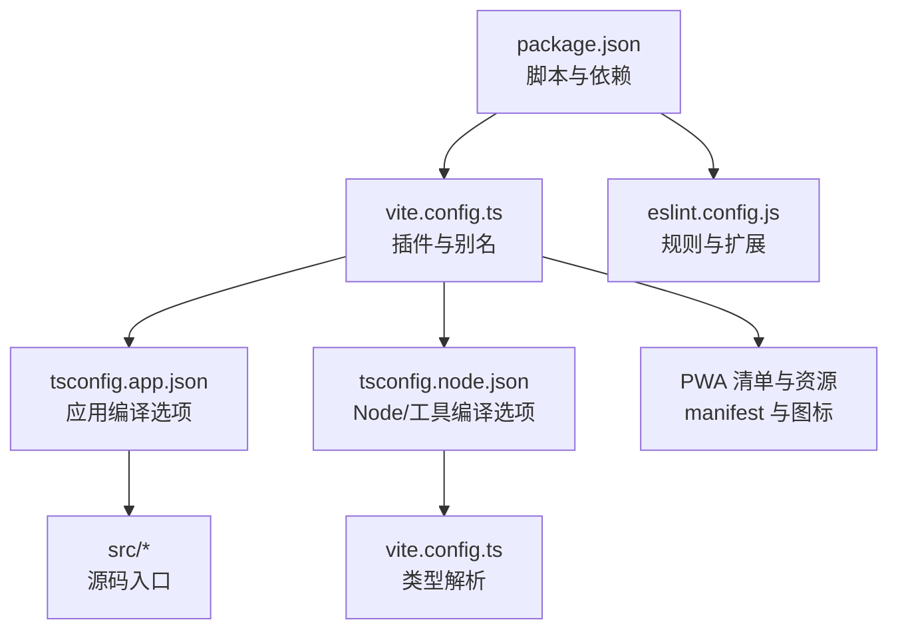
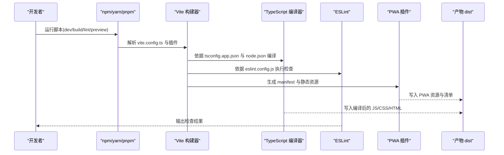
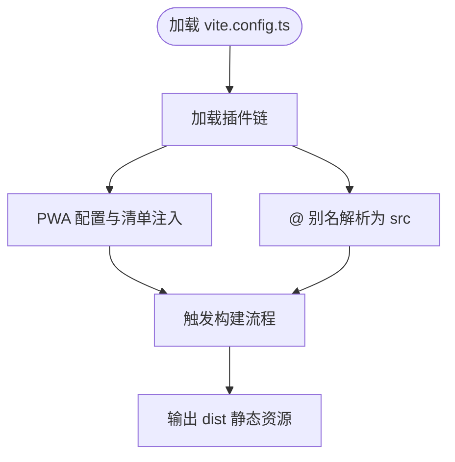
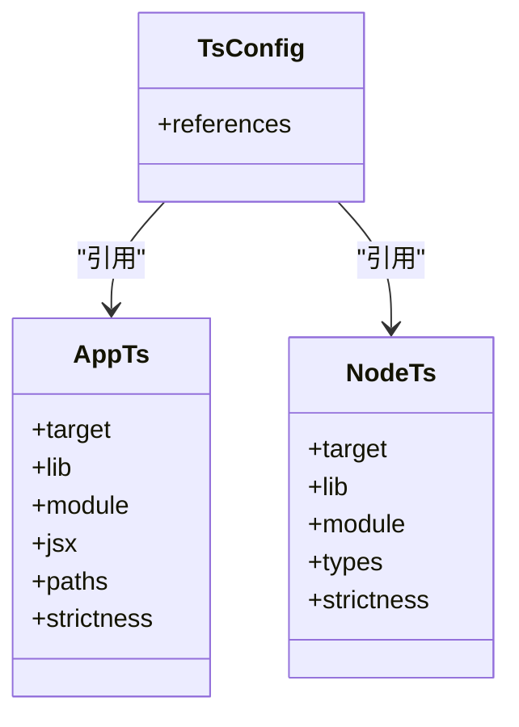
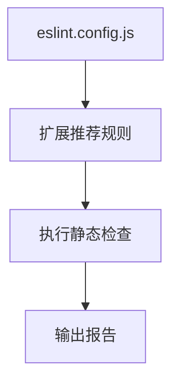
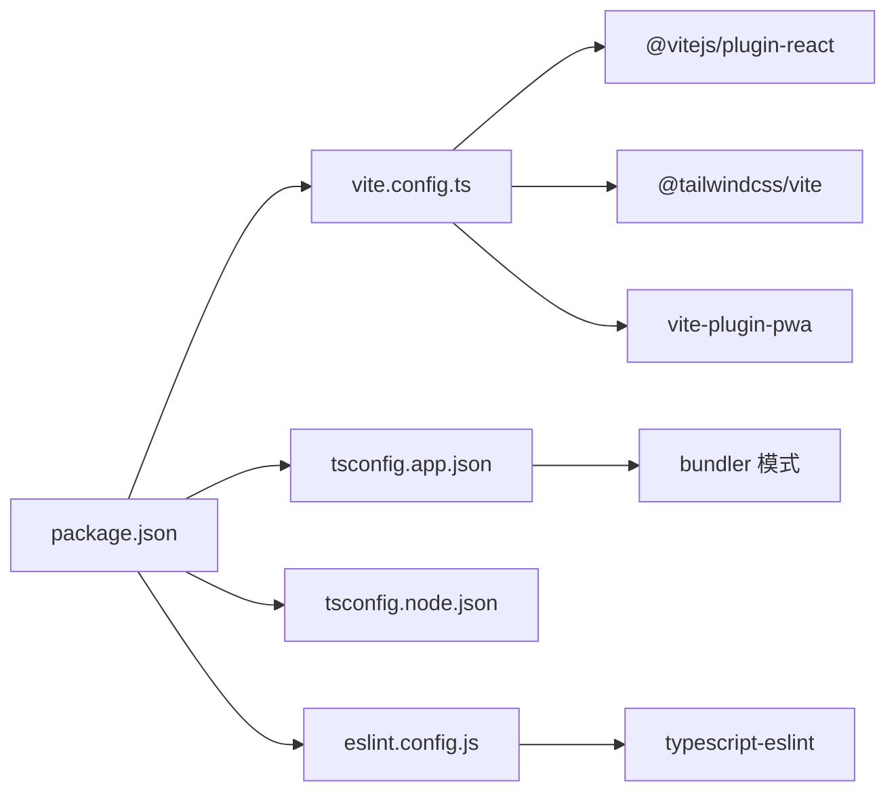

# 配置和部署

<cite>
**本文引用的文件**
- [vite.config.ts](file://vite.config.ts)
- [package.json](file://package.json)
- [eslint.config.js](file://eslint.config.js)
- [tsconfig.json](file://tsconfig.json)
- [tsconfig.app.json](file://tsconfig.app.json)
- [tsconfig.node.json](file://tsconfig.node.json)
- [README.md](file://README.md)
</cite>

## 目录
1. [简介](#简介)
2. [项目结构](#项目结构)
3. [核心组件](#核心组件)
4. [架构总览](#架构总览)
5. [详细组件分析](#详细组件分析)
6. [依赖关系分析](#依赖关系分析)
7. [性能考量](#性能考量)
8. [故障排除指南](#故障排除指南)
9. [结论](#结论)
10. [附录](#附录)

## 简介
本指南面向 MoneyNote 项目的配置与部署，覆盖 Vite 构建配置、TypeScript 编译选项、ESLint 代码规范、包管理配置、PWA 配置、环境变量管理、构建优化策略、开发与生产环境差异、多平台部署（GitHub Pages、Vercel、Netlify）、CI/CD 流程与自动化部署，以及常见问题排查与性能调优建议。内容基于仓库中现有配置文件进行系统化梳理与落地说明。

## 项目结构
MoneyNote 采用 Vite + React + TypeScript 技术栈，使用单体 tsconfig 引用 app 与 node 两套编译配置，并通过 Vite 插件体系集成 TailwindCSS 与 PWA 能力。核心配置文件包括：
- 构建与插件：vite.config.ts
- 包与脚本：package.json
- 类型与编译：tsconfig.json、tsconfig.app.json、tsconfig.node.json
- 代码规范：eslint.config.js
- 项目说明与可选 ESLint 扩展：README.md

图表来源
- [vite.config.ts:1-36](file://vite.config.ts#L1-L36)
- [package.json:1-40](file://package.json#L1-L40)
- [tsconfig.app.json:1-27](file://tsconfig.app.json#L1-L27)
- [tsconfig.node.json:1-25](file://tsconfig.node.json#L1-L25)
- [eslint.config.js:1-23](file://eslint.config.js#L1-L23)

章节来源
- [vite.config.ts:1-36](file://vite.config.ts#L1-L36)
- [package.json:1-40](file://package.json#L1-L40)
- [tsconfig.json:1-8](file://tsconfig.json#L1-L8)
- [tsconfig.app.json:1-27](file://tsconfig.app.json#L1-L27)
- [tsconfig.node.json:1-25](file://tsconfig.node.json#L1-L25)
- [eslint.config.js:1-23](file://eslint.config.js#L1-L23)
- [README.md:1-74](file://README.md#L1-L74)

## 核心组件
- Vite 构建与插件
  - React 插件、TailwindCSS 插件、PWA 插件
  - 路径别名 @ 指向 src
- TypeScript 编译
  - 单体 tsconfig 引用 app 与 node 两份配置
  - 应用侧启用 JSX、路径映射、严格未使用检测
  - 工具侧启用 bundler 模式与 Node 类型
- ESLint 规范
  - 基于 flat config，推荐规则链路包含 ts、react-hooks、react-refresh
  - 支持类型感知的可选扩展（README 提示）
- 包管理与脚本
  - 开发、构建、预览、代码检查脚本
  - 生产依赖与开发依赖分层

章节来源
- [vite.config.ts:1-36](file://vite.config.ts#L1-L36)
- [package.json:1-40](file://package.json#L1-L40)
- [tsconfig.app.json:1-27](file://tsconfig.app.json#L1-L27)
- [tsconfig.node.json:1-25](file://tsconfig.node.json#L1-L25)
- [eslint.config.js:1-23](file://eslint.config.js#L1-L23)
- [README.md:14-74](file://README.md#L14-L74)

## 架构总览
下图展示从开发到构建的关键流程：Vite 读取配置与插件，TypeScript 编译器按配置生成构建信息，ESLint 进行静态检查，最终输出静态资源并支持 PWA 注册与缓存策略。

图表来源
- [vite.config.ts:1-36](file://vite.config.ts#L1-L36)
- [tsconfig.app.json:1-27](file://tsconfig.app.json#L1-L27)
- [tsconfig.node.json:1-25](file://tsconfig.node.json#L1-L25)
- [eslint.config.js:1-23](file://eslint.config.js#L1-L23)
- [package.json:6-11](file://package.json#L6-L11)

## 详细组件分析

### Vite 构建配置
- 插件链
  - React 插件：启用 React JSX 与热更新
  - TailwindCSS 插件：集成样式工具链
  - PWA 插件：自动注册、静态资源纳入、manifest 定义
- 路径别名
  - 使用 @ 指向 src，便于模块导入
- PWA 清单与资源
  - 主题色、背景色、图标集、启动路径、显示模式等
  - 包含 favicon、Apple Touch Icon、192x192、512x512 图标及 maskable 变体

图表来源
- [vite.config.ts:7-35](file://vite.config.ts#L7-L35)

章节来源
- [vite.config.ts:1-36](file://vite.config.ts#L1-L36)

### TypeScript 编译配置
- 单体引用
  - tsconfig.json 通过 references 引用 app 与 node 两份配置
- 应用配置（app）
  - 目标与库：ES2023 + DOM
  - 模块解析：bundler；JSX：react-jsx
  - 路径映射：@/* -> src/*
  - 严格性：未使用局部变量/参数、switch 无 fallthrough 等
- 工具配置（node）
  - 目标与库：ES2023
  - 模块解析：bundler；仅用于 Vite 配置类型
  - 严格性：未使用局部变量/参数、switch 无 fallthrough 等

图表来源
- [tsconfig.json:1-8](file://tsconfig.json#L1-L8)
- [tsconfig.app.json:1-27](file://tsconfig.app.json#L1-L27)
- [tsconfig.node.json:1-25](file://tsconfig.node.json#L1-L25)

章节来源
- [tsconfig.json:1-8](file://tsconfig.json#L1-L8)
- [tsconfig.app.json:1-27](file://tsconfig.app.json#L1-L27)
- [tsconfig.node.json:1-25](file://tsconfig.node.json#L1-L25)

### ESLint 代码规范
- 配置风格
  - 使用 flat config，推荐规则链路包含 @eslint/js、typescript-eslint 推荐、react-hooks 推荐、react-refresh Vite 适配
- 语言选项
  - 浏览器全局；可选类型感知（README 提示）
- 文件范围
  - 针对 .ts/.tsx 文件生效

图表来源
- [eslint.config.js:8-22](file://eslint.config.js#L8-L22)

章节来源
- [eslint.config.js:1-23](file://eslint.config.js#L1-L23)
- [README.md:14-74](file://README.md#L14-L74)

### 包管理与脚本
- 脚本职责
  - dev：本地开发服务器
  - build：先增量编译 ts，再打包构建
  - lint：执行 ESLint
  - preview：本地预览构建产物
- 依赖分层
  - 生产依赖：React 生态、数据持久化与可视化等
  - 开发依赖：Vite、React 插件、TailwindCSS、PWA 插件、TypeScript、ESLint 及其插件

章节来源
- [package.json:6-11](file://package.json#L6-L11)
- [package.json:12-38](file://package.json#L12-L38)

### PWA 配置与优化
- 自动更新注册
  - 采用 autoUpdate 注册类型
- 资源纳入
  - favicon.svg、apple-touch-icon.png、icon-192x192.png、icon-512x512.png
- 清单字段
  - 名称、短名称、描述、主题色、背景色、显示模式、启动路径、图标数组（含 maskable）
- 优化建议
  - 在生产构建后验证 service worker 是否正确注入与缓存策略
  - 确保 manifest 字段与实际图标一致

章节来源
- [vite.config.ts:11-29](file://vite.config.ts#L11-L29)

### 环境变量管理
- 当前仓库未发现 .env* 文件或显式的环境变量读取逻辑
- 建议
  - 如需运行时变量，在开发与 CI 中分别配置对应键值
  - 对于 Vite，遵循 Vite 的环境变量命名约定（如 VITE_ 前缀）

[本节不直接分析具体文件，故无“章节来源”]

### 开发与生产环境差异
- 构建命令
  - 开发：vite（HMR、快速启动）
  - 生产：先 tsc -b 增量编译，再 vite build 打包
- PWA 行为
  - 生产构建会生成 service worker 与 manifest，适合离线与安装体验
- 其他差异
  - 生产构建通常开启压缩与 Tree-shaking（由 Vite 默认行为决定）

章节来源
- [package.json:8](file://package.json#L8)
- [vite.config.ts:11-29](file://vite.config.ts#L11-L29)

## 依赖关系分析
- 组件耦合
  - vite.config.ts 依赖 react、tailwindcss、vite-plugin-pwa
  - tsconfig.app.json 依赖 ts 与 bundler 模式
  - eslint.config.js 依赖 tseslint、react-hooks、react-refresh
  - package.json 统一调度上述能力
- 外部依赖
  - React 生态、Dexie（IndexedDB 封装）、Recharts（图表）、Framer Motion（动画）

图表来源
- [package.json:1-40](file://package.json#L1-L40)
- [vite.config.ts:1-5](file://vite.config.ts#L1-L5)
- [tsconfig.app.json:10-14](file://tsconfig.app.json#L10-L14)
- [eslint.config.js:1-6](file://eslint.config.js#L1-L6)

章节来源
- [package.json:1-40](file://package.json#L1-L40)
- [vite.config.ts:1-36](file://vite.config.ts#L1-L36)
- [tsconfig.app.json:1-27](file://tsconfig.app.json#L1-L27)
- [eslint.config.js:1-23](file://eslint.config.js#L1-L23)

## 性能考量
- 构建顺序
  - 先 tsc -b 增量编译，再 vite build，有助于减少重复编译开销
- 模块解析
  - 使用 bundler 模式与 verbatimModuleSyntax，有利于 Tree-shaking 与打包体积控制
- PWA 与缓存
  - 合理配置 includeAssets 与 manifest，避免不必要的资源缓存
- 开发体验
  - React 插件与 HMR 提升迭代速度；如需进一步优化可考虑禁用 React Compiler（参考 README 说明）

章节来源
- [package.json:8](file://package.json#L8)
- [tsconfig.app.json:10-14](file://tsconfig.app.json#L10-L14)
- [README.md:10-12](file://README.md#L10-L12)

## 故障排除指南
- 构建失败（TypeScript）
  - 确认已执行 tsc -b 增量编译后再执行 vite build
  - 检查 tsconfig.app.json 与 tsconfig.node.json 的引用是否正确
- PWA 未生效
  - 确认已生成 service worker 与 manifest
  - 检查 includeAssets 与图标路径是否与实际资源一致
- ESLint 报错
  - 若需要类型感知规则，请参考 README 中的可选扩展方式
  - 确保编辑器或 CI 使用的 ESLint 版本与配置兼容
- 路径别名无效
  - 确认 @ 别名在 tsconfig.app.json 中已配置，且 Vite 插件链已启用

章节来源
- [package.json:8](file://package.json#L8)
- [tsconfig.json:3-6](file://tsconfig.json#L3-L6)
- [tsconfig.app.json:21-23](file://tsconfig.app.json#L21-L23)
- [vite.config.ts:30-34](file://vite.config.ts#L30-L34)
- [eslint.config.js:18-21](file://eslint.config.js#L18-L21)
- [README.md:14-74](file://README.md#L14-L74)

## 结论
本指南基于仓库现有配置，系统梳理了 MoneyNote 的构建、类型、规范与 PWA 能力，并给出开发/生产差异、部署与 CI/CD 的通用实践建议。建议在后续迭代中补充环境变量与 CI/CD 配置文件，以完善端到端自动化流程。

## 附录

### 部署到不同平台的通用步骤
- GitHub Pages
  - 在仓库设置中启用 Pages，选择分支与根目录
  - 在构建脚本中确保输出目录为 dist
  - 如需子路径部署，可在 Vite 配置中设置 base
- Vercel
  - 连接仓库后，使用框架检测识别 Vite
  - 设置构建命令为 npm run build 或对应包管理器命令
  - 预览与生产环境变量通过面板配置
- Netlify
  - 指定发布目录为 dist，构建命令为 npm run build
  - 在表单中配置环境变量（如需要）

[本节为通用流程说明，不直接分析具体文件，故无“章节来源”]

### CI/CD 流程与自动化部署
- 建议流水线步骤
  - 安装依赖（npm ci 或等效）
  - 类型检查（tsc --noEmit）
  - 代码检查（npm run lint）
  - 构建（npm run build）
  - 部署（根据目标平台配置）
- 环境变量
  - 在 CI 系统中配置密钥与运行时变量，避免硬编码
- 缓存策略
  - 缓存 node_modules 与 TypeScript 构建信息，提升重复作业速度

[本节为通用流程说明，不直接分析具体文件，故无“章节来源”]