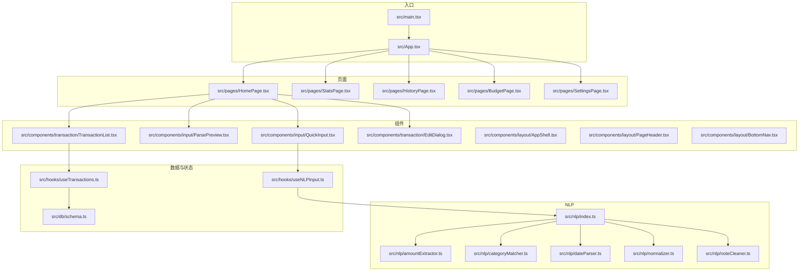
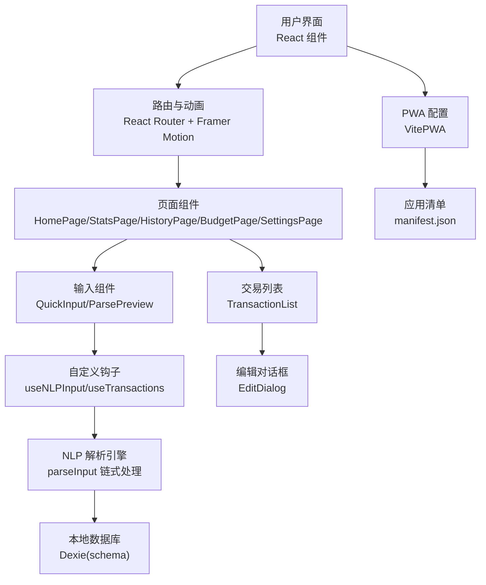
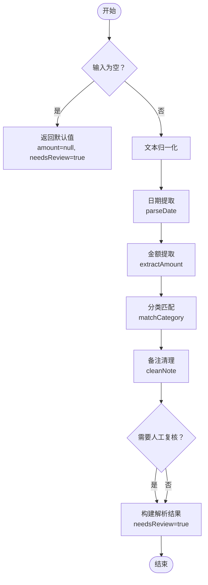
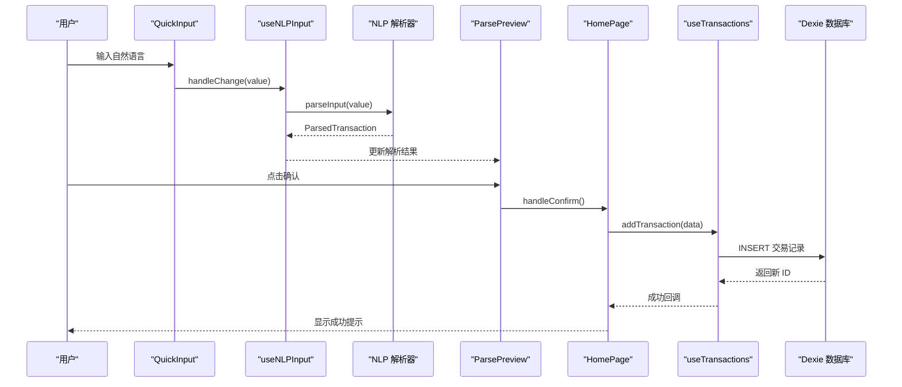
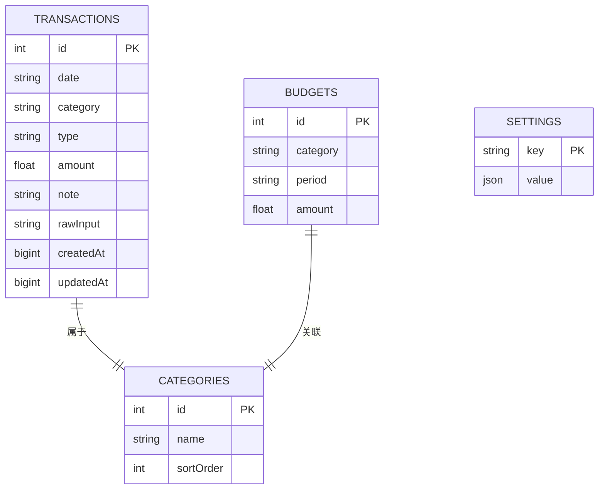
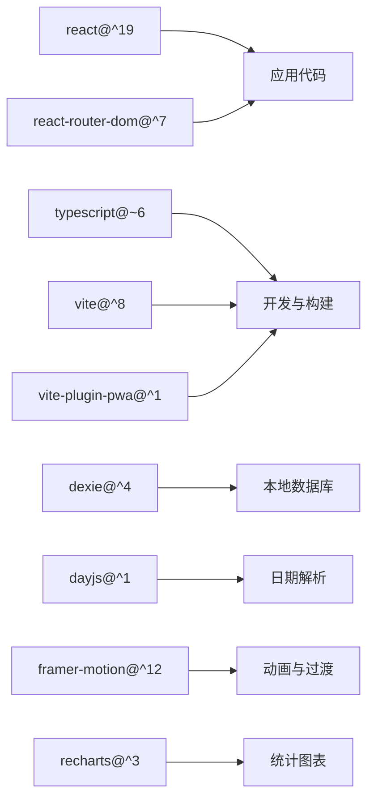

# 项目概述

<cite>
**本文档引用的文件**
- [package.json](file://package.json)
- [vite.config.ts](file://vite.config.ts)
- [src/main.tsx](file://src/main.tsx)
- [src/App.tsx](file://src/App.tsx)
- [src/pages/HomePage.tsx](file://src/pages/HomePage.tsx)
- [src/components/input/QuickInput.tsx](file://src/components/input/QuickInput.tsx)
- [src/components/input/ParsePreview.tsx](file://src/components/input/ParsePreview.tsx)
- [src/components/transaction/TransactionList.tsx](file://src/components/transaction/TransactionList.tsx)
- [src/components/transaction/EditDialog.tsx](file://src/components/transaction/EditDialog.tsx)
- [src/hooks/useNLPInput.ts](file://src/hooks/useNLPInput.ts)
- [src/hooks/useTransactions.ts](file://src/hooks/useTransactions.ts)
- [src/nlp/index.ts](file://src/nlp/index.ts)
- [src/nlp/amountExtractor.ts](file://src/nlp/amountExtractor.ts)
- [src/nlp/categoryMatcher.ts](file://src/nlp/categoryMatcher.ts)
- [src/nlp/dateParser.ts](file://src/nlp/dateParser.ts)
- [src/nlp/normalizer.ts](file://src/nlp/normalizer.ts)
- [src/nlp/noteCleaner.ts](file://src/nlp/noteCleaner.ts)
- [src/db/schema.ts](file://src/db/schema.ts)
- [src/utils/constants.ts](file://src/utils/constants.ts)
- [src/utils/format.ts](file://src/utils/format.ts)
- [src/utils/dateHelpers.ts](file://src/utils/dateHelpers.ts)
- [src/utils/export.ts](file://src/utils/export.ts)
- [src/styles/index.css](file://src/styles/index.css)
- [README.md](file://README.md)
</cite>

## 目录
1. [引言](#引言)
2. [项目结构](#项目结构)
3. [核心组件](#核心组件)
4. [架构总览](#架构总览)
5. [详细组件分析](#详细组件分析)
6. [依赖关系分析](#依赖关系分析)
7. [性能考虑](#性能考虑)
8. [故障排除指南](#故障排除指南)
9. [结论](#结论)
10. [附录](#附录)

## 引言
MoneyNote 是一款基于 React 19 + TypeScript + Vite 构建的渐进式 Web 应用（PWA），专注于通过自然语言处理（NLP）实现智能记账。其核心目标是让用户以最自然的方式输入“记一笔”，系统自动解析金额、时间、分类与备注，并生成准确的财务记录。项目采用前端原生数据库（Dexie）进行本地持久化，结合 React Hooks 实现响应式数据流，配合 Framer Motion 提供流畅的页面切换动画，TailwindCSS 实现现代化 UI 设计。

- 目标用户：追求高效、便捷记账体验的个人用户，尤其是习惯口头或自然语言表达的用户。
- 应用场景：日常消费记录、旅行开销、聚餐费用等碎片化记账需求。
- 核心价值主张：降低记账门槛，提升输入效率；通过 NLP 减少手动选择与输入成本；提供直观的数据概览与历史记录管理。

## 项目结构
项目采用按功能域划分的目录组织方式，核心模块包括：
- 页面层：首页、统计页、历史页、预算页、设置页
- 组件层：布局组件、输入组件、交易组件、统计组件、UI 基础组件
- 数据层：数据库定义、类型声明、工具函数
- NLP 层：文本归一化、金额提取、日期解析、分类匹配、备注清理
- 钩子层：输入解析钩子、交易数据钩子、统计钩子
- 工具与样式：常量、格式化、日期辅助、导出工具、全局样式

**图表来源**
- [src/main.tsx:1-14](file://src/main.tsx#L1-L14)
- [src/App.tsx:1-51](file://src/App.tsx#L1-L51)
- [src/pages/HomePage.tsx:1-100](file://src/pages/HomePage.tsx#L1-L100)
- [src/components/input/QuickInput.tsx:1-68](file://src/components/input/QuickInput.tsx#L1-L68)
- [src/components/transaction/TransactionList.tsx:1-50](file://src/components/transaction/TransactionList.tsx#L1-L50)
- [src/hooks/useNLPInput.ts:1-51](file://src/hooks/useNLPInput.ts#L1-L51)
- [src/hooks/useTransactions.ts:1-67](file://src/hooks/useTransactions.ts#L1-L67)
- [src/nlp/index.ts:1-62](file://src/nlp/index.ts#L1-L62)
- [src/nlp/amountExtractor.ts:1-44](file://src/nlp/amountExtractor.ts#L1-L44)
- [src/nlp/categoryMatcher.ts:1-90](file://src/nlp/categoryMatcher.ts#L1-L90)
- [src/nlp/dateParser.ts:1-121](file://src/nlp/dateParser.ts#L1-L121)
- [src/db/schema.ts:1-21](file://src/db/schema.ts#L1-L21)

**章节来源**
- [src/main.tsx:1-14](file://src/main.tsx#L1-L14)
- [src/App.tsx:1-51](file://src/App.tsx#L1-L51)
- [vite.config.ts:1-36](file://vite.config.ts#L1-L36)
- [package.json:1-40](file://package.json#L1-L40)

## 核心组件
- 输入与解析链路
  - 快速输入组件负责接收用户自然语言输入，触发去抖动解析。
  - NLP 解析器按阶段执行：文本归一化 → 日期提取 → 金额提取 → 分类匹配 → 备注清理，最终输出解析结果。
  - 解析预览组件展示解析结果与置信度，支持一键确认或手动调整。
- 交易管理
  - 交易列表按日期分组展示，支持点击进入编辑对话框进行修改或删除。
  - 使用 Dexie 本地数据库存储交易、分类、预算与设置信息，通过 dexie-react-hooks 实现实时查询与更新。
- 统计与概览
  - 首页提供今日与本月支出摘要，帮助用户快速掌握收支状况。
- 路由与动画
  - 使用 React Router 管理页面路由，配合 Framer Motion 实现页面切换动画，提升交互体验。

**章节来源**
- [src/pages/HomePage.tsx:1-100](file://src/pages/HomePage.tsx#L1-L100)
- [src/components/input/QuickInput.tsx:1-68](file://src/components/input/QuickInput.tsx#L1-L68)
- [src/components/input/ParsePreview.tsx](file://src/components/input/ParsePreview.tsx)
- [src/components/transaction/TransactionList.tsx:1-50](file://src/components/transaction/TransactionList.tsx#L1-L50)
- [src/components/transaction/EditDialog.tsx](file://src/components/transaction/EditDialog.tsx)
- [src/hooks/useNLPInput.ts:1-51](file://src/hooks/useNLPInput.ts#L1-L51)
- [src/hooks/useTransactions.ts:1-67](file://src/hooks/useTransactions.ts#L1-L67)
- [src/nlp/index.ts:1-62](file://src/nlp/index.ts#L1-L62)

## 架构总览
本项目采用“页面-组件-NLP-数据”分层架构，强调职责分离与可扩展性。前端通过 Vite 提供开发与构建环境，PWA 插件确保离线可用与安装能力；Dexie 提供轻量级 IndexedDB 封装，满足移动端本地存储需求。

**图表来源**
- [src/App.tsx:1-51](file://src/App.tsx#L1-L51)
- [src/pages/HomePage.tsx:1-100](file://src/pages/HomePage.tsx#L1-L100)
- [src/components/input/QuickInput.tsx:1-68](file://src/components/input/QuickInput.tsx#L1-L68)
- [src/components/transaction/TransactionList.tsx:1-50](file://src/components/transaction/TransactionList.tsx#L1-L50)
- [src/hooks/useNLPInput.ts:1-51](file://src/hooks/useNLPInput.ts#L1-L51)
- [src/hooks/useTransactions.ts:1-67](file://src/hooks/useTransactions.ts#L1-L67)
- [src/nlp/index.ts:1-62](file://src/nlp/index.ts#L1-L62)
- [src/db/schema.ts:1-21](file://src/db/schema.ts#L1-L21)
- [vite.config.ts:1-36](file://vite.config.ts#L1-L36)

## 详细组件分析

### NLP 解析流程
NLP 解析器将自然语言输入拆解为金额、日期、分类与备注，并根据置信度决定是否需要人工复核。解析流程如下：

**图表来源**
- [src/nlp/index.ts:8-55](file://src/nlp/index.ts#L8-L55)
- [src/nlp/amountExtractor.ts:27-43](file://src/nlp/amountExtractor.ts#L27-L43)
- [src/nlp/dateParser.ts:101-120](file://src/nlp/dateParser.ts#L101-L120)
- [src/nlp/categoryMatcher.ts:45-89](file://src/nlp/categoryMatcher.ts#L45-L89)
- [src/nlp/normalizer.ts](file://src/nlp/normalizer.ts)
- [src/nlp/noteCleaner.ts](file://src/nlp/noteCleaner.ts)

**章节来源**
- [src/nlp/index.ts:1-62](file://src/nlp/index.ts#L1-L62)
- [src/nlp/amountExtractor.ts:1-44](file://src/nlp/amountExtractor.ts#L1-L44)
- [src/nlp/categoryMatcher.ts:1-90](file://src/nlp/categoryMatcher.ts#L1-L90)
- [src/nlp/dateParser.ts:1-121](file://src/nlp/dateParser.ts#L1-L121)

### 交易生命周期
从输入到持久化的完整流程如下：

**图表来源**
- [src/components/input/QuickInput.tsx:18-22](file://src/components/input/QuickInput.tsx#L18-L22)
- [src/hooks/useNLPInput.ts:11-30](file://src/hooks/useNLPInput.ts#L11-L30)
- [src/nlp/index.ts:8-55](file://src/nlp/index.ts#L8-L55)
- [src/components/input/ParsePreview.tsx](file://src/components/input/ParsePreview.tsx)
- [src/pages/HomePage.tsx:19-34](file://src/pages/HomePage.tsx#L19-L34)
- [src/hooks/useTransactions.ts:21-29](file://src/hooks/useTransactions.ts#L21-L29)
- [src/db/schema.ts:13-18](file://src/db/schema.ts#L13-L18)

**章节来源**
- [src/pages/HomePage.tsx:1-100](file://src/pages/HomePage.tsx#L1-L100)
- [src/hooks/useNLPInput.ts:1-51](file://src/hooks/useNLPInput.ts#L1-L51)
- [src/hooks/useTransactions.ts:1-67](file://src/hooks/useTransactions.ts#L1-L67)
- [src/db/schema.ts:1-21](file://src/db/schema.ts#L1-L21)

### 数据模型与索引设计
数据库采用 Dexie 定义多张表，包含交易、分类、预算与设置。核心字段与索引策略如下：
- 交易表：主键自增、按日期倒序、按类型+日期复合索引，便于快速查询与排序
- 分类表：按排序字段排序，支持前端展示
- 预算表：按分类+周期组合索引，支持周期预算查询
- 设置表：按键名唯一，用于存储应用配置

**图表来源**
- [src/db/schema.ts:13-18](file://src/db/schema.ts#L13-L18)

**章节来源**
- [src/db/schema.ts:1-21](file://src/db/schema.ts#L1-L21)

## 依赖关系分析
- 技术栈选择
  - React 19：现代 React 生态，支持并发特性与编译器优化
  - TypeScript：提供强类型保障，提升开发与维护效率
  - Vite：快速开发与构建工具，支持热更新与插件生态
  - PWA 插件：提供应用清单与离线缓存能力
  - Dexie：轻量级 IndexedDB 封装，适合移动端本地存储
  - dayjs：轻量日期处理库，支持国际化
  - Framer Motion：提供流畅的动画与过渡效果
  - Recharts：可视化统计图表
- 外部依赖与版本约束
  - 通过 package.json 管理依赖与脚本命令
  - Vite 配置启用 React 插件、TailwindCSS 插件与 PWA 插件
  - 路径别名 @ 指向 src 目录，简化导入路径

**图表来源**
- [package.json:12-37](file://package.json#L12-L37)
- [vite.config.ts:8-29](file://vite.config.ts#L8-L29)

**章节来源**
- [package.json:1-40](file://package.json#L1-L40)
- [vite.config.ts:1-36](file://vite.config.ts#L1-L36)

## 性能考虑
- 去抖动解析：输入变更后延迟 300ms 触发解析，减少频繁计算与渲染
- 本地数据库：使用 Dexie 的实时查询钩子，避免不必要的重渲染
- 动画与路由：页面切换使用轻量动画，避免复杂过渡影响首屏性能
- PWA 缓存：通过应用清单与 Service Worker 提升离线访问速度
- 依赖体积：按需引入 dayjs 国际化与 Recharts，控制打包体积

[本节为通用性能建议，不直接分析具体文件]

## 故障排除指南
- 输入无响应或解析异常
  - 检查输入组件是否正确绑定事件与回调解函数
  - 确认解析钩子的去抖动逻辑未被意外清除
- 解析结果不符合预期
  - 核对 NLP 各阶段正则与匹配逻辑，必要时增加调试日志
  - 检查分类词典与金额模式是否覆盖常见表达
- 交易无法保存或显示异常
  - 确认数据库版本与索引定义一致
  - 检查交易添加与更新的回调是否正确执行
- PWA 安装或更新问题
  - 校验应用清单字段与图标资源路径
  - 确保注册类型与更新策略符合预期

**章节来源**
- [src/components/input/QuickInput.tsx:18-22](file://src/components/input/QuickInput.tsx#L18-L22)
- [src/hooks/useNLPInput.ts:14-30](file://src/hooks/useNLPInput.ts#L14-L30)
- [src/nlp/index.ts:8-55](file://src/nlp/index.ts#L8-L55)
- [src/hooks/useTransactions.ts:21-39](file://src/hooks/useTransactions.ts#L21-L39)
- [src/db/schema.ts:13-18](file://src/db/schema.ts#L13-L18)
- [vite.config.ts:11-28](file://vite.config.ts#L11-L28)

## 结论
MoneyNote 通过“自然语言输入 + NLP 解析 + 本地数据库”的组合，实现了低门槛、高效率的智能记账体验。项目采用现代化前端技术栈与清晰的分层架构，既适合初学者快速上手，也为有经验的开发者提供了良好的扩展空间。未来可在 NLP 模型增强、多语言支持、数据同步与导出功能等方面持续演进。

[本节为总结性内容，不直接分析具体文件]

## 附录
- 开发与构建
  - 开发服务器：npm run dev
  - 生产构建：npm run build
  - 预览构建：npm run preview
- 目录约定
  - 组件按功能域存放于 src/components 下
  - 页面组件位于 src/pages
  - NLP 模块位于 src/nlp
  - 数据库与类型位于 src/db
  - 工具函数位于 src/utils
  - 全局样式位于 src/styles

**章节来源**
- [package.json:6-11](file://package.json#L6-L11)
- [README.md:1-74](file://README.md#L1-L74)