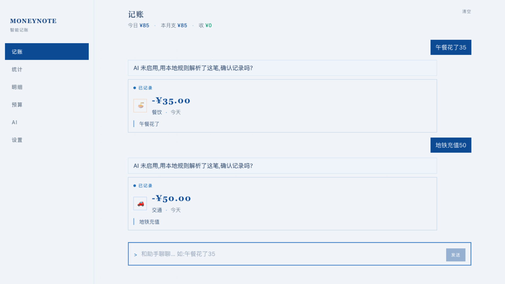
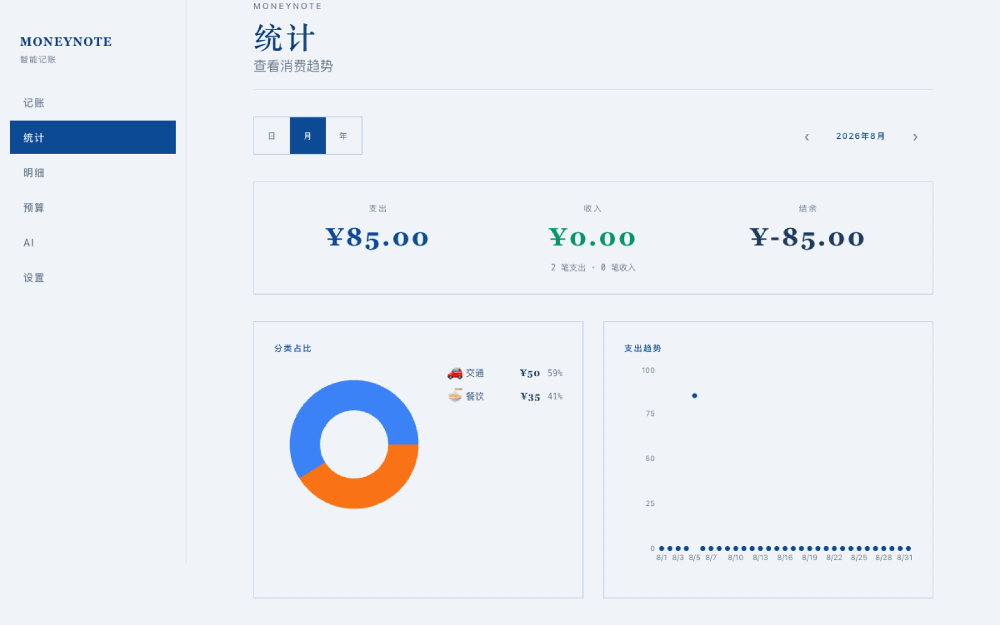

<div align="center">

# 💰 MoneyNote · AI 智能记账

**本地优先的个人记账 PWA — 自然语言就能记账**

<p>
  <a href="https://github.com/Justin-Ju-0413/moneynote/releases">
    
  </a>
  
  
  
  <a href="https://github.com/Justin-Ju-0413/moneynote/stargazers">
    
  </a>
</p>

ChatGPT 式对话记账 · AI 工作台 · 账单导入 · 模糊去重
<br>数据全部存浏览器 IndexedDB · API Key 本地加密 · AI 请求脱敏

[功能特性](#功能特性) · [快速开始](#快速开始) · [验证](#verification--验证) · [状态](#current-status--当前状态) · [FAQ](#常见问题)

</div>

## 📸 Screenshots / 演示

| 对话记账 / Chat entry | 统计 / Stats |
|---|---|
|  |  |

## ✨ 功能特性

### 🤖 对话记账
- **ChatGPT 式交互**：说一句话就能记一笔、查账单、改分类、删记录
- **5 种意图识别**：记一笔 / 查询 / 修改 / 删除 / 闲聊，数据变更前弹出确认卡片
- **混合解析策略**：本地规则 5 阶段管线 + LLM 增强，速度快又准

### 📊 AI 工作台
- **四类 AI 任务**：综合审计 · 自动归类 · 智能查重 · 月度摘要
- **逐条审核**：AI 建议全部人工确认后应用，不瞎改数据
- **结果缓存**：按流水签名缓存，重跑不重复消耗 API
- **超量分批**：数据多也不怕，带进度条，可强制刷新
- **月度摘要**：任意月份一键生成

### 🧹 模糊去重
- 基于相似度 + 时间窗的可配置查重算法
- amount 排序剪枝，大数据量也很快
- 保留 A / 保留 B / 忽略，三键操作

### 📈 统计 & 预算
- 分类饼图 · 趋势折线 · 预算追踪
- 全量明细搜索筛选，支持多维度过滤

### 🔒 数据安全 & 隐私
- `storage.persist()` 防浏览器驱逐
- 自动防抖快照（保留 10 份）+ 手动备份/恢复
- 删除 / 去重合并 / 应用分类均支持 **5 秒撤销**
- API Key 用 AES-GCM 加密存本地
- AI 请求自动脱敏：手机号 / 订单号 / 身份证 / 邮箱 / 带称呼姓名

### 📱 PWA
- 可安装到桌面，离线可用
- 路由级懒加载，首屏 ~150kB gzip

### 🖥 桌面应用（Tauri，macOS）
把同一套代码包成原生桌面应用：双击图标直接打开（无需起服务器），**关闭窗口即退出**，单实例防重复打开，数据仍存在本机 IndexedDB。

```bash
npm run desktop:build    # 产出 .app + dmg（首次需 Rust 工具链）
npm run desktop:install  # 把 .app 安装到 /Applications
npm run desktop:dev      # 带热重载开发桌面端
```

产物位于 `src-tauri/target/release/bundle/`（`macos/MoneyNote.app` 与 `dmg/`）。桌面端与浏览器 PWA 是两个独立存储，已有数据可在设置页用「备份/导出」迁移。

## 🚀 快速开始

```bash
# 安装依赖
npm install

# 开发服务器
npm run dev

# 构建生产版本
npm run build

# 代码检查 & 单测
npm run lint
npm test
```

> AI 配置在「设置」页：选服务商预设（DeepSeek / OpenAI / 通义千问 / OpenCode Go / 自定义），填 API Key 与模型。
> 未配置时 AI 工作台自动回退到本地启发式规则，不影响基础使用。

### No-API-Key demo / 无 Key 演示

应用不要求登录或 API Key。启动后可直接新增记录，或在设置页导入 [`public/sample-data.csv`](public/sample-data.csv) 体验统计、预算、导出和本地规则；只有显式启用在线 AI 服务时才会发送已脱敏的请求。

## 🛠 技术栈

| 类别 | 技术 |
|---|---|
| 框架 | **React 19** · **Vite** · TypeScript |
| 样式 | Tailwind CSS v4 · framer-motion |
| 数据库 | Dexie (IndexedDB) |
| 图表 | recharts |
| PWA | vite-plugin-pwa |
| 桌面端 | Tauri 2 |
| 测试 | vitest |

## 💾 数据层

Dexie schema 演进至 **v13**，升级自动迁移：

| 版本 | 内容 |
|---|---|
| v1–v5 | transactions / categories / budgets / settings / classificationCache / parseCache / billTemplates |
| v6 | `aiSuggestions`（AI 工作台建议） |
| v7 | `dedupStrategies` / `dedupRecords`（模糊去重） |
| v8 | `backups`（自动/手动数据备份） |
| v9 | `auditCache`（AI 审计结果缓存） |
| v10 | `billTemplates` 增加 `importCount` 索引（修复设置页 orderBy 白屏） |
| v11 | `chatMessages`（首页对话历史持久化） |
| v12 | `learningRules`（AI 学习规则：商户→分类映射，本地识别进化） |
| v13 | `llmUsage`（LLM 用量记录，成本可观测） |

## Verification / 验证

```bash
npm ci
npm run lint
npm test
npm run build
npm run test:e2e
```

单元测试使用 `fake-indexeddb`；E2E 使用 mock LLM，不需要真实 API Key。CI 对 Pull Request 执行质量检查和关键路径 E2E。

## Current status / 当前状态

- 当前稳定 Release：`v1.5.0`。
- 定位：local-first AI personal finance product，基础记账不依赖账号或 API Key。
- 当前进行中：[全面焕新计划](docs/superpowers/plans/2026-09-15-renewal.md)——视觉与交互、体验功能、质量基建、深水区攻坚四个批次（详见 [docs/ROADMAP.md](docs/ROADMAP.md)）。
- 不以无限增加功能作为路线图目标。

## Roadmap / 路线图

详见 [docs/ROADMAP.md](docs/ROADMAP.md)。要点：

1. **全面焕新计划**（进行中，[计划文档](docs/superpowers/plans/2026-09-15-renewal.md)）：现代亲和风视觉焕新 · 流式输出/明细规模化等体验升级 · 测试与基建加固 · C4 结构化输出与 C7 泛化导入攻坚。
2. 短期收尾：账单导入兼容性与错误诊断、备份加固与异地化、AI 建议可解释性。
3. 长期北极星：可选的端到端加密多设备同步（自托管，隐私不妥协）。

## Limitations / 限制

- 数据默认只在当前浏览器或桌面容器的 IndexedDB 中；跨设备迁移依赖导出/导入。
- 清除站点数据、隐私模式或浏览器存储策略可能导致本地数据丢失，应定期导出备份。
- 在线 AI 请求会发送到用户配置的第三方 provider；应用会脱敏，但 provider 的处理政策仍由其自身决定。
- PWA 后台能力受浏览器和操作系统限制，不能替代银行或专业财务系统。

安全边界与漏洞报告方式见 [SECURITY.md](SECURITY.md)。

## ❓ 常见问题

**Q：数据存在哪里？换电脑怎么办？**
A：全部存在浏览器 IndexedDB。换电脑用「设置 → 导出备份」+「导入备份」即可迁移。

**Q：支持哪些账单导入？**
A：支付宝 CSV、微信支付 Excel、平安银行 Excel，含模板自适应学习与硬去重。

**Q：没有 API Key 能用吗？**
A：能。基础记账、统计、导入完全本地运行；AI 工作台会回退到本地启发式规则。

## 📝 Changelog

详见 [Releases](https://github.com/Justin-Ju-0413/moneynote/releases) 页面。

## 🤝 贡献

欢迎提 Issue 和 PR！有任何想法或 bug 都欢迎反馈。

## 📄 License

MIT © [Justin Ju](https://github.com/Justin-Ju-0413)

---

<div align="center">

如果觉得好用，点个 ⭐ Star 就是最大的支持~

</div>
